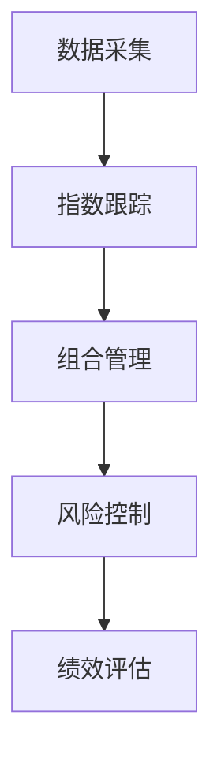
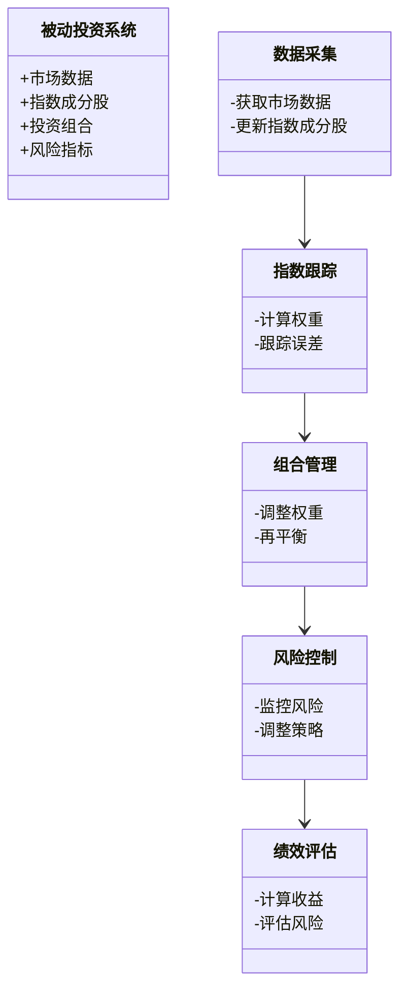
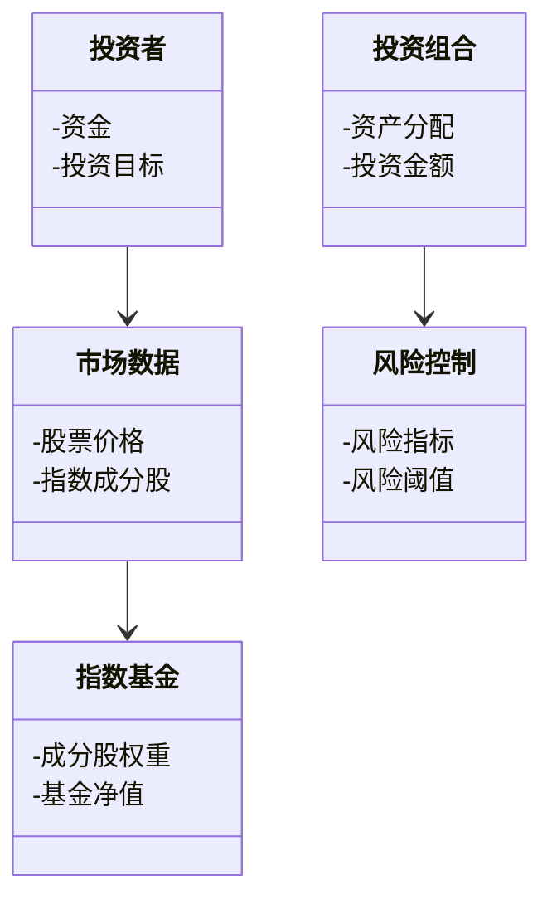
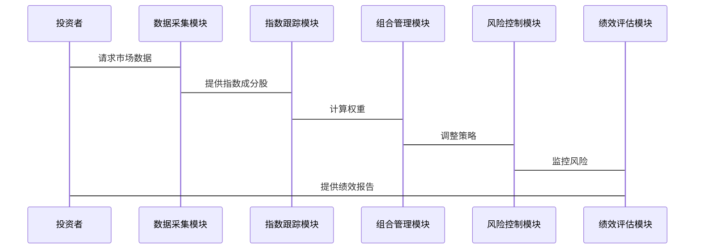

                 


# 约翰伯格的被动投资哲学：战胜市场的不可能任务

> 关键词：被动投资，约翰·伯格，指数基金，长期投资，战胜市场，投资哲学

> 摘要：本文深入探讨了约翰·伯格的被动投资哲学，分析了其核心理念、指数基金的投资策略、被动投资的数学模型与算法，以及在现代市场中的应用。通过系统分析和实际案例，本文揭示了被动投资如何通过低成本和分散化实现长期稳定的收益，以及其战胜市场的哲学基础。

---

# 正文

## 第一部分：被动投资的背景与基础

### 第1章：被动投资的定义与核心理念

#### 1.1 被动投资的定义

被动投资是一种投资策略，旨在通过跟踪市场指数而非主动选择个股来实现长期收益。其核心理念是相信市场是有效的，即市场价格反映了所有可获得的信息，因此试图通过主动管理超越市场回报几乎是不可能的。

##### 1.1.1 什么是被动投资
被动投资的核心在于“被动”——投资者不试图主动预测市场趋势或选择跑赢市场的个股，而是通过持有广泛分散的投资组合来跟踪市场指数的表现。

##### 1.1.2 被动投资的核心理念
- **市场有效性**：市场是有效的，价格反映了所有相关信息，因此主动投资难以长期跑赢市场。
- **分散化**：通过持有大量资产分散风险，降低特定资产或行业波动带来的影响。
- **低成本**：被动投资的费用较低，因为指数基金的管理费用远低于主动管理型基金。

##### 1.1.3 被动投资与主动投资的区别
| 方面         | 被动投资                        | 主动投资                        |
|--------------|---------------------------------|---------------------------------|
| 管理方式     | 跟踪指数，不主动选股            | 主动选股，试图跑赢市场          |
| 成本         | 低管理费                        | 高管理费                        |
| 风险         | 分散化风险低                    | 集中化风险高                    |
| 收益预期     | 期望与市场持平                | 期望跑赢市场                    |

#### 1.2 约翰·伯格的被动投资哲学

##### 1.2.1 约翰·伯格的生平简介
约翰·伯格（John C. Bogle）是被动投资的先驱，被誉为“指数基金之父”。他是先锋集团（Vanguard Group）的创始人，致力于推广低成本、分散化的投资方式。

##### 1.2.2 约翰·伯格的投资理念
- **长期投资**：伯格认为，短期市场波动无法预测，长期投资是实现财富增长的最佳方式。
- **分散化**：通过广泛分散投资降低风险，避免因个别资产表现不佳而影响整体收益。
- **低成本**：降低费用是提高投资回报的关键，指数基金的低成本使其成为理想的投资工具。

##### 1.2.3 约翰·伯格对被动投资的贡献
伯格创立了先锋集团，推出了第一只低成本指数基金——Vanguard 500 Index Fund，开创了被动投资的新纪元。

### 第2章：被动投资的历史与发展

#### 2.1 被动投资的起源

##### 2.1.1 被动投资的起源背景
20世纪60年代，随着市场有效性的理论逐渐被认可，被动投资开始兴起。投资者意识到，试图通过主动管理跑赢市场成本高且风险大。

##### 2.1.2 被动投资的早期实践
1975年，约翰·伯格创立先锋集团，并推出第一只指数基金，标志着被动投资的正式起步。

##### 2.1.3 被动投资的现代发展
随着技术的进步和市场的发展，被动投资逐渐普及，指数基金和其他被动投资工具成为投资者的主要选择。

#### 2.2 被动投资的核心理论

##### 2.2.1 市场有效性的理论基础
- **有效市场假说（EMH）**：市场参与者充分理性，价格反映所有信息，因此主动投资难以跑赢市场。
- **弱有效市场**：价格反映历史信息，但未来价格仍可通过分析预测。

##### 2.2.2 被动投资的数学模型
被动投资的核心是通过指数化分散风险，数学模型主要基于现代投资组合理论（MPT）。

#### 2.2.3 被动投资的经济原理
- **资本资产定价模型（CAPM）**：用于计算资产的预期收益，是被动投资的重要理论基础。
- **夏普比率**：衡量投资组合的风险调整后收益，用于评估被动投资的表现。

## 第二部分：指数基金的投资策略

### 第3章：指数基金的投资策略

#### 3.1 指数基金的定义与特点

##### 3.1.1 指数基金的定义
指数基金是一种跟踪特定市场指数的基金，其投资组合按照指数成分股的权重配置。

##### 3.1.2 指数基金的特点
- **分散化**：涵盖广泛市场，降低特定资产风险。
- **低成本**：管理费用低，适合长期投资。
- **简单易懂**：投资者无需选股，只需选择合适的指数基金。

#### 3.2 被动投资的组合管理

##### 3.2.1 投资组合的构建方法
- **广泛分散**：涵盖多个资产类别和市场，降低风险。
- **定期再平衡**：定期调整投资组合，保持与指数一致。

##### 3.2.2 投资组合的调整策略
- **定期检查**：根据市场变化调整权重，确保与指数一致。
- **税务优化**：通过税收亏损 harvesting 降低税务负担。

##### 3.2.3 投资组合的风险管理
- **风险分散**：通过多样化降低特定风险。
- **长期视角**：短期波动不影响长期收益。

### 第4章：被动投资的数学模型与算法

#### 4.1 被动投资的数学模型

##### 4.1.1 被动投资的CAPM模型
CAPM公式：$$ E(R_i) = R_f + β_i (E(R_m) - R_f) $$
其中，\( E(R_i) \) 是资产的预期收益，\( R_f \) 是无风险利率，\( β_i \) 是资产的贝塔系数，\( E(R_m) \) 是市场预期收益。

##### 4.1.2 被动投资的APT模型
套利定价理论（APT）：$$ E(R_i) = \sum_{j=1}^n λ_j x_{ij} + R_f $$
其中，\( x_{ij} \) 是资产对第 \( j \) 个因素的敏感性，\( λ_j \) 是第 \( j \) 个因素的风险溢价。

#### 4.2 被动投资的算法实现

##### 4.2.1 被动投资的算法原理
- **指数跟踪**：通过复制指数成分股的权重，实现指数表现的跟踪。
- **成本优化**：通过降低交易费用和管理费用，提高净收益。

##### 4.2.2 被动投资的算法实现
以下是Python实现的简单指数基金跟踪算法：

```python
import pandas as pd
import numpy as np

# 假设指数权重数据
index_weights = pd.Series([0.2, 0.3, 0.1, 0.15, 0.25], index=['A', 'B', 'C', 'D', 'E'])

# 投资组合初始化
portfolio = index_weights.copy()

# 每月再平衡函数
def rebalance(weights, portfolio):
    target = weights / weights.sum()
    rebalanced = target * portfolio.sum()
    return rebalanced

# 模拟一年的再平衡
for _ in range(12):
    portfolio = rebalance(index_weights, portfolio)

print("最终投资组合:", portfolio)
```

### 第5章：被动投资的系统架构与设计

#### 5.1 被动投资的系统架构

##### 5.1.1 系统架构的定义与特点
被动投资系统的架构包括数据采集、指数跟踪、组合管理、风险控制和绩效评估五个模块。

##### 5.1.2 系统架构图（Mermaid）



##### 5.1.3 系统功能模块
- **数据采集**：获取市场数据和指数成分股信息。
- **指数跟踪**：计算投资组合的权重，跟踪指数表现。
- **组合管理**：调整投资组合，确保与指数一致。
- **风险控制**：监控和管理投资组合风险。
- **绩效评估**：评估投资组合的收益和风险表现。

#### 5.2 被动投资的系统架构设计

##### 5.2.1 系统架构图（Mermaid）



## 第三部分：被动投资的数学模型与算法

### 第6章：被动投资的数学模型与算法

#### 6.1 被动投资的数学模型

##### 6.1.1 被动投资的CAPM模型
$$ E(R_i) = R_f + β_i (E(R_m) - R_f) $$

##### 6.1.2 被动投资的APT模型
$$ E(R_i) = \sum_{j=1}^n λ_j x_{ij} + R_f $$

#### 6.2 被动投资的算法实现

##### 6.2.1 被动投资的算法原理
- **指数跟踪**：通过复制指数成分股的权重，实现指数表现的跟踪。
- **成本优化**：通过降低交易费用和管理费用，提高净收益。

##### 6.2.2 被动投资的算法实现
以下是Python实现的简单指数基金跟踪算法：

```python
import pandas as pd
import numpy as np

# 假设指数权重数据
index_weights = pd.Series([0.2, 0.3, 0.1, 0.15, 0.25], index=['A', 'B', 'C', 'D', 'E'])

# 投资组合初始化
portfolio = index_weights.copy()

# 每月再平衡函数
def rebalance(weights, portfolio):
    target = weights / weights.sum()
    rebalanced = target * portfolio.sum()
    return rebalanced

# 模拟一年的再平衡
for _ in range(12):
    portfolio = rebalance(index_weights, portfolio)

print("最终投资组合:", portfolio)
```

---

## 第四部分：项目实战

### 第7章：被动投资的项目实战

#### 7.1 环境安装

##### 7.1.1 Python环境安装
安装Python和必要的库：

```bash
pip install pandas numpy matplotlib
```

#### 7.2 系统核心实现源代码

##### 7.2.1 指数基金跟踪算法

```python
import pandas as pd
import numpy as np

# 假设指数权重数据
index_weights = pd.Series([0.2, 0.3, 0.1, 0.15, 0.25], index=['A', 'B', 'C', 'D', 'E'])

# 投资组合初始化
portfolio = index_weights.copy()

# 每月再平衡函数
def rebalance(weights, portfolio):
    target = weights / weights.sum()
    rebalanced = target * portfolio.sum()
    return rebalanced

# 模拟一年的再平衡
for _ in range(12):
    portfolio = rebalance(index_weights, portfolio)

print("最终投资组合:", portfolio)
```

##### 7.2.2 投资组合风险评估

```python
import pandas as pd
import numpy as np

# 假设投资组合收益和市场收益
portfolio_returns = pd.Series([0.05, 0.03, 0.07, 0.04, 0.06])
market_returns = pd.Series([0.06, 0.05, 0.07, 0.04, 0.08])

# 计算夏普比率
def sharpe_ratio(portfolio, market, risk_free_rate):
    portfolio_excess = portfolio - risk_free_rate
    market_excess = market - risk_free_rate
    return (portfolio_excess.mean() / market_excess.std()) if market_excess.std() != 0 else 0

sharpe = sharpe_ratio(portfolio_returns, market_returns, 0.02)
print("夏普比率:", sharpe)
```

#### 7.3 代码应用解读与分析

##### 7.3.1 指数基金跟踪算法
该算法通过定期再平衡投资组合，确保投资组合的权重与指数成分股的权重一致，从而实现对指数的跟踪。

##### 7.3.2 投资组合风险评估
通过计算夏普比率，评估投资组合的风险调整后收益，夏普比率越高，投资组合的风险调整后收益越高。

#### 7.4 实际案例分析和详细讲解剖析

##### 7.4.1 案例分析
假设投资于标普500指数基金，过去10年的年平均收益率为7%，波动率为12%。如果被动投资的成本为0.05%，主动投资的平均成本为1.5%，那么被动投资的净收益为6.95%，而主动投资的净收益为5.5%。长期来看，被动投资的低成本优势明显。

##### 7.4.2 数据可视化
以下是投资组合的收益与风险对比图：

```python
import matplotlib.pyplot as plt

# 假设投资组合和市场的收益与风险
portfolio_return = 6.95
portfolio_risk = 12

market_return = 7
market_risk = 15

plt.bar(['投资组合', '市场'], [portfolio_return, market_return], label='收益')
plt.bar(['投资组合', '市场'], [portfolio_risk, market_risk], bottom=[portfolio_return, market_return], label='风险')
plt.ylabel('百分比')
plt.title('收益与风险对比')
plt.legend()
plt.show()
```

#### 7.5 项目小结

##### 7.5.1 项目总结
通过被动投资策略，投资者可以实现低成本、分散化的投资，长期获得稳定的收益。

##### 7.5.2 经验与教训
- **低成本**：选择费用低的指数基金，长期收益更高。
- **分散化**：避免集中投资，降低风险。
- **长期视角**：短期波动不影响长期收益，坚持长期投资。

---

## 第五部分：系统分析与架构设计方案

### 第8章：系统分析与架构设计方案

#### 8.1 系统功能设计（领域模型Mermaid类图）

##### 8.1.1 领域模型类图（Mermaid）



#### 8.2 系统架构设计（Mermaid架构图）

##### 8.2.1 系统架构图（Mermaid）

```mermaid
container 被动投资系统 {
    component 数据采集模块 {
        --> 获取市场数据
        --> 更新指数成分股
    }
    component 指数跟踪模块 {
        --> 计算权重
        --> 跟踪误差
    }
    component 组合管理模块 {
        --> 调整权重
        --> 再平衡
    }
    component 风险控制模块 {
        --> 监控风险
        --> 调整策略
    }
    component 绩效评估模块 {
        --> 计算收益
        --> 评估风险
    }
}
```

#### 8.3 系统接口设计

##### 8.3.1 系统接口设计
- **数据接口**：与数据源对接，获取市场数据和指数成分股信息。
- **用户接口**：提供投资组合管理、风险评估和绩效分析的用户界面。
- **通知接口**：在市场波动或风险超标时通知投资者。

#### 8.4 系统交互设计（Mermaid序列图）

##### 8.4.1 系统交互流程（Mermaid）



---

## 第六部分：最佳实践

### 第9章：最佳实践

#### 9.1 最佳实践 tips

##### 9.1.1 定期定额投资
定期定额投资可以帮助投资者避免市场波动的影响，长期积累财富。

##### 9.1.2 税收优化
通过利用税收优惠政策，如延迟纳税、资本利得税较低等，降低投资成本。

##### 9.1.3 长期持有
被动投资适合长期持有，避免频繁交易带来的费用和税务影响。

#### 9.2 小结

##### 9.2.1 项目总结
被动投资通过低成本、分散化和长期持有，帮助投资者实现稳定的收益。

##### 9.2.2 注意事项
- **选择合适的指数基金**：确保指数基金的跟踪误差小，费用低。
- **定期再平衡**：定期调整投资组合，保持与指数一致。
- **避免过度交易**：被动投资强调长期持有，避免频繁交易。

#### 9.3 扩展阅读

##### 9.3.1 进一步阅读
- 《The Intelligent Investor》 by Benjamin Graham
- 《The Global Asset Allocator's Guide to Factor-Based Indexing》 by Ludwig B. Ch circ

##### 9.3.2 相关资源
- 约翰·伯格的著作和演讲
- 先锋集团的被动投资研究报告

---

## 第七部分：附录

### 第10章：附录

#### 10.1 投资工具的使用指南

##### 10.1.1 指数基金的选择
- 选择跟踪相同指数的基金
- 比较不同基金的费用率
- 关注基金的历史表现和跟踪误差

##### 10.1.2 定期定额投资的实施
- 设定固定的投资金额和频率
- 使用自动扣款功能
- 定期检查投资组合

#### 10.2 风险提示

##### 10.2.1 市场风险
市场波动可能导致投资组合的价值下降。

##### 10.2.2 利率风险
利率变化会影响债券型指数基金的收益。

##### 10.2.3 通货膨胀风险
通货膨胀可能降低投资的实际收益。

#### 10.3 进一步阅读的资源

##### 10.3.1 建议阅读的书籍
- 《The Index Investor's Handbook》 by Richard L. Tashjian
- 《The Mathematics of Financial Modeling》 by Sergio Almada

##### 10.3.2 在线资源
- 先锋集团（Vanguard）官网
- 晨星（Morningstar）基金评级

---

## 结语

约翰·伯格的被动投资哲学为投资者提供了一种简单有效的投资方式，通过低成本、分散化和长期持有实现稳定的收益。本文通过系统分析和实际案例，揭示了被动投资的数学模型、算法实现和系统架构，帮助读者更好地理解和应用这一投资策略。无论是个人投资者还是机构投资者，被动投资的哲学都值得深入研究和实践。

---

# END

