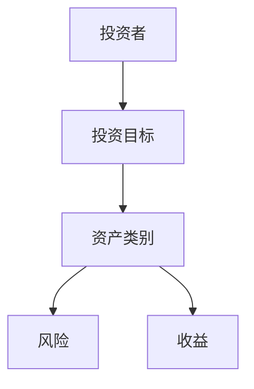

                 


# 《约翰伯格的资产配置建议》

> **关键词**：资产配置，投资组合，风险管理，现代投资组合理论，约翰伯格，Python实现

> **摘要**：本文详细探讨了资产配置的核心概念、数学模型、系统设计以及实际应用。通过分析约翰伯格的投资理念，结合现代投资组合理论，本文为读者提供了从理论到实践的全面指导。文章还通过Python代码实现了资产配置模型，展示了如何在实际中应用这些理论。

---

## 第一部分: 资产配置的背景与核心概念

### 第1章: 资产配置的定义与重要性

#### 1.1 资产配置的定义

资产配置是指将资金分配到不同的资产类别（如股票、债券、现金等）以实现风险和收益的最佳平衡。其核心在于通过分散投资降低风险，同时最大化收益。

#### 1.2 资产配置的重要性

- **投资组合风险与收益的平衡**：通过合理分配资产，投资者可以在不同市场条件下优化风险调整后的收益。
- **资产配置在投资决策中的地位**：资产配置是投资策略的核心，决定了投资组合的整体表现。
- **资产配置与长期投资回报的关系**：研究表明，资产配置对长期投资回报的贡献超过市场择时和证券选择。

#### 1.3 约翰伯格的背景与投资理念

约翰·伯格（John Bogle）是 Vanguard 集团的创始人，被誉为“指数基金之父”。他提倡长期投资、价值投资和费用最小化。伯格认为，资产配置是投资成功的关键，尤其是通过低成本指数基金实现长期财富增长。

#### 1.4 资产配置的边界与外延

- **适用范围**：适用于个人投资者、机构投资者和退休基金等。
- **资产配置与其他策略的区别**：不同于市场择时和证券选择，资产配置侧重于长期结构性投资。
- **资产配置的局限性**：在极端市场条件下，资产配置的效果可能受限。

#### 1.5 资产配置的核心要素

- **资产类别**：股票、债券、现金、房地产等。
- **配置比例**：根据风险承受能力和投资目标确定各类资产的占比。
- **时间因素**：定期调整配置比例以适应市场变化。

---

## 第二部分: 资产配置的核心概念与联系

### 第2章: 资产配置的原理与模型

#### 2.1 资产配置的原理

资产配置的理论基础是现代投资组合理论（MPT），由哈里·马科维茨（Harry Markowitz）提出。MPT认为，通过合理分散投资可以降低非系统性风险，实现风险与收益的最佳平衡。

#### 2.2 资产配置的主要模型

- **均值-方差模型**：计算各资产的预期收益和风险，寻找最优组合。
- **Black-Litterman 模型**：结合市场观点和资产配置。
- **基于因子的资产配置模型**：利用因子模型（如Fama-French三因子模型）进行优化。

#### 2.3 资产配置的属性特征对比

| 模型名称         | 优点                          | 缺点                          |
|------------------|-------------------------------|-------------------------------|
| 均值-方差模型     | 简单直观，考虑风险和收益       | 易受尾部风险影响               |
| Black-Litterman 模型 | 结合市场观点，灵活性高         | 实施复杂，需要市场观点输入     |
| 基于因子的模型   | 解释性强，考虑更多风险因素     | 建模复杂，需数据支持           |

#### 2.4 实体关系图（ER图）



---

## 第三部分: 资产配置的数学模型与算法

### 第3章: 现代投资组合理论（MPT）的应用

#### 3.1 均值-方差模型的数学表达

目标是最小化投资组合的方差，即风险：

$$
\min_w \sum_{i=1}^n \sum_{j=1}^n w_i w_j \sigma_{ij}
$$

约束条件：

$$
\sum_{i=1}^n w_i = 1
$$

其中，$w_i$ 是资产 i 的权重，$\sigma_{ij}$ 是资产 i 和 j 的协方差。

#### 3.2 Python实现

```python
import numpy as np

# 示例数据：资产收益和协方差矩阵
mu = np.array([0.1, 0.15, 0.08])  # 各资产的预期收益
sigma = np.array([[0.16, 0.05, 0.02],
                  [0.05, 0.20, 0.01],
                  [0.02, 0.01, 0.12]])

# 求解最小方差组合
def min_variance_portfolio(mu, sigma):
    n = len(mu)
    cov = sigma
    ones = np.ones(n)
    inv_cov = np.linalg.inv(cov)
    w = inv_cov @ ones / (ones.T @ inv_cov @ ones)
    return w

weights = min_variance_portfolio(mu, sigma)
print("最优权重:", weights)
```

#### 3.3 结果解读

通过上述代码，我们可以计算出各资产的最优权重，从而构建风险最小的投资组合。

---

## 第四部分: 系统分析与架构设计

### 第4章: 资产配置系统的架构设计

#### 4.1 项目介绍

设计一个基于MPT的资产配置系统，帮助投资者根据风险偏好构建最优投资组合。

#### 4.2 系统功能设计

- 用户输入：资产列表、预期收益、协方差矩阵。
- 算法选择：均值-方差模型。
- 输出结果：最优权重、风险调整后收益。

#### 4.3 系统架构图


---

## 第五部分: 项目实战

### 第5章: 投资组合优化的Python实现

#### 5.1 环境安装

安装必要的库：

```bash
pip install numpy scipy matplotlib
```

#### 5.2 核心实现

```python
import numpy as np

def portfolio_optimization(mu, sigma):
    n = len(mu)
    cov = sigma
    ones = np.ones(n)
    inv_cov = np.linalg.inv(cov)
    w = inv_cov @ ones / (ones.T @ inv_cov @ ones)
    return w

# 示例数据
mu = np.array([0.1, 0.15, 0.08])
sigma = np.array([[0.16, 0.05, 0.02],
                  [0.05, 0.20, 0.01],
                  [0.02, 0.01, 0.12]])

weights = portfolio_optimization(mu, sigma)
print("最优权重:", weights)
```

#### 5.3 结果解读

计算结果给出了各资产的最优权重，帮助投资者构建风险最小的投资组合。

---

## 第六部分: 总结与展望

### 6.1 最佳实践 tips

- 定期调整资产配置，以适应市场变化。
- 使用低成本工具和算法优化配置过程。
- 结合市场观点和数据驱动的方法进行决策。

### 6.2 小结

本文通过理论分析和实践案例，详细探讨了资产配置的核心概念、数学模型和系统设计。通过Python代码实现，帮助读者将理论应用于实际投资中。

### 6.3 注意事项

- 资产配置需根据个人风险承受能力和投资目标调整。
- 数据质量和模型选择对结果影响重大，需谨慎处理。

### 6.4 拓展阅读

- 《投资学》（书籍）
- 现代投资组合理论相关论文
- 相关技术博客和在线资源

---

通过本文的学习，读者可以全面理解资产配置的理论与实践，掌握使用Python进行投资组合优化的方法，为实现长期财富增长打下坚实基础。

