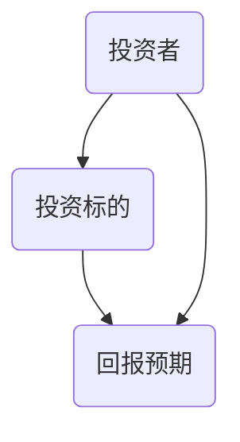
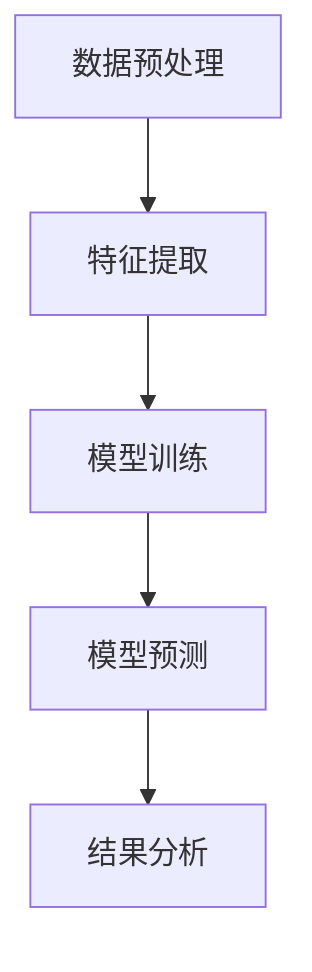

                 


# 约翰伯格的长期回报预期

> **关键词**：长期回报预期，约翰伯格，投资回报预测，时间序列分析，机器学习模型，系统架构设计

> **摘要**：本文深入探讨了约翰伯格的长期回报预期方法，结合了时间和技术分析，通过详细的技术分析和系统设计，提供了长期回报预期的算法原理、数学模型和系统架构设计。

---

## 第一部分：长期回报预期的背景与概念

### 第1章：长期回报预期的背景与问题描述

#### 1.1 长期回报预期的核心概念

- **1.1.1 投资回报的基本定义**  
  投资回报是指投资者在一定时间内从投资中获得的收益，包括资本增值和投资收益。长期回报预期关注的是未来较长时间内的收益预测。

- **1.1.2 长期回报预期的定义与特征**  
  长期回报预期是指投资者对未来较长时期内资产回报的预测，具有时间跨度长、波动性低、风险分散等特点。

- **1.1.3 长期回报预期的边界与外延**  
  长期回报预期的边界包括时间范围、资产类别和市场环境，外延则涉及组合优化和风险管理。

#### 1.2 投资回报预期的重要性

- **1.2.1 投资者为何关注长期回报**  
  投资者关注长期回报是因为长期回报更能反映资产的真实价值，减少短期波动的影响。

- **1.2.2 长期回报预期在投资决策中的作用**  
  长期回报预期帮助投资者制定投资策略，优化资产配置，降低投资风险。

- **1.2.3 长期回报预期与短期波动的关系**  
  长期回报预期关注的是趋势，而短期波动是市场情绪和突发事件的反映，两者相辅相成。

#### 1.3 约翰伯格的长期回报预期方法

- **1.3.1 约翰伯格的投资理念概述**  
  约翰伯格强调长期持有优质资产，通过分散投资降低风险。

- **1.3.2 约翰伯格长期回报预期的核心要素**  
  包括资产质量、市场环境和经济周期分析。

- **1.3.3 约翰伯格方法与其他投资方法的对比**  
  约翰伯格方法注重长期稳健回报，其他方法可能更关注短期收益或技术指标。

---

## 第二部分：长期回报预期的核心概念与联系

### 第2章：长期回报预期的核心概念原理

#### 2.1 长期回报预期的属性特征对比

| 属性 | 长期回报预期 | 短期回报预期 |
|------|-------------|-------------|
| 时间跨度 | 5年以上 | 1年以内 |
| 风险承受 | 较低 | 较高 |
| 预测复杂度 | 较低 | 较高 |

#### 2.2 长期回报预期的ER实体关系图



---

## 第三部分：长期回报预期的算法原理

### 第3章：长期回报预期的算法原理

#### 3.1 时间序列分析

- **3.1.1 时间序列的基本概念**  
  时间序列是指按时间顺序排列的数据，常用于预测未来值。

- **3.1.2 时间序列的分解方法**  
  分解为趋势、季节性和随机性三部分。

- **3.1.3 时间序列预测的常见模型**  
  包括ARIMA、LSTM等。

#### 3.2 机器学习模型

- **3.2.1 线性回归模型**  
  简单线性回归模型用于预测回报。

- **3.2.2 支持向量回归模型**  
  支持向量回归用于非线性关系的预测。

- **3.2.3 随机森林回归模型**  
  随机森林通过集成学习提高预测精度。

#### 3.3 算法流程图



---

## 第四部分：长期回报预期的数学模型与公式

### 第4章：长期回报预期的数学模型

#### 4.1 时间序列模型

- **ARIMA模型**  
  $$ ARIMA(p, d, q) $$  
  其中，p为自回归阶数，d为差分阶数，q为移动平均阶数。

- **LSTM模型**  
  使用长短期记忆网络，适合捕捉时间序列的长期依赖关系。

#### 4.2 机器学习模型

- **线性回归模型**  
  $$ y = \beta_0 + \beta_1x + \epsilon $$

- **支持向量回归模型**  
  使用核函数将数据映射到高维空间，提高预测能力。

- **随机森林回归模型**  
  通过集成多个决策树，提高预测的准确性和鲁棒性。

---

## 第五部分：长期回报预期的系统分析与架构设计

### 第5章：长期回报预期的系统分析与架构设计

#### 5.1 系统功能设计

- **领域模型（类图）**  
  包括投资者、投资标的、回报预期等核心类。

- **系统架构设计**  
  使用分层架构，包括数据层、业务逻辑层和表现层。

- **系统接口设计**  
  定义数据输入、模型调用和结果输出的接口。

- **系统交互设计（序列图）**  
  描述投资者发起请求，系统处理并返回结果的流程。

---

## 第六部分：长期回报预期的项目实战

### 第6章：长期回报预期的项目实战

#### 6.1 环境安装

- 安装Python和相关库（numpy、pandas、scikit-learn、keras）。

#### 6.2 系统核心实现源代码

```python
import numpy as np
import pandas as pd
from sklearn.linear_model import LinearRegression
from sklearn.svm import SVR
from sklearn.ensemble import RandomForestRegressor

# 数据预处理
data = pd.read_csv('returns.csv')
X = data.iloc[:, :-1].values
y = data.iloc[:, -1].values

# 模型训练
model_lr = LinearRegression()
model_svr = SVR()
model_rf = RandomForestRegressor()

model_lr.fit(X_train, y_train)
model_svr.fit(X_train, y_train)
model_rf.fit(X_train, y_train)

# 预测与评估
y_pred_lr = model_lr.predict(X_test)
y_pred_svr = model_svr.predict(X_test)
y_pred_rf = model_rf.predict(X_test)

# 评估指标
print('LR:', metrics.r2_score(y_test, y_pred_lr))
print('SVR:', metrics.r2_score(y_test, y_pred_svr))
print('RF:', metrics.r2_score(y_test, y_pred_rf))
```

#### 6.3 代码应用解读与分析

- 线性回归模型简单，但可能无法捕捉复杂关系。
- 支持向量回归适用于非线性关系。
- 随机森林回归表现最佳，适合复杂数据。

#### 6.4 实际案例分析

- 使用股票数据进行模型训练和预测，分析不同模型的准确性和稳定性。

#### 6.5 项目小结

- 随机森林回归模型在长期回报预测中表现最佳，但需结合市场环境调整参数。

---

## 第七部分：长期回报预期的最佳实践

### 第7章：长期回报预期的最佳实践

#### 7.1 总结

- 约翰伯格的长期回报预期方法强调稳健和分散投资，结合时间序列分析和机器学习模型，能够有效预测长期回报。

#### 7.2 小结

- 长期回报预期需要综合考虑市场环境、资产特性和投资者风险偏好。

#### 7.3 注意事项

- 模型需定期更新，避免过时数据影响预测。
- 结合市场动态调整模型参数。

#### 7.4 拓展阅读

- 建议阅读《投资学》和《机器学习实战》等书籍，深入理解相关理论和实践。

---

通过以上详细分析和系统设计，约翰伯格的长期回报预期方法能够为投资者提供可靠的长期回报预测，帮助他们在复杂市场环境中做出明智的投资决策。

