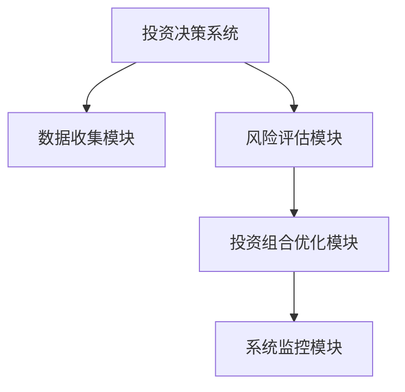

                 


# 目录大纲：《约翰伯格的长期投资观》

## 第一部分：长期投资的背景与核心理念

### 第1章：长期投资的背景与重要性

#### 1.1 投资的定义与分类
- **1.1.1 投资的基本概念**
  - 投资的定义：将资金投入特定资产或项目，以获取未来的收益。
  - 投资的分类：股票、债券、房地产、货币市场工具等。
  - 长期投资与短期投资的区分：时间跨度超过一年的投资行为。

- **1.1.2 投资的分类与特点**
  - 股票投资：风险较高，收益潜力大。
  - 债券投资：相对稳定，收益较为固定。
  - 房地产投资：流动性较低，但收益稳定。
  - 货币市场工具：流动性高，风险低，收益稳定。

- **1.1.3 长期投资与短期投资的对比**
  - 长期投资：注重资产的长期增值，较少关注短期市场波动。
  - 短期投资：追求短期收益，可能频繁交易，风险较高。

#### 1.2 长期投资的核心价值
- **1.2.1 长期投资的定义与特征**
  - 定义：投资者将资金投入具有长期增值潜力的资产，通常持有时间超过三年。
  - 特征：注重资产的内在价值，而非市场波动；分散投资以降低风险；耐心持有优质资产。

- **1.2.2 长期投资的经济意义**
  - 促进长期资产增值，为投资者提供稳定的收益。
  - 有助于经济的长期稳定发展，鼓励企业进行长期投资和创新。

- **1.2.3 长期投资与社会财富分配的关系**
  - 长期投资有助于财富的合理分配，减少短期投机带来的市场波动。
  - 促进资本的合理配置，优化资源配置效率。

#### 1.3 约翰·伯格的长期投资哲学
- **1.3.1 约翰·伯格的生平简介**
  - 约翰·伯格：美国著名投资家，价值投资的倡导者。
  - 伯格的投资经历：从格雷厄姆学到价值投资理念，创立了伯克希尔·哈撒韦公司。

- **1.3.2 伯格的投资理念与核心思想**
  - 价值投资：购买低于内在价值的股票，长期持有。
  - 集中投资：将资金集中在少数优质资产上，降低风险。
  - 风险管理：通过分散投资和严格的风险控制来保护资本。

- **1.3.3 长期投资在伯格哲学中的地位**
  - 长期投资是伯格哲学的核心，强调时间的力量和复利效应。
  - 通过长期持有优质资产，实现财富的长期增长。

## 第二部分：长期投资的核心概念与数学模型

### 第2章：价值投资与复利效应

#### 2.1 价值投资的定义与原理
- **2.1.1 价值投资的定义**
  - 价值投资：寻找市场价格低于内在价值的资产进行投资，长期持有。

- **2.1.2 价值投资的原理**
  - 市场价格与内在价值的差异：市场价格受短期因素影响，内在价值反映企业的长期盈利能力。
  - 安全边际：购买价格低于内在价值，以降低投资风险。

- **2.1.3 价值投资与市场波动的关系**
  - 市场波动为价值投资者提供了低价买入的机会。
  - 长期来看，市场价格会回归内在价值。

#### 2.2 复利效应的数学模型
- **2.2.1 复利公式与计算方法**
  - 复利公式：A = P(1 + r)^n
  - 其中，A为终值，P为本金，r为年利率，n为投资年数。

- **2.2.2 复利效应的经济意义**
  - 复利效应是长期投资收益的核心驱动力，时间越长，复利效应越显著。

- **2.2.3 复利在长期投资中的应用**
  - 通过长期持有优质资产，最大化复利效应。
  - 分散投资，降低风险，同时享受复利增长。

#### 2.3 投资组合优化的数学模型
- **2.3.1 投资组合优化的基本概念**
  - 投资组合优化：通过合理配置资产，最大化收益，最小化风险。

- **2.3.2 马科维茨投资组合理论**
  - 理论简介：马科维茨提出的投资组合理论，强调通过分散投资降低风险。
  - 有效前沿：在给定风险水平下，提供最高收益的投资组合。

- **2.3.3 如何构建最优投资组合**
  - 确定投资目标和风险承受能力。
  - 分析各种资产的预期收益和风险。
  - 优化资产配置，构建最优投资组合。

## 第三部分：长期投资的风险管理与策略

### 第3章：风险管理的核心原理

#### 3.1 风险的定义与分类
- **3.1.1 风险的定义**
  - 投资风险：指投资回报可能低于预期或遭受损失的可能性。

- **3.1.2 投资中的主要风险类型**
  - 市场风险：市场价格波动带来的风险。
  - 信用风险：债券发行人违约的风险。
  - 利率风险：利率变动影响债券价格的风险。
  - 流动性风险：资产难以迅速变现的风险。

- **3.1.3 风险与收益的权衡关系**
  - 风险越高，潜在收益越大；收益越高，风险也越高。

#### 3.2 风险管理的数学模型
- **3.2.1 风险的度量方法**
  - 方差与标准差：衡量资产收益的波动性。
  - VaR（在险值）：衡量投资组合在特定置信水平下的潜在损失。

- **3.2.2 风险调整后的收益模型**
  - Sharpe比率：衡量投资回报相对于其风险的表现。
  - Treynor比率：衡量单位系统性风险下的超额收益。

- **3.2.3 风险管理在投资组合中的应用**
  - 通过分散投资降低非系统性风险。
  - 使用VaR等工具监控和管理风险。

#### 3.3 约翰·伯格的风险管理策略
- **3.3.1 伯格的风险管理理念**
  - 风险管理是投资成功的关键，通过分散投资降低风险。

- **3.3.2 如何通过分散投资降低风险**
  - 将资金分散投资于不同资产类别、行业和地域，降低特定风险。

- **3.3.3 风险控制的具体实施步骤**
  - 确定投资目标和风险承受能力。
  - 分析和评估潜在投资的风险。
  - 构建分散化的投资组合，定期监控和调整。

## 第四部分：长期投资的系统架构与实现

### 第4章：投资决策系统的架构设计

#### 4.1 投资决策系统的功能模块
- **4.1.1 数据收集与处理模块**
  - 收集市场数据，包括股票价格、财务报表等。
  - 数据清洗与预处理，确保数据的准确性和完整性。

- **4.1.2 风险评估与分析模块**
  - 评估投资标的的风险，包括市场风险、信用风险等。
  - 使用VaR等工具进行风险量化。

- **4.1.3 投资组合优化模块**
  - 根据风险偏好和投资目标，优化资产配置。
  - 构建最优投资组合，最大化收益，最小化风险。

- **4.1.4 系统监控与反馈模块**
  - 实时监控投资组合的表现。
  - 根据市场变化和投资目标，调整投资组合。

#### 4.2 系统架构的 Mermaid 图


#### 4.3 系统接口设计与交互流程
- **4.3.1 系统接口的设计原则**
  - 标准化接口设计，确保不同模块之间的兼容性。
  - 可扩展性设计，便于未来功能的扩展和升级。

- **4.3.2 系统交互流程**
  - 数据收集模块获取市场数据。
  - 风险评估模块评估投资风险。
  - 投资组合优化模块优化资产配置。
  - 系统监控模块实时监控投资组合表现，必要时进行调整。

## 第五部分：长期投资的项目实战

### 第5章：项目实战与经验分享

#### 5.1 环境配置与工具安装
- **5.1.1 系统环境要求**
  - 操作系统：Windows、MacOS或Linux。
  - Python版本：建议使用Python 3.6或更高版本。
  - 需要安装的库：Pandas、NumPy、Matplotlib、Scipy等。

- **5.1.2 安装必要的Python库**
  ```bash
  pip install pandas numpy matplotlib scipy
  ```

#### 5.2 核心代码实现与解读
- **5.2.1 数据收集与预处理**
  - 使用Pandas库从Yahoo Finance获取股票数据。
  - 数据清洗与整理，确保数据的完整性和准确性。

- **5.2.2 风险评估与分析**
  - 计算股票的VaR值，评估市场风险。
  - 使用标准差衡量资产的波动性。

- **5.2.3 投资组合优化**
  - 使用马科维茨投资组合理论，构建最优投资组合。
  - 使用Scipy库进行优化计算。

- **5.2.4 系统监控与反馈**
  - 实时监控投资组合的表现。
  - 根据市场变化调整投资组合。

#### 5.3 案例分析与经验总结
- **5.3.1 案例分析**
  - 以伯克希尔·哈撒韦的投资组合为例，分析其投资策略和风险管理方法。

- **5.3.2 经验总结**
  - 长期投资的成功需要耐心和纪律。
  - 风险管理是投资成功的关键。

## 第六部分：长期投资的最佳实践与注意事项

### 第6章：最佳实践与注意事项

#### 6.1 长期投资的最佳实践
- **6.1.1 长期投资的策略**
  - 选择具有持续竞争优势和良好管理的公司。
  - 长期持有优质资产，避免频繁交易。

- **6.1.2 风险管理的技巧**
  - 分散投资，降低特定风险。
  - 定期评估和调整投资组合。

- **6.1.3 心理因素的控制**
  - 克服贪婪和恐惧，保持理性。
  - 长期持有，避免受短期市场波动影响。

#### 6.2 投资中的注意事项
- **6.2.1 避免过度杠杆**
  - 高杠杆会放大风险，尤其是在市场下跌时。

- **6.2.2 避免过度 diversification
  - 过度分散投资可能降低收益，应选择优质资产进行集中投资。

- **6.2.3 长期关注公司的基本面**
  - 定期评估投资公司的财务状况和经营业绩。

#### 6.3 拓展阅读与进一步学习
- **6.3.1 推荐书目**
  - 《投资最重要的简单常识》——约翰·伯格
  - 《投资学原理》——查尔斯·埃勒
  - 《价值投资实战》——彼得·林奇

- **6.3.2 在线资源**
  - 投资论坛和社区，如雪球、Reddit的r/Investing。
  - 专业的投资网站和博客，提供最新的投资策略和分析。

## 结语
《约翰伯格的长期投资观》这本书深入探讨了长期投资的核心理念、策略和实践。通过系统的分析和实际案例的分享，读者可以更好地理解如何在长期投资中实现财富的增长。无论是对于投资新手还是有经验的投资者，这本书都提供了宝贵的见解和实用的指导。通过遵循约翰·伯格的长期投资哲学，读者可以在复杂的金融市场中找到一条稳定而可靠的财富增长之路。

---

关键词：长期投资、约翰·伯格、价值投资、复利效应、风险管理、投资组合优化、系统架构设计、项目实战、最佳实践

摘要：《约翰伯格的长期投资观》系统地探讨了长期投资的核心理念、策略和实践。通过分析价值投资、复利效应和风险管理，结合投资组合优化和系统架构设计，本书提供了丰富的理论和实践指导，帮助读者在复杂的金融市场中实现长期财富增长。通过实际案例和最佳实践，读者可以深入理解约翰·伯格的投资哲学，并将其应用于实际投资中。

