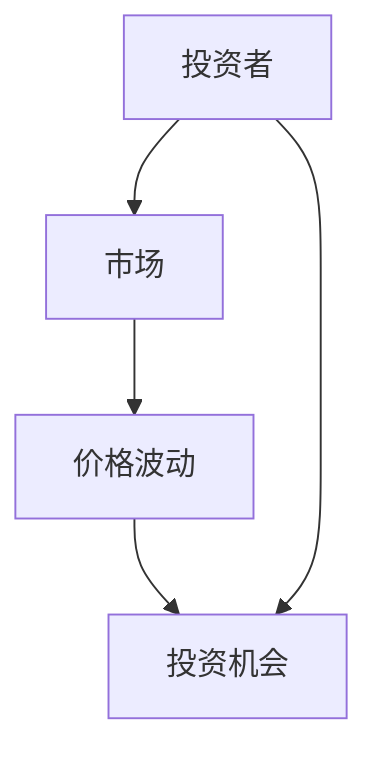
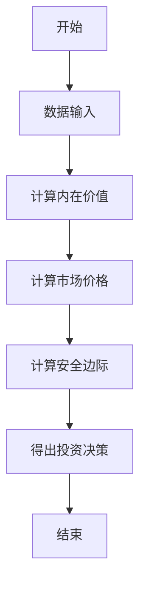
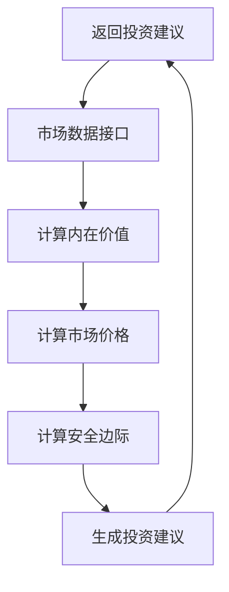

                 


# 约翰·聂夫的反向投资理念

## 关键词：反向投资、约翰·聂夫、价值投资、安全边际、市场逆向思维

## 摘要：约翰·聂夫是投资界的传奇人物，以其独特的反向投资策略闻名。本文将深入解析聂夫的投资理念，探讨其背后的数学模型和算法，结合实际案例，系统性地阐述反向投资的理论基础、应用场景及风险控制。

---

# 第一部分：反向投资的背景与基础

## 第1章：反向投资的起源与发展

### 1.1 投资学的起源与发展

- 1.1.1 投资学的基本概念
- 1.1.2 反向投资的起源
- 1.1.3 约翰·聂夫的生平与投资历程

### 1.2 约翰·聂夫的投资哲学

- 1.2.1 价值投资与成长投资的区别
- 1.2.2 反向投资的核心思想
- 1.2.3 投资中的逆向思维

### 1.3 反向投资的策略与特点

- 1.3.1 反向投资的策略框架
- 1.3.2 反向投资与市场周期的关系
- 1.3.3 反向投资的风险与收益平衡

### 1.4 经典投资案例分析

- 1.4.1 美国可口可乐公司的投资案例
- 1.4.2 其他经典投资案例分析
- 1.4.3 案例总结与经验启示

### 1.5 本章小结

---

## 第2章：反向投资的核心概念与联系

### 2.1 反向投资的核心概念

- 2.1.1 市场逆向思维的定义
- 2.1.2 价值评估的核心要素
- 2.1.3 安全边际的概念与作用

### 2.2 反向投资与其他投资策略的对比

- 2.2.1 价值投资与成长投资的对比
- 2.2.2 技术分析与基本面分析的对比
- 2.2.3 反向投资的独特性与优势

### 2.3 反向投资的ER实体关系图



---

## 第3章：反向投资的算法原理与数学模型

### 3.1 反向投资的算法原理

- 3.1.1 基于价值的股票筛选算法
- 3.1.2 市场情绪分析算法
- 3.1.3 安全边际计算算法

### 3.2 反向投资的数学模型

- 3.2.1 价值评估模型
  $$ P = \frac{E}{P/E} $$
- 3.2.2 安全边际计算公式
  $$ \text{安全边际} = \text{内在价值} - \text{市场价格} $$
- 3.2.3 市场周期模型
  $$ C = \frac{P}{E} \times G $$
  其中，\( P \) 为价格，\( E \) 为收益，\( G \) 为增长率。

### 3.3 算法流程图



---

## 第4章：反向投资的系统分析与架构设计

### 4.1 问题场景介绍

- 4.1.1 投资者面临的市场波动问题
- 4.1.2 如何利用反向投资策略进行风险管理

### 4.2 项目介绍

- 4.2.1 反向投资决策系统的开发目标
- 4.2.2 系统的功能概述
- 4.2.3 系统的用户群体与应用场景

### 4.3 系统功能设计

- 4.3.1 领域模型设计
  ```mermaid
  classDiagram
      class 投资者 {
          资金
          投资组合
      }
      class 市场 {
          股价
          市盈率
      }
      class 投资机会 {
          价值评估
          安全边际
      }
      投资者 --> 市场: 获取市场信息
      市场 --> 投资机会: 生成投资机会
      投资者 --> 投资机会: 选择投资标的
  ```

### 4.4 系统架构设计

- 4.4.1 系统架构图
  ```mermaid
  architecture
  Client <---> Web层 <---> 业务逻辑层 <---> 数据库
  ```

### 4.5 系统接口设计

- 4.5.1 API接口定义
- 4.5.2 接口交互流程
- 4.5.3 接口安全设计

### 4.6 系统交互流程图



---

## 第5章：反向投资的项目实战

### 5.1 环境安装与配置

- 5.1.1 系统运行环境要求
- 5.1.2 开发工具安装
- 5.1.3 数据源配置

### 5.2 核心算法实现

- 5.2.1 价值评估模型的Python实现
  ```python
  def calculate_intrinsic_value(price, pe_ratio):
      return price / pe_ratio
  ```
- 5.2.2 安全边际计算代码
  ```python
  def calculate_margin_of_safety(intrinsic_value, market_price):
      return intrinsic_value - market_price
  ```

### 5.3 实际案例分析

- 5.3.1 某公司股票的反向投资分析
- 5.3.2 数据分析结果解读
- 5.3.3 投资决策建议

### 5.4 项目总结

- 5.4.1 项目成果
- 5.4.2 实施过程中的经验教训
- 5.4.3 未来改进方向

---

## 第6章：反向投资的最佳实践

### 6.1 小结

- 6.1.1 反向投资的核心要点
- 6.1.2 算法与模型的总结
- 6.1.3 项目实施的经验总结

### 6.2 注意事项

- 6.2.1 投资者需具备的条件
- 6.2.2 市场风险的防范措施
- 6.2.3 投资决策的注意事项

### 6.3 拓展阅读

- 6.3.1 推荐的书籍与资源
- 6.3.2 相关学术论文
- 6.3.3 实战博客与案例分享

---

## 结语

通过本文的系统性分析，读者可以全面了解约翰·聂夫的反向投资理念，掌握其背后的算法原理和数学模型，并通过实际案例和项目实战，提升自己的投资能力。反向投资不仅是一种投资策略，更是一种逆向思维的智慧，值得每一位投资者深入研究和实践。

