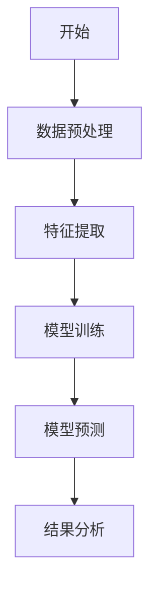
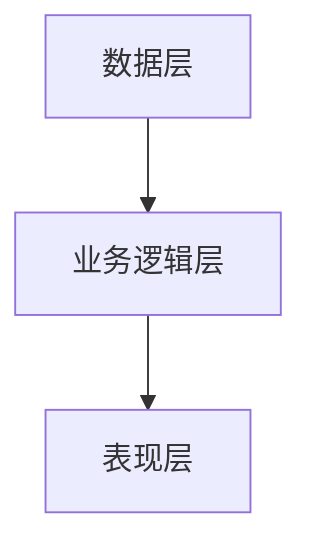
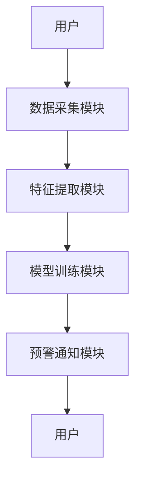

                 


# 约翰聂夫的市场泡沫识别

## 关键词：市场泡沫、投资策略、约翰·聂夫、价值投资、风险管理

## 摘要：本文深入分析了约翰·聂夫的市场泡沫识别方法，探讨了其背后的逻辑和原理，结合技术分析和基本面分析，提出了系统的市场泡沫识别框架，并通过实际案例展示了如何在投资中避免泡沫带来的风险。

---

## 第一部分: 市场泡沫识别的背景与核心概念

### 第1章: 市场泡沫的基本概念与历史案例

#### 1.1 市场泡沫的定义与特征
##### 1.1.1 市场泡沫的定义
市场泡沫是指资产价格在短期内快速上涨，远超过其内在价值的现象。泡沫的形成通常与市场情绪、过度投机和羊群效应密切相关。

##### 1.1.2 市场泡沫的核心特征
市场泡沫的核心特征包括价格远高于内在价值、交易量激增、市场情绪极度乐观以及投资者的非理性行为。

##### 1.1.3 市场泡沫与经济周期的关系
市场泡沫通常出现在经济周期的扩张阶段，尤其是在市场情绪高涨和资金充裕的情况下。

#### 1.2 历史上的市场泡沫案例
##### 1.2.1 荷兰郁金香泡沫
17世纪荷兰郁金香市场的狂热情况，导致价格暴涨后暴跌，成为最早的市场泡沫案例。

##### 1.2.2 互联网泡沫
20世纪90年代互联网公司的疯狂估值，导致大量公司倒闭，股价暴跌。

##### 1.2.3 2008年次贷危机与房地产泡沫
次贷危机引发了全球性金融危机，证明了市场泡沫对经济的破坏性影响。

#### 1.3 市场泡沫的形成机制
##### 1.3.1 市场情绪的作用
投资者情绪的波动是泡沫形成的重要推动力。

##### 1.3.2 过度投机的驱动
投资者为了追求短期收益，往往忽视资产的长期价值。

##### 1.3.3 市场参与者的羊群效应
投资者倾向于跟随市场趋势，导致价格的非理性波动。

---

### 第2章: 市场泡沫识别的核心指标

#### 2.1 市场估值指标
##### 2.1.1 市盈率（P/E Ratio）
市盈率是衡量股票价格是否合理的常用指标，过高市盈率可能表明市场泡沫。

##### 2.1.2 市净率（P/B Ratio）
市净率是股票价格与每股净资产的比率，过高的市净率可能暗示市场泡沫。

##### 2.1.3 市销率（P/S Ratio）
市销率是股票价格与每股销售收入的比率，过高可能表明市场泡沫。

#### 2.2 市场情绪指标
##### 2.2.1 投资者情绪指数（AAII）
投资者情绪指数反映了市场的乐观或悲观程度。

##### 2.2.2 买入/卖出信号比率
买入和卖出信号的比率可以帮助判断市场的买卖力量。

##### 2.2.3 市场波动率
高波动率通常与市场情绪的极度波动相关，可能暗示市场泡沫。

#### 2.3 市场流动性指标
##### 2.3.1 资金流入/流出比率
资金流入和流出的比率反映了市场的资金动向。

##### 2.3.2 市场成交量分析
成交量是市场情绪的重要指标，高成交量可能暗示市场的过度活跃。

##### 2.3.3 资金杠杆率
高杠杆率通常与市场的过度投机行为相关。

---

### 第3章: 市场泡沫识别的分析框架

#### 3.1 技术分析方法
##### 3.1.1 趋势线与支撑阻力位
趋势线和支撑阻力位是技术分析的重要工具，可以帮助识别市场的超买或超卖状态。

##### 3.1.2 均线与MACD指标
均线和MACD指标是技术分析中的经典工具，可以帮助判断市场的短期和长期趋势。

##### 3.1.3 布林带与波动率分析
布林带和波动率分析可以帮助识别市场的波动性变化，从而判断市场的潜在风险。

#### 3.2 基本面分析方法
##### 3.2.1 公司财务指标分析
公司财务指标如净利润、营业收入、资产负债率等是基本面分析的重要内容。

##### 3.2.2 行业周期分析
行业周期分析可以帮助判断市场的长期趋势和潜在风险。

##### 3.2.3 宏观经济指标分析
宏观经济指标如GDP、通胀率、利率等是判断市场泡沫的重要参考。

#### 3.3 组合分析方法
##### 3.3.1 技术与基本面结合分析
结合技术分析和基本面分析可以提高市场泡沫识别的准确性。

##### 3.3.2 多指标交叉验证
通过多个指标的交叉验证可以减少误判的可能性。

##### 3.3.3 时间序列分析
时间序列分析可以帮助识别市场的周期性变化和趋势。

---

## 第二部分: 基于算法的市场泡沫识别

### 第4章: 市场泡沫识别的算法原理

#### 4.1 时间序列分析
时间序列分析是一种常用的市场泡沫识别方法，通过分析历史数据来预测未来趋势。

#### 4.2 回归分析
回归分析可以帮助识别市场泡沫的相关因素，并预测未来的价格走势。

#### 4.3 聚类分析
聚类分析可以将市场数据分为不同的类别，从而识别出异常的价格波动。

#### 4.4 机器学习算法
机器学习算法如支持向量机（SVM）、随机森林（Random Forest）等可以用于市场泡沫的识别。

#### 4.5 算法流程图
使用Mermaid绘制的算法流程图如下：



---

### 第5章: 系统设计与架构方案

#### 5.1 问题场景介绍
市场泡沫识别系统需要能够实时监控市场数据，并通过算法识别潜在的市场泡沫。

#### 5.2 系统功能设计
系统功能包括数据采集、特征提取、模型训练和预警系统。

#### 5.3 系统架构设计
系统架构包括数据层、业务逻辑层和表现层，使用Mermaid绘制的系统架构图如下：



#### 5.4 系统接口设计
系统接口包括数据输入接口、模型训练接口和预警通知接口。

#### 5.5 系统交互流程
使用Mermaid绘制的系统交互流程图如下：



---

## 第三部分: 项目实战与最佳实践

### 第6章: 项目实战

#### 6.1 环境安装
需要安装Python、Pandas、NumPy、Scikit-learn等库。

#### 6.2 系统核心实现源代码
以下是Python代码示例：

```python
import pandas as pd
import numpy as np
from sklearn.linear_model import LinearRegression

# 数据预处理
data = pd.read_csv('market_data.csv')
data = data.dropna()

# 特征提取
features = data[['市盈率', '市净率', '市销率']]
target = data['价格']

# 模型训练
model = LinearRegression()
model.fit(features, target)

# 模型预测
predictions = model.predict(features)
```

#### 6.3 代码应用解读与分析
通过上述代码可以训练一个线性回归模型，用于预测市场价格，并识别潜在的市场泡沫。

#### 6.4 实际案例分析
以2000年互联网泡沫为例，分析模型如何识别市场的异常波动。

#### 6.5 项目小结
通过项目实战可以验证算法的有效性，并总结经验教训。

---

### 第7章: 最佳实践与注意事项

#### 7.1 投资策略建议
投资者应结合技术分析和基本面分析，制定合理的投资策略。

#### 7.2 风险管理注意事项
投资者应注重风险管理，避免过度杠杆和非理性投资。

#### 7.3 拓展阅读推荐
推荐阅读约翰·聂夫的《巴菲特的loomberg》等书籍，深入理解价值投资的精髓。

---

## 第四部分: 总结与展望

### 第8章: 总结与展望

#### 8.1 总结
本文详细介绍了约翰·聂夫的市场泡沫识别方法，结合技术分析和基本面分析，提出了系统的市场泡沫识别框架。

#### 8.2 展望
未来的研究可以进一步探索深度学习和大数据分析在市场泡沫识别中的应用，提高识别的准确性和效率。

---

通过以上分析，我们可以看到市场泡沫识别是一个复杂但重要的问题，需要结合多种方法和技术，才能有效识别和应对市场风险。

