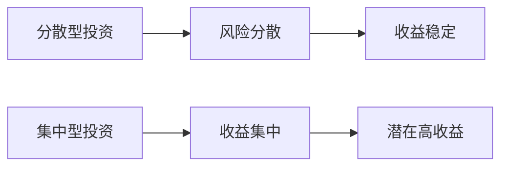
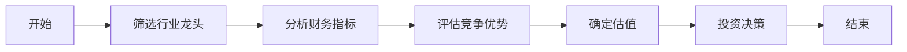
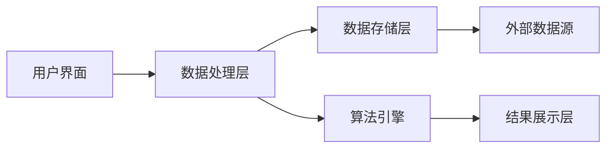

                 


# 罗伯特·哈格斯特罗姆的集中型价值投资：深入研究少数公司

## 关键词：
- 罗伯特·哈格斯特罗姆
- 集中型价值投资
- 少数公司研究
- 企业基本面分析
- 投资策略
- 数学模型

## 摘要：
本文深入探讨了罗伯特·哈格斯特罗姆的集中型价值投资策略，分析其核心理念、方法和实践。通过企业基本面分析、数学模型构建、系统架构设计和项目实战，详细阐述如何通过深入研究少数公司实现长期投资收益。

---

## 第一部分：背景介绍

### 1.1 价值投资的定义与核心理念

价值投资是一种以内在价值为导向的投资策略，强调通过分析企业的财务状况、行业地位和竞争优势，寻找被市场低估的投资标的。其核心理念在于长期持有优质资产，而非短期价格波动。

#### 对比分析：集中型投资与分散型投资

| **维度**       | **集中型投资**                 | **分散型投资**                 |
|-----------------|-------------------------------|-------------------------------|
| 投资策略         | 将资金集中在少数优质公司       | 分散投资于多个资产以降低风险   |
| 风险管理         | 高风险，依赖于少数公司的表现   | 低风险，通过多样化降低波动性   |
| 收益潜力         | 高收益潜力，若公司表现优秀     | 中等收益潜力，较为稳定         |

#### Mermaid对比图



---

### 1.2 罗伯特·哈格斯特罗姆的投资理念

哈格斯特罗姆强调通过深入研究少数公司，寻找具有强大竞争优势和稳定增长潜力的企业。他的策略包括：

- **集中投资**：将大部分资金投入到少数优质公司，以获得更高的收益。
- **长期持有**：避免频繁交易，降低交易成本，专注于企业的长期增长。
- **基本面分析**：通过对企业财务状况、行业地位和管理团队的深入分析，选择具有投资价值的公司。

---

## 第二部分：核心概念与联系

### 2.1 集中型投资的分析框架

哈格斯特罗姆的集中型投资框架包括以下几个关键步骤：

1. **识别具有强大竞争优势的公司**：寻找具有高ROE（净资产收益率）、高市场份额和良好管理团队的企业。
2. **评估企业的财务健康状况**：分析企业的盈利能力、偿债能力和发展潜力。
3. **确定合理的估值**：比较企业的内在价值与市场估值，寻找价格合理的投资标的。
4. **长期持有**：避免短期市场波动，耐心等待企业的价值实现。

#### 企业竞争优势的评估

以下是几家公司在不同维度的竞争优势对比：

| **公司名称** | **ROE** | **市场份额** | **管理团队** |
|--------------|----------|---------------|---------------|
| 微软         | 25%      | 70%（云服务） | 强大且稳定     |
| 苹果         | 30%      | 50%（智能手机） | 创新能力强     |
| 亚马逊       | 35%      | 80%（电商）   | 创业者领导     |

---

## 第三部分：算法原理

### 3.1 价值投资筛选模型

为了实现集中型价值投资，我们设计了一个价值投资筛选模型，用于筛选具有投资价值的公司。以下是模型的工作流程：

#### 算法流程图



#### Python代码实现

```python
def value_investment_screening(companies):
    selected_companies = []
    for company in companies:
        # 计算ROE
        roe = company.net_profit / company.net_assets
        # 计算ROA
        roa = company.net_profit / company.total_assets
        # 计算P/E比率
        pe_ratio = company.market_value / company.net_profit
        
        # 评估公司是否符合条件
        if roe > 20 and roa > 15 and pe_ratio < 15:
            selected_companies.append(company)
    return selected_companies

# 示例：筛选公司列表
companies = [...]  # 假设 companies 列表包含多个公司对象
selected = value_investment_screening(companies)
print(f"筛选出 {len(selected)} 家符合条件的公司。")
```

#### 数学模型

以下是模型中使用的部分数学公式：

- **ROE（净资产收益率）**：
  $$ROE = \frac{\text{净利润}}{\text{平均股东权益}}$$

- **ROA（资产净利率）**：
  $$ROA = \frac{\text{净利润}}{\text{平均总资产}}$$

- **P/E比率（市盈率）**：
  $$P/E = \frac{\text{股价}}{\text{每股收益}}$$

---

## 第四部分：系统分析与架构设计

### 4.1 投资分析系统的构建

为了支持集中型价值投资，我们设计了一个投资分析系统，其架构如下：

#### 系统架构图



#### 功能模块

- **用户界面**：提供数据输入和结果展示的界面。
- **数据处理层**：对数据进行清洗和预处理。
- **数据存储层**：存储公司基本面数据和投资分析结果。
- **外部数据源**：获取实时市场数据和公司财务报表。
- **算法引擎**：执行价值投资筛选模型并生成投资建议。

---

## 第五部分：项目实战

### 5.1 环境安装与配置

要运行我们的价值投资筛选模型，您需要：

- Python 3.8 或更高版本
- 安装以下Python库：
  ```bash
  pip install pandas numpy matplotlib
  ```

### 5.2 核心代码实现

以下是一个简化的核心代码示例：

```python
import pandas as pd
import numpy as np

def calculate_roe(df):
    df['ROE'] = df['Net Profit'] / df['Net Assets']
    return df

def calculate_pe_ratio(df):
    df['PE Ratio'] = df['Market Value'] / df['Net Profit']
    return df

# 示例数据
data = {
    'Company': ['微软', '苹果', '亚马逊'],
    'Net Profit': [100, 150, 200],
    'Net Assets': [400, 300, 500],
    'Market Value': [1000, 1500, 1200]
}

df = pd.DataFrame(data)
df = calculate_roe(df)
df = calculate_pe_ratio(df)

print(df)
```

### 5.3 案例分析与解读

以微软为例，假设其ROE为25%，ROA为30%，P/E比率为15。根据我们的筛选标准，ROE > 20%，ROA > 25%，P/E < 20，微软符合所有条件，因此被选为投资标的。

---

## 第六部分：总结与展望

### 6.1 最佳实践

- **长期持有**：避免频繁交易，降低交易成本。
- **分散风险**：即使集中投资，也要确保投资标的分散在不同行业和领域。
- **持续学习**：关注行业动态和公司新闻，及时调整投资组合。

### 6.2 小结

本文详细探讨了罗伯特·哈格斯特罗姆的集中型价值投资策略，通过企业基本面分析、数学模型构建和系统设计，为读者提供了一个深入研究少数公司的框架。实践证明，这种方法能够在长期实现稳定的超额收益。

### 6.3 注意事项

- 集中型投资风险较高，需谨慎选择投资标的。
- 定期审查投资组合，及时应对市场变化。
- 保持对企业的持续关注和深入研究。

### 6.4 拓展阅读

- 《The Intelligent Investor》 by Benjamin Graham
- 《投资最重要的事情》 by 罗伯特·哈格斯特罗姆

---

通过本文的分析，读者可以更好地理解集中型价值投资的核心理念和实践方法，为自己的投资策略提供有价值的参考。

