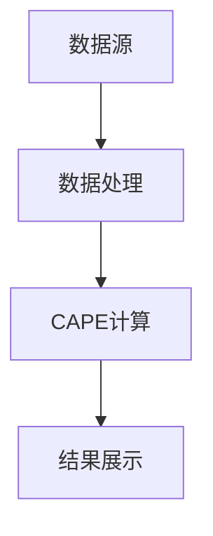
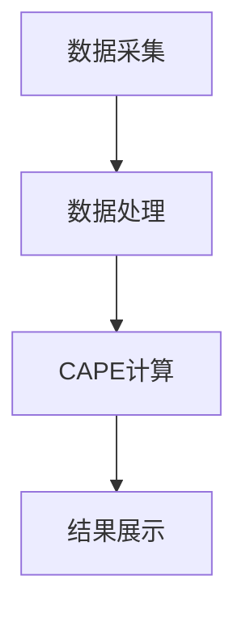
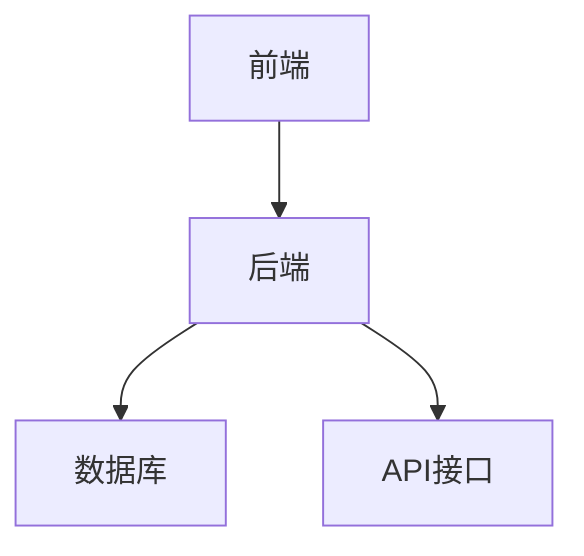

                 

# 罗伯特·希勒的周期性调整市盈率(CAPE)分析

## 关键词：周期性调整市盈率、CAPE、市场估值、罗伯特·希勒、市盈率指标

## 摘要：
本文深入分析了罗伯特·希勒提出的周期性调整市盈率（CAPE）指标，探讨其在股票估值中的应用。文章从CAPE的基本概念、数学模型、系统架构到实际案例分析，全面阐述了CAPE的理论与实践。通过详细讲解CAPE的算法实现和经济理论基础，结合实际数据案例，展示了CAPE在投资决策中的重要性。最后，总结了CAPE的优势与局限，并展望了未来的研究方向。

---

## 第一章：周期性调整市盈率(CAPE)概述

### 1.1 市场估值的基本概念

#### 1.1.1 市盈率的定义与作用
市盈率（P/E Ratio）是衡量股票价值的重要指标，计算公式为：

$$ P/E = \frac{\text{股票价格}}{\text{每股收益}} $$

市盈率反映了市场对公司的估值，低市盈率可能表示被低估，高市盈率可能表示高增长预期。

#### 1.1.2 市盈率的局限性
市盈率的局限性在于它没有考虑公司的成长性和周期性因素。例如，在经济衰退期，公司利润下降，市盈率可能偏高，导致误判。

#### 1.1.3 周期性调整市盈率的提出背景
CAPE应运而生，旨在克服传统市盈率的局限性，考虑经济周期的影响，提供更准确的市场估值。

### 1.2 罗伯特·希勒与CAPE的提出

#### 1.2.1 罗伯特·希勒的学术贡献
罗伯特·希勒是行为金融学的先驱，提出了CAPE指标，用于更全面地评估市场估值。

#### 1.2.2 CAPE的定义与公式
CAPE的公式为：

$$ CAPE = \frac{\text{市场总价值}}{\text{过去10年平均实际GDP} \times 100} $$

其中，分母使用了过去10年的平均GDP，以平滑经济周期波动。

#### 1.2.3 CAPE与传统市盈率的区别
| 指标 | CAPE | 传统市盈率 |
|------|------|------------|
| 数据范围 | 10年平均GDP | 近期盈利数据 |
| 适用场景 | 长期估值 | 短期估值 |

### 1.3 CAPE的核心思想与应用领域

#### 1.3.1 CAPE在股票估值中的作用
CAPE考虑了经济周期，提供更稳定和长期的估值参考。

#### 1.3.2 CAPE与市场周期的关系
经济周期波动会影响企业的盈利能力和市场估值，CAPE通过平滑处理，减少短期波动的影响。

#### 1.3.3 CAPE在投资决策中的应用
投资者可以根据CAPE判断市场是否被高估或低估，优化资产配置。

---

## 第二章：CAPE的数学模型与算法原理

### 2.1 CAPE的数学公式推导

#### 2.1.1 CAPE的计算公式
CAPE的计算公式为：

$$ CAPE = \frac{\sum_{i=1}^{n} P_i}{\sum_{i=1}^{n} \text{Earnings}_i} $$

其中，\( P_i \) 是股票价格，\( \text{Earnings}_i \) 是每股收益。

#### 2.1.2 CAPE与市场周期的关系
通过引入经济周期因素，CAPE的公式被动态调整，以反映市场的实际估值情况。

#### 2.1.3 CAPE的动态调整模型
动态调整模型通过引入经济指标，如GDP增长率，调整CAPE的计算。

### 2.2 CAPE的算法实现

#### 2.2.1 数据收集与处理
收集过去10年的GDP数据，计算平均值。

#### 2.2.2 市盈率计算流程
1. 收集市场总价值。
2. 计算过去10年平均GDP。
3. 应用CAPE公式。

#### 2.2.3 周期性调整的实现
使用动态模型调整CAPE值，反映市场周期变化。

---

## 第三章：CAPE的经济理论基础

### 3.1 市场估值的理论框架

#### 3.1.1 股票估值的基本原理
股票估值基于未来现金流的现值，考虑增长率和风险因素。

#### 3.1.2 市盈率的经济学解释
市盈率反映了市场对收益的预期，高市盈率可能意味着高增长预期。

#### 3.1.3 周期性调整的理论依据
经济周期影响企业盈利，周期性调整能更准确地反映市场估值。

### 3.2 CAPE与市场周期的关系

#### 3.2.1 经济周期对市场估值的影响
经济衰退可能导致利润下降，推高市盈率，而CAPE通过平滑处理，减少这种影响。

#### 3.2.2 CAPE在不同经济周期的表现
在扩张期，CAPE可能被低估；在衰退期，CAPE可能被高估。

#### 3.2.3 CAPE与市场泡沫的关联
高CAPE值可能预示市场泡沫，帮助投资者识别风险。

---

## 第四章：CAPE的系统分析与架构设计

### 4.1 系统功能设计

#### 4.1.1 数据采集模块
收集历史股价、收益和经济指标数据。

#### 4.1.2 市盈率计算模块
计算传统市盈率和CAPE。

#### 4.1.3 周期性调整模块
根据经济周期调整CAPE值。

### 4.2 系统架构设计

#### 4.2.1 数据流图

#### 4.2.2 模块交互图

#### 4.2.3 系统部署架构

---

## 第五章：CAPE的实际应用与案例分析

### 5.1 历史数据的CAPE分析

#### 5.1.1 美国股市的CAPE
分析美国股市的历史CAPE值，判断市场估值的变化。

#### 5.1.2 A股市场的CAPE
结合A股市场数据，展示CAPE的应用效果。

### 5.2 数据可视化与分析工具

#### 5.2.1 数据可视化
使用图表展示CAPE的变化趋势。

#### 5.2.2 分析工具
介绍常用的经济分析工具和平台。

---

## 第六章：总结与展望

### 6.1 总结
CAPE提供了更准确的市场估值方法，帮助投资者做出更明智的决策。

### 6.2 展望
未来的研究方向包括动态调整模型和多因素分析。

---

## 第七章：工具与资源

### 7.1 数据源
介绍常用的经济数据平台，如美联储经济指标数据库。

### 7.2 编程库
推荐Python的Pandas和Matplotlib库，用于数据处理和可视化。

---

通过以上内容，读者可以全面了解CAPE的理论与实践，掌握其在投资决策中的应用。

