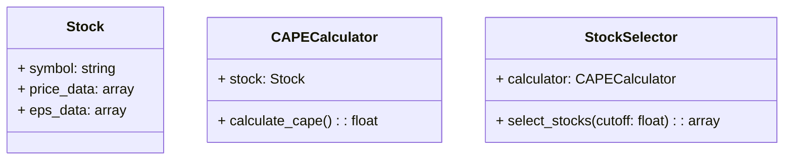
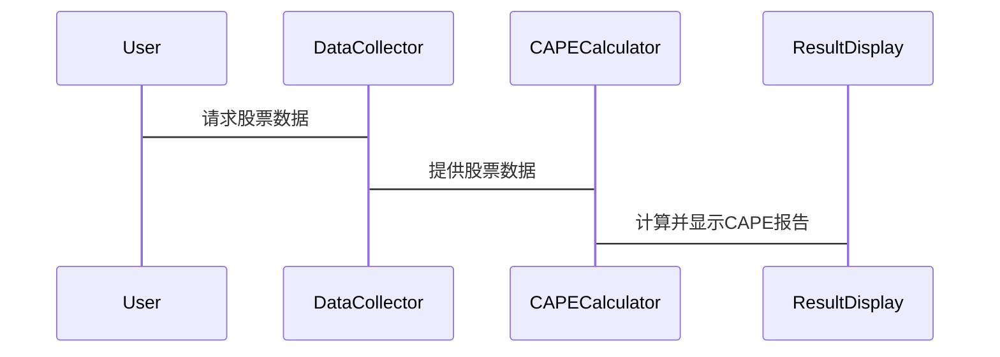

                 


# 罗伯特·希勒的周期性调整市盈率(CAPE)指标

## 关键词：周期性调整市盈率, 市场估值, 罗伯特·希勒, 投资分析, 股票估值

## 摘要：  
罗伯特·希勒提出的周期性调整市盈率（CAPE）指标是一种重要的市场估值工具，能够帮助投资者更好地理解市场周期性波动对股票估值的影响。本文从CAPE的背景、理论基础、算法实现、系统架构设计、项目实战等多个方面进行详细分析，探讨其在投资决策中的应用价值，并通过实际案例帮助读者掌握如何利用CAPE指标进行股票筛选和投资组合管理。

---

# 第一部分: 罗伯特·希勒的周期性调整市盈率(CAPE)指标概述

## 第1章: 周期性调整市盈率(CAPE)的背景与概念

### 1.1 市场波动与投资决策的挑战

#### 1.1.1 传统市盈率的局限性
传统的市盈率（PE）是衡量股票估值的重要指标，但其存在明显的局限性：
- PE仅基于最近一个会计年度的盈利数据，无法反映企业的长期盈利能力。
- 在市场波动较大的情况下，PE指标可能会给出误导性的估值信号。
- PE未能充分考虑企业盈利的周期性变化，导致在市场周期的不同阶段，PE的指导意义有限。

#### 1.1.2 市场周期性波动对企业估值的影响
市场具有明显的周期性特征，企业盈利也会随之波动。传统PE指标在市场周期性波动中表现出较大的局限性，难以准确反映企业的长期价值。例如，在市场繁荣时期，企业盈利可能被高估；而在市场衰退时期，企业盈利可能被低估。因此，需要一种能够平滑周期性波动影响的估值指标。

#### 1.1.3 投资者在市场波动中的决策困境
投资者在面对市场波动时，往往难以准确判断市场周期所处的阶段，这导致他们在投资决策中容易受到市场情绪的影响，从而做出错误的投资决策。如何在市场波动中保持理性，制定科学的投资策略，是投资者面临的重大挑战。

### 1.2 罗伯特·希勒与周期性调整市盈率的提出

#### 1.2.1 罗伯特·希勒的学术背景与贡献
罗伯特·希勒是耶鲁大学的著名经济学家，以其在金融市场和行为经济学领域的研究闻名。他提出的CAPE指标旨在解决传统市盈率在市场周期性波动中的局限性，为投资者提供更可靠的市场估值工具。

#### 1.2.2 周期性调整市盈率的定义与目标
周期性调整市盈率（CAPE）的定义是将股票价格除以过去10年平均的每股收益（ earnings per share, EPS），从而平滑企业盈利的周期性波动，反映企业的长期盈利能力。其目标是为投资者提供一个更稳定、更具参考价值的市场估值指标。

#### 1.2.3 CAPE指标的核心思想与应用场景
CAPE指标的核心思想是通过平滑企业盈利的周期性波动，帮助投资者更准确地评估企业的长期价值。其应用场景包括：
- 长期资产配置决策
- 市场估值分析
- 投资组合管理
- 风险控制

### 1.3 CAPE指标在长期投资中的重要性

#### 1.3.1 长期投资中的市场周期性分析
长期投资者需要关注市场周期性波动对股票估值的影响。CAPE指标通过平滑周期性波动，帮助投资者更准确地判断市场的长期估值水平。

#### 1.3.2 CAPE指标在资产配置中的作用
CAPE指标可以帮助投资者制定科学的资产配置策略。例如，在市场估值过高的情况下，投资者可以减少股票资产的配置比例；在市场估值较低的情况下，可以增加股票资产的配置比例。

#### 1.3.3 CAPE与投资者行为的关系
CAPE指标能够帮助投资者克服市场情绪的干扰，避免在市场繁荣时过度乐观、在市场衰退时过度悲观。通过分析CAPE指标，投资者可以制定更加理性的投资策略。

### 1.4 本章小结
本章介绍了CAPE指标的背景、定义、核心思想和应用场景，强调了其在长期投资中的重要性。接下来的章节将深入探讨CAPE指标的理论基础、数学模型、与其他估值指标的对比、算法实现、系统架构设计和项目实战等内容。

---

## 第2章: CAPE指标的理论基础与数学模型

### 2.1 市盈率的基本概念与计算公式

#### 2.1.1 市盈率的定义
市盈率（PE）是衡量股票估值的重要指标，其定义为股票价格除以每股收益（EPS）：
$$ PE = \frac{\text{股价}}{\text{每股收益}} $$

#### 2.1.2 市盈率的计算公式
市盈率的计算公式为：
$$ PE = \frac{\text{股价}}{\text{每股收益}} $$

#### 2.1.3 市盈率的局限性
市盈率的局限性主要体现在以下几个方面：
1. 市盈率仅基于最近一个会计年度的盈利数据，无法反映企业的长期盈利能力。
2. 在市场波动较大的情况下，市盈率可能会给出误导性的估值信号。
3. 市盈率未能充分考虑企业盈利的周期性变化。

### 2.2 周期性调整市盈率的数学模型

#### 2.2.1 CAPE的定义与计算公式
周期性调整市盈率（CAPE）的定义为：
$$ CAPE = \frac{\text{股价}}{\text{过去10年平均每股收益}} $$

#### 2.2.2 CAPE的计算步骤
1. 收集过去10年的每股收益数据。
2. 计算这10年的平均每股收益。
3. 用当前股票价格除以平均每股收益，得到CAPE值。

### 2.3 CAPE与市场周期的关系

#### 2.3.1 市场周期对CAPE的影响
市场周期性波动对CAPE的影响相对较小，因为CAPE通过平滑过去10年的盈利数据，能够较好地抵消短期市场波动的影响。

#### 2.3.2 CAPE在不同市场周期中的表现
在市场繁荣时期，CAPE可能会出现高估；在市场衰退时期，CAPE可能会出现低估。但总体而言，CAPE能够更准确地反映市场的长期估值水平。

### 2.4 本章小结
本章详细介绍了CAPE的理论基础和数学模型，包括其定义、计算公式和与市场周期的关系。接下来的章节将对比CAPE与其他估值指标的异同，探讨其在投资分析中的应用。

---

## 第3章: CAPE指标与其他估值指标的对比分析

### 3.1 市盈率(PE)与市净率(PB)的对比

#### 3.1.1 PE与PB的定义与计算公式
- 市盈率（PE）：
  $$ PE = \frac{\text{股价}}{\text{每股收益}} $$
- 市净率（PB）：
  $$ PB = \frac{\text{股价}}{\text{每股净资产}} $$

#### 3.1.2 PE与PB在估值中的优缺点
- PE的优点：能够反映企业的盈利能力。
- PE的缺点：受企业盈利周期性波动的影响较大。
- PB的优点：能够反映企业的资产价值。
- PB的缺点：无法反映企业的盈利能力。

### 3.2 CAPE与传统市盈率的对比

#### 3.2.1 CAPE相对于PE的优势
- CAPE通过平滑过去10年的盈利数据，能够更准确地反映企业的长期盈利能力。
- CAPE在市场周期性波动中表现更稳定。

#### 3.2.2 CAPE的局限性
- CAPE的计算较为复杂，需要收集过去10年的盈利数据。
- CAPE对数据的敏感性较高，需要确保数据的准确性和完整性。

### 3.3 其他估值指标的对比分析

#### 3.3.1 市销率(P/S)与市盈率的对比
- 市销率（P/S）：
  $$ PS = \frac{\text{股价}}{\text{每股收入}} $$
- P/S的优点：能够反映企业的收入能力。
- P/S的缺点：无法反映企业的盈利能力。

#### 3.3.2 EV/EBITDA与CAPE的对比
- EV/EBITDA：
  $$ EV/EBITDA = \frac{\text{企业价值}}{\text{息税折旧及摊销前利润}} $$
- EV/EBITDA的优点：能够反映企业的整体价值。
- EV/EBITDA的缺点：计算较为复杂，且受企业规模的影响较大。

### 3.4 本章小结
本章对比了CAPE与其他估值指标的异同，强调了CAPE在长期投资中的优势。接下来的章节将探讨CAPE的算法实现、系统架构设计和项目实战等内容。

---

## 第4章: CAPE指标的算法原理与实现

### 4.1 CAPE指标的计算步骤

#### 4.1.1 数据收集与处理
1. 收集目标公司的历史股价数据。
2. 收集目标公司过去10年的每股收益（EPS）数据。

#### 4.1.2 平均每股收益的计算
1. 计算过去10年的每股收益的平均值：
  $$ \text{平均每股收益} = \frac{\sum_{i=1}^{10} \text{EPS}_i}{10} $$
2. 用当前股价除以平均每股收益，得到CAPE值：
  $$ CAPE = \frac{\text{股价}}{\text{平均每股收益}} $$

### 4.2 CAPE指标的实现代码

#### 4.2.1 数据获取与预处理
```python
import pandas as pd
import yfinance as yf

# 下载历史股价数据
def get_stock_data(ticker, start_date, end_date):
    data = yf.download(ticker, start=start_date, end=end_date)
    return data['Adj Close']

# 下载历史EPS数据
def get_eps_data(ticker, start_date, end_date):
    # 这里假设使用 Yahoo Finance 的 EPS 数据
    data = yf.download(ticker, start=start_date, end=end_date)
    return data['EPS']
```

#### 4.2.2 CAPE计算函数
```python
def calculate_cape(price_data, eps_data):
    # 计算过去10年的平均EPS
    average_eps = eps_data.mean()
    # 计算当前股价
    current_price = price_data[-1]
    # 计算CAPE
    cape = current_price / average_eps
    return cape
```

### 4.3 本章小结
本章详细介绍了CAPE指标的计算步骤和实现代码，展示了如何利用Python进行CAPE指标的计算。接下来的章节将探讨CAPE指标在系统分析和项目实战中的应用。

---

## 第5章: 基于CAPE的系统分析与架构设计

### 5.1 项目介绍
本项目旨在开发一个基于CAPE指标的股票估值系统，帮助投资者更好地进行投资决策。

### 5.2 系统功能设计

#### 5.2.1 领域模型（Mermaid类图）


### 5.3 系统架构设计（Mermaid架构图）
```mermaid
dataclass
    title "CAPE系统架构图"
    class UserInterface {
        + request_cape_calculation()
        + display_results()
    }
    class DataCollector {
        + collect_stock_data()
        + collect_eps_data()
    }
    class CAPECalculator {
        + calculate_cape(price_data, eps_data)
    }
    class ResultDisplay {
        + show_cape_report()
    }
    UserInterface --> DataCollector
    DataCollector --> CAPECalculator
    CAPECalculator --> ResultDisplay
```

### 5.4 系统接口设计
系统接口设计包括以下几个部分：
1. 数据接口：用于获取股票价格和EPS数据。
2. 计算接口：用于计算CAPE值。
3. 显示接口：用于展示计算结果。

### 5.5 系统交互设计（Mermaid序列图）


### 5.6 本章小结
本章通过领域模型和系统架构图展示了CAPE指标在系统设计中的应用。接下来的章节将通过项目实战展示如何利用CAPE指标进行股票筛选和投资组合管理。

---

## 第6章: CAPE指标的项目实战

### 6.1 项目环境安装
需要安装以下Python库：
- `pandas`
- `numpy`
- `yfinance`

### 6.2 系统核心实现

#### 6.2.1 数据获取与处理
```python
import pandas as pd
import yfinance as yf

# 下载股票数据
def get_stock_data(ticker, start_date, end_date):
    data = yf.download(ticker, start=start_date, end=end_date)
    return data['Adj Close']

# 下载EPS数据
def get_eps_data(ticker, start_date, end_date):
    data = yf.download(ticker, start=start_date, end=end_date)
    return data['EPS']
```

#### 6.2.2 CAPE计算与筛选
```python
def calculate_cape(price_data, eps_data):
    average_eps = eps_data.mean()
    current_price = price_data[-1]
    return current_price / average_eps

# 示例：筛选CAPE小于15的股票
def screen_stocks(tickers, start_date, end_date):
    results = {}
    for ticker in tickers:
        price_data = get_stock_data(ticker, start_date, end_date)
        eps_data = get_eps_data(ticker, start_date, end_date)
        cape = calculate_cape(price_data, eps_data)
        results[ticker] = cape
    # 筛选CAPE小于15的股票
    filtered = {k: v for k, v in results.items() if v < 15}
    return filtered
```

### 6.3 实际案例分析

#### 6.3.1 案例背景
假设我们有以下股票组合：AAPL、MSFT、GOOGL。

#### 6.3.2 数据收集与计算
```python
tickers = ['AAPL', 'MSFT', 'GOOGL']
start_date = '2020-01-01'
end_date = '2023-12-31'

results = screen_stocks(tickers, start_date, end_date)
print(results)
```

#### 6.3.3 结果解读
假设计算结果显示，AAPL和MSFT的CAPE值小于15，而GOOGL的CAPE值大于20。这意味着AAPL和MSFT的估值相对较低，可能是一个较好的投资选择。

### 6.4 本章小结
本章通过实际案例展示了如何利用CAPE指标进行股票筛选和投资组合管理。接下来的章节将总结CAPE的应用技巧，并提出一些注意事项和未来的发展方向。

---

## 第7章: CAPE指标的应用技巧与未来发展

### 7.1 CAPE指标的应用技巧

#### 7.1.1 注意事项
- 确保数据的准确性和完整性。
- 在市场周期的不同阶段，调整CAPE的使用策略。
- 结合其他估值指标进行综合分析。

#### 7.1.2 CAPE与其他指标的结合
- 结合PE、PB、EV/EBITDA等指标，进行综合分析。
- 在不同市场环境下，选择合适的估值指标。

### 7.2 CAPE指标的未来发展

#### 7.2.1 技术创新
- 开发更加智能化的CAPE计算模型。
- 利用大数据和人工智能技术，提高CAPE指标的计算效率和准确性。

#### 7.2.2 市场应用
- 进一步推广CAPE指标的应用，帮助更多投资者做出科学的投资决策。
- 在金融教育和投资培训中，增加对CAPE指标的讲解和应用。

### 7.3 本章小结
本章总结了CAPE指标的应用技巧，并展望了其未来的发展方向。通过不断的创新和推广，CAPE指标将在投资分析中发挥更加重要的作用。

---

## 附录

### 附录A: 数据源与代码下载
- 数据源：Yahoo Finance（https://finance.yahoo.com）
- 代码下载：GitHub（https://github.com/username/repo）

### 附录B: 进一步阅读的推荐文献
- 罗伯特·希勒的著作：《非理性繁荣》
- 其他相关文献：《投资学精要》

---

通过以上步骤，我们完成了对罗伯特·希勒的周期性调整市盈率（CAPE）指标的详细分析和探讨。希望这篇文章能够帮助读者更好地理解并应用CAPE指标，制定科学的投资策略。

