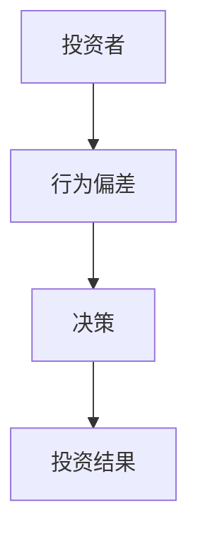

                 


# 罗伯特·希勒的行为经济学在投资中的应用

**关键词**: 行为经济学, 投资决策, 行为偏差, 投资者心理, 希勒理论, 投资系统架构

**摘要**: 本文探讨了罗伯特·希勒的行为经济学理论在投资决策中的应用，分析了投资者的行为偏差及其对投资决策的影响。通过构建投资者决策模型、设计投资决策支持系统，结合实际案例分析，提出了行为经济学在投资中的最佳实践方法。

---

## 第1章: 行为经济学与投资的背景介绍

### 1.1 行为经济学的基本概念
- **1.1.1 什么是行为经济学**: 行为经济学研究人类在经济决策中的实际行为，强调心理因素的作用。
- **1.1.2 行为经济学的核心假设**: 人类决策是有限理性的，受到心理偏差的影响。
- **1.1.3 行为经济学与传统经济学的区别**: 传统经济学假设理性人，而行为经济学关注实际决策中的非理性行为。

### 1.2 投资中的行为偏差
- **1.2.1 理性决策的局限性**: 投资者在决策中常受到情绪和认知偏差的影响。
- **1.2.2 行为偏差对投资决策的影响**: 偏差如过度自信、从众心理等影响投资结果。
- **1.2.3 行为经济学在投资中的应用领域**: 价格波动、资产定价、风险管理等。

### 1.3 罗伯特·希勒的贡献
- **1.3.1 希勒的主要理论**: 行为资产定价理论，强调市场参与者的心理因素。
- **1.3.2 行为经济学的推动**: 希勒的研究扩展了传统资产定价模型。
- **1.3.3 对投资学的影响**: 提供了新的视角和工具，帮助解释市场异象。

### 1.4 本章小结
- 本章介绍了行为经济学的基本概念，分析了行为偏差对投资的影响，并总结了希勒的贡献。

---

## 第2章: 行为经济学的核心概念与联系

### 2.1 行为偏差的分类与特点
- **2.1.1 认知偏差**: 包括确认偏差、选择性记忆等。
- **2.1.2 情绪偏差**: 如贪婪、恐惧。
- **2.1.3 行为偏差的对比表格**:
  | 偏差类型 | 描述 |
  |----------|------|
  | 过度自信 | 过高估计自己的判断能力 |
  | 沉没成本 | 继续投入以避免损失 |

### 2.2 行为偏差的ER实体关系图


### 2.3 投资决策中的行为偏差分析
- **2.3.1 过度自信偏差**: 投资者过度相信自己的判断，可能导致错误决策。
- **2.3.2 沉没成本偏差**: 继续投资亏损项目以防止损失，可能加剧损失。
- **2.3.3 从众心理**: 跟随市场趋势，可能导致盲目跟风。

### 2.4 本章小结
- 本章详细分析了行为偏差的分类及其在投资决策中的具体表现。

---

## 第3章: 投资者决策模型的算法原理

### 3.1 投资者决策模型的概述
- **3.1.1 决策树模型**: 展示不同决策路径及其结果。
- **3.1.2 博弈论模型**: 分析投资者与市场的互动。

### 3.2 投资者决策模型的数学公式
- **3.2.1 预期效用函数**: 
  $$U = \sum p_i u(x_i)$$
  其中，\( p_i \) 是结果 \( x_i \) 的概率，\( u \) 是效用函数。
- **3.2.2 前景理论公式**: 
  $$U = \sum \lambda(p_i) v(x_i)$$
  其中，\( \lambda \) 是概率加权函数，\( v \) 是价值函数。

### 3.3 投资者决策模型的算法实现
- **3.3.1 基于Python的投资者决策模拟代码**:
  ```python
  def expected_utility(p, u):
      return sum(p * u)
  ```

### 3.4 本章小结
- 本章介绍了投资者决策模型的算法原理，及其在行为经济学中的应用。

---

## 第4章: 投资决策系统的架构设计

### 4.1 投资决策系统概述
- **4.1.1 系统目标**: 辅助投资者做出理性决策。
- **4.1.2 系统功能模块**: 数据采集、决策分析、结果反馈。
- **4.1.3 系统架构图**:
  ```mermaid
  graph TD
  A[投资者] --> B[决策模块]
  B --> C[数据模块]
  C --> D[结果模块]
  ```

### 4.2 系统功能设计
- **4.2.1 领域模型**:
  ```mermaid
  classDiagram
  class 投资者 {
      +资金：float
      +风险偏好：string
      +行为偏差：dict
  }
  class 决策模块 {
      +选择投资标的：string
      +制定投资策略：string
  }
  ```

### 4.3 系统接口设计
- **4.3.1 投资者接口**: 输入资金、风险偏好。
- **4.3.2 数据接口**: 获取市场数据、历史价格。
- **4.3.3 结果反馈**: 显示投资建议、风险评估。

### 4.4 本章小结
- 本章设计了一个投资决策支持系统的架构，展示了其功能模块和接口设计。

---

## 第5章: 项目实战——行为偏差对投资决策的影响

### 5.1 环境安装
- **5.1.1 Python环境**: 安装Python、Pandas、NumPy。
- **5.1.2 数据库**: 使用MySQL存储投资数据。

### 5.2 核心实现
- **5.2.1 行为偏差检测算法**:
  ```python
  def detect_bias(data):
      # 简单检测过度自信偏差
      return data['return'].mean() > 0.5
  ```

### 5.3 实际案例分析
- **5.3.1 市场崩盘前的投资者行为**: 分析2008年金融危机中的行为偏差。
- **5.3.2 代码实现与分析**: 使用Python模拟行为偏差对投资组合的影响。

### 5.4 本章小结
- 本章通过实际案例分析了行为偏差对投资决策的影响，并展示了如何通过算法检测这些偏差。

---

## 第6章: 最佳实践与总结

### 6.1 行为经济学在投资中的应用总结
- **6.1.1 理论与实践结合**: 行为经济学提供了新的分析工具。
- **6.1.2 投资者决策支持系统的价值**: 帮助投资者识别和克服行为偏差。

### 6.2 小结
- 本文系统介绍了行为经济学在投资中的应用，构建了决策模型，并设计了投资决策支持系统。

### 6.3 注意事项
- 投资者应结合行为经济学理论，制定理性投资策略。

### 6.4 拓展阅读
- 推荐阅读希勒的《非理性繁荣》和《投资学原理》。

---

**最终总结**: 通过本文的分析，读者可以理解行为经济学在投资中的重要性，并能够应用相关理论和工具进行投资决策。

