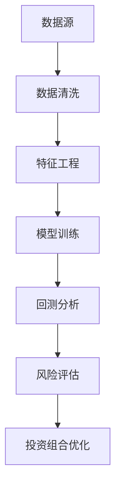
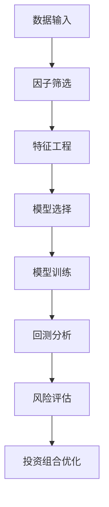

                 


# 罗伯特·阿诺特的基本面量化价值投资：数据驱动的方法

> 关键词：基本面量化投资，数据驱动方法，投资模型，风险管理，因子分析，现代投资组合理论

> 摘要：本文详细探讨了罗伯特·阿诺特的基本面量化价值投资方法，结合数据驱动的分析手段，从理论基础、模型构建到实际应用进行了系统性分析。文章首先介绍了基本面投资的基本概念和量化方法的重要性，接着深入分析了数据预处理、因子筛选与特征工程的核心步骤，详细讲解了基于因子模型和机器学习模型的投资策略。最后，文章讨论了风险管理与组合优化的关键原则，提出了有效的风险控制策略和投资组合优化方法。本文旨在为投资者提供一种系统化、数据驱动的投资框架，帮助他们在复杂多变的市场环境中实现稳健的投资回报。

---

## 第一部分: 基本面量化投资的背景与概念

### 第1章: 基本面投资与量化方法概述

#### 1.1 基本面投资的核心概念
- **1.1.1 基本面投资的定义与特点**
  基本面投资是一种以公司基本面分析为核心的投资策略，通过分析公司的财务报表、行业地位、竞争优势等因素，评估其内在价值，从而做出投资决策。基本面投资强调长期价值，注重对公司基本面的深入研究，而非短期市场波动。

- **1.1.2 量化方法在投资中的作用**
  量化方法通过引入数学模型和算法，将基本面分析数据化、系统化。量化方法的优势在于能够快速处理大量数据，发现潜在的投资机会，并通过回测验证策略的有效性。

- **1.1.3 基本面量化投资的优势与局限性**
  - **优势**：结合了基本面分析的深度和量化方法的高效性，能够在复杂市场环境中找到潜在投资机会。
  - **局限性**：过于依赖数据和模型，可能忽略市场的非理性因素；模型的有效性可能受到数据质量和市场变化的影响。

#### 1.2 数据驱动投资的基本原理
- **1.2.1 数据在投资决策中的重要性**
  数据是基本面量化投资的核心，通过分析历史数据和实时数据，投资者可以发现市场规律、识别投资机会和风险。

- **1.2.2 数据驱动方法的分类**
  数据驱动方法主要包括统计分析、机器学习和大数据挖掘等。这些方法能够从海量数据中提取有用的信息，帮助投资者做出更科学的投资决策。

- **1.2.3 数据驱动与传统投资策略的结合**
  数据驱动方法与传统基本面分析的结合，不仅提高了分析效率，还能够发现传统方法难以捕捉的市场信号。

#### 1.3 基本面量化投资的数学模型
- **1.3.1 基本面因子的定义与选择**
  基本面因子是衡量公司价值的关键指标，常见的因子包括市盈率（P/E）、市净率（P/B）、股息率、营业收入增长率等。

- **1.3.2 因子权重的计算方法**
  因子权重的计算可以通过统计方法（如回归分析）或机器学习方法（如随机森林）实现。权重反映了各个因子对投资组合收益的贡献程度。

- **1.3.3 组合优化的数学公式**
  组合优化的目标是在给定风险水平下最大化收益，或在给定收益水平下最小化风险。马科维茨的均值-方差模型是常用的组合优化方法：
  $$ \text{目标函数} = \min \sigma^2 \quad \text{或} \quad \max \mu $$
  其中，$\sigma^2$ 是投资组合的方差，$\mu$ 是投资组合的期望收益。

---

## 第二部分: 基本面量化模型的构建与实现

### 第2章: 基本面因子的筛选与分析

#### 2.1 常见基本面因子的分类
- **2.1.1 市盈率（P/E）**
  市盈率是衡量股票价值的重要指标，反映了市场对公司未来盈利能力的预期。

- **2.1.2 市净率（P/B）**
  市净率是股票价格与每股净资产的比率，适用于评估价值被低估的公司。

- **2.1.3 股息率**
  股息率是股票的年度股息与股票价格的比率，常用于评估股票的分红能力。

- **2.1.4 营业收入增长率**
  营业收入增长率反映了公司的销售能力和发展潜力。

#### 2.2 因子筛选的数学方法
- **2.2.1 因子相关性分析**
  通过计算因子之间的相关性，可以避免因子之间的多重共线性问题。

- **2.2.2 因子重要性排序**
  通过回归分析或特征重要性排序，可以筛选出对投资组合收益贡献最大的因子。

- **2.2.3 因子筛选的回归分析**
  回归分析可以帮助确定哪些因子对股票收益有显著影响。

#### 2.3 因子组合优化的策略
- **2.3.1 等权重分配**
  将相同的权重分配给所有选中的因子，简单但可能无法充分利用各因子的差异性。

- **2.3.2 风险调整权重**
  根据因子的风险贡献进行权重调整，以降低投资组合的整体风险。

- **2.3.3 基于机器学习的权重分配**
  使用机器学习模型（如随机森林）对因子的重要性进行动态调整，以优化投资组合的收益风险比。

#### 2.4 本章小结

### 第3章: 数据预处理与特征工程

#### 3.1 数据收集与清洗
- **3.1.1 数据来源的选择**
  数据来源包括公开的财务报表、市场数据和新闻数据等，选择可靠的数据源是确保分析结果准确性的关键。

- **3.1.2 数据清洗的步骤**
  数据清洗包括去除缺失值、异常值和重复数据，以及处理数据格式的一致性。

- **3.1.3 数据标准化与归一化**
  标准化和归一化是将数据转换到相同尺度的过程，有助于提高模型的训练效率和准确性。

#### 3.2 特征工程的核心方法
- **3.2.1 特征提取**
  通过统计方法或领域知识，从原始数据中提取有用的特征。

- **3.2.2 特征变换**
  对特征进行变换（如对数变换、正交变换）以改善模型的性能。

- **3.2.3 特征选择**
  通过特征重要性排序或统计检验，选择对目标变量影响最大的特征。

#### 3.3 数据驱动的特征工程案例
- **3.3.1 基于历史数据的特征构建**
  例如，计算过去一年的平均收益率、最大回撤等指标。

- **3.3.2 基于市场情绪的特征构建**
  通过分析社交媒体数据、新闻数据等，构建反映市场情绪的特征。

- **3.3.3 基于技术指标的特征构建**
  使用RSI、MACD等技术指标作为特征。

#### 3.4 本章小结

---

## 第三部分: 系统架构与实现

### 第4章: 基本面量化模型的构建

#### 4.1 基于因子模型的投资策略
- **4.1.1 单因子模型**
  单因子模型假设收益仅由一个因子驱动，例如市值因子。

- **4.1.2 多因子模型**
  多因子模型考虑多个因子对收益的共同影响，能够更全面地解释资产收益。

- **4.1.3 因子轮动策略**
  根据因子表现的变化动态调整投资组合，捕捉市场变化带来的收益。

#### 4.2 基于机器学习的量化模型
- **4.2.1 线性回归模型**
  线性回归模型用于预测资产收益，假设收益与因子之间存在线性关系。

- **4.2.2 支持向量机（SVM）**
  SVM用于分类问题，可以将资产分为高收益和低收益两类。

- **4.2.3 随机森林与梯度提升树**
  随机森林和梯度提升树是基于树的模型，能够捕捉非线性关系，适合处理复杂的特征组合。

#### 4.3 模型性能评估与优化
- **4.3.1 回测分析**
  回测分析是通过历史数据验证模型的有效性，计算回测收益、最大回撤等指标。

- **4.3.2 风险调整后的收益评估**
  使用夏普比率、特雷诺比率等指标衡量投资组合的风险调整后收益。

- **4.3.3 模型优化的策略**
  通过调整模型参数、增加或减少因子数量，优化模型的性能。

#### 4.4 本章小结

---

## 第四部分: 风险管理与组合优化

### 第5章: 风险管理与组合优化

#### 5.1 风险管理的核心原则
- **5.1.1 风险的定义与分类**
  风险包括市场风险、流动性风险、信用风险等，不同风险类型需要不同的管理策略。

- **5.1.2 风险管理的目标**
  风险管理的目标是通过分散投资、对冲风险和控制杠杆，降低投资组合的整体风险。

- **5.1.3 风险管理的工具与方法**
  风险管理的工具包括期权对冲、资产分配和风险敞口分析。

#### 5.2 基于现代投资组合理论的组合优化
- **5.2.1 马科维茨均值-方差模型**
  马科维茨模型通过优化投资组合的期望收益和方差，找到最优风险收益比的投资组合。

- **5.2.2 基于风险中性的组合优化**
  风险中性组合优化方法在中性化风险的基础上，优化投资组合的收益。

- **5.2.3 基于因子模型的组合优化**
  使用因子模型对投资组合的风险和收益进行建模，优化因子权重以实现最优收益风险比。

#### 5.3 风险控制的策略与实现
- **5.3.1 仓位管理**
  根据市场情况动态调整投资仓位，避免过度集中。

- **5.3.2 止损策略**
  设置止损点，当投资组合的亏损达到设定阈值时，立即卖出资产以锁定损失。

- **5.3.3 风险调整后的投资组合**
  根据风险偏好和风险承受能力，调整投资组合的风险水平，确保投资目标的实现。

#### 5.4 本章小结

---

## 第五部分: 项目实战与拓展阅读

### 第6章: 项目实战

#### 6.1 环境安装与数据准备
- **6.1.1 环境安装**
  安装必要的编程环境，如Python、Jupyter Notebook等。

- **6.1.2 数据准备**
  下载历史股价、财务数据等，确保数据的完整性和准确性。

#### 6.2 系统核心实现
- **6.2.1 数据预处理**
  对数据进行清洗、标准化和特征工程处理。

- **6.2.2 模型开发**
  实现因子模型或机器学习模型，进行回测和优化。

- **6.2.3 回测与优化**
  通过回测验证模型的性能，并根据回测结果优化模型参数。

#### 6.3 实际案例分析
- **6.3.1 案例背景**
  例如，使用市盈率和营业收入增长率作为因子，构建投资组合。

- **6.3.2 数据分析与建模**
  对数据进行分析，构建因子模型，并进行回测。

- **6.3.3 结果解读**
  分析投资组合的收益和风险，验证模型的有效性。

#### 6.4 项目小结
- **6.4.1 项目总结**
  总结项目的关键步骤和成果。

- **6.4.2 经验与教训**
  总结在项目实施过程中遇到的问题及解决方案。

---

## 第六部分: 最佳实践与扩展阅读

### 第7章: 最佳实践 tips、小结、注意事项、拓展阅读

#### 7.1 最佳实践 tips
- **数据来源的选择**：确保数据的可靠性和完整性。
- **模型选择与优化**：根据实际情况选择合适的模型，并进行充分的回测和验证。
- **风险管理的重要性**：始终将风险管理放在首位，避免过度杠杆和集中投资。

#### 7.2 小结
本文从基本面量化投资的基本概念出发，详细讲解了数据预处理、因子筛选、模型构建和风险管理的核心步骤。通过实际案例分析，展示了如何将理论应用于实践。

#### 7.3 注意事项
- **数据质量问题**：数据的准确性和完整性直接影响模型的性能。
- **模型的局限性**：量化模型无法完全捕捉市场的非理性因素，需要结合实际情况进行调整。
- **风险管理的重要性**：即使模型表现优异，也需要通过有效的风险管理确保投资组合的稳健性。

#### 7.4 拓展阅读
- **《投资学》（CFA Level I、II、III）**：深入理解投资学的基本原理。
- **《量化投资入门到精通》**：系统学习量化投资的方法和技巧。
- **《Python机器学习实战》**：掌握机器学习在投资中的应用。

---

## 附录

### 附录A: 代码实现

```python
import pandas as pd
import numpy as np
from sklearn.linear_model import LinearRegression
from sklearn.ensemble import RandomForestRegressor
from sklearn.metrics import mean_squared_error

# 示例代码：基于因子模型的投资策略
def preprocess_data(data):
    # 数据清洗和特征工程
    data = data.dropna()
    data['normalized_factor'] = (data['factor'] - data['factor'].mean()) / data['factor'].std()
    return data

def build_model(X, y):
    # 构建线性回归模型
    model = LinearRegression()
    model.fit(X, y)
    return model

def evaluate_model(y_true, y_pred):
    # 评估模型性能
    mse = mean_squared_error(y_true, y_pred)
    rmse = np.sqrt(mse)
    return rmse

# 示例代码：回测分析
def backtest策略(data, model):
    returns = []
    for i in range(len(data)):
        if i >= len(data) - 10:
            break
        # 预测收益
        predicted_return = model.predict([data.iloc[i, 1:]])
        # 计算实际收益
        actual_return = data.iloc[i+1, -1] - data.iloc[i, -1]
        returns.append(actual_return)
    return returns

# 示例代码：风险调整后的收益
def risk_adjusted_return(returns, risk_free_rate):
    # 计算夏普比率
    excess_return = returns - risk_free_rate
    sharpe_ratio = np.mean(excess_return) / np.std(excess_return)
    return sharpe_ratio
```

### 附录B: 系统架构图



### 附录C: 算法流程图



---

## 结语

通过本文的系统性分析，读者可以全面理解罗伯特·阿诺特的基本面量化价值投资方法，并掌握数据驱动的投资策略。无论是理论学习还是实际操作，本文提供的方法和工具都具有重要的参考价值。希望本文能够为投资者在复杂多变的市场中提供有力的指导，帮助他们实现稳健的投资回报。

