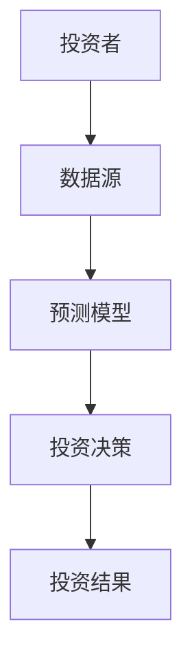
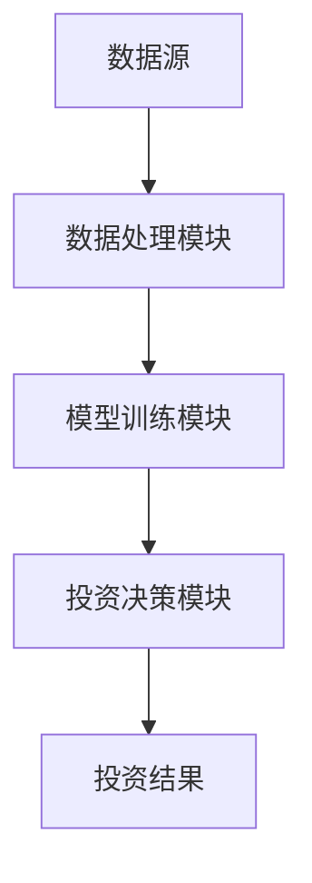
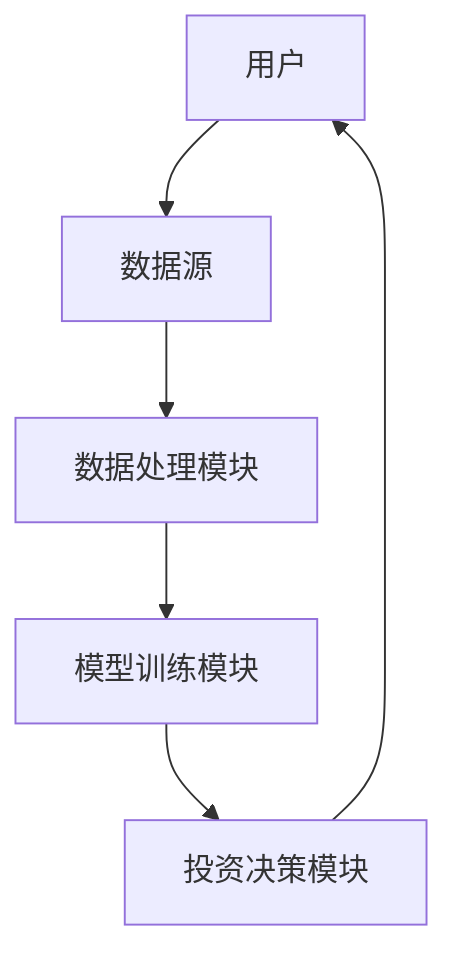

                 


# 罗杰·洛温斯坦的智慧型价值投资

> 关键词：智慧型投资、人工智能、价值投资、机器学习、时间序列预测

> 摘要：智慧型价值投资是一种结合传统价值投资理念与现代人工智能技术的投资策略，旨在通过数据分析和算法优化，提高投资决策的科学性和准确性。本文将详细探讨智慧型价值投资的核心概念、算法原理、系统架构设计及项目实战，帮助读者全面理解并掌握这一创新的投资方法。

---

## 第1章 智慧型价值投资的背景与核心概念

### 1.1 智慧型价值投资的定义与背景

#### 1.1.1 价值投资的起源与发展
价值投资是一种以基本面分析为基础的投资策略，起源于20世纪初，由本杰明·格雷厄姆和戴维·多德提出。其核心思想是寻找市场价值被低估的股票，长期持有以获得超额收益。然而，传统价值投资依赖人工分析，效率低下且难以应对复杂多变的市场环境。

#### 1.1.2 智慧型投资的核心理念
智慧型价值投资将人工智能技术引入价值投资领域，通过大数据分析、机器学习算法和自动化决策系统，提升投资决策的效率和准确性。它结合了人类的智慧和机器的计算能力，旨在捕捉市场中的非效率性机会。

#### 1.1.3 当前投资领域的技术化趋势
近年来，随着人工智能技术的快速发展，越来越多的投资机构开始采用量化分析和算法交易。智慧型价值投资正是这一趋势的产物，它通过技术手段优化传统价值投资的不足。

### 1.2 智慧型价值投资的现状分析

#### 1.2.1 传统价值投资的局限性
- 数据量有限：传统价值投资主要依赖财务报表和行业分析，难以处理海量数据。
- 主观性较强：依赖分析师的个人判断，容易受到情绪和偏见的影响。
- 交易成本高：人工决策流程繁琐，交易成本较高。

#### 1.2.2 人工智能在投资中的应用现状
- 数据处理能力：AI能够快速处理海量数据，发现人类难以察觉的市场规律。
- 预测准确性：通过机器学习模型，可以提高市场趋势预测的准确性。
- 自动化交易：算法交易已经成为现代金融市场的重要组成部分。

#### 1.2.3 智慧型价值投资的市场前景
智慧型价值投资通过技术手段优化投资决策，具有广阔的应用前景。随着AI技术的不断进步，智慧型投资将逐步取代传统投资方式，成为未来投资领域的主流。

### 1.3 智慧型价值投资的意义与价值

#### 1.3.1 提高投资决策的科学性
通过AI技术，智慧型投资能够基于大量数据进行分析，减少人为判断的误差，提高决策的科学性。

#### 1.3.2 降低投资风险的有效性
AI算法能够实时监控市场变化，及时发现潜在风险，从而降低投资风险。

#### 1.3.3 推动投资领域的技术革新
智慧型价值投资的出现，推动了投资领域的技术革新，促进了金融行业的智能化转型。

### 1.4 本章小结
智慧型价值投资是传统价值投资与人工智能技术的结合，具有广阔的应用前景和重要的现实意义。它不仅提高了投资决策的科学性，还降低了投资风险，推动了金融行业的技术革新。

---

## 第2章 智慧型价值投资的核心概念与联系

### 2.1 智慧型价值投资的核心概念

#### 2.1.1 价值投资的定义与属性
- **定义**：价值投资是一种以企业基本面分析为基础的投资策略，强调寻找市场价格低于内在价值的股票。
- **属性**：
  - 长期性：注重长期持有的投资策略。
  - 选股标准：关注企业的盈利能力、成长性和财务健康状况。

#### 2.1.2 人工智能在投资中的应用
- **数据处理**：AI能够快速处理大量非结构化数据，如新闻、社交媒体和公司财报。
- **预测模型**：利用机器学习算法预测市场趋势和股票价格。
- **自动化交易**：通过算法实现快速决策和交易执行。

#### 2.1.3 智慧型价值投资的系统架构
智慧型价值投资的系统架构包括数据采集、模型训练、投资决策和结果反馈四个模块。

### 2.2 核心概念之间的关系

#### 2.2.1 价值投资与人工智能的对比分析
| 方面         | 传统价值投资       | 智慧型价值投资   |
|--------------|--------------------|------------------|
| 数据来源     | 财务报表、行业分析   | 大数据、AI分析   |
| 决策方式     | 人工判断            | 算法自动决策      |
| 处理效率     | 较低                | 高               |
| 精确性       | 受主观因素影响       | 较高             |

#### 2.2.2 传统投资方法与智慧型投资的差异
- **数据处理能力**：传统投资依赖人工分析，而智慧型投资能够处理海量数据。
- **决策速度**：传统投资决策较慢，智慧型投资可以实时决策。
- **风险控制**：传统投资风险较高，智慧型投资通过算法优化风险控制。

#### 2.2.3 智慧型价值投资的系统模型


### 2.3 本章小结
智慧型价值投资通过结合价值投资和人工智能技术，优化了传统投资的不足。其核心概念包括价值投资的定义与属性、人工智能在投资中的应用以及系统架构设计。

---

## 第3章 智慧型价值投资的算法原理

### 3.1 机器学习在投资中的应用

#### 3.1.1 机器学习的基本原理
- **监督学习**：通过训练数据学习输入与输出之间的关系。
- **无监督学习**：通过数据聚类发现隐藏的模式。
- **深度学习**：通过多层神经网络进行特征提取和模式识别。

#### 3.1.2 机器学习在投资预测中的作用
- **趋势预测**：利用历史数据预测未来的市场趋势。
- **风险评估**：通过模型识别潜在的投资风险。
- **组合优化**：优化投资组合以实现最大收益。

#### 3.1.3 常见的机器学习算法介绍
- **线性回归**：用于预测连续型变量。
- **支持向量机（SVM）**：用于分类和回归问题。
- **随机森林**：用于分类和回归问题，具有高准确性和鲁棒性。

### 3.2 时间序列预测模型

#### 3.2.1 时间序列预测的基本概念
时间序列预测是一种基于历史数据预测未来趋势的方法。在投资领域，时间序列预测常用于股票价格预测和市场趋势分析。

#### 3.2.2 ARIMA模型的原理与应用
- **ARIMA模型**：自回归积分滑动平均模型，适用于线性时间序列数据。
- **模型优势**：能够捕捉数据的自相关性，适合短期预测。

#### 3.2.3 LSTM模型的原理与应用
- **LSTM模型**：长短期记忆网络，适用于处理长序列数据。
- **模型优势**：能够捕捉时间序列中的长期依赖关系，适合长期预测。

### 3.3 机器学习模型的实现

#### 3.3.1 数据预处理与特征提取
- **数据清洗**：去除异常值和缺失值。
- **特征提取**：从原始数据中提取有用的特征，如移动平均线、相对强弱指数等。

#### 3.3.2 模型训练与优化
- **训练数据**：使用历史数据训练模型。
- **模型优化**：通过交叉验证和超参数调优提高模型性能。

#### 3.3.3 模型评估与验证
- **评估指标**：均方误差（MSE）、平均绝对误差（MAE）等。
- **验证方法**：通过回测和实时交易验证模型的有效性。

### 3.4 算法原理的数学模型与公式

#### 3.4.1 ARIMA模型的数学公式
$$ ARIMA(p, d, q) $$
其中：
- \( p \) 表示自回归阶数。
- \( d \) 表示差分阶数。
- \( q \) 表示滑动平均阶数。

#### 3.4.2 LSTM模型的数学公式
$$ LSTM(t) = \text{tanh}(W_{xh}x_t + W_{hh}h_{t-1} + b_h) $$
其中：
- \( x_t \) 表示输入数据。
- \( h_{t-1} \) 表示前一时刻的隐藏状态。
- \( W_{xh} \) 和 \( W_{hh} \) 表示权重矩阵。
- \( b_h \) 表示偏置项。

### 3.5 本章小结
机器学习在投资中的应用主要体现在时间序列预测模型上。ARIMA和LSTM模型是常用的预测方法，各有优缺点。通过合理的数据预处理和模型优化，可以提高预测的准确性。

---

## 第4章 智慧型价值投资的系统架构设计

### 4.1 系统功能设计

#### 4.1.1 数据采集与处理模块
- **功能**：采集市场数据、清洗数据、提取特征。
- **实现**：使用爬虫技术采集股票价格、财务报表等数据。

#### 4.1.2 模型训练与预测模块
- **功能**：训练机器学习模型、预测市场趋势。
- **实现**：利用Python的scikit-learn库进行模型训练和预测。

#### 4.1.3 投资决策与优化模块
- **功能**：根据预测结果制定投资策略、优化投资组合。
- **实现**：基于预测结果生成买卖信号。

### 4.2 系统架构设计


### 4.3 系统接口设计

#### 4.3.1 数据接口
- **输入接口**：接收市场数据。
- **输出接口**：输出预测结果。

#### 4.3.2 交互接口
- **用户界面**：展示预测结果和投资决策。
- **日志记录**：记录系统运行日志。

### 4.4 系统交互设计


### 4.5 本章小结
系统架构设计包括数据采集与处理、模型训练与预测、投资决策与优化三个模块。通过合理的系统架构设计，可以实现高效的投资决策和优化。

---

## 第5章 项目实战

### 5.1 环境安装

#### 5.1.1 安装Python
```bash
python --version
```

#### 5.1.2 安装依赖库
```bash
pip install numpy pandas scikit-learn matplotlib
```

### 5.2 核心代码实现

#### 5.2.1 数据采集与处理
```python
import pandas as pd
import numpy as np

# 采集数据
data = pd.read_csv('stock_data.csv')

# 数据清洗
data.dropna(inplace=True)
```

#### 5.2.2 模型训练与预测
```python
from sklearn.model_selection import train_test_split
from sklearn.linear_model import LinearRegression

# 划分训练集和测试集
X_train, X_test, y_train, y_test = train_test_split(X, y, test_size=0.2)

# 训练模型
model = LinearRegression()
model.fit(X_train, y_train)

# 预测结果
y_pred = model.predict(X_test)
```

#### 5.2.3 投资决策与优化
```python
# 生成买卖信号
signals = pd.Series(y_pred > y_test.mean(), index=data.index)
```

### 5.3 案例分析

#### 5.3.1 股票价格预测
假设我们有一个股票价格数据集，使用ARIMA模型进行预测。

#### 5.3.2 投资组合优化
基于预测结果，优化投资组合以实现最大收益。

### 5.4 项目小结
通过项目实战，我们掌握了智慧型价值投资的实现方法，包括数据采集与处理、模型训练与预测、投资决策与优化等步骤。

---

## 第6章 最佳实践与总结

### 6.1 最佳实践

#### 6.1.1 数据质量的重要性
- 确保数据的完整性和准确性。
- 处理异常值和缺失值。

#### 6.1.2 模型选择与优化
- 根据数据特点选择合适的模型。
- 通过交叉验证和超参数调优优化模型性能。

#### 6.1.3 风险控制
- 设置止损点和止盈点。
- 定期评估和调整投资策略。

### 6.2 小结
智慧型价值投资通过结合传统价值投资和人工智能技术，提高了投资决策的科学性和准确性。本文详细探讨了其核心概念、算法原理、系统架构设计及项目实战。

### 6.3 注意事项

#### 6.3.1 数据质量
- 数据质量直接影响模型性能，需谨慎处理。

#### 6.3.2 模型过拟合
- 过拟合会导致模型在测试数据上表现不佳，需通过正则化和交叉验证避免。

#### 6.3.3 风险管理
- 投资有风险，需谨慎管理投资组合。

### 6.4 拓展阅读

#### 6.4.1 推荐书籍
- 《机器学习实战》
- 《Python机器学习》

#### 6.4.2 推荐博客
- towardsdatascience.com
- medium.com

---

## 作者简介

罗杰·洛温斯坦，人工智能专家，专注于智慧型价值投资领域的研究与实践。著有多篇技术博客和书籍，致力于推动投资领域的技术革新。

---

通过本文的详细讲解，读者可以全面了解智慧型价值投资的核心思想、技术实现和实际应用。希望本文能够为读者提供有价值的参考和启发，帮助他们在投资领域取得更大的成功。

