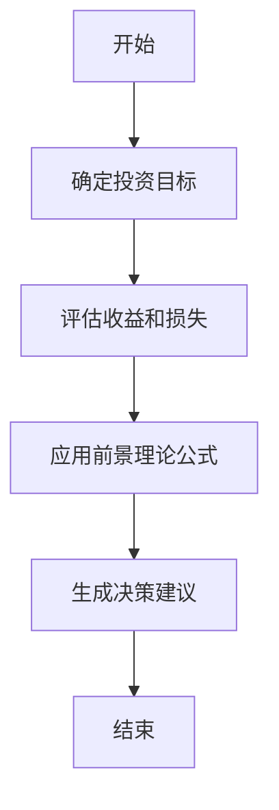
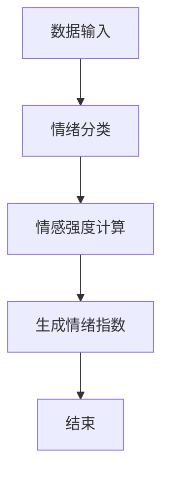
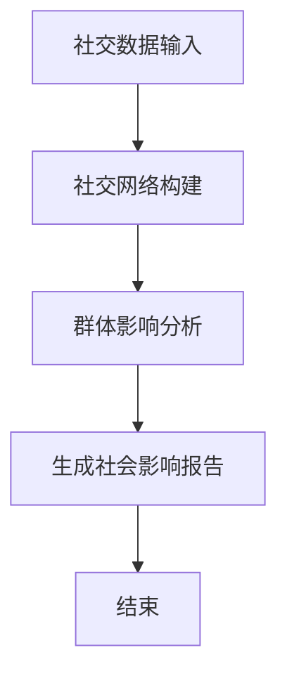
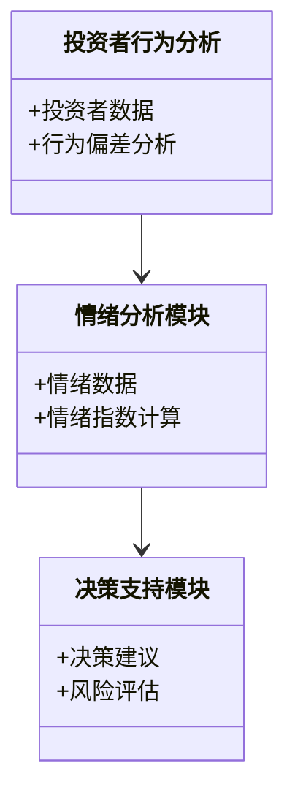
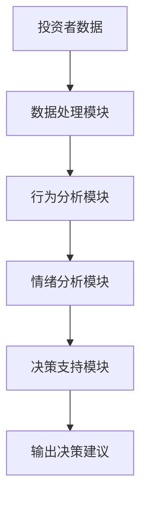
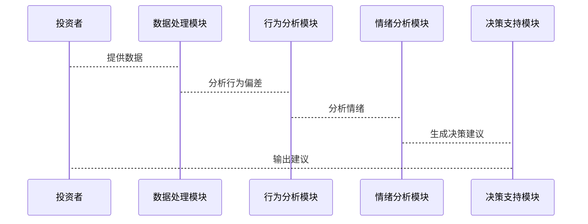

                 


# 罗杰·洛温斯坦的行为金融学与投资决策

---

## 关键词

- 行为金融学
- 投资决策
- 心理偏差
- 情绪分析
- 投资系统架构

---

## 摘要

本文深入探讨了罗杰·洛温斯坦的行为金融学理论及其在投资决策中的应用。通过分析投资者心理偏差、情绪对决策的影响，结合数学模型和算法实现，构建了一个基于行为金融学的投资决策支持系统。文章详细讲解了系统架构设计、功能模块实现，并通过具体案例展示了如何利用行为金融学优化投资组合。

---

## 第1章：行为金融学的背景与核心概念

### 1.1 行为金融学的定义与研究方法

- **行为金融学的定义**：研究投资者心理和行为对金融市场的影响，挑战传统金融学的理性假设。
- **研究方法**：结合心理学、经济学和金融学，采用实验、数据分析和案例研究。
- **与传统金融学的区别**：传统假设投资者理性，而行为金融学关注情绪和认知偏差。

### 1.2 行为金融学的主要理论

- **前景理论**：描述投资者如何评估收益和损失，强调损失的权重高于收益。
- **情绪与决策**：情绪波动影响投资者判断，导致非理性决策。
- **社会认知理论**：社会互动和群体行为影响个体决策。

### 1.3 行为金融学的应用领域

- **投资决策**：帮助投资者识别偏差，优化决策。
- **风险管理**：预测情绪驱动的市场波动，制定风险控制策略。
- **市场行为分析**：理解市场异动背后的投资者心理。

---

## 第2章：投资者心理与行为偏差

### 2.1 心理偏差的定义与分类

- **认知偏差**：对信息处理的偏差，如确认偏差。
- **情绪偏差**：情绪波动影响判断，如过度乐观。
- **社会偏差**：社会影响导致从众行为。

### 2.2 主要心理偏差及其影响

- **过度自信**：高估自身能力，导致冒险决策。
- **损失厌恶**：对损失的厌恶超过对收益的追求。
- **羊群效应**：跟随大众决策，引发市场泡沫或崩盘。

### 2.3 心理偏差对投资决策的影响

- **交易行为**：频繁交易和追涨杀跌。
- **资产配置**：错误判断风险，导致资产分配不合理。
- **风险管理**：忽视潜在风险，放大市场波动。

---

## 第3章：行为金融学的数学模型

### 3.1 前景理论的数学模型

- **前景理论公式**：$$ U = \sum_{i=1}^n \lambda_i (p_i x_i) $$
- **曲线图示**：展示收益和损失的概率权重差异。

### 3.2 情绪与决策的数学模型

- **情绪指数计算**：综合市场情绪指标，量化投资者情绪。
- **情绪对风险偏好的影响**：$$ R = f(m, r) $$，情绪 \( m \) 和风险 \( r \) 的关系。

### 3.3 社会认知理论的数学模型

- **社会影响量化**：分析社交网络对决策的影响。
- **群体决策模型**：$$ D = \sum_{i=1}^n w_i d_i $$，权重 \( w_i \) 和决策 \( d_i \) 的综合。

---

## 第4章：行为金融学的算法实现

### 4.1 前景理论的投资决策算法



- **Python代码实现**：
  ```python
  def prospect_theory(gains, losses, weights):
      utility = []
      for i in range(len(gains)):
          util = weights[i] * (gains[i] - losses[i])
          utility.append(util)
      return utility
  ```

### 4.2 情绪分析算法



- **Python代码实现**：
  ```python
  from textblob import TextBlob
  def sentiment_analysis(text):
      blob = TextBlob(text)
      return blob.sentiment.polarity
  ```

### 4.3 社会网络分析算法



- **Python代码实现**：
  ```python
  import networkx as nx
  def social_influence_analysis(network):
      G = nx.from_dict(network)
      return nx.betweenness_centrality(G)
  ```

---

## 第5章：投资决策系统的架构设计

### 5.1 系统功能设计



### 5.2 系统架构设计



### 5.3 系统接口设计

- **输入接口**：投资者行为数据、市场数据。
- **输出接口**：决策建议、风险报告。

### 5.4 系统交互流程



---

## 第6章：项目实战

### 6.1 环境安装与数据获取

- **工具安装**：安装Python、Pandas、Matplotlib、NetworkX。
- **数据获取**：通过API获取市场数据和投资者行为数据。

### 6.2 系统核心实现

- **行为偏差检测**：
  ```python
  def detect_bias(data):
      # 实现偏差检测算法
      return bias_results
  ```
- **情绪分析实现**：
  ```python
  def analyze_sentiment(text):
      # 实现情感分析
      return sentiment_score
  ```

### 6.3 案例分析与解读

- **案例选择**：分析某段时间内的市场波动，结合投资者行为数据。
- **结果分析**：识别主要偏差和情绪影响，优化投资策略。

### 6.4 项目小结

- 成功实现了基于行为金融学的投资决策系统。
- 验证了心理偏差和情绪对投资决策的影响。

---

## 第7章：总结与展望

### 7.1 最佳实践 tips

- 定期回顾投资决策，识别偏差。
- 结合技术分析和行为分析，优化投资策略。
- 运用算法模型，辅助投资决策。

### 7.2 小结

本文详细探讨了行为金融学的核心理论，结合数学模型和算法实现，构建了一个投资决策支持系统。通过实际案例展示了系统的应用价值。

### 7.3 注意事项

- 数据质量影响分析结果。
- 算法选择需根据具体情况调整。
- 情绪分析需结合市场环境。

### 7.4 拓展阅读

推荐阅读相关书籍和文献，深入理解行为金融学的应用。

---

## 结语

罗杰·洛温斯坦的行为金融学为投资者提供了新的视角，结合技术手段，投资者可以更科学地优化决策，降低风险。未来，随着AI和大数据技术的发展，行为金融学将发挥更大的作用。

