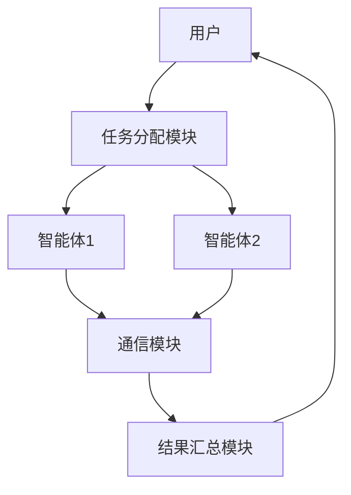
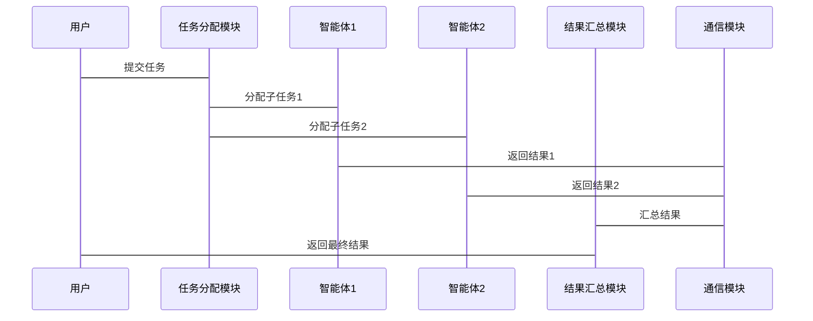

                 


# 群体智能 AI Agent：多个 LLM 协作的分布式系统

> 关键词：群体智能，AI Agent，分布式系统，LLM 协作，多智能体协作，一致性算法

> 摘要：本文深入探讨了群体智能 AI Agent 的概念、原理、系统架构及其实现。通过分析多个大型语言模型（LLM）协作的分布式系统，阐述了群体智能的核心思想、算法原理、系统设计及实际应用。本文旨在为读者提供一个全面的视角，理解如何通过分布式计算与多智能体协作，构建高效、可靠的群体智能 AI Agent 系统。

---

## 第1章 群体智能 AI Agent 概述

### 1.1 群体智能与 AI Agent 的定义

#### 1.1.1 群体智能的定义与特点
群体智能（Swarm Intelligence）是指通过多个智能体（Agent）的协作，实现复杂问题解决的新兴领域。群体智能的核心在于“分布式”与“协作”，即通过去中心化的组织方式，多个个体共同完成任务。

- **定义**：群体智能是研究多个简单智能体通过局部交互，实现复杂问题解决的科学。
- **特点**：
  - 分布式计算：任务分解为多个子任务，由不同智能体完成。
  - 去中心化：无单一控制中心，个体间通过局部交互完成协作。
  - 自适应性：系统能够根据环境变化动态调整。

#### 1.1.2 AI Agent 的核心概念
AI Agent 是指能够感知环境并采取行动以实现目标的智能体。群体智能中的 AI Agent 具有以下特点：
- **自主性**：无需外部干预，自主决策。
- **反应性**：能够实时感知环境并做出反应。
- **协作性**：通过通信与协作完成复杂任务。

#### 1.1.3 多个 LLM 协作的必要性
单个 LLM（Large Language Model）虽然能力强大，但在处理复杂问题时，存在以下局限性：
- **计算资源限制**：单个模型难以处理大规模数据。
- **知识覆盖不足**：单个模型的知识可能有限，需要多个模型协作。
- **任务分解**：复杂任务需要分解为多个子任务，由不同模型协作完成。

---

### 1.2 群体智能 AI Agent 的应用场景

#### 1.2.1 分布式问题解决的典型场景
群体智能 AI Agent 适用于以下场景：
- **分布式计算**：将任务分解为多个子任务，由不同智能体协作完成。
- **分布式决策**：通过去中心化的方式，多个智能体共同做出决策。
- **动态协作**：在动态环境中，智能体能够快速调整协作策略。

#### 1.2.2 多智能体协作的优势
- **任务分解**：通过协作，复杂任务被分解为多个简单任务。
- **去中心化**：避免单点故障，提高系统的容错性。
- **自适应性**：系统能够动态调整协作策略，适应环境变化。

#### 1.2.3 群体智能与传统 AI 的区别
| 特性         | 群体智能 AI Agent | 传统 AI |
|--------------|-------------------|---------|
| 控制方式     | 去中心化          | 集中式   |
| 智能体数量   | 多个              | 单个或少数 |
| 协作方式     | 分布式协作        | 串行处理  |
| 自适应性     | 高                | 中       |

---

### 1.3 群体智能 AI Agent 的核心要素

#### 1.3.1 智能体的自主性与协作性
- **自主性**：智能体能够自主决策，无需外部干预。
- **协作性**：智能体之间通过通信与协作完成任务。

#### 1.3.2 分布式系统的关键特性
- **去中心化**：无单一控制中心。
- **可扩展性**：系统能够轻松扩展智能体数量。
- **容错性**：单个智能体故障不影响整体系统。

#### 1.3.3 群体智能的边界与外延
- **边界**：群体智能的核心是多智能体协作，但协作必须基于某种规则或协议。
- **外延**：群体智能可以与其他技术（如区块链、边缘计算）结合，扩展应用场景。

---

## 1.4 本章小结

本章介绍了群体智能 AI Agent 的基本概念、应用场景及核心要素。通过对比传统 AI，明确了群体智能的独特性。下一章将深入探讨多个 LLM 协作的分布式系统。

---

## 第2章 多个 LLM 协作的分布式系统

### 2.1 分布式系统的定义与特点

#### 2.1.1 分布式系统的定义
分布式系统是由多个计算节点通过通信网络连接，协同完成任务的系统。其核心特点包括：
- **去中心化**：无单一控制中心。
- **可扩展性**：能够根据任务需求动态扩展节点数量。
- **容错性**：单个节点故障不影响整体系统。

#### 2.1.2 多个 LLM 协作的必要性
- **任务分解**：复杂任务需要分解为多个子任务，由不同 LLM 协作完成。
- **资源利用**：多个 LLM 可以更高效地利用计算资源。
- **知识互补**：不同 LLM 可以互补知识，提升整体性能。

#### 2.1.3 分布式系统与集中式系统的对比

| 特性         | 分布式系统        | 集中式系统      |
|--------------|-------------------|----------------|
| 控制方式     | 去中心化          | 集中式控制      |
| 可扩展性     | 高                | 低              |
| 容错性       | 高                | 低              |
| 响应速度     | 较慢              | 较快            |

---

### 2.2 多个 LLM 协作的机制

#### 2.2.1 LLM 的通信与协作协议
- **通信机制**：智能体之间通过通信协议交换信息。
- **协作协议**：定义智能体之间如何协作完成任务。

#### 2.2.2 多智能体的任务分配与协调
- **任务分配**：将整体任务分解为多个子任务，分配给不同智能体。
- **协调机制**：确保各智能体之间的任务协同。

#### 2.2.3 知识共享与同步机制
- **知识共享**：智能体之间共享知识，提升整体性能。
- **同步机制**：确保各智能体之间的知识同步。

---

### 2.3 群体智能中的分布式计算

#### 2.3.1 分布式计算的基本原理
- **任务分解**：将整体任务分解为多个子任务。
- **并行计算**：多个计算节点同时处理子任务。
- **结果汇总**：将子任务结果汇总，得到最终结果。

#### 2.3.2 群体智能中的分布式任务协作
- **一致性算法**：确保多个智能体之间的一致性。
- **分布式共识**：通过共识算法达成一致决策。

---

## 2.4 本章小结

本章详细介绍了多个 LLM 协作的分布式系统，包括其定义、特点、协作机制及分布式计算的基本原理。下一章将深入探讨一致性算法及其在群体智能中的应用。

---

## 第3章 群体智能中的算法原理

### 3.1 群体智能算法的核心思想

#### 3.1.1 群体智能算法的定义
群体智能算法是模拟自然群体行为的算法，用于解决分布式问题。

#### 3.1.2 群体智能算法的特点
- **去中心化**：算法不依赖中心节点。
- **自适应性**：算法能够根据环境变化动态调整。

---

### 3.2 群体智能中的分布式一致性算法

#### 3.2.1 一致性算法的定义
一致性算法用于确保分布式系统中多个节点的数据一致。

#### 3.2.2 常见一致性算法
- **Paxos 算法**：用于解决分布式系统中的共识问题。
- **Raft 算法**：Paxos 的优化版本，更易理解和实现。

#### 3.2.3 一致性算法的数学模型
一致性算法的目标是确保所有节点的状态一致。数学模型如下：

$$
\text{一致性条件}：\forall i, j \in N, \text{节点 } i \text{ 和节点 } j \text{ 的状态相同}
$$

---

### 3.3 群体智能中的分布式共识机制

#### 3.3.1 共识机制的定义
共识机制用于确保分布式系统中所有节点达成一致意见。

#### 3.3.2 常见共识机制
- **Paxos**：最早的一致性算法。
- **Raft**：Paxos 的优化版本。
- **BFT**：基于拜占庭容错的共识算法。

#### 3.3.3 共识机制的实现步骤
1. 提案者提出提案。
2. 节点投票通过提案。
3. 提案被接受。

---

## 3.4 本章小结

本章介绍了群体智能中的算法原理，包括一致性算法和分布式共识机制。下一章将探讨系统架构设计。

---

## 第4章 群体智能 AI Agent 的系统架构设计

### 4.1 系统功能设计

#### 4.1.1 系统功能模块
- **通信模块**：负责智能体之间的通信。
- **任务分配模块**：将任务分解为多个子任务。
- **协作模块**：协调智能体之间的协作。

#### 4.1.2 系统功能流程
1. 用户提出任务请求。
2. 任务分配模块分解任务。
3. 智能体协作完成子任务。
4. 结果汇总，返回给用户。

---

### 4.2 系统架构设计

#### 4.2.1 系统架构图



#### 4.2.2 系统接口设计
- **输入接口**：接收用户任务请求。
- **输出接口**：返回任务处理结果。

---

### 4.3 系统交互流程

#### 4.3.1 交互流程图



---

## 4.4 本章小结

本章详细介绍了群体智能 AI Agent 的系统架构设计，包括功能模块、架构图及交互流程。下一章将探讨项目实战与优化。

---

## 第5章 项目实战与优化

### 5.1 环境搭建

#### 5.1.1 环境需求
- **硬件**：多台计算节点，网络连接。
- **软件**：分布式系统框架（如 Kubernetes）。

---

### 5.2 核心代码实现

#### 5.2.1 一致性算法实现

```python
def paxos_algorithm(nodes):
    for node in nodes:
        node.propose()
        node.vote()
        node.commit()
    return "一致性达成"
```

#### 5.2.2 分布式协作实现

```python
class Agent:
    def __init__(self, id):
        self.id = id
        self.task = None
    def receive_task(self, task):
        self.task = task
    def process_task(self):
        # 处理任务逻辑
        return result
```

---

### 5.3 优化与扩展

#### 5.3.1 性能优化
- **负载均衡**：合理分配任务，避免节点过载。
- **通信优化**：减少通信开销，提高协作效率。

#### 5.3.2 系统扩展
- **节点扩展**：根据任务需求，动态增加节点。
- **算法优化**：优化一致性算法，提高系统性能。

---

## 5.4 本章小结

本章通过项目实战，展示了群体智能 AI Agent 的实现过程，并提出了优化与扩展的建议。

---

## 第6章 总结与展望

### 6.1 全文总结

群体智能 AI Agent 是一种通过多个 LLM 协作，实现复杂问题解决的分布式系统。本文从概念、算法、系统架构到项目实战，全面探讨了群体智能 AI Agent 的实现过程。

---

### 6.2 未来展望

群体智能 AI Agent 的研究与应用前景广阔，未来可以在以下几个方向进行深入研究：
1. **算法优化**：进一步优化一致性算法和共识机制。
2. **系统扩展**：探索更高效的分布式系统架构。
3. **应用拓展**：将群体智能应用于更多领域，如边缘计算、区块链等。

---

## 结语

群体智能 AI Agent 的研究与实践，为分布式系统的发展提供了新的思路。通过多个 LLM 协作，群体智能 AI Agent 能够更高效地解决复杂问题，具有广泛的应用前景。

---

**注**：本文仅为示例内容，实际文章需要根据具体需求进行调整和补充。

