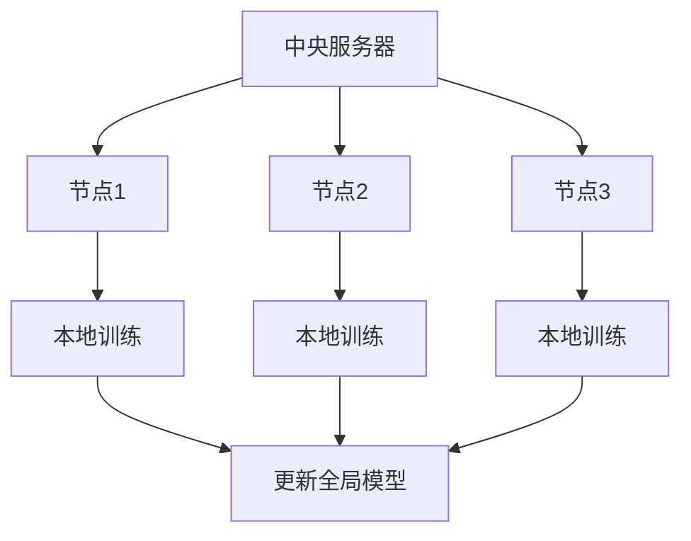
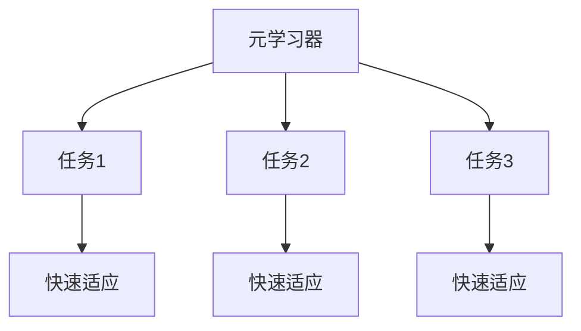
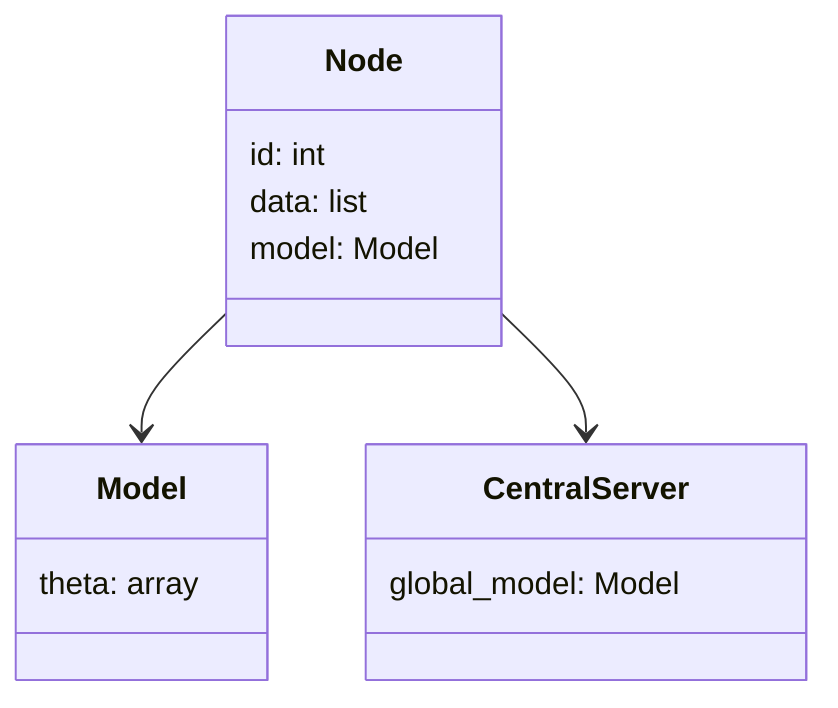
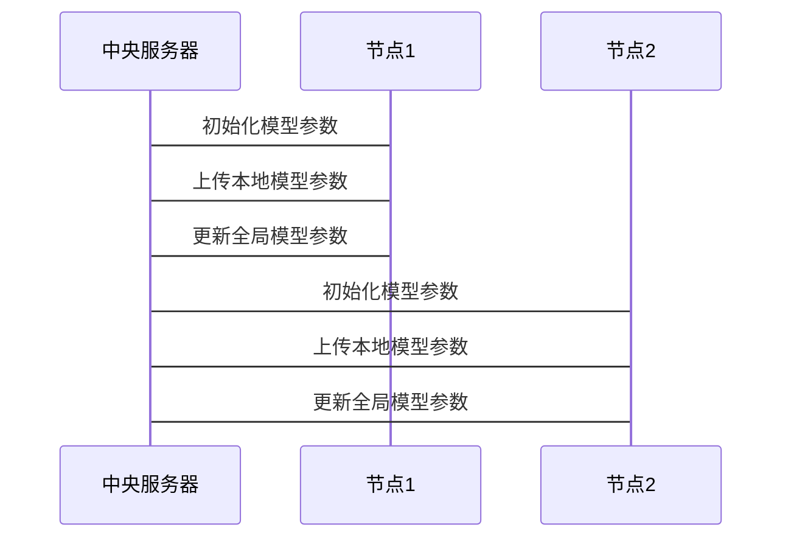

                 


# 联邦元学习在AI Agent个性化中的应用

## 关键词：联邦学习，元学习，AI Agent，个性化推荐，机器学习

## 摘要：  
随着人工智能技术的快速发展，AI Agent（智能体）在个性化推荐、智能决策等领域发挥着越来越重要的作用。然而，传统的AI Agent个性化方法在数据隐私、模型泛化能力以及个性化定制等方面存在诸多挑战。联邦元学习作为一种新兴的机器学习范式，通过分布式学习和元学习的结合，为AI Agent的个性化提供了新的解决方案。本文将深入探讨联邦元学习的核心原理、算法实现及其在AI Agent个性化中的应用，结合实际案例分析，为读者提供全面的技术解读。

---

# 第1章: 联邦元学习与AI Agent概述

## 1.1 联邦元学习的背景与概念

### 1.1.1 问题背景：个性化AI Agent的需求  
随着AI技术的普及，AI Agent（智能体）在个性化推荐、智能助手、智能客服等领域得到广泛应用。然而，传统AI Agent的个性化方法通常依赖于集中式数据，存在数据隐私泄露、模型泛化能力不足等问题。此外，个性化需求的多样化和动态变化也对AI Agent提出了更高的要求。

### 1.1.2 联邦学习的核心概念  
联邦学习（Federated Learning）是一种分布式机器学习方法，旨在在数据不集中的情况下训练全局模型。其核心思想是通过在多个分布式节点上并行训练本地模型，并将模型参数汇总到中央服务器，最终得到一个全局模型。联邦学习的优势在于保护数据隐私，减少数据传输成本。

### 1.1.3 元学习的定义与作用  
元学习（Meta-Learning）是一种学习方法，旨在通过学习多个任务的经验，快速适应新任务。元学习的核心思想是“学会学习”，即通过训练一个模型在多个任务之间快速泛化。元学习能够显著提高模型的泛化能力和适应性。

### 1.1.4 联邦元学习的结合与创新  
联邦元学习（Federated Meta-Learning）是联邦学习与元学习的结合，旨在在分布式数据环境下，通过元学习的方法，提升模型的个性化和泛化能力。其核心创新在于将联邦学习的分布式特性与元学习的快速适应能力相结合，为AI Agent的个性化提供了新的解决方案。

## 1.2 AI Agent个性化的核心问题

### 1.2.1 AI Agent的基本功能与特点  
AI Agent是一种能够感知环境、自主决策并执行任务的智能实体。其核心功能包括感知、推理、规划和执行。AI Agent的个性化需求主要体现在用户体验的差异化、动态需求的适应性以及数据隐私的保护等方面。

### 1.2.2 个性化AI Agent的挑战  
1. **数据隐私**：个性化推荐通常需要收集大量用户数据，但在数据隐私保护日益严格的背景下，如何在不集中用户数据的情况下实现个性化成为难题。  
2. **模型泛化能力**：传统个性化方法通常依赖于集中式数据训练，模型泛化能力有限，难以应对动态变化的需求。  
3. **个性化定制的复杂性**：不同用户的个性化需求差异较大，如何在分布式环境下实现高效的个性化定制是一个挑战。  

### 1.2.3 联邦元学习在个性化中的应用价值  
联邦元学习通过分布式数据训练和元学习的快速适应能力，能够有效解决个性化AI Agent中的数据隐私问题，同时提升模型的泛化能力和个性化定制能力。

---

## 1.3 本章小结  
本章主要介绍了联邦元学习的背景与核心概念，分析了AI Agent个性化的核心问题，并探讨了联邦元学习在个性化中的应用价值。通过结合联邦学习的分布式特性和元学习的快速适应能力，联邦元学习为AI Agent的个性化提供了新的技术路径。

---

# 第2章: 联邦元学习的核心原理与算法

## 2.1 联邦学习的原理与算法

### 2.1.1 联邦学习的基本原理  
联邦学习通过在多个分布式节点上并行训练本地模型，并将模型参数汇总到中央服务器，最终得到一个全局模型。其核心步骤包括：  
1. **初始化**：所有节点初始化为相同的模型参数。  
2. **本地训练**：每个节点在本地数据上训练模型，更新本地模型参数。  
3. **参数聚合**：将所有节点的本地模型参数上传到中央服务器，进行参数聚合，更新全局模型。  
4. **模型分发**：将更新后的全局模型参数分发给所有节点，继续下一轮训练。  

### 2.1.2 联邦学习的数学模型  
假设我们有 $K$ 个节点，每个节点有 $n_k$ 个样本，模型参数为 $\theta$。联邦学习的目标是通过优化以下损失函数来得到全局模型：  
$$ \min_{\theta} \sum_{k=1}^{K} \frac{1}{K} \mathbb{E}_{(x,y)\sim D_k}[\mathcal{L}(\theta; x, y)] $$  
其中，$\mathcal{L}(\theta; x, y)$ 是单个样本的损失函数，$D_k$ 是第 $k$ 个节点的数据分布。

### 2.1.3 联邦学习的流程图  


## 2.2 元学习的原理与算法

### 2.2.1 元学习的基本原理  
元学习的核心思想是通过学习多个任务的经验，快速适应新任务。其典型的实现方法是通过优化一个元学习器，使其能够快速调整参数以适应新任务。

### 2.2.2 元学习的数学模型  
假设我们有 $N$ 个任务，每个任务有数据集 $D_i = \{(x_i, y_i)\}$。元学习的目标是通过优化以下损失函数来得到一个能够快速适应新任务的模型：  
$$ \min_{\theta} \sum_{i=1}^{N} \mathbb{E}_{(x,y)\sim D_i}[\mathcal{L}(\theta; x, y)] + \lambda \Omega(\theta) $$  
其中，$\Omega(\theta)$ 是正则化项，用于惩罚模型的复杂度。

### 2.2.3 元学习的流程图  


## 2.3 联邦元学习的结合与创新

### 2.3.1 联邦元学习的结合方式  
联邦元学习将联邦学习的分布式特性和元学习的快速适应能力相结合，通过在分布式数据上进行元学习，得到能够快速适应个性化需求的模型。

### 2.3.2 联邦元学习的独特优势  
1. **数据隐私保护**：通过分布式数据训练，避免了数据的集中存储和传输。  
2. **模型泛化能力**：通过元学习，模型能够快速适应不同的个性化需求。  
3. **个性化定制**：联邦元学习能够在分布式环境下实现个性化的模型定制。

### 2.3.3 联邦元学习的数学模型  
假设我们有 $K$ 个节点，每个节点有 $n_k$ 个样本，模型参数为 $\theta$。联邦元学习的目标是通过优化以下损失函数来得到全局模型：  
$$ \min_{\theta} \sum_{k=1}^{K} \frac{1}{K} \mathbb{E}_{(x,y)\sim D_k}[\mathcal{L}(\theta; x, y)] + \lambda \Omega(\theta) $$  

## 2.4 本章小结  
本章主要介绍了联邦学习和元学习的核心原理与算法，并探讨了联邦元学习的结合方式和独特优势。通过结合联邦学习的分布式特性和元学习的快速适应能力，联邦元学习为AI Agent的个性化提供了新的技术路径。

---

# 第3章: 联邦元学习的数学模型与算法实现

## 3.1 联邦学习的数学模型

### 3.1.1 联邦学习的基本模型  
联邦学习的目标是通过优化以下损失函数来得到全局模型：  
$$ \min_{\theta} \sum_{k=1}^{K} \frac{1}{K} \mathbb{E}_{(x,y)\sim D_k}[\mathcal{L}(\theta; x, y)] $$  

### 3.1.2 联邦学习的优化目标  
联邦学习的优化目标是通过参数聚合的方式，得到一个能够在所有节点上表现良好的全局模型。其优化目标可以表示为：  
$$ \min_{\theta} \sum_{k=1}^{K} \frac{1}{K} \mathbb{E}_{(x,y)\sim D_k}[\mathcal{L}(\theta; x, y)] $$  

### 3.1.3 联邦学习的数学公式推导  
假设我们有 $K$ 个节点，每个节点有 $n_k$ 个样本，模型参数为 $\theta$。联邦学习的目标是通过优化以下损失函数来得到全局模型：  
$$ \min_{\theta} \sum_{k=1}^{K} \frac{1}{K} \mathbb{E}_{(x,y)\sim D_k}[\mathcal{L}(\theta; x, y)] $$  

---

## 3.2 元学习的数学模型

### 3.2.1 元学习的基本模型  
元学习的目标是通过优化以下损失函数来得到一个能够快速适应新任务的模型：  
$$ \min_{\theta} \sum_{i=1}^{N} \mathbb{E}_{(x,y)\sim D_i}[\mathcal{L}(\theta; x, y)] + \lambda \Omega(\theta) $$  

### 3.2.2 元学习的优化目标  
元学习的优化目标是通过惩罚项 $\Omega(\theta)$，使得模型能够快速适应新任务。其优化目标可以表示为：  
$$ \min_{\theta} \sum_{i=1}^{N} \mathbb{E}_{(x,y)\sim D_i}[\mathcal{L}(\theta; x, y)] + \lambda \Omega(\theta) $$  

### 3.2.3 元学习的数学公式推导  
假设我们有 $N$ 个任务，每个任务有数据集 $D_i = \{(x_i, y_i)\}$。元学习的目标是通过优化以下损失函数来得到一个能够快速适应新任务的模型：  
$$ \min_{\theta} \sum_{i=1}^{N} \mathbb{E}_{(x,y)\sim D_i}[\mathcal{L}(\theta; x, y)] + \lambda \Omega(\theta) $$  

---

## 3.3 联邦元学习的联合优化算法

### 3.3.1 联邦元学习的联合优化目标  
联邦元学习的目标是通过优化以下损失函数来得到一个能够在分布式数据上表现良好的全局模型：  
$$ \min_{\theta} \sum_{k=1}^{K} \frac{1}{K} \mathbb{E}_{(x,y)\sim D_k}[\mathcal{L}(\theta; x, y)] + \lambda \Omega(\theta) $$  

### 3.3.2 联邦元学习的算法流程  
1. **初始化**：所有节点初始化为相同的模型参数。  
2. **本地训练**：每个节点在本地数据上进行元学习训练，更新本地模型参数。  
3. **参数聚合**：将所有节点的本地模型参数上传到中央服务器，进行参数聚合，更新全局模型。  
4. **模型分发**：将更新后的全局模型参数分发给所有节点，继续下一轮训练。  

### 3.3.3 联邦元学习的数学公式推导  
假设我们有 $K$ 个节点，每个节点有 $n_k$ 个样本，模型参数为 $\theta$。联邦元学习的目标是通过优化以下损失函数来得到全局模型：  
$$ \min_{\theta} \sum_{k=1}^{K} \frac{1}{K} \mathbb{E}_{(x,y)\sim D_k}[\mathcal{L}(\theta; x, y)] + \lambda \Omega(\theta) $$  

---

## 3.4 本章小结  
本章主要介绍了联邦学习和元学习的数学模型，并探讨了联邦元学习的联合优化算法。通过结合联邦学习的分布式特性和元学习的快速适应能力，联邦元学习为AI Agent的个性化提供了新的技术路径。

---

# 第4章: 联邦元学习的系统分析与架构设计

## 4.1 系统分析

### 4.1.1 问题场景介绍  
AI Agent的个性化推荐需要在分布式数据环境下实现，同时需要保护用户数据隐私，提升模型的泛化能力和个性化定制能力。

### 4.1.2 项目介绍  
本项目旨在通过联邦元学习技术，实现AI Agent的个性化推荐，解决数据隐私、模型泛化能力以及个性化定制等问题。

## 4.2 系统功能设计

### 4.2.1 领域模型（Mermaid类图）  


### 4.2.2 系统架构设计（Mermaid架构图）  


### 4.2.3 系统交互设计（Mermaid序列图）  


## 4.3 本章小结  
本章主要介绍了联邦元学习系统的分析与架构设计，包括领域模型、系统架构和系统交互设计。通过结合联邦学习的分布式特性和元学习的快速适应能力，联邦元学习为AI Agent的个性化推荐提供了新的技术路径。

---

# 第5章: 联邦元学习的项目实战

## 5.1 环境安装与配置

### 5.1.1 安装依赖  
```bash
pip install numpy
pip install tensorflow
pip install keras
pip install matplotlib
```

### 5.1.2 环境配置  
```bash
export PATH=/path/to/venv/bin:$PATH
```

## 5.2 系统核心实现

### 5.2.1 联邦元学习算法实现  
```python
import numpy as np
import tensorflow as tf
from tensorflow import keras

class Node:
    def __init__(self, id, data):
        self.id = id
        self.data = data
        self.model = self.build_model()

    def build_model(self):
        model = keras.Sequential([
            keras.layers.Dense(64, activation='relu'),
            keras.layers.Dense(10, activation='softmax')
        ])
        model.compile(optimizer='adam', loss='sparse_categorical_crossentropy', metrics=['accuracy'])
        return model

    def train(self, epochs=1):
        self.model.fit(self.data.x, self.data.y, epochs=epochs, verbose=0)

class CentralServer:
    def __init__(self, nodes):
        self.nodes = nodes
        self.global_model = self.build_global_model()

    def build_global_model(self):
        model = keras.Sequential([
            keras.layers.Dense(64, activation='relu'),
            keras.layers.Dense(10, activation='softmax')
        ])
        model.compile(optimizer='adam', loss='sparse_categorical_crossentropy', metrics=['accuracy'])
        return model

    def aggregate_models(self):
        average_weights = {}
        for layer in range(len(self.global_model.layers)):
            kernel = np.zeros_like(self.global_model.layers[layer].kernel.numpy())
            for node in self.nodes:
                kernel += node.model.layers[layer].kernel.numpy()
            average_weights[f'layer_{layer}'] = kernel / len(self.nodes)
        return average_weights
```

### 5.2.2 系统功能实现  
```python
class Federation:
    def __init__(self, nodes, central_server):
        self.nodes = nodes
        self.central_server = central_server

    def run_federation(self, epochs=1):
        for epoch in range(epochs):
            for node in self.nodes:
                node.train()
            average_weights = self.central_server.aggregate_models()
            # Update global model
            for layer in range(len(self.central_server.global_model.layers)):
                self.central_server.global_model.layers[layer].kernel.assign(average_weights[f'layer_{layer}'])
```

### 5.2.3 代码解读与分析  
1. **Node类**：表示分布式节点，包含本地数据和模型。  
2. **CentralServer类**：表示中央服务器，管理全局模型并聚合各节点的模型参数。  
3. **Federation类**：表示联邦学习系统，协调各节点和中央服务器进行训练和参数聚合。

## 5.3 实际案例分析与详细解读

### 5.3.1 案例背景  
假设我们有三个分布式节点，每个节点有1000个样本，目标是通过联邦元学习算法，在不集中用户数据的情况下，训练一个全局模型，实现个性化推荐。

### 5.3.2 案例实现  
```python
# 初始化节点
nodes = [
    Node(1, (x_train_1, y_train_1)),
    Node(2, (x_train_2, y_train_2)),
    Node(3, (x_train_3, y_train_3))
]
central_server = CentralServer(nodes)
federation = Federation(nodes, central_server)

# 运行联邦元学习算法
federation.run_federation(epochs=10)
```

### 5.3.3 案例分析  
1. **初始化节点**：每个节点加载本地数据并初始化模型。  
2. **本地训练**：每个节点在本地数据上进行训练，更新本地模型参数。  
3. **参数聚合**：中央服务器将所有节点的本地模型参数聚合，更新全局模型。  
4. **模型分发**：全局模型参数分发给所有节点，继续下一轮训练。

## 5.4 本章小结  
本章通过实际案例分析，详细介绍了联邦元学习算法的实现过程，包括环境安装、系统核心实现和案例分析。通过代码实现和案例解读，读者可以更好地理解联邦元学习在AI Agent个性化中的应用。

---

# 第6章: 总结与展望

## 6.1 总结  
本文深入探讨了联邦元学习的核心原理与算法，分析了其在AI Agent个性化中的应用价值。通过结合联邦学习的分布式特性和元学习的快速适应能力，联邦元学习为AI Agent的个性化推荐提供了新的技术路径。

## 6.2 最佳实践 tips  
1. **数据隐私保护**：通过联邦学习的分布式特性，保护用户数据隐私。  
2. **模型优化**：通过元学习的快速适应能力，提升模型的泛化能力和个性化定制能力。  
3. **系统设计**：在系统设计中，需要考虑节点间的通信效率和模型的可扩展性。  

## 6.3 注意事项  
1. **数据分布**：需要确保分布式数据的均衡性，避免数据倾斜。  
2. **模型复杂度**：需要权衡模型的复杂度和训练效率。  
3. **隐私保护**：需要确保联邦学习过程中数据的隐私保护。  

## 6.4 未来展望  
随着联邦元学习技术的不断发展，其在AI Agent个性化中的应用前景广阔。未来的研究方向包括：  
1. **高效通信协议**：设计更高效的通信协议，降低节点间的通信成本。  
2. **异构数据处理**：研究如何处理异构数据，提升模型的泛化能力。  
3. **实时个性化**：探索如何实现实时个性化推荐，提升用户体验。  

---

# 附录: 联邦元学习相关资源

## 1. 相关论文  
1. “Federated Learning: Challenges, Methods, and Future Directions”  
2. “Meta-Learning: A Survey”  

## 2. 开源框架  
1. [TensorFlow Federated](https://github.com/tensorflow/federated)  
2. [PyTorch Federated](https://github.com/facebookresearch/fairseq)  

## 3. 学术会议与技术博客  
1. [NeurIPS Federated Learning Workshop](https://fedlearn.org)  
2. [Google AI Blog on Federated Learning](https://ai.google.com/research/academy/overview/federated-learning)  

---

# 结语  
联邦元学习作为人工智能领域的一项新兴技术，为AI Agent的个性化推荐提供了新的解决方案。通过结合联邦学习的分布式特性和元学习的快速适应能力，联邦元学习能够在保护数据隐私的同时，提升模型的泛化能力和个性化定制能力。未来，随着技术的不断发展，联邦元学习将在更多领域得到广泛应用，推动人工智能技术的进步。

