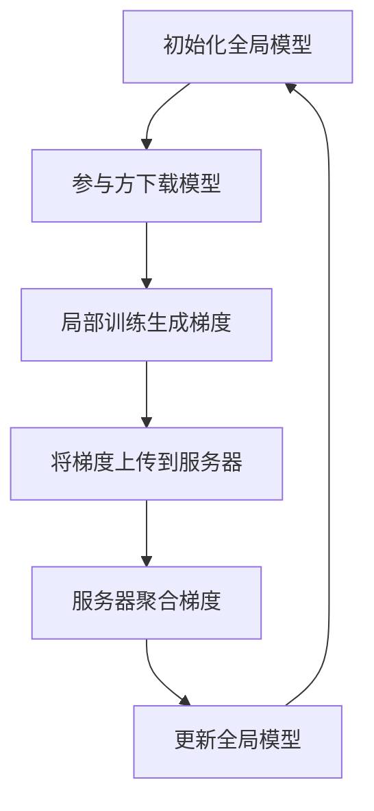
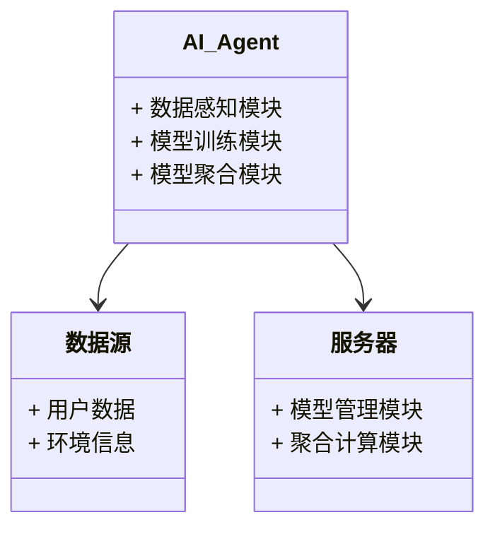
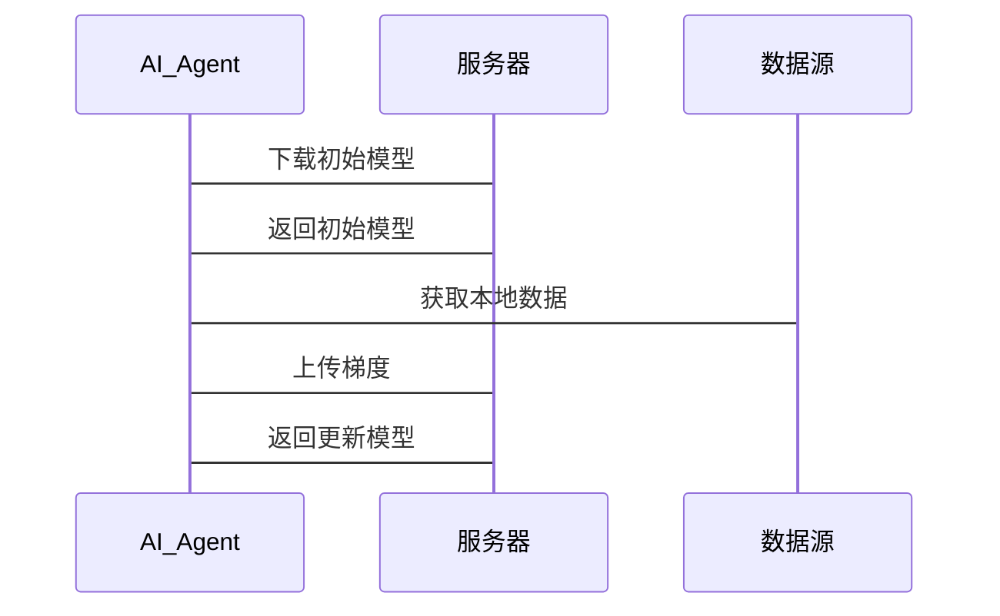

                 


# 联邦学习在AI Agent隐私保护中的高级应用

> 关键词：联邦学习，AI Agent，隐私保护，分布式系统，协作学习，数据安全

> 摘要：随着人工智能技术的快速发展，AI Agent（智能体）在各个领域的应用越来越广泛。然而，AI Agent在实现复杂任务时需要处理大量的数据，这些数据可能包含用户的敏感信息。如何在不泄露数据的情况下，让AI Agent协同工作并提升性能，成为了一个重要的研究课题。联邦学习作为一种新兴的技术，能够在保护数据隐私的前提下，实现多个分布式数据源的协作学习。本文将详细探讨联邦学习在AI Agent隐私保护中的高级应用，从核心概念、算法原理、系统架构到实际案例，全面解析其技术细节和应用价值。

---

## 第1章：联邦学习与AI Agent的基本概念

### 1.1 联邦学习的定义与特点
#### 1.1.1 联邦学习的基本概念
联邦学习（Federated Learning，FL）是一种分布式机器学习技术，允许多个参与方在不共享原始数据的情况下，共同训练一个统一的模型。其核心思想是将模型的训练过程分散到各个数据源，仅在需要时交换必要的信息（如梯度或模型参数），从而保护数据的隐私和安全。

#### 1.1.2 联邦学习的核心特点
- **数据本地性**：数据无需离开原始存储位置，仅在本地进行计算。
- **隐私保护**：通过局部模型更新和参数聚合，避免直接传输敏感数据。
- **分布式协作**：多个参与方协同工作，共同优化全局模型。

#### 1.1.3 联邦学习与传统数据共享的区别
| 特性 | 联邦学习 | 传统数据共享 |
|------|----------|--------------|
| 数据传输 | 仅传输模型参数或梯度 | 传输原始数据 |
| 隐私风险 | 极低 | 高 |
| 计算效率 | 较低，需多次通信 | 较高 |
| 适用场景 | 数据敏感场景 | 数据不敏感场景 |

### 1.2 AI Agent的基本概念与功能
#### 1.2.1 AI Agent的定义
AI Agent是一种智能实体，能够感知环境、自主决策并执行任务。它可以是一个软件程序、机器人或其他智能设备，具备以下核心功能：
- **感知**：通过传感器或数据输入获取环境信息。
- **推理**：基于感知信息进行分析和决策。
- **执行**：根据决策结果执行具体操作。

#### 1.2.2 AI Agent的核心功能
- **自主性**：能够在没有外部干预的情况下独立运作。
- **反应性**：能够实时感知环境变化并做出反应。
- **目标导向性**：以特定目标为导向，优化自身行为。

#### 1.2.3 AI Agent与传统程序的区别
| 特性 | AI Agent | 传统程序 |
|------|----------|----------|
| 智能性 | 高 | 低 |
| 环境适应性 | 强 | 弱 |
| 自主决策能力 | 强 | 无或弱 |

### 1.3 联邦学习在AI Agent隐私保护中的作用
#### 1.3.1 隐私保护的重要性
随着AI Agent在医疗、金融、交通等领域的广泛应用，数据隐私问题变得尤为重要。联邦学习通过局部建模和模型聚合，能够在不泄露原始数据的情况下，实现模型的联合优化。

#### 1.3.2 联邦学习如何实现隐私保护
- **数据本地训练**：每个AI Agent在本地数据上训练模型，并仅传输梯度或模型参数。
- **模型聚合**：通过安全多方计算或加密技术，将各参与方的模型参数进行聚合，得到全局模型。

#### 1.3.3 联邦学习在AI Agent中的应用前景
联邦学习为AI Agent的隐私保护提供了新的可能性，特别是在医疗数据分析、金融风险评估等领域，能够在保护用户隐私的前提下，提升AI Agent的智能性和决策能力。

---

## 第2章：联邦学习与AI Agent的核心概念与联系

### 2.1 联邦学习的核心原理
联邦学习通过将模型的训练过程分散到各个数据源，实现数据的局部训练和全局优化。其核心流程包括：
1. **初始化**：所有参与方下载初始模型参数。
2. **局部训练**：每个参与方在本地数据上训练模型，并生成梯度或模型更新。
3. **模型聚合**：将各参与方的模型更新进行汇总，生成新的全局模型。
4. **迭代优化**：重复局部训练和模型聚合过程，直到模型收敛。

### 2.2 AI Agent的核心属性
AI Agent的核心属性包括：
- **感知能力**：通过传感器或接口获取环境信息。
- **决策能力**：基于感知信息做出最优决策。
- **执行能力**：通过动作执行决策。

### 2.3 联邦学习与AI Agent的联系
通过联邦学习，AI Agent可以在不共享原始数据的情况下，协同训练模型，提升智能体的决策能力和数据分析能力。这种协作模式不仅保护了数据隐私，还能够充分利用分布式数据源的优势，提升模型的泛化能力。

---

## 第3章：联邦学习的算法原理与实现

### 3.1 联邦学习的数学模型
联邦学习的核心是通过局部模型更新和全局模型聚合，实现模型的优化。其数学模型可以表示为：
$$
\theta_{t+1} = \theta_t + \sum_{i=1}^{n} \eta (g_i)
$$
其中，$\theta_t$ 表示全局模型参数，$g_i$ 表示第 $i$ 个参与方的梯度，$\eta$ 表示学习率，$n$ 表示参与方的数量。

### 3.2 联邦学习的算法流程


### 3.3 联邦学习的Python实现示例
```python
import numpy as np

# 初始化全局模型参数
theta = np.random.randn(10, 1)

# 定义局部训练函数
def local_train(theta, X, y, eta):
    # 计算梯度
    y_pred = theta.T.dot(X)
    loss = np.mean((y_pred - y) ** 2)
    d_loss = 2 * (y_pred - y).dot(X.T) / X.shape[0]
    # 更新模型参数
    theta = theta - eta * d_loss
    return theta

# 联邦学习迭代过程
for _ in range(100):
    theta = local_train(theta, X, y, 0.01)
```

---

## 第4章：基于联邦学习的AI Agent系统架构设计

### 4.1 系统功能设计


### 4.2 系统架构设计


### 4.3 系统接口设计
- **数据接口**：AI Agent与数据源之间的数据交互接口。
- **模型接口**：AI Agent与服务器之间的模型参数传输接口。

### 4.4 系统交互流程


---

## 第5章：项目实战与案例分析

### 5.1 项目环境安装
```bash
pip install numpy matplotlib scikit-learn
```

### 5.2 系统核心实现
```python
import numpy as np

# 初始化模型参数
theta = np.zeros((10, 1))

# 定义模型聚合函数
def aggregate_gradients(gradients):
    return np.mean(gradients, axis=0)

# 联邦学习过程
for _ in range(100):
    # 每个参与方进行局部训练并生成梯度
    gradients = [local_train(theta, X_i, y_i) for X_i, y_i in zip(X_list, y_list)]
    # 聚合梯度
    aggregated_gradients = aggregate_gradients(gradients)
    # 更新全局模型
    theta = theta - 0.01 * aggregated_gradients
```

### 5.3 实际案例分析
以医疗数据分析为例，多个医院可以通过联邦学习协同训练一个医疗诊断模型，而无需共享患者的具体数据。每个医院在本地数据上训练模型，并将梯度上传到服务器，最终得到一个全局的诊断模型。

### 5.4 系统测试与优化
- **模型性能测试**：比较联邦学习模型与传统集中式模型的性能差异。
- **系统优化**：优化通信效率和模型收敛速度。

---

## 第6章：最佳实践与总结

### 6.1 小结
联邦学习为AI Agent的隐私保护提供了新的思路，能够在不泄露数据的前提下，实现模型的协同优化。

### 6.2 注意事项
- **数据质量**：确保数据的完整性和一致性。
- **通信效率**：优化模型聚合过程，减少通信开销。
- **安全性**：加强数据加密和隐私保护机制。

### 6.3 未来研究方向
- **联邦学习的优化算法**：研究更高效的模型聚合方法。
- **AI Agent的自主性提升**：增强智能体的自主决策能力。
- **跨领域应用**：探索联邦学习在更多领域的应用潜力。

---

通过以上章节的详细讲解，我们可以看到，联邦学习在AI Agent的隐私保护中具有重要的应用价值。它不仅能够保护数据隐私，还能够充分利用分布式数据源的优势，提升模型的智能性和准确性。未来，随着技术的不断发展，联邦学习将在更多领域发挥重要作用。

