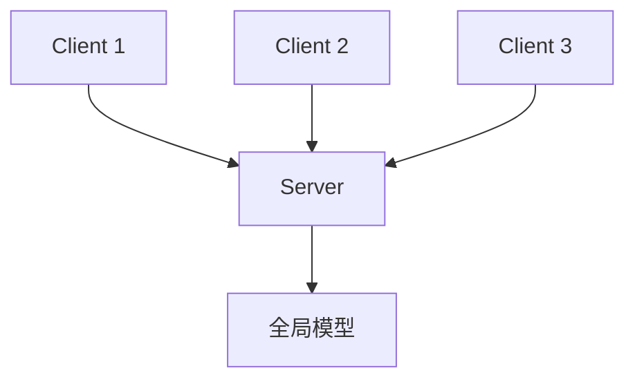

                 


# 《联邦学习在AI Agent隐私保护推理中的应用》

## 关键词：联邦学习，AI Agent，隐私保护，分布式计算，数据安全

## 摘要：  
随着人工智能技术的快速发展，AI Agent（智能体）在各个领域的应用越来越广泛。然而，AI Agent在执行任务时需要处理大量敏感数据，如何在保证数据隐私的前提下进行高效的推理和学习，成为了一个重要的挑战。联邦学习作为一种分布式机器学习技术，能够在保护数据隐私的前提下，实现模型的联合训练和推理。本文将详细探讨联邦学习在AI Agent隐私保护中的应用，分析其核心原理、系统架构以及实际应用案例，为AI Agent的安全发展提供理论和技术支持。

---

## 第1章: 联邦学习与AI Agent的背景与应用

### 1.1 联邦学习的基本概念  
联邦学习（Federated Learning）是一种分布式机器学习技术，允许多个参与方在不共享原始数据的前提下，协作训练一个共同的模型。其核心思想是将模型的训练过程分散到数据源所在的边缘设备或服务器中，仅在需要时将模型参数上传到中心服务器进行聚合，从而保护原始数据的隐私性。

#### 联邦学习的核心特点  
1. **数据本地化**：数据无需集中到中心服务器，仅在本地设备上进行处理。  
2. **模型参数共享**：通过通信协议将模型参数上传到中心服务器进行聚合，生成全局模型。  
3. **隐私保护**：通过加密和差分隐私等技术，确保数据在传输和计算过程中的安全性。  

### 1.2 AI Agent的基本概念与功能  
AI Agent是一种能够感知环境、自主决策并执行任务的智能实体。它通常具备以下核心功能：  
1. **感知环境**：通过传感器或数据接口获取外部信息。  
2. **推理与决策**：基于获取的信息进行分析和判断，制定执行策略。  
3. **执行任务**：根据决策结果执行具体操作，例如控制设备或与用户交互。  

#### AI Agent的核心需求  
1. **数据隐私保护**：AI Agent通常处理敏感数据，例如用户的地理位置、行为习惯等，必须确保这些数据不被泄露。  
2. **高效推理**：在保证隐私的前提下，AI Agent需要快速完成推理和决策任务。  
3. **分布式协作**：多个AI Agent可以通过联邦学习技术协作训练模型，提升整体性能。  

### 1.3 联邦学习与AI Agent的结合  
联邦学习为AI Agent提供了一种在保护数据隐私的前提下进行协作学习的解决方案。通过联邦学习，多个AI Agent可以在不共享原始数据的情况下，联合训练一个全局模型，同时保证每个Agent的本地数据不被泄露。

---

## 第2章: 联邦学习的核心概念与原理

### 2.1 联邦学习的基本原理  
联邦学习的核心流程包括以下几个步骤：  
1. **初始化**：每个参与方（Client）下载全局模型的初始参数。  
2. **本地训练**：每个Client在本地数据集上训练模型，更新模型参数。  
3. **参数上传**：Client将更新后的模型参数上传到中心服务器（Server）。  
4. **模型聚合**：Server将所有Client上传的参数进行聚合，生成新的全局模型。  
5. **模型下发**：Server将新的全局模型下发给所有Client，开始下一轮训练。  

#### 联邦学习的通信机制  
在联邦学习中，Client和Server之间的通信通常采用加密技术或差分隐私技术来保护数据隐私。例如，使用同态加密技术可以在不泄露原始数据的情况下完成模型参数的聚合。

### 2.2 联邦学习的关键技术  
1. **加密技术**：通过加密技术保护Client上传的模型参数，确保数据在传输过程中的安全性。  
2. **差分隐私**：在模型聚合过程中，通过添加噪声确保单个Client的数据对全局模型的影响不可被识别。  
3. **模型聚合方法**：常用的模型聚合方法包括平均法（FedAvg）、加权平均法（FedWeighted）等。  

#### 模型聚合方法对比  
| 方法名称      | 特点                                      | 适用场景               |
|---------------|------------------------------------------|------------------------|
| FedAvg        | 基于简单平均，适用于数据分布均匀的场景。 | 通用场景               |
| FedWeighted   | 基于Client的本地数据量进行加权聚合。     | 数据量分布不均的场景   |
| FedProx       | 基于Proximal方法，适用于非IID数据场景。   | 数据分布不独立同分布的场景 |

### 2.3 联邦学习的核心概念对比  
1. **联邦学习与分布式学习**：  
   - 联邦学习强调数据隐私保护，而分布式学习更关注计算资源的分布式利用。  
2. **联邦学习与边缘计算**：  
   - 联邦学习可以在边缘计算架构中实现，但其核心目标是保护数据隐私，而边缘计算更关注计算的分布式执行。  

---

## 第3章: AI Agent的隐私保护需求与挑战

### 3.1 AI Agent的隐私保护需求  
AI Agent在运行过程中需要处理大量敏感数据，例如用户的地理位置、行为习惯、设备状态等。这些数据如果被恶意利用，可能导致用户的隐私泄露或财产损失。因此，AI Agent必须具备以下隐私保护能力：  
1. **数据加密存储**：确保本地存储的数据在物理层面上无法被 unauthorized 访问。  
2. **数据匿名化处理**：在数据上传或共享过程中，对数据进行匿名化处理，避免关联到具体用户。  
3. **安全通信机制**：通过加密通信协议，确保数据在传输过程中的安全性。  

### 3.2 AI Agent隐私保护的核心挑战  
1. **数据安全问题**：AI Agent在本地训练模型时，可能因为数据泄露或中间人攻击而导致隐私泄露。  
2. **模型推理风险**：攻击者可以通过分析模型的推理结果，逆推出原始数据的某些特征。  
3. **计算资源限制**：AI Agent通常运行在资源受限的设备上，如何在保证隐私的前提下进行高效的计算是一个难题。  

---

## 第4章: 联邦学习在AI Agent隐私保护中的应用

### 4.1 联邦学习在AI Agent中的应用背景  
随着AI Agent的广泛应用，数据隐私保护已成为其发展的关键瓶颈。通过联邦学习技术，多个AI Agent可以在不共享原始数据的前提下，联合训练一个全局模型，从而提升整体性能，同时保护数据隐私。

### 4.2 联邦学习在AI Agent中的具体应用  
1. **多Agent协作学习**：多个AI Agent可以通过联邦学习技术协作训练一个全局模型，提升每个Agent的推理能力。  
2. **隐私保护的分布式推理**：在联邦学习框架下，AI Agent可以在本地完成推理任务，仅上传必要的推理结果，避免暴露敏感数据。  
3. **动态联邦网络构建**：根据任务需求动态调整参与联邦学习的AI Agent数量和类型，确保模型的多样性和鲁棒性。  

#### 联邦学习在AI Agent中的应用场景  
- **智能助手**：通过联邦学习，多个智能助手可以协作训练一个全局模型，提升自然语言处理能力，同时保护用户的隐私数据。  
- **自动驾驶**：多个自动驾驶车辆可以通过联邦学习技术共享驾驶数据，提升车辆的自动驾驶能力，同时保护车辆的隐私数据。  

### 4.3 联邦学习在AI Agent中的优势  
1. **数据隐私保护**：通过联邦学习，AI Agent可以在不共享原始数据的前提下完成模型训练和推理。  
2. **模型性能提升**：通过多个AI Agent的协作，可以训练出性能更优的全局模型。  
3. **灵活性与可扩展性**：联邦学习框架支持动态调整参与方数量和类型，具有较强的灵活性和可扩展性。  

---

## 第5章: 联邦学习在AI Agent中的实现与优化

### 5.1 联邦学习在AI Agent中的实现流程  
1. **初始化阶段**：每个AI Agent下载全局模型的初始参数。  
2. **本地训练阶段**：每个AI Agent在本地数据集上训练模型，更新模型参数。  
3. **参数上传阶段**：AI Agent将更新后的模型参数上传到中心服务器。  
4. **模型聚合阶段**：中心服务器对所有上传的参数进行聚合，生成新的全局模型。  
5. **模型下发阶段**：中心服务器将新的全局模型下发给所有AI Agent，开始下一轮训练。  

### 5.2 联邦学习的优化策略  
1. **动态参数聚合**：根据Client的参与情况动态调整模型聚合策略，例如使用加权平均法。  
2. **差分隐私优化**：在模型聚合过程中，通过添加噪声保护数据隐私。  
3. **异步训练优化**：允许多个Client异步上传模型参数，提升训练效率。  

---

## 第6章: 项目实战：基于联邦学习的AI Agent隐私保护系统

### 6.1 项目背景与目标  
本项目旨在通过联邦学习技术，构建一个支持多AI Agent协作学习的隐私保护系统，确保数据隐私的前提下提升模型性能。

### 6.2 系统架构设计  
1. **系统功能模块**：  
   - **Client模块**：负责本地数据训练和模型参数上传。  
   - **Server模块**：负责接收Client上传的参数，进行模型聚合，并将新模型下发给Client。  
2. **数据流设计**：  
   - Client在本地训练模型，将参数上传到Server。  
   - Server对所有参数进行聚合，生成新模型。  
   - Server将新模型下发给Client，开始下一轮训练。  

#### 系统架构图（Mermaid）  


### 6.3 系统实现与代码解读  
1. **环境安装**：  
   - 安装Python和相关依赖库（如Flask、TensorFlow）。  
   - 安装联邦学习框架（如Federated Learning Library）。  

2. **核心代码实现**  
   ```python
   import numpy as np
   from fl_model import FLModel

   class Client:
       def __init__(self, model):
           self.model = model
           self.local_data = load_data()

       def train(self):
           # 在本地数据上训练模型
           for epoch in range(num_epochs):
               for X, y in self.local_data:
                   self.model.fit(X, y)
                   break
           return self.model.get_weights()

   class Server:
       def __init__(self):
           self.models = []

       def aggregate_models(self):
           # 使用平均法聚合模型参数
           avg_weights = np.mean([model.get_weights() for model in self.models], axis=1)
           return avg_weights

       def broadcast_model(self, weights):
           # 将聚合后的参数下发给所有Client
           for model in self.models:
               model.set_weights(weights)

   # 初始化全局模型
   global_model = FLModel()
   server = Server()
   server.models.append(global_model)

   # 启动训练过程
   for round in range(num_rounds):
       # Client进行本地训练并上传参数
       for client in server.models:
           client.train()
           server.models[0].weights = client.train()

       # Server聚合模型参数
       global_weights = server.aggregate_models()

       # Server下发新模型参数
       server.broadcast_model(global_weights)
   ```

3. **代码解读与分析**  
   - **Client模块**：负责本地数据训练和模型参数上传。  
   - **Server模块**：负责接收Client上传的参数，进行模型聚合，并将新模型下发给Client。  
   - **模型聚合方法**：使用平均法聚合模型参数，生成新的全局模型。  

---

## 第7章: 总结与展望

### 7.1 本章总结  
本文详细探讨了联邦学习在AI Agent隐私保护中的应用，分析了联邦学习的核心原理、系统架构以及实际应用案例。通过联邦学习技术，AI Agent可以在不共享原始数据的前提下，实现模型的联合训练和推理，有效保护数据隐私。

### 7.2 未来展望  
随着联邦学习技术的不断发展，其在AI Agent中的应用前景广阔。未来的研究方向包括：  
1. **优化联邦学习算法**：进一步提升模型聚合效率和隐私保护能力。  
2. **扩展应用场景**：探索更多领域中的应用，例如智能交通、医疗健康等。  
3. **加强安全防护**：研究更先进的加密技术和安全机制，确保联邦学习系统的安全性。  

---

## 思考与总结  

通过本文的探讨，我们可以看到联邦学习为AI Agent的隐私保护提供了一种有效的解决方案。它不仅能够保护数据隐私，还能够通过协作学习提升模型性能。然而，联邦学习在实际应用中仍面临诸多挑战，例如数据安全问题、计算资源限制等。未来，随着技术的不断进步，联邦学习将在更多领域发挥重要作用，为AI Agent的发展注入新的活力。

