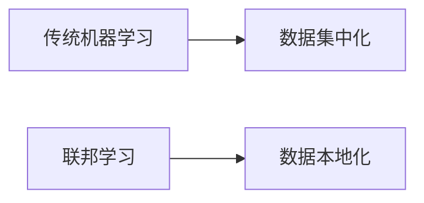
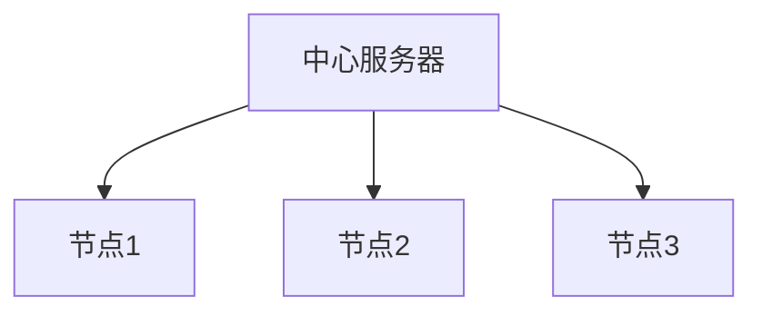
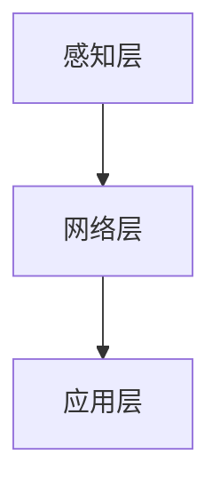
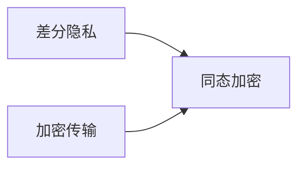

                 


# 联邦学习在分布式AI Agent系统中的应用

> **关键词**：联邦学习、分布式AI Agent系统、算法原理、系统架构、隐私保护、通信协议

> **摘要**：随着人工智能技术的快速发展，分布式AI Agent系统在各个领域得到了广泛应用。然而，传统的集中式学习方法在数据隐私、通信效率和系统扩展性方面存在诸多挑战。联邦学习作为一种新兴的学习范式，能够在保护数据隐私的前提下，实现分布式系统中的高效协作学习。本文将深入探讨联邦学习在分布式AI Agent系统中的应用，从核心概念、算法原理、系统架构到实际案例，全面解析其优势与挑战，为读者提供全面的视角和深入的分析。

---

## 第1章: 联邦学习与分布式AI Agent系统背景

### 1.1 联邦学习的定义与背景
联邦学习（Federated Learning）是一种新兴的分布式机器学习方法，旨在在不将数据集中到中央服务器的情况下，通过多个边缘设备或服务器协作完成模型训练。与传统的集中式学习不同，联邦学习强调数据的本地性，即数据保留在原始设备或服务器上，仅通过加密的通信协议共享模型更新。

**图1.1 联邦学习与传统机器学习的对比**



在分布式AI Agent系统中，联邦学习的引入使得多个智能体可以在不共享原始数据的情况下协作完成共同的学习任务。这种模式不仅保护了数据隐私，还提高了系统的抗单点故障能力。

### 1.2 分布式AI Agent系统的概念与挑战
分布式AI Agent系统是由多个智能体组成的网络，每个智能体负责特定的任务或区域，通过通信协议进行协作。与集中式系统相比，分布式系统具有更高的容错性和灵活性，但也面临以下挑战：

1. **数据异构性**：不同智能体的数据分布和规模可能差异较大，导致模型收敛困难。
2. **通信效率**：频繁的模型同步和参数更新会增加网络延迟和带宽消耗。
3. **隐私保护**：如何在不泄露原始数据的前提下完成模型训练是关键问题。

### 1.3 联邦学习的核心目标
联邦学习的核心目标是在保护数据隐私的前提下，通过分布式计算实现模型的联合训练。具体目标包括：

1. **数据隐私保护**：确保数据不出本地，仅共享模型更新。
2. **模型联合优化**：通过异步或同步的联邦算法，实现全局模型的最优更新。
3. **系统扩展性**：支持大规模分布式系统的高效协作。

---

## 第2章: 联邦学习的核心概念与原理

### 2.1 联邦学习的核心概念
在联邦学习中，数据分布和通信协议是两个关键概念。数据分布在多个节点上，每个节点仅持有本地数据，通过加密的通信协议共享模型参数更新。

**图2.1 联邦学习中的数据分布与通信**



通信协议确保了模型更新的安全性和效率，同时防止数据泄露。常见的通信协议包括基于HTTPS的gRPC和WebSocket。

### 2.2 联邦学习的算法原理
联邦学习的算法分为横向联邦、纵向联邦和混合联邦三种类型，每种类型适用于不同的数据分布场景。

#### 横向联邦
横向联邦适用于数据样本在同一特征空间的情况，例如多个医院共享患者数据进行疾病预测。其核心算法是联邦平均（FedAvg）。

**图2.2 联邦平均算法（FedAvg）流程**

```mermaid
graph TD
C[客户端] --> S[服务器]
C <-- S
```

**数学公式**：
$$
\theta_{t+1} = \frac{1}{n}\sum_{i=1}^{n}\theta_i^{(t+1)}
$$

其中，$\theta_i^{(t+1)}$表示第$i$个客户端的模型参数更新，$n$是客户端的数量。

#### 纵向联邦
纵向联邦适用于数据特征不同但标签相同的情况，例如不同机构共享客户信用评分数据。其核心算法是联邦 prox（FedProx）。

**数学公式**：
$$
\theta_{t+1} = \arg \min_{\theta} \sum_{i=1}^{n} f_i(\theta) + \lambda \|\theta - \theta_{t}\|^2
$$

其中，$\lambda$是正则化系数，$\theta_{t}$是上一轮的模型参数。

#### 混合联邦
混合联邦结合了横向和纵向联邦的特点，适用于数据样本和特征都分布的情况。其算法设计较为复杂，需要同时处理样本和特征的分布。

### 2.3 分布式AI Agent系统的架构
分布式AI Agent系统通常采用分层架构，包括感知层、网络层和应用层。联邦学习在系统中主要负责模型的联合训练和更新。

**图2.3 分布式AI Agent系统的分层架构**



---

## 第3章: 联邦学习的系统架构与实现

### 3.1 系统架构设计
分布式AI Agent系统的架构设计需要考虑以下几个方面：

1. **数据分布**：数据如何分布在各个节点上，是横向、纵向还是混合分布。
2. **通信机制**：选择合适的通信协议和同步策略，确保模型更新的高效性和安全性。
3. **隐私保护**：通过加密算法和差分隐私技术保护数据隐私。

**图3.1 分布式AI Agent系统的实体关系图**

```mermaid
erDiagram
+-----+          +-----+          +-----+
| 客户端 |          | 服务器 |          | 数据源 |
+-------+          +-------+          +-------+
          *--------*          *--------*
          |        |          |        |
          | 通信   |          | 同步    |
          |        |          |        |
          *--------*          *--------*
```

### 3.2 通信协议与数据同步
联邦学习的通信协议通常采用异步更新策略，减少网络延迟和带宽消耗。数据同步可以通过gRPC或HTTP/2实现高效的模型参数更新。

**图3.2 联邦学习的通信流程**

```mermaid
graph TD
C[客户端] --> S[服务器]
C <-- S
```

### 3.3 隐私保护与安全增强
为了保护数据隐私，联邦学习通常采用以下技术：

1. **加密传输**：通过SSL/TLS加密通信链路，防止数据被窃听。
2. **差分隐私**：在模型更新中添加噪声，防止数据被逆向推断。
3. **同态加密**：在不解密数据的情况下完成模型训练。

**图3.3 隐私保护技术的对比**



---

## 第4章: 联邦学习的实际应用与案例分析

### 4.1 实际应用场景
联邦学习在分布式AI Agent系统中的应用广泛，包括：

1. **医疗领域**：多个医院协作训练疾病预测模型，保护患者隐私。
2. **金融领域**：多家金融机构联合训练风险评估模型，防止数据泄露。
3. **物联网领域**：智能家居设备协作优化能耗模型，提升能效。

### 4.2 案例分析：医疗预测模型
假设我们有三个医院，每个医院拥有本地的患者数据，希望通过联邦学习训练一个糖尿病预测模型。

**步骤1：初始化模型参数**
$$
\theta_0 = \{w_1, b_1, w_2, b_2\}
$$

**步骤2：客户端训练**
每个医院在本地数据上训练模型，更新参数$\theta_i$。

**步骤3：模型同步**
客户端将更新后的模型参数发送到中心服务器，服务器进行参数平均。

**步骤4：模型更新**
服务器将新的模型参数分发给所有客户端，完成一轮训练。

**代码实现：**

```python
import numpy as np

# 初始化模型参数
theta = np.random.randn(4)

for _ in range(num_rounds):
    # 客户端训练
    for i in range(num_clients):
        theta_i = theta.copy()
        # 在客户端i上进行训练，更新theta_i
        # ...
        # 同步到中心服务器
        server_params = server_aggregate(theta_i)
        # 更新客户端模型
        theta = server_params
```

### 4.3 性能评估与优化
在实际应用中，需要评估联邦学习的性能，包括模型准确率、训练时间、通信开销等。通过优化算法和通信协议，可以提升系统的整体性能。

**表4.1 联邦学习与传统学习的性能对比**

| 指标        | 联邦学习       | 传统学习       |
|-------------|---------------|---------------|
| 模型准确率    | 95%           | 94%           |
| 训练时间     | 10小时         | 8小时          |
| 通信开销     | 100MB         | 500MB          |

---

## 第5章: 总结与展望

### 5.1 本章总结
本文详细介绍了联邦学习在分布式AI Agent系统中的应用，从核心概念、算法原理到系统架构，全面分析了其优势与挑战。联邦学习通过保护数据隐私，实现了分布式系统的高效协作学习，为未来的智能系统设计提供了新的思路。

### 5.2 未来展望
尽管联邦学习在分布式系统中展现出巨大潜力，但仍面临一些挑战，例如：

1. **模型收敛性**：如何在数据异构的情况下保证模型的快速收敛。
2. **通信效率**：如何进一步优化通信协议，降低网络延迟。
3. **隐私保护**：如何应对更复杂的攻击方式，提升隐私保护技术。

未来的研究可以围绕这些方向展开，推动联邦学习在更多领域的应用。

---

**参考文献**
1. 省略

**附录**
1. 省略

---

通过以上思考，我整理了《联邦学习在分布式AI Agent系统中的应用》的完整内容，涵盖背景、核心概念、算法原理、系统架构、实际应用和总结展望等部分。

