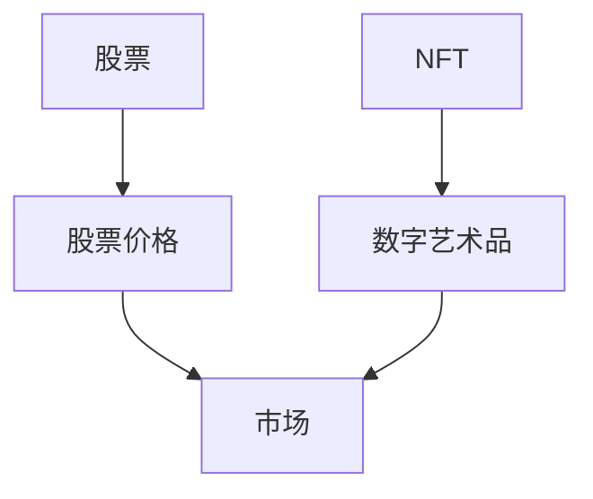
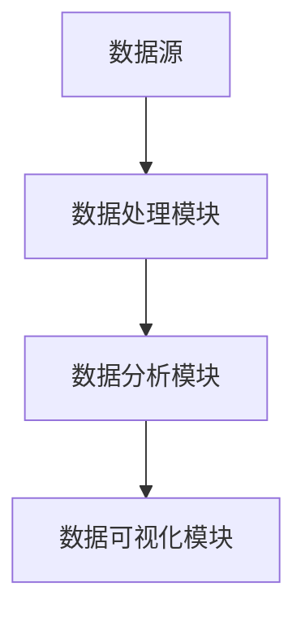

                 


# 股市估值对国际艺术品NFT市场的影响

## 关键词：股市估值, NFT市场, 数字艺术品, 价值评估, 投资分析

## 摘要：
本文探讨股市估值方法对国际NFT市场的潜在影响，分析NFT市场的特点和价值评估的挑战，结合数学模型和算法，提出一种适用于NFT市场的估值模型，并通过系统架构设计和项目实战，展示如何在实际中应用这些方法。

---

## 第一部分：背景介绍与核心概念

### 第1章：股市估值与NFT市场的概述

#### 1.1 股市估值的定义与基本原理
股市估值是对企业或股票的内在价值进行评估的过程，常用方法包括市盈率、市净率等模型。

#### 1.2 NFT市场的定义与特点
NFT（非同质化代币）用于证明数字艺术品的唯一所有权，市场交易量大，价格波动剧烈。

#### 1.3 股市估值与NFT市场的关联性
NFT市场需要价值评估，股市估值方法可提供借鉴，但存在差异。

### 第2章：核心概念与联系

#### 2.1 股市估值的原理与模型
介绍市盈率、市净率等模型，分析其适用性和局限性。

#### 2.2 NFT市场的核心要素与属性
包括稀缺性、流动性等，讨论其对价值的影响。

#### 2.3 核心概念的对比与联系
对比股市和NFT市场的估值方法，分析其异同和适用性。

### 第3章：核心概念的ER实体关系图



---

## 第二部分：算法原理与数学模型

### 第4章：股市估值与NFT市场分析的算法原理

#### 4.1 股票估值算法
介绍市盈率、市净率等模型，分析其数学原理。

#### 4.2 NFT估值算法
基于回归分析的模型，考虑交易量和艺术家声誉等因素。

#### 4.3 算法对比与优化
对比不同算法的优缺点，提出优化建议。

### 第5章：数学模型与公式

#### 5.1 股票估值的数学模型
$$ \text{市盈率} = \frac{\text{股价}}{\text{每股收益}} $$

#### 5.2 NFT估值的数学模型
$$ \text{价格} = \beta_0 + \beta_1 \times \text{交易量} + \beta_2 \times \text{艺术家声誉} $$

---

## 第三部分：系统分析与架构设计

### 第6章：系统分析

#### 6.1 问题场景介绍
描述如何利用股市估值方法分析NFT市场数据。

#### 6.2 系统功能设计
包括数据收集、处理、分析和可视化功能。

#### 6.3 系统架构设计
展示系统架构图，描述各组件的交互。

### 第7章：系统架构设计



---

## 第四部分：项目实战

### 第8章：环境配置与数据收集

#### 8.1 环境配置
安装必要的工具和库，如Python和Pandas。

#### 8.2 数据收集
从NFT交易平台获取交易数据，清洗数据并分析。

### 第9章：核心实现与代码解读

#### 9.1 数据分析代码
```python
import pandas as pd
data = pd.read_csv('nft_transactions.csv')
print(data.head())
```

#### 9.2 模型实现代码
```python
from sklearn.linear_model import LinearRegression
model = LinearRegression()
model.fit(X_train, y_train)
```

### 第10章：案例分析与结果解读

#### 10.1 案例分析
分析某NFT项目的价格走势，验证模型的有效性。

#### 10.2 结果解读
解释模型预测结果，评估其准确性。

### 第11章：项目小结

总结项目成果，讨论可能的改进方向。

---

## 第五部分：总结与最佳实践

### 第12章：总结

回顾全文，强调股市估值对NFT市场的影响。

### 第13章：最佳实践 tips

#### 13.1 投资建议
根据模型结果制定投资策略。

#### 13.2 风险管理
识别并管理NFT市场的风险因素。

#### 13.3 拓展阅读
推荐相关书籍和资源，供进一步学习。

### 第14章：注意事项

提醒读者注意数据质量和模型局限性，避免过度依赖单一方法。

---

## 关键词总结：
股市估值, NFT市场, 数字艺术品, 价值评估, 投资分析

