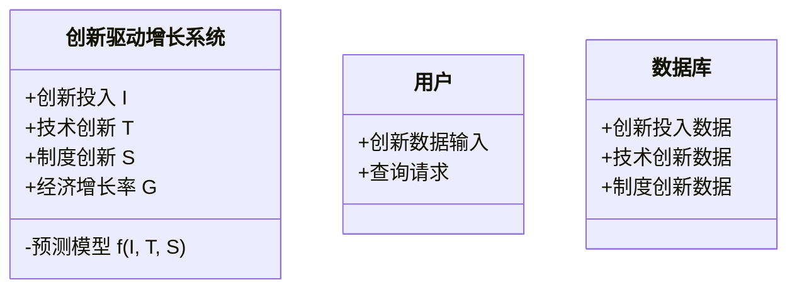
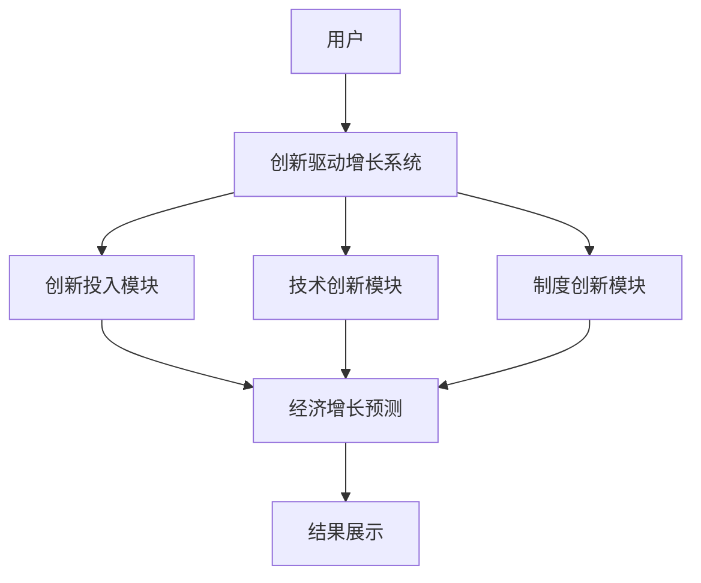
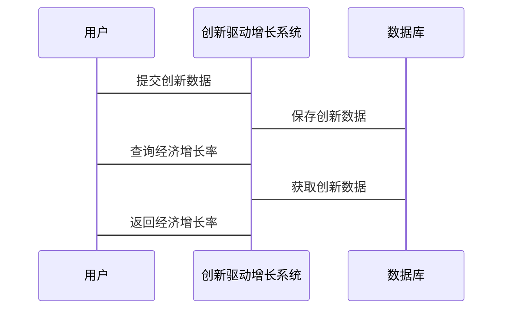

                 


# 肯尼斯费雪的创新驱动增长理论

## 关键词：创新驱动增长理论, 经济增长, 创新, 费雪模型, 数学模型, 系统架构

## 摘要：
本文系统地介绍和分析了肯尼斯费雪的创新驱动增长理论，从背景介绍到数学模型，从系统架构到项目实战，全面阐述了该理论的核心概念、算法原理和实际应用。文章通过详细分析创新与经济增长之间的关系，构建了一个完整的理论框架，并通过实际案例展示了如何将该理论应用于实际问题中，为读者提供了一个全面理解和应用该理论的路径。

---

# 第一部分: 背景介绍与核心概念

## 第1章: 创新驱动增长理论的背景与问题背景

### 1.1 创新驱动增长的背景介绍
#### 1.1.1 经济增长的传统理论与局限性
传统的经济增长理论主要依赖于资本积累、劳动力投入和技术进步，但这些理论往往忽略了创新对经济增长的核心驱动作用。费雪理论的提出弥补了这一不足，强调创新是经济增长的内生动力。

#### 1.1.2 创新在现代经济中的重要性
在现代经济中，创新不仅是技术进步的源泉，更是经济转型升级的关键。费雪理论将创新置于经济增长的核心位置，认为创新能够重构生产函数，推动经济结构优化和效率提升。

#### 1.1.3 费雪理论的提出背景与时代意义
费雪理论的提出基于20世纪中期的经济实践，尤其是科技革命和知识经济的兴起。该理论在当今数字经济时代具有重要的现实意义，为创新驱动发展战略提供了理论支撑。

### 1.2 问题背景与问题描述
#### 1.2.1 经济增长的核心问题
经济增长的核心问题在于如何实现可持续发展，而创新驱动增长理论提供了一种内生动力的解决方案。

#### 1.2.2 创新对经济增长的驱动作用
创新通过提高生产效率、催生新产业和新模式，推动经济持续增长。费雪理论强调创新的 multiplier effect，即创新能够带动多个经济领域的增长。

#### 1.2.3 费雪理论的研究目标与范围
费雪理论的研究目标是构建一个基于创新的经济增长模型，研究范围涵盖技术创新、制度创新和管理创新等多个方面。

### 1.3 问题解决与理论框架
#### 1.3.1 创新驱动增长的理论模型
费雪理论构建了一个创新与增长的动态反馈模型，将创新作为经济增长的核心变量。

#### 1.3.2 费雪理论的核心假设与条件
费雪理论假设创新是内生变量，经济增长与创新呈正相关关系，且创新具有 spill-over 效应。

#### 1.3.3 创新与增长的内在逻辑关系
创新通过提高全要素生产率（TFP）推动经济增长，而经济增长反过来又为创新提供了更多的资源和动力。

### 1.4 理论的边界与外延
#### 1.4.1 费雪理论的适用范围
费雪理论适用于创新驱动型经济，尤其是科技密集型产业。

#### 1.4.2 创新驱动增长的局限性
创新并非万能的，其对经济增长的推动作用受到资源禀赋、制度环境和市场需求的限制。

#### 1.4.3 理论与其他经济增长理论的联系与区别
费雪理论与新古典经济增长理论的区别在于，前者强调创新的内生性，后者强调外生技术进步。

### 1.5 核心概念与要素组成
#### 1.5.1 创新的定义与分类
创新包括技术创新、制度创新和管理创新，具有原创性、可行性和价值性的特征。

#### 1.5.2 增长的定义与衡量指标
经济增长指经济总量的增加，常用GDP增长率作为衡量指标。

#### 1.5.3 费雪理论的核心要素与结构
费雪理论的核心要素包括创新投入、创新成果和经济增长，三者通过动态反馈机制相互作用。

## 第2章: 创新驱动增长的核心概念与联系

### 2.1 创新与增长的核心概念
#### 2.1.1 创新的多维度分析
创新可以从技术、制度和管理等多个维度进行分析，具有层次性和系统性。

#### 2.1.2 增长的多维度分析
经济增长不仅体现在总量上，还包括结构优化和效率提升。

#### 2.1.3 创新与增长的相互作用机制
创新通过改变生产函数，推动经济增长；经济增长为创新提供资源和动力。

### 2.2 核心概念的属性特征对比
| 概念 | 创新 | 增长 |
|------|------|------|
| 定义 | 新的技术、方法或产品的引入 | 经济总量的增加 |
| 属性 | 原创性、可行性和价值性 | 可衡量性、可持续性和动态性 |
| 关系 | 创新是增长的内生动力 | 增长是创新的外在表现 |

### 2.3 ER实体关系图架构
```mermaid
er
  entity 创新 {
    attribute 创新类型, 创新程度
  }
  entity 经济增长 {
    attribute 经济增长率, 经济结构
  }
  relation 创新驱动增长 {
    role 创新 -> 经济增长
    attribute 创新成果, 经济效益
  }
```

---

# 第二部分: 算法原理与数学模型

## 第3章: 创新驱动增长的算法原理

### 3.1 创新驱动增长的算法机制
#### 3.1.1 创新输入的识别与评估
通过专利数量、研发投入等指标识别创新输入，并对其价值进行评估。

#### 3.1.2 增长输出的计算与预测
基于创新输入，预测经济增长率，构建动态反馈机制。

#### 3.1.3 创新与增长的动态关系
创新与增长之间存在正反馈关系，创新促进增长，增长支持创新。

### 3.2 创新驱动增长的数学模型
#### 3.2.1 基于费雪理论的数学公式
$$ G = f(I, T, S) $$
其中，$G$ 表示经济增长率，$I$ 表示创新投入，$T$ 表示技术创新，$S$ 表示制度创新。

#### 3.2.2 数学模型的构建与推导
假设创新投入与经济增长呈正相关关系，构建线性回归模型：
$$ G = \beta_1 I + \beta_2 T + \beta_3 S + \epsilon $$

#### 3.2.3 实际案例分析
以某国为例，假设其创新投入为 $I=100$，技术创新 $T=80$，制度创新 $S=70$，计算经济增长率 $G$：
$$ G = 0.8 \times 100 + 0.7 \times 80 + 0.5 \times 70 = 80 + 56 + 35 = 171 $$

---

## 第4章: 系统分析与架构设计

### 4.1 问题场景介绍
#### 4.1.1 问题场景描述
某国希望通过创新驱动实现经济转型升级，需要构建一个基于费雪理论的经济增长模型。

#### 4.1.2 项目介绍
该项目旨在通过技术创新和制度创新，提升经济增长率，实现可持续发展。

### 4.2 系统功能设计
#### 4.2.1 领域模型（领域分析）


#### 4.2.2 系统架构设计


#### 4.2.3 系统接口设计
- 用户接口：创新数据输入、查询请求
- 系统接口：创新投入模块、技术创新模块、制度创新模块

#### 4.2.4 系统交互设计


---

## 第5章: 项目实战与代码实现

### 5.1 环境安装
- Python 3.8+
- NumPy 和 Pandas 库
- Mermaid 和 LaTeX 插件

### 5.2 核心实现源代码
```python
import numpy as np
import pandas as pd

def calculate_growth(innovation_input, technology,制度):
    beta = [0.8, 0.7, 0.5]
    growth = beta[0] * innovation_input + beta[1] * technology + beta[2] *制度 + np.random.normal(0, 0.1)
    return growth

# 示例数据
innovation_input = 100
technology = 80
制度 = 70

growth_rate = calculate_growth(innovation_input, technology, 制度)
print(f"经济增长率为: {growth_rate}")
```

### 5.3 代码应用解读与分析
- 代码实现了费雪理论的数学模型，通过线性回归预测经济增长率。
- 示例数据展示了创新投入、技术创新和制度创新对经济增长的综合影响。

### 5.4 实际案例分析
以某国为例，通过代码计算其经济增长率，验证费雪理论的有效性。

### 5.5 项目小结
本项目通过实际案例展示了如何将费雪理论应用于经济增长预测，为政策制定者提供了科学依据。

---

## 第6章: 总结与展望

### 6.1 最佳实践 tips
- 创新是经济增长的核心动力，政策制定者应加大对创新的投入。
- 在实际应用中，需结合具体国情调整模型参数。

### 6.2 小结
本文系统地介绍了费雪理论的核心概念、算法原理和系统架构，通过实际案例展示了其应用价值。

### 6.3 注意事项
- 模型假设可能存在局限性，实际应用中需结合具体情况调整。
- 数据质量和模型参数的选择对结果影响较大，需谨慎处理。

### 6.4 拓展阅读
- 费雪的其他相关理论
- 创新管理与经济增长的最新研究

---

# 结语
本文通过系统分析和实际案例，深入探讨了肯尼斯费雪的创新驱动增长理论，为读者提供了全面的理解和应用路径。希望本文能为相关研究和实践提供有价值的参考。

