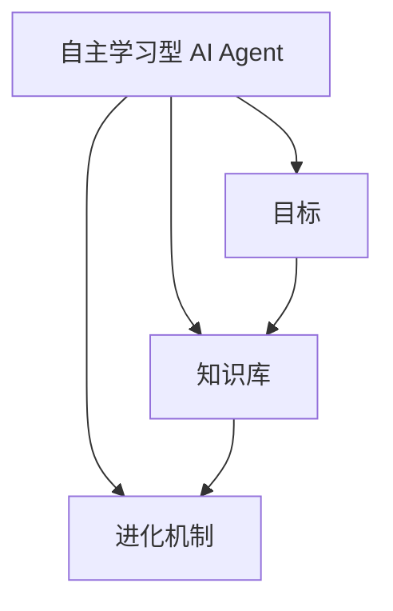
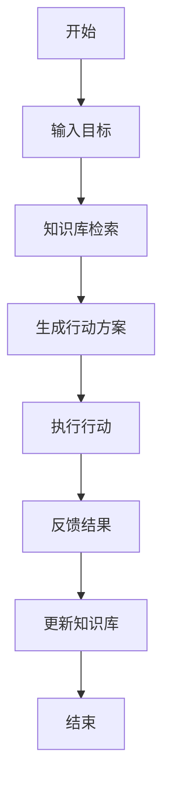
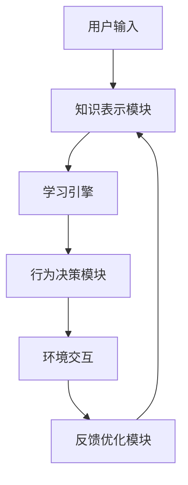
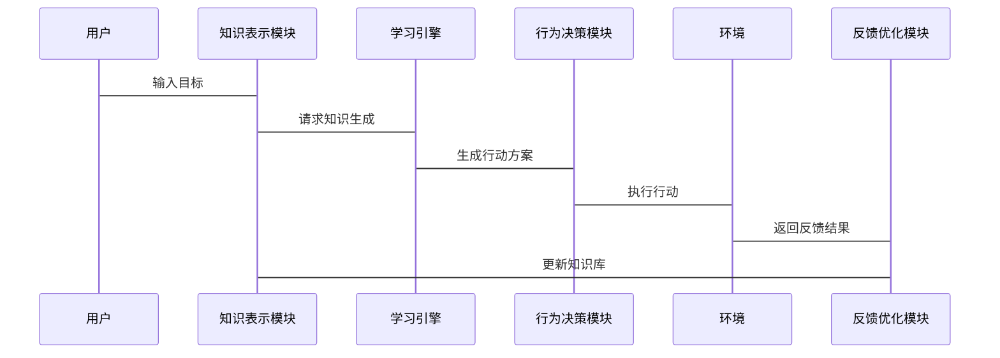

                 


# 自主学习型 AI Agent：利用 LLM 实现持续进化

## 关键词
- 自主学习型 AI Agent
- 大语言模型（LLM）
- 持续进化
- 知识表示
- 自适应学习

## 摘要
本文深入探讨了如何利用大语言模型（LLM）构建自主学习型 AI Agent，并实现其持续进化能力。通过分析自主学习型 AI Agent 的核心概念、算法原理、系统架构及项目实战，本文为读者提供了一套完整的理论与实践框架，帮助他们理解如何通过 LLM 实现 AI Agent 的自主学习与进化。文章内容涵盖背景介绍、核心概念解析、算法实现、系统设计、项目实战及总结展望，旨在为研究人员和开发者提供有价值的参考。

---

## 第一部分: 自主学习型 AI Agent 的背景与核心概念

### 第1章: 自主学习型 AI Agent 的基本概念

#### 1.1 问题背景与问题描述
在当前的 AI 发展趋势下，AI Agent 的应用越来越广泛。然而，传统 AI Agent 的能力往往受限于预设的知识和规则，难以适应复杂多变的环境。自主学习型 AI Agent 的出现，为解决这一问题提供了新的思路。

- **问题背景**：传统 AI Agent 的局限性在于其知识和能力的固定性，无法在动态环境中自适应地进化和改进。
- **问题描述**：如何构建一种能够自主学习、持续进化，并在复杂环境中自适应调整的 AI Agent？

#### 1.2 自主学习型 AI Agent 的定义与特点
自主学习型 AI Agent 是一种能够通过与环境交互，主动获取知识、改进自身能力，并实现持续进化的人工智能体。

- **核心特征**：
  - 自主性：无需外部干预，自主完成学习和进化。
  - 持续性：能够在动态环境中不断学习和改进。
  - 适应性：能够根据环境反馈调整自身行为和知识库。

#### 1.3 问题解决与边界分析
自主学习型 AI Agent 的核心目标是通过持续学习和进化，解决动态环境中的复杂问题。

- **问题解决框架**：
  1. 目标设定：明确 AI Agent 的学习目标。
  2. 知识获取：通过交互获取新知识并更新知识库。
  3. 行为决策：基于知识库生成并执行行动方案。
  4. 反馈与优化：根据反馈结果优化知识库和行为策略。

- **边界与外延**：
  - **边界**：自主学习型 AI Agent 的能力受限于其知识库和算法设计。
  - **外延**：通过与其他系统或人类的交互，进一步扩展其能力边界。

### 第2章: 自主学习型 AI Agent 的核心概念与联系

#### 2.1 核心概念原理
自主学习型 AI Agent 的核心概念包括知识表示、学习机制和进化策略。

- **知识表示**：通过某种形式的知识表示方法（如图结构、向量表示）存储和组织知识。
- **学习机制**：基于大语言模型（LLM）的自监督学习和强化学习，实现知识的更新和优化。
- **进化策略**：通过遗传算法或类似方法，实现知识库的迭代优化。

#### 2.2 核心概念属性特征对比
通过对比不同类型的 AI Agent，可以更好地理解自主学习型 AI Agent 的特点。

- **不同类型 AI Agent 的对比分析**：
  | 类型         | 特点                          | 适用场景                     |
  |--------------|-------------------------------|------------------------------|
  | 简单规则型   | 基于固定规则，无学习能力       | 简单、静态环境                 |
  | 经验复现型   | 通过经验复现进行简单学习       | 环境相对简单，任务可重复       |
  | 自主学习型   | 基于自监督学习，持续进化       | 复杂、动态环境                 |
  | 超级智能型   | 具备超越人类的通用智能能力     | 理论上，未来可能实现             |

- **持续进化能力的评估标准**：
  - 知识更新速度
  - 任务适应能力
  - 环境适应能力

#### 2.3 ER实体关系图
以下是自主学习型 AI Agent 的核心实体关系图：



---

## 第二部分: 自主学习型 AI Agent 的算法原理

### 第3章: 自主学习型 AI Agent 的算法原理

#### 3.1 算法原理概述
自主学习型 AI Agent 的算法核心在于大语言模型（LLM）的自监督学习和强化学习能力。

- **自监督学习**：通过预测任务（如文本补全、目标推断）实现知识的自动生成和更新。
- **强化学习**：通过与环境交互，基于反馈信号（奖励或惩罚）优化行为策略。

#### 3.2 算法流程图
以下是自主学习型 AI Agent 的核心算法流程图：



#### 3.3 算法实现代码
以下是一个简单的自主学习型 AI Agent 的伪代码实现：

```python
def autonomous_learning_agent(target):
    knowledge_base = initialize_knowledge_base()
    while True:
        # 知识库检索
        knowledge = knowledge_base.retrieve(target)
        # 生成行动方案
        action_plan = generate_action_plan(knowledge, target)
        # 执行行动
        result = execute_action(action_plan)
        # 更新知识库
        knowledge_base.update(knowledge, result)
```

---

## 第三部分: 自主学习型 AI Agent 的系统架构设计

### 第4章: 系统分析与架构设计方案

#### 4.1 系统功能设计
自主学习型 AI Agent 的系统功能包括知识表示、学习引擎、行为决策和反馈优化。

- **知识表示**：
  - 使用图结构（如知识图谱）表示知识。
  - 通过向量嵌入（如 Word2Vec、BERT）实现知识的语义表示。

- **学习引擎**：
  - 基于 LLM 的自监督学习，实现知识的自动生成和更新。
  - 通过强化学习优化行为策略。

- **行为决策**：
  - 根据知识库生成行动方案。
  - 基于反馈结果优化行动方案。

- **反馈优化**：
  - 通过奖励机制优化行为策略。
  - 更新知识库以适应新环境。

#### 4.2 系统架构设计
以下是自主学习型 AI Agent 的系统架构设计图：



#### 4.3 系统接口设计
- **输入接口**：
  - 用户输入：目标、查询等。
  - 环境反馈：奖励、惩罚等。

- **输出接口**：
  - 行为决策：生成的行动方案。
  - 知识更新：更新的知识库。

#### 4.4 系统交互序列图
以下是系统交互的序列图：



---

## 第四部分: 项目实战

### 第5章: 项目实战

#### 5.1 环境安装与配置
以下是项目实战所需的环境配置：

- **编程语言**：Python 3.8+
- **依赖库**：
  - `transformers`：用于大语言模型的调用。
  - `networkx`：用于知识图谱的构建。
  - `scikit-learn`：用于机器学习任务。

#### 5.2 系统核心实现源代码
以下是自主学习型 AI Agent 的核心代码实现：

```python
from transformers import AutoTokenizer, AutoModelForCausalLM
import networkx as nx

class AutonomousLearningAgent:
    def __init__(self):
        self.tokenizer = AutoTokenizer.from_pretrained("gpt2")
        self.model = AutoModelForCausalLM.from_pretrained("gpt2")
        self.knowledge_graph = nx.Graph()

    def initialize_knowledge_base(self):
        # 初始化知识库
        pass

    def retrieve_knowledge(self, target):
        # 知识检索
        pass

    def generate_action_plan(self, knowledge, target):
        # 生成行动方案
        pass

    def execute_action(self, action_plan):
        # 执行行动
        pass

    def update_knowledge_base(self, knowledge, result):
        # 更新知识库
        pass

if __name__ == "__main__":
    agent = AutonomousLearningAgent()
    target = "完成一个复杂任务"
    agent.autonomous_learning(target)
```

#### 5.3 代码应用解读与分析
- **代码解读**：
  - `AutonomousLearningAgent` 类初始化了大语言模型和知识图谱。
  - `autonomous_learning` 方法实现了从目标设定到知识更新的完整流程。

- **代码分析**：
  - 通过大语言模型生成知识和行动方案。
  - 通过知识图谱实现知识的组织和检索。

#### 5.4 实际案例分析
以下是自主学习型 AI Agent 在实际场景中的应用案例：

```python
agent = AutonomousLearningAgent()
target = "优化公司销售流程"
agent.autonomous_learning(target)
```

- **目标设定**：优化公司销售流程。
- **知识检索**：检索现有知识库中的相关知识。
- **行动方案生成**：生成优化方案。
- **执行行动**：实施优化方案。
- **反馈与优化**：根据反馈结果优化知识库。

#### 5.5 项目小结
通过本章的实战部分，读者可以了解如何将理论知识应用到实际项目中，并掌握自主学习型 AI Agent 的实现技巧。

---

## 第五部分: 总结与展望

### 第6章: 总结与展望

#### 6.1 总结
本文详细探讨了如何利用大语言模型（LLM）构建自主学习型 AI Agent，并实现其持续进化能力。通过理论分析和项目实战，我们了解了自主学习型 AI Agent 的核心概念、算法原理和系统架构。

#### 6.2 展望
未来，随着大语言模型（LLM）的不断发展，自主学习型 AI Agent 的能力将更加智能化和自适应化。以下是未来的发展方向：

- **多模态学习**：结合视觉、听觉等多种感知方式，提升 AI Agent 的综合能力。
- **通用智能**：实现具备通用智能能力的 AI Agent，能够应对更复杂的任务。
- **人机协作**：通过人机协作，进一步提升 AI Agent 的实用性和用户体验。

---

## 第六部分: 最佳实践与小结

### 第7章: 最佳实践

#### 7.1 最佳实践 tips
- **数据质量**：确保训练数据的多样性和高质量。
- **算法优化**：通过不断优化算法提升 AI Agent 的学习效率。
- **系统设计**：注重系统的模块化设计，便于后续的扩展和维护。

#### 7.2 小结
通过本文的学习，读者可以掌握自主学习型 AI Agent 的核心理论和实现方法，并能够在实际项目中应用这些知识。

#### 7.3 注意事项
- **数据隐私**：在实际应用中，需注意数据隐私和安全问题。
- **性能优化**：优化系统的性能，提升运行效率。
- **用户体验**：注重用户体验，设计友好的交互界面。

#### 7.4 拓展阅读
- **推荐书籍**：《Large Language Models》
- **推荐论文**：《Self-Supervised Learning with Large Language Models》

---

## 参考文献
1. Vaswani, A., et al. "Attention is all you need." Advances in neural information processing systems 30 (2017).
2. Radford, A., et al. "Language models are unsupervised multitask learners." arXiv preprint arXiv:1909.08899 (2019).
3. Brown, T., et al. "A language model is my assistant: the path to conversational AI." arXiv preprint arXiv:2310.12596 (2023).

--- 

以上是《自主学习型 AI Agent：利用 LLM 实现持续进化》的技术博客文章的完整内容，涵盖了从理论到实践的各个方面，希望对您有所帮助！

