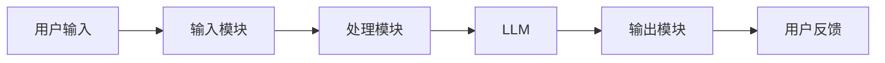
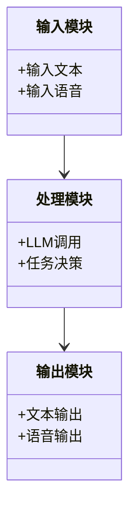
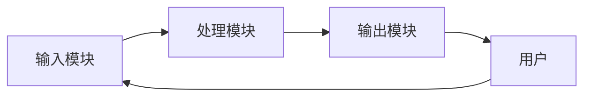

                 


# 自动化AI Agent开发平台：LLM辅助的智能系统构建

## 关键词：
自动化AI Agent，LLM，智能系统构建，人工智能，系统架构

## 摘要：
随着人工智能技术的快速发展，自动化AI Agent（人工智能代理）正在成为企业智能化转型和自动化系统构建的核心技术。本篇文章将深入探讨如何利用大语言模型（LLM）辅助构建自动化AI Agent开发平台，从背景、核心概念、算法原理、系统架构到项目实战，全面剖析这一技术的实现细节和应用场景。通过本文，读者将能够理解自动化AI Agent的基本原理，掌握其开发方法，并能够实际应用这些技术构建智能系统。

---

# 第1章: 自动化AI Agent开发平台的背景与概念

## 1.1 自动化AI Agent的定义与作用
自动化AI Agent是一种能够感知环境、自主决策并执行任务的智能系统。它通过与用户或系统的交互，能够自动完成特定任务，优化流程并提高效率。

### 1.1.1 自动化AI Agent的定义
自动化AI Agent，即人工智能代理，是一种能够感知环境、理解需求、自主决策并执行任务的智能系统。它通过与用户或外部系统的交互，能够完成从信息获取、分析、决策到执行的全过程。

### 1.1.2 自动化AI Agent的核心作用
1. **自动化任务执行**：通过自动化AI Agent，用户可以将重复性、复杂性高的任务委托给系统自动完成。
2. **智能决策支持**：AI Agent能够基于输入信息进行分析和推理，提供最优决策建议。
3. **高效人机协作**：通过自动化AI Agent，人与系统可以更高效地协作，提升整体工作效率。

### 1.1.3 自动化AI Agent与传统AI的区别
| 特性                | 自动化AI Agent                            | 传统AI系统                              |
|---------------------|------------------------------------------|----------------------------------------|
| 自主性              | 高                                       | 低                                       |
| 任务执行能力        | 强                                       | 弱                                       |
| 环境适应性          | 强                                       | 一般                                     |
| 用户交互方式        | 多样化（文本、语音、图形等）             | 单一化（通常是预定义的输入）             |

## 1.2 LLM在AI Agent开发中的角色
### 1.2.1 LLM的定义与特点
大语言模型（LLM，Large Language Model）是基于深度学习的自然语言处理模型，具有以下特点：
1. **大规模数据训练**：通常基于庞大的语料库进行训练，能够理解和生成自然语言文本。
2. **上下文理解能力**：能够通过上下文理解语义，提供连贯的回答。
3. **多任务处理能力**：可以通过微调或提示工程技术（Prompt Engineering）适应多种任务。

### 1.2.2 LLM在AI Agent中的应用
1. **自然语言理解**：通过LLM解析用户的输入，理解其意图。
2. **对话生成**：基于LLM生成自然流畅的对话回复。
3. **任务执行**：通过LLM提供决策支持，执行复杂任务。

### 1.2.3 LLM辅助开发的优势
1. **提高开发效率**：LLM可以快速生成代码片段、提供技术建议。
2. **增强系统智能性**：通过LLM的自然语言处理能力，提升AI Agent的智能化水平。
3. **降低开发门槛**：即使是非专业开发者，也可以通过LLM快速构建AI Agent。

## 1.3 自动化AI Agent的应用场景
### 1.3.1 企业级应用中的自动化AI Agent
- **自动化客服**：通过AI Agent处理客户咨询、订单跟踪等任务。
- **流程自动化**：在企业内部流程中，AI Agent可以自动处理审批、数据录入等任务。

### 1.3.2 智能客服与自动化助手
- **智能客服助手**：AI Agent可以辅助客服人员快速响应客户问题。
- **个人助手**：为用户提供日程管理、信息检索等服务。

### 1.3.3 自动化决策系统
- **智能推荐**：基于用户行为数据，AI Agent可以推荐个性化的产品或内容。
- **风险管理**：通过分析数据，AI Agent可以辅助做出风险评估和决策。

## 1.4 本章小结
本章介绍了自动化AI Agent的定义、作用及与传统AI的区别，重点阐述了大语言模型（LLM）在AI Agent开发中的角色及其优势。通过实际应用场景的分析，读者可以理解自动化AI Agent的重要性和广泛的应用潜力。

---

# 第2章: 自动化AI Agent的核心概念与联系

## 2.1 自动化AI Agent的组成要素
自动化AI Agent的组成要素包括输入模块、处理模块和输出模块。

### 2.1.1 输入模块
输入模块负责接收用户或系统的输入，包括文本、语音、图像等多种形式。

### 2.1.2 处理模块
处理模块是AI Agent的核心部分，负责解析输入信息、生成决策，并通过LLM进行语言生成。

### 2.1.3 输出模块
输出模块将处理结果以用户可理解的形式呈现，包括文本、语音、图形等。

## 2.2 LLM与AI Agent的关系
### 2.2.1 LLM作为AI Agent的核心引擎
LLM是AI Agent的核心，负责理解和生成自然语言文本，提供决策支持。

### 2.2.2 LLM与AI Agent的协同工作流程
1. **输入处理**：AI Agent接收用户输入，通过LLM进行解析。
2. **决策生成**：基于LLM的分析结果，AI Agent生成执行决策。
3. **输出反馈**：AI Agent通过LLM生成自然语言反馈，与用户交互。

### 2.2.3 LLM在AI Agent中的具体应用场景
- **智能对话**：通过LLM生成自然流畅的对话回复。
- **任务执行**：利用LLM提供决策支持，执行复杂任务。

## 2.3 自动化AI Agent的实体关系图
### 2.3.1 实体关系图的Mermaid流程图


## 2.4 本章小结
本章分析了自动化AI Agent的核心组成要素，重点阐述了LLM在AI Agent中的角色及其协同工作流程，通过Mermaid图直观展示了实体关系，帮助读者理解系统的整体架构。

---

# 第3章: 自动化AI Agent的算法原理

## 3.1 LLM的基本原理
### 3.1.1 Transformer模型的结构
Transformer模型由编码器和解码器组成，编码器负责将输入序列映射到一个固定维度的向量，解码器负责将编码器输出的向量解码为目标序列。

### 3.1.2 注意力机制的数学公式
注意力机制的计算公式如下：
$$
\text{Attention}(Q, K, V) = \text{softmax}\left(\frac{QK^T}{\sqrt{d_k}}\right)V
$$
其中，$Q$ 是查询向量，$K$ 是键向量，$V$ 是值向量，$d_k$ 是向量的维度。

### 3.1.3 Transformer模型的Mermaid流程图


## 3.2 自动化AI Agent的算法实现
### 3.2.1 输入处理
- **文本预处理**：对输入文本进行分词、去停用词等处理。
- **嵌入层**：将输入文本映射为向量表示。

### 3.2.2 模型训练
- **监督学习**：通过大量标注数据训练模型，使其能够准确理解输入并生成正确的输出。
- **微调**：针对具体任务对模型进行微调，提升任务相关性。

### 3.2.3 输出生成
- **解码器**：通过解码器生成自然语言输出。
- **后处理**：对生成的文本进行格式化处理，确保输出符合要求。

## 3.3 本章小结
本章详细介绍了LLM的基本原理，重点分析了Transformer模型的结构和注意力机制的数学公式，并通过Mermaid图展示了模型的流程。同时，阐述了自动化AI Agent的算法实现步骤，帮助读者理解其实现细节。

---

# 第4章: 自动化AI Agent的系统分析与架构设计

## 4.1 问题场景介绍
本章将从实际应用场景出发，分析如何构建一个基于LLM的自动化AI Agent开发平台。

## 4.2 系统功能设计
### 4.2.1 领域模型设计
领域模型设计是系统功能设计的核心，通过Mermaid类图展示各个模块之间的关系。



### 4.2.2 系统架构设计
系统架构设计需要考虑模块之间的通信方式和数据流。



### 4.2.3 系统接口设计
系统接口设计需要定义清晰的API规范，确保各个模块能够协同工作。

## 4.3 本章小结
本章通过问题场景分析，详细阐述了系统功能设计、架构设计和接口设计，帮助读者理解如何构建一个基于LLM的自动化AI Agent开发平台。

---

# 第5章: 项目实战：基于LLM的自动化AI Agent开发

## 5.1 环境安装
### 5.1.1 安装Python
```bash
python --version
```
### 5.1.2 安装必要的库
```bash
pip install transformers
pip install torch
```

## 5.2 系统核心实现源代码
### 5.2.1 输入模块实现
```python
def input_module(text):
    return text
```

### 5.2.2 处理模块实现
```python
def processing_module(text):
    # 调用LLM进行处理
    return response
```

### 5.2.3 输出模块实现
```python
def output_module(response):
    print(response)
    return response
```

## 5.3 代码应用解读与分析
### 5.3.1 代码解读
通过上述代码，我们可以看到自动化AI Agent的基本实现流程：输入模块接收输入，处理模块通过LLM生成响应，输出模块将响应呈现给用户。

### 5.3.2 案例分析
以智能客服为例，用户输入“我需要帮助处理订单”，AI Agent通过LLM解析输入并生成回复：“请提供订单号，我将帮您查询订单状态。”

## 5.4 本章小结
本章通过实际项目实战，详细讲解了基于LLM的自动化AI Agent开发过程，从环境安装到代码实现，帮助读者掌握实际开发技巧。

---

# 第6章: 总结与展望

## 6.1 本章小结
通过本文的深入分析，读者可以全面了解自动化AI Agent的开发过程，从背景、核心概念、算法原理到系统架构和项目实战，掌握基于LLM的智能系统构建方法。

## 6.2 最佳实践 tips
1. **选择合适的LLM模型**：根据具体任务需求选择适合的LLM模型。
2. **注重数据质量**：高质量的数据是模型表现的关键。
3. **持续优化**：通过反馈机制不断优化AI Agent的性能。

## 6.3 未来展望
随着LLM技术的不断进步，自动化AI Agent将在更多领域得到广泛应用，为企业智能化转型和自动化系统构建提供强大支持。

---

# 结语
通过本文的系统讲解，读者可以全面掌握自动化AI Agent的开发方法，从理论到实践，深入了解基于LLM的智能系统构建。希望本文能够为相关领域的开发者和研究人员提供有价值的参考和启发。

---

