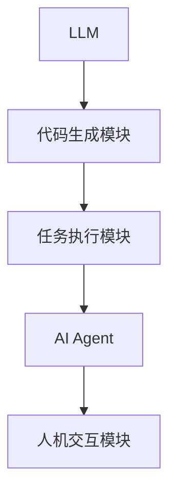
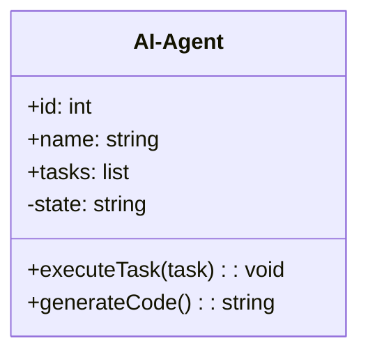
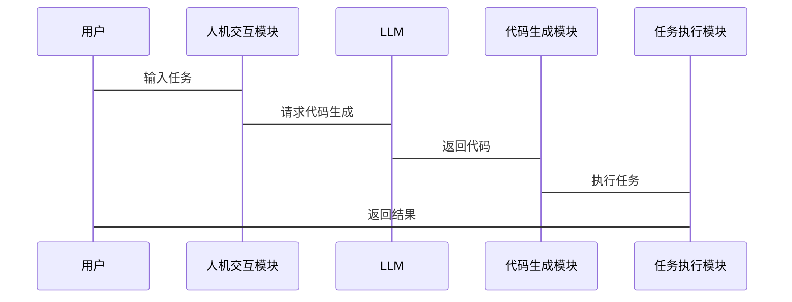

                 


# 《自动化AI Agent开发：LLM辅助的代码生成》

> 关键词：自动化AI Agent，LLM，代码生成，大语言模型，人工智能，机器学习

> 摘要：随着人工智能技术的快速发展，自动化AI Agent开发逐渐成为技术领域的重要趋势。利用大语言模型（LLM）辅助代码生成，能够显著提高开发效率和代码质量。本文从背景、核心概念、算法原理、系统架构到项目实战，全面深入探讨如何利用LLM实现自动化AI Agent开发，并提供丰富的技术细节和实际案例，帮助读者掌握这一前沿技术。

---

# 第1章: 自动化AI Agent开发的背景与现状

## 1.1 自动化AI Agent的定义与背景

### 1.1.1 自动化AI Agent的定义
自动化AI Agent（Artificial Intelligence Agent）是指能够自主感知环境、执行任务并做出决策的智能体。它通过与环境交互，实现特定目标，例如数据处理、任务执行或信息检索。

### 1.1.2 自动化AI Agent的发展背景
随着人工智能和机器学习技术的快速发展，AI Agent的应用场景越来越广泛，特别是在自动化系统、智能助手和无人系统等领域。

### 1.1.3 自动化AI Agent的应用场景
- **自动化系统**：如工业自动化中的机器人。
- **智能助手**：如Siri、Alexa等。
- **无人系统**：如自动驾驶汽车。

## 1.2 LLM辅助代码生成的技术基础

### 1.2.1 LLM的基本概念
大语言模型（LLM，Large Language Model）是一种基于深度学习的自然语言处理模型，能够理解和生成人类语言。

### 1.2.2 LLM在代码生成中的优势
- **高效性**：LLM可以快速生成大量代码。
- **智能性**：能够理解上下文，生成符合需求的代码。
- **可定制性**：支持根据特定需求生成代码。

### 1.2.3 当前LLM辅助代码生成的技术现状
目前，LLM辅助代码生成已经应用于多个领域，但仍然面临一些挑战，如代码准确性、可解释性等。

## 1.3 自动化AI Agent开发的必要性

### 1.3.1 开发效率的提升需求
传统AI Agent开发周期长、成本高，LLM辅助开发可以显著提高效率。

### 1.3.2 代码生成的智能化趋势
通过LLM辅助生成代码，可以减少人工干预，实现更加智能化的开发流程。

### 1.3.3 LLM在代码生成中的潜力
LLM可以生成高质量的代码片段，甚至完整系统，为AI Agent开发提供了新的可能性。

## 1.4 本章小结
本章介绍了自动化AI Agent的定义、背景和应用场景，并分析了LLM辅助代码生成的技术基础和必要性。

---

# 第2章: AI Agent与LLM的核心概念

## 2.1 AI Agent的基本原理

### 2.1.1 AI Agent的定义与特点
AI Agent通过感知环境、执行动作来实现目标，具有自主性、反应性和社会性等特点。

### 2.1.2 AI Agent的分类与应用场景
- **简单反射型AI Agent**：基于规则执行任务。
- **基于模型的AI Agent**：具有内部模型，能够理解环境。
- **实用基于模型的AI Agent**：基于效用函数进行决策。

### 2.1.3 AI Agent与传统自动化的区别
AI Agent具有自主性和智能性，而传统自动化系统依赖固定规则。

## 2.2 LLM的基本原理

### 2.2.1 LLM的定义与特点
LLM是一种基于深度学习的自然语言处理模型，具有强大的文本生成能力。

### 2.2.2 LLM的核心技术与实现原理
- **Transformer模型**：基于自注意力机制和前馈神经网络。
- **训练目标**：最小化预测概率损失。

### 2.2.3 LLM与传统NLP模型的区别
LLM具有更大的参数规模和更强的上下文理解能力。

## 2.3 AI Agent与LLM的结合方式

### 2.3.1 LLM作为AI Agent的核心驱动力
LLM可以生成代码、处理任务和提供决策支持。

### 2.3.2 AI Agent对LLM的扩展与应用
通过结合AI Agent的需求，优化LLM的生成能力。

### 2.3.3 LLM在AI Agent中的角色与功能
- **代码生成**：生成AI Agent所需代码。
- **任务执行**：通过LLM生成指令，驱动AI Agent完成任务。

## 2.4 本章小结
本章详细讲解了AI Agent和LLM的基本原理，并分析了它们的结合方式和在代码生成中的作用。

---

# 第3章: LLM辅助代码生成的算法原理

## 3.1 LLM的模型结构

### 3.1.1 Transformer模型的基本结构
Transformer模型由编码器和解码器组成，编码器用于处理输入，解码器用于生成输出。

### 3.1.2 注意力机制的核心原理
注意力机制通过计算输入序列中每个位置的重要性，生成加权后的表示。

$$
\text{注意力权重计算公式：} \alpha_{ij} = \frac{\exp(e_{ij})}{\sum_{k} \exp(e_{ik})}
$$

其中，$e_{ij}$是查询和键的点积。

### 3.1.3 Transformer模型的训练流程
- **输入预处理**：对输入序列进行编码。
- **编码器处理**：生成上下文表示。
- **解码器处理**：基于上下文生成输出。

## 3.2 LLM的训练与优化

### 3.2.1 损失函数的定义
交叉熵损失函数用于衡量生成结果与真实值的差距。

$$
\text{损失函数：} \mathcal{L} = -\sum_{i} y_i \log p(y_i)
$$

### 3.2.2 梯度下降与优化算法
使用Adam优化器进行参数更新。

### 3.2.3 模型并行与分布式训练
通过模型并行和分布式训练加速模型训练。

## 3.3 LLM的推理过程

### 3.3.1 解码策略
- **贪心解码**：每次选择概率最高的词。
- **随机采样**：随机选择词，提高多样性。

### 3.3.2 代码生成的实现
通过LLM生成代码片段，并将其整合到AI Agent中。

## 3.4 本章小结
本章详细讲解了LLM的模型结构、训练优化和推理过程，分析了代码生成的实现细节。

---

# 第4章: 系统分析与架构设计方案

## 4.1 问题场景介绍

### 4.1.1 项目介绍
开发一个基于LLM的AI Agent系统，实现自动化任务执行。

### 4.1.2 系统功能设计
- **代码生成模块**：生成AI Agent所需代码。
- **任务执行模块**：驱动AI Agent完成任务。
- **人机交互模块**：提供与用户的交互界面。

### 4.1.3 系统架构设计



## 4.2 系统架构设计

### 4.2.1 领域模型设计



### 4.2.2 系统架构图


### 4.2.3 系统接口设计
- **API接口**：提供代码生成和任务执行的接口。
- **命令行接口**：支持命令行输入和输出。

### 4.2.4 系统交互流程



## 4.3 本章小结
本章通过问题场景分析和系统架构设计，详细介绍了基于LLM的AI Agent系统的实现方案。

---

# 第5章: 项目实战

## 5.1 环境安装与配置

### 5.1.1 安装Python与依赖库
安装Python 3.8及以上版本，以及必要的依赖库，如`transformers`和`torch`。

### 5.1.2 安装LLM模型
选择合适的LLM模型，如GPT-2或GPT-3，并下载其预训练权重。

## 5.2 系统核心实现

### 5.2.1 LLM代码生成实现
编写代码生成模块，基于LLM生成AI Agent所需的代码。

```python
from transformers import AutoTokenizer, AutoModelForCausalLM

tokenizer = AutoTokenizer.from_pretrained("gpt2")
model = AutoModelForCausalLM.from_pretrained("gpt2")

def generate_code(prompt):
    inputs = tokenizer(prompt, return_tensors="pt")
    outputs = model.generate(inputs.input_ids, max_length=100)
    return tokenizer.decode(outputs[0], skip_special_tokens=True)
```

### 5.2.2 任务执行模块实现
实现任务执行模块，基于生成的代码驱动AI Agent完成任务。

```python
def execute_task(code):
    # 执行代码
    exec(code)
    return "Task executed successfully"
```

### 5.2.3 系统集成与测试
将各模块集成到系统中，并进行功能测试。

## 5.3 实际案例分析

### 5.3.1 案例背景
开发一个简单的AI Agent，实现网页爬虫功能。

### 5.3.2 代码生成过程
通过LLM生成爬虫代码。

### 5.3.3 系统交互流程
用户输入爬取需求，系统生成代码并执行任务。

## 5.4 本章小结
本章通过实际案例，详细讲解了基于LLM的AI Agent开发过程，包括环境配置、代码实现和系统测试。

---

# 第6章: 总结与展望

## 6.1 核心内容回顾
- 自动化AI Agent的背景与必要性
- LLM辅助代码生成的技术原理
- 系统架构与项目实战

## 6.2 未来发展方向
- 提高代码生成的准确性和可解释性
- 结合其他AI技术，如强化学习和视觉识别
- 推动LLM在更多领域的应用

## 6.3 最佳实践Tips
- 合理选择LLM模型和工具
- 注重代码质量和可维护性
- 加强系统安全性和鲁棒性

## 6.4 本章小结
本章总结了全书的核心内容，并展望了未来的发展方向，为读者提供了进一步学习和实践的指导。

---

# 参考文献

（此处列出相关文献和资料，具体根据实际内容添加）

---

通过以上目录和内容设计，本文系统地介绍了自动化AI Agent开发中LLM辅助代码生成的核心概念、算法原理和实际应用，为读者提供了全面的技术指导和实践参考。

