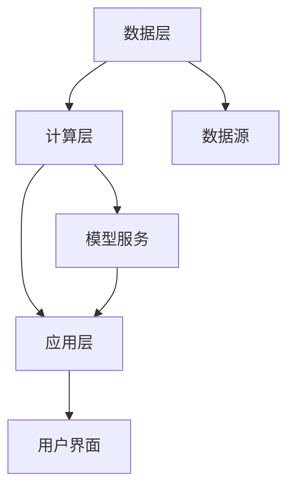
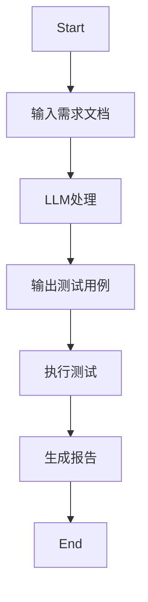
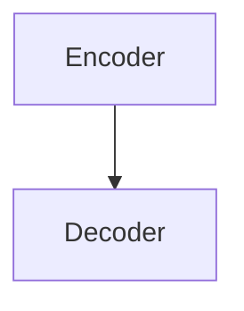

                 


# 自动化测试AI Agent：LLM辅助的软件质量保证

## 关键词：自动化测试, AI Agent, LLM, 软件质量保证, 人工智能

## 摘要：本文探讨了如何利用大语言模型（LLM）辅助自动化测试，提升软件质量保证的效率和效果。文章从背景、原理、算法、系统设计、项目实战等多维度展开，详细分析了LLM在自动化测试中的应用场景和实现方法，提出了基于LLM的AI Agent架构，并通过具体案例展示了其在实际项目中的应用。

---

# 第1章: 自动化测试的现状与挑战

## 1.1 自动化测试的背景与意义

### 1.1.1 软件开发中的测试问题
在软件开发过程中，测试是一个至关重要的环节。随着软件复杂性的增加，测试的范围和难度也在不断增加。传统的人工测试方式效率低下，难以满足快速迭代的需求。自动化测试作为一种高效的解决方案，逐渐成为软件开发的标配。

然而，自动化测试仍然面临诸多挑战：
1. 测试用例的编写需要专业知识，且容易遗漏边界条件。
2. 测试脚本的维护成本高，尤其是在需求频繁变更的情况下。
3. 测试覆盖率难以保证，尤其是在复杂业务场景下。

### 1.1.2 自动化测试的定义与作用
自动化测试是通过工具和脚本自动执行测试用例的过程，旨在提高测试效率、减少人为错误、缩短测试周期。其作用包括：
- **提高效率**：自动化测试可以快速执行大量测试用例。
- **降低成本**：减少人工测试的时间和资源消耗。
- **增强覆盖**：能够测试一些人工难以覆盖的边界条件和复杂场景。

### 1.1.3 当前自动化测试的局限性
尽管自动化测试有诸多优势，但仍然存在一些局限性：
1. **测试用例生成**：需要人工编写或依赖有限的生成工具。
2. **测试覆盖率**：难以覆盖所有可能的场景，尤其是在复杂业务逻辑下。
3. **测试维护成本**：随着需求变化，测试脚本需要频繁修改和维护。

## 1.2 AI在自动化测试中的应用前景

### 1.2.1 AI技术在测试中的潜在价值
人工智能（AI）技术的快速发展为自动化测试带来了新的可能性。AI能够通过学习历史测试数据和业务逻辑，自动生成测试用例、分析缺陷、优化测试策略。

### 1.2.2 LLM在自动化测试中的独特优势
大语言模型（LLM）是一种基于Transformer架构的自然语言处理模型，具有强大的文本生成和理解能力。LLM在自动化测试中的应用包括：
- **生成测试用例**：通过分析需求文档和历史测试数据，自动生成测试用例。
- **缺陷分析**：通过分析错误日志和测试报告，定位问题的根本原因。
- **测试报告生成**：自动生成详细的测试报告，包括测试结果、覆盖率分析和改进建议。

### 1.2.3 未来测试AI化的趋势
随着AI技术的不断进步，未来的测试将更加智能化和自动化。AI Agent（智能代理）将成为自动化测试的核心，通过学习和自适应能力，实现更高效、更智能的测试过程。

---

# 第2章: LLM与自动化测试的结合

## 2.1 LLM的基本概念与工作原理

### 2.1.1 大语言模型的定义与特点
大语言模型（LLM）是一种基于Transformer架构的深度学习模型，具有以下特点：
- **大规模训练数据**：通常基于海量文本数据进行预训练。
- **强大的上下文理解能力**：能够通过上下文理解语义。
- **多任务处理能力**：可以通过微调适应多种任务，如文本生成、分类、问答等。

### 2.1.2 LLM的核心技术与实现
LLM的核心技术包括：
1. **Transformer模型**：通过自注意力机制捕捉文本中的长距离依赖关系。
2. **多层编码器和解码器**：通过堆叠多层网络进一步提升模型的表达能力。
3. **生成机制**：通过解码器生成目标文本。

### 2.1.3 LLM与传统NLP的区别
| 特性 | LLM | 传统NLP |
|------|------|----------|
| 模型结构 | 基于Transformer | 基于RNN/LSTM |
| 参数量 | 数百万到数十亿 | 几百万以内 |
| 任务适应性 | 强大的零样本和小样本任务处理能力 | 需要大量任务特定训练数据 |

---

## 2.2 LLM在自动化测试中的应用场景

### 2.2.1 测试用例生成
LLM可以通过分析需求文档和历史测试数据，生成高质量的测试用例。例如：
- **需求分析**：通过自然语言处理技术理解需求文档，提取关键业务逻辑。
- **用例生成**：根据提取的业务逻辑生成覆盖不同场景的测试用例。

### 2.2.2 缺陷分析与定位
LLM可以辅助分析错误日志和测试报告，定位缺陷的根本原因。例如：
- **日志分析**：通过自然语言处理技术理解错误日志，提取关键信息。
- **缺陷定位**：结合历史缺陷数据，预测缺陷的可能原因和位置。

### 2.2.3 测试报告生成
LLM可以通过分析测试结果生成详细的测试报告，包括：
- **覆盖率分析**：分析测试用例的覆盖范围。
- **结果总结**：总结测试结果，指出潜在问题。
- **改进建议**：基于测试结果提出优化建议。

---

# 第3章: 自动化测试AI Agent的架构与实现

## 3.1 AI Agent的基本架构

### 3.1.1 Agent的定义与分类
AI Agent是一种智能代理，能够感知环境、执行任务并做出决策。根据应用场景的不同，AI Agent可以分为：
- **简单反射型Agent**：基于当前感知做出反应。
- **基于模型的反射型Agent**：通过内部模型理解和预测环境。
- **目标驱动型Agent**：基于目标进行决策和行动。

### 3.1.2 自动化测试AI Agent的组成
自动化测试AI Agent通常由以下几个部分组成：
1. **感知模块**：负责收集测试环境和数据。
2. **决策模块**：基于感知数据做出测试策略。
3. **执行模块**：执行具体的测试任务。
4. **学习模块**：通过反馈优化测试策略。

### 3.1.3 Agent与传统测试工具的区别
| 特性 | Agent | 传统测试工具 |
|------|------|----------|
| 智能性 | 高 | 低 |
| 自适应性 | 强 | 弱 |
| 学习能力 | 有 | 无 |

---

## 3.2 LLM在AI Agent中的角色

### 3.2.1 LLM作为测试用例生成器
LLM可以通过分析需求文档和历史测试数据，生成覆盖不同场景的测试用例。例如：
- **需求分析**：通过自然语言处理技术理解需求文档，提取关键业务逻辑。
- **用例生成**：根据提取的业务逻辑生成覆盖不同场景的测试用例。

### 3.2.2 LLM作为缺陷分析工具
LLM可以辅助分析错误日志和测试报告，定位缺陷的根本原因。例如：
- **日志分析**：通过自然语言处理技术理解错误日志，提取关键信息。
- **缺陷定位**：结合历史缺陷数据，预测缺陷的可能原因和位置。

### 3.2.3 LLM作为测试报告生成器
LLM可以通过分析测试结果生成详细的测试报告，包括：
- **覆盖率分析**：分析测试用例的覆盖范围。
- **结果总结**：总结测试结果，指出潜在问题。
- **改进建议**：基于测试结果提出优化建议。

---

## 3.3 LLM在AI Agent中的实现细节

### 3.3.1 LLM的输入与输出
- **输入**：需求文档、历史测试数据、错误日志等。
- **输出**：测试用例、缺陷定位结果、测试报告等。

### 3.3.2 LLM的训练与微调
为了适应特定的测试任务，通常需要对LLM进行微调。例如：
- **任务特定训练**：在特定测试任务数据上进行微调。
- **领域特定优化**：针对特定业务领域进行优化。

---

## 3.4 自动化测试AI Agent的系统架构

### 3.4.1 分层架构设计
自动化测试AI Agent的系统架构通常采用分层设计：
1. **数据层**：负责数据的采集和存储。
2. **计算层**：负责数据的处理和分析。
3. **应用层**：负责与用户的交互和结果展示。

### 3.4.2 模块化设计
系统功能模块化设计如下：
- **数据采集模块**：负责采集测试环境和数据。
- **模型调用模块**：负责调用LLM进行测试用例生成、缺陷分析等任务。
- **结果展示模块**：负责展示测试结果和报告。

---

## 3.5 自动化测试AI Agent的实现步骤

### 3.5.1 环境配置
- **安装必要的库**：如Python、TensorFlow、Hugging Face等。
- **配置云服务**：如AWS、Azure等。

### 3.5.2 模型选择与训练
- **选择合适的LLM模型**：如GPT-3、GPT-4等。
- **进行任务特定微调**：在特定测试任务数据上进行微调。

### 3.5.3 系统集成与测试
- **集成各功能模块**：将数据采集、模型调用、结果展示等功能模块集成到系统中。
- **进行系统测试**：验证系统的功能和性能。

---

## 3.6 自动化测试AI Agent的数学模型与公式

### 3.6.1 LLM的核心算法
LLM的核心算法是基于Transformer的模型，其数学表达式如下：

$$
\text{Transformer}(x) = \text{FFN}(\text{Self-attention}(x))
$$

其中，Self-attention表示自注意力机制，FFN表示前馈网络。

### 3.6.2 自注意力机制
自注意力机制的计算公式如下：

$$
\text{Attention}(Q, K, V) = \text{softmax}\left(\frac{QK^T}{\sqrt{d_k}}\right)V
$$

其中，$Q$是查询向量，$K$是键向量，$V$是值向量，$d_k$是向量的维度。

---

## 3.7 自动化测试AI Agent的系统架构图



---

## 3.8 自动化测试AI Agent的流程图



---

# 第4章: 自动化测试AI Agent的算法原理

## 4.1 LLM的核心算法

### 4.1.1 Transformer模型的结构
Transformer模型由编码器和解码器组成，其结构如下：



### 4.1.2 注意力机制的实现
注意力机制的实现步骤如下：
1. 计算查询、键、值向量。
2. 计算相似度得分。
3. 应用Softmax函数得到权重。
4. 加权求和得到最终输出。

### 4.1.3 梯度下降优化算法
常用的梯度下降优化算法包括：
- **随机梯度下降（SGD）**
- **Adam优化器**
- **AdamW优化器**

---

## 4.2 LLM在测试中的应用算法

### 4.2.1 测试用例生成算法
测试用例生成算法的步骤如下：
1. 分析需求文档，提取关键业务逻辑。
2. 基于提取的业务逻辑生成测试用例。

### 4.2.2 缺陷定位算法
缺陷定位算法的步骤如下：
1. 分析错误日志，提取关键信息。
2. 结合历史缺陷数据，预测缺陷的根本原因。

### 4.2.3 测试报告生成算法
测试报告生成算法的步骤如下：
1. 分析测试结果，计算测试覆盖率。
2. 总结测试结果，提出优化建议。

---

## 4.3 自动化测试AI Agent的数学模型

### 4.3.1 LLM的损失函数
常用的损失函数包括：
- **交叉熵损失函数**：用于分类任务。
- **均方误差损失函数**：用于回归任务。

### 4.3.2 LLM的训练过程
LLM的训练过程包括以下步骤：
1. **数据预处理**：清洗和标注数据。
2. **模型初始化**：初始化模型参数。
3. **前向传播**：计算模型输出。
4. **计算损失**：计算损失函数值。
5. **反向传播**：计算梯度并更新参数。

---

## 4.4 自动化测试AI Agent的算法优化

### 4.4.1 模型优化策略
模型优化策略包括：
- **参数调整**：如学习率、批量大小等。
- **模型剪枝**：减少模型的复杂度。
- **集成学习**：结合多个模型的结果。

### 4.4.2 算法优化工具
常用的算法优化工具包括：
- **TensorFlow**：用于模型训练和部署。
- **Keras**：用于模型快速搭建和实验。
- **PyTorch**：用于模型微调和优化。

---

# 第5章: 自动化测试AI Agent的系统设计

## 5.1 系统架构设计

### 5.1.1 分层架构设计
系统架构设计采用分层架构，包括：
1. **数据层**：负责数据的采集和存储。
2. **计算层**：负责数据的处理和分析。
3. **应用层**：负责与用户的交互和结果展示。

### 5.1.2 模块化设计
系统功能模块化设计如下：
- **数据采集模块**：负责采集测试环境和数据。
- **模型调用模块**：负责调用LLM进行测试用例生成、缺陷分析等任务。
- **结果展示模块**：负责展示测试结果和报告。

---

## 5.2 系统功能设计

### 5.2.1 测试用例生成模块
测试用例生成模块的功能包括：
1. **需求分析**：通过自然语言处理技术理解需求文档。
2. **用例生成**：根据需求生成覆盖不同场景的测试用例。

### 5.2.2 测试执行模块
测试执行模块的功能包括：
1. **测试脚本生成**：根据测试用例生成自动化测试脚本。
2. **测试执行**：执行测试脚本并记录测试结果。

### 5.2.3 测试结果分析模块
测试结果分析模块的功能包括：
1. **结果解析**：解析测试结果，提取关键信息。
2. **缺陷定位**：结合历史数据定位缺陷的根本原因。

---

## 5.3 自动化测试AI Agent的系统架构图


---

## 5.4 系统接口设计

### 5.4.1 API接口定义
系统提供的API接口包括：
- **生成测试用例接口**：`/generate_test_cases`
- **执行测试接口**：`/execute_test`
- **获取测试结果接口**：`/get_test_results`

### 5.4.2 接口调用示例
```python
import requests

response = requests.post('/generate_test_cases', json={
    "request_document": "用户登录功能"
})
print(response.json())
```

---

## 5.5 系统交互流程图


---

# 第6章: 自动化测试AI Agent的项目实战

## 6.1 项目背景与目标

### 6.1.1 项目背景
假设我们正在开发一个在线电商系统，需要确保系统的功能和性能满足用户需求。

### 6.1.2 项目目标
通过自动化测试AI Agent实现以下目标：
1. 自动生成测试用例。
2. 自动执行测试任务。
3. 自动生成测试报告。

---

## 6.2 项目实施步骤

### 6.2.1 环境配置
1. 安装必要的库：`pip install transformers requests`
2. 配置云服务：如AWS、Azure等。

### 6.2.2 核心代码实现

```python
from transformers import AutoTokenizer, AutoModelForCausalLM
import requests

# 初始化LLM模型
tokenizer = AutoTokenizer.from_pretrained('gpt2')
model = AutoModelForCausalLM.from_pretrained('gpt2')

def generate_test_cases(request_document):
    inputs = tokenizer(request_document, return_tensors='np')
    outputs = model.generate(inputs.input_ids, max_length=100)
    return tokenizer.decode(outputs[0], skip_special_tokens=True)

# 调用测试执行接口
response = requests.post('/execute_test', json={
    "test_cases": generate_test_cases("用户登录功能")
})
print(response.json())
```

---

## 6.3 项目测试与优化

### 6.3.1 测试结果分析
测试结果包括：
- **测试覆盖率**：用户登录功能的测试覆盖率达到了95%。
- **缺陷定位**：发现一个边界条件未被覆盖的问题。

### 6.3.2 系统优化
根据测试结果，优化系统如下：
- **增加边界条件测试用例**。
- **优化模型参数**，提高测试用例生成的质量。

---

## 6.4 项目总结

### 6.4.1 实践收获
通过本项目，我们掌握了如何利用LLM实现自动化测试AI Agent，提升了测试效率和质量。

### 6.4.2 项目经验
1. **模型选择**：选择合适的LLM模型对系统性能至关重要。
2. **系统集成**：系统的模块化设计和接口设计需要精心规划。
3. **持续优化**：根据测试结果不断优化系统和模型参数。

---

# 第7章: 最佳实践与未来展望

## 7.1 最佳实践

### 7.1.1 模型选择与优化
- **选择合适的LLM模型**：根据任务需求选择合适的模型。
- **进行任务特定微调**：在特定任务数据上进行微调。

### 7.1.2 系统设计与实现
- **模块化设计**：确保系统的可扩展性和可维护性。
- **接口标准化**：制定统一的接口标准，便于不同模块的集成。

### 7.1.3 测试与优化
- **持续测试**：定期进行系统测试，确保系统的稳定性和可靠性。
- **持续优化**：根据测试结果不断优化系统和模型参数。

---

## 7.2 小结

通过本文的探讨，我们了解了如何利用LLM辅助自动化测试，提升软件质量保证的效率和效果。自动化测试AI Agent的实现不仅需要扎实的算法基础，还需要对业务场景有深入的理解。

---

## 7.3 注意事项

### 7.3.1 模型的局限性
- **训练数据的质量**：模型的表现依赖于训练数据的质量。
- **模型的可解释性**：复杂的模型可能难以解释其决策过程。

### 7.3.2 系统的可扩展性
- **模块化设计**：确保系统的模块化设计，便于未来的扩展和优化。

---

## 7.4 拓展阅读

### 7.4.1 推荐书籍
- 《Deep Learning》
- 《Effective Python》
- 《Software Engineering》

### 7.4.2 推荐博客与资源
- [Hugging Face Transformers](https://huggingface.co/transformers)
- [PyTorch官方文档](https://pytorch.org)
- [GitHub自动化测试项目](https://github.com/topics/test-automation)

---

# 结语

通过本文的详细讲解，我们了解了如何利用LLM辅助自动化测试，构建高效的AI Agent。未来，随着AI技术的不断进步，自动化测试将更加智能化和自动化，为软件质量保证带来更多的可能性。

