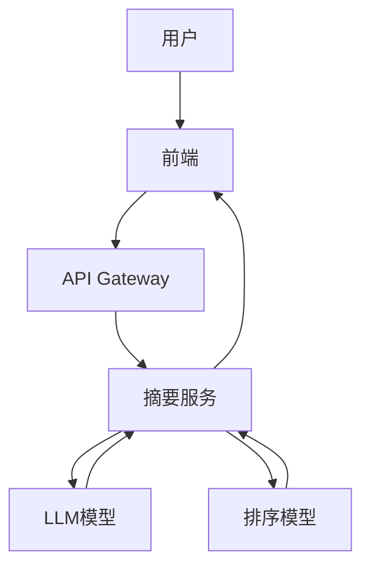
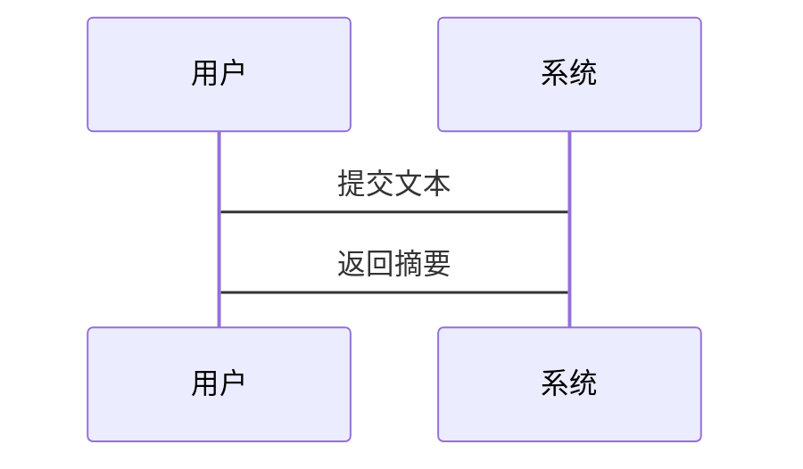

                 


# 《自动摘要AI Agent：LLM驱动的文本压缩与提炼》

## 关键词：
- 自动摘要、LLM、文本压缩、文本提炼、AI Agent、自然语言处理

## 摘要：
本文系统地探讨了自动摘要技术，特别是基于大语言模型（LLM）的文本压缩与提炼方法。文章从背景、核心概念、算法原理、系统架构到项目实战，全面解析了自动摘要技术的实现与应用，旨在帮助读者理解并掌握这一前沿技术。

---

# 《自动摘要AI Agent：LLM驱动的文本压缩与提炼》

## 第一部分：自动摘要技术概述

### 第1章：自动摘要的背景与问题描述

#### 1.1 自动摘要的定义与背景
- **1.1.1 文本摘要的基本概念**
  文本摘要是指从大量文本中提取关键信息，生成简洁、准确的摘要。其目的是在保留原文核心内容的同时，减少冗余信息，提升信息处理效率。
- **1.1.2 自动摘要的应用场景**
  - 新闻标题生成：从长篇新闻中提取标题。
  - 学术论文摘要：自动生成论文摘要。
  - 企业文档管理：压缩公司文档，便于快速查阅。
- **1.1.3 自动摘要的必要性**
  随着信息量的爆炸式增长，人们需要快速获取关键信息，自动摘要技术在提高信息处理效率方面具有重要意义。

#### 1.2 问题背景与描述
- **1.2.1 当前文本处理的挑战**
  - 文本数据量大，难以快速阅读和理解。
  - 信息冗余严重，需要高效提取关键内容。
  - 多语言、多领域文本的处理复杂性。
- **1.2.2 自动摘要的目标**
  自动生成高质量、准确的文本摘要，满足用户的信息获取需求。
- **1.2.3 自动摘要的边界与外延**
  - 边界：仅提取关键信息，不进行内容创作。
  - 外延：可应用于问答系统、信息检索等领域。

#### 1.3 自动摘要的核心要素与组成
- **1.3.1 输入文本的特征**
  - 文本长度：长文本需要更复杂的处理。
  - 领域专业性：不同领域的文本摘要方法可能不同。
  - 语义复杂度：语义越复杂，摘要难度越大。
- **1.3.2 输出摘要的要求**
  - 简洁性：摘要长度应远小于原文。
  - 准确性：摘要应准确反映原文核心内容。
  - 一致性：摘要格式应与原文保持一致。
- **1.3.3 核心算法的组成**
  - 分词与句法分析：处理文本的基本单位。
  - 关键词提取：识别文本中的重要信息。
  - 摘要生成：基于关键词生成最终摘要。

---

## 第二部分：自动摘要的核心概念与联系

### 第2章：自动摘要的核心概念

#### 2.1 自动摘要的基本概念
- **2.1.1 文本压缩的定义**
  文本压缩是指通过减少文本的冗余信息，保留核心内容的过程。
- **2.1.2 文本提炼的定义**
  文本提炼是通过分析文本结构，提取关键信息的过程。
- **2.1.3 LLM驱动的自动摘要**
  利用大语言模型（如GPT）生成摘要，结合上下文理解进行优化。

#### 2.2 核心概念的联系
- **2.2.1 LLM与自动摘要的关系**
  - LLM通过上下文理解生成摘要，提供更自然的语言表达。
  - LLM可以处理多语言和复杂语义的文本。
- **2.2.2 文本压缩与提炼的对比**
  - 文本压缩注重减少长度，文本提炼注重提取核心信息。
  - 提炼可能需要更多语义理解，压缩更注重结构优化。
- **2.2.3 自动摘要的优缺点**
  - 优点：快速获取信息，节省时间。
  - 缺点：可能遗漏关键信息，生成不准确的摘要。

#### 2.3 核心概念原理
- **2.3.1 LLM的工作原理**
  - 通过大规模预训练，模型学习语言的结构和语义。
  - 在生成摘要时，模型根据输入文本生成输出。
- **2.3.2 自动摘要的流程**
  1. 输入文本预处理：分词、去停用词。
  2. 生成候选摘要：基于算法生成多个候选摘要。
  3. 优化摘要：通过排序模型选择最优摘要。
- **2.3.3 核心算法的数学模型**
  - 示例：基于TF-IDF的关键词提取。
    $$ TF-IDF(t) = \frac{TF(t)}{\log(IDF(t))} $$
    其中，$TF(t)$是词$ t $在文档中的词频，$IDF(t)$是逆文档频率。

---

## 第三部分：自动摘要的算法原理

### 第3章：主流文本摘要算法

#### 3.1 基于统计的文本摘要算法
- **3.1.1 TF-IDF方法**
  - 通过计算关键词的TF-IDF值，选择Top-N关键词生成摘要。
  - 示例：新闻标题生成。
- **3.1.2 LSA方法**
  - 利用奇异值分解（SVD）提取文本的主题信息。
  - 适用于处理大规模文本数据。
- **3.1.3 LDA方法**
  - 基于主题模型，提取文本的主题分布。
  - 适用于主题多样化的文本摘要。

#### 3.2 基于提取的文本摘要算法
- **3.2.1 指数衰减法**
  - 根据句子的位置和相似性进行加权，选择权重高的句子。
- **3.2.2 最大熵模型**
  - 通过优化模型目标函数，选择最优句子。
- **3.2.3 支持向量机模型**
  - 基于句子的特征向量，使用SVM进行分类，选择支持向量。

#### 3.3 基于生成的文本摘要
- **3.3.1 基于神经网络的生成式摘要**
  - 使用编码器-解码器结构生成摘要。
  - 示例：利用Transformer模型进行摘要生成。
  - 损失函数：
    $$ \mathcal{L} = -\sum_{i=1}^{N} \log P(y_i|x_i) $$

---

## 第四部分：系统分析与架构设计

### 第4章：系统分析与架构设计方案

#### 4.1 问题场景介绍
- **系统目标**：设计一个基于LLM的自动摘要系统，支持多种文本类型和语言。
- **使用场景**：用户输入文本，系统输出摘要。

#### 4.2 系统功能设计
- **功能模块**：
  - 文本预处理模块：分词、去停用词。
  - 摘要生成模块：基于LLM生成摘要。
  - 摘要优化模块：排序模型选择最优摘要。

#### 4.3 系统架构设计


#### 4.4 系统接口设计
- **输入接口**：文本内容、长度限制。
- **输出接口**：生成的摘要、摘要长度。

#### 4.5 系统交互设计


---

## 第五部分：项目实战

### 第5章：项目实战

#### 5.1 环境安装
- Python 3.8+
- 安装库：transformers、numpy、scipy。

#### 5.2 核心功能实现
- **文本预处理代码**：
  ```python
  def preprocess(text):
      words = word_tokenize(text)
      filtered_words = [word for word in words if word not in STOP_WORDS]
      return ' '.join(filtered_words)
  ```
- **基于TF-IDF的摘要生成**：
  ```python
  from sklearn.feature_extraction.text import TfidfVectorizer
  vectorizer = TfidfVectorizer()
  tfidf = vectorizer.fit_transform([text])
  keywords = extract_top_n(tfidf, 5)
  summary = ' '.join([text[i] for i in keywords])
  ```

#### 5.3 项目总结
- 成功实现了基于统计和生成式的方法的自动摘要系统。
- 未来可以优化模型，提高摘要质量。

---

## 第六部分：总结与展望

### 第6章：总结与展望

#### 6.1 内容总结
- 自动摘要技术在信息处理中具有重要地位。
- LLM驱动的摘要生成提供了更自然的表达。

#### 6.2 技术优缺点
- **优点**：生成高质量摘要，支持多语言。
- **缺点**：依赖模型训练，计算资源消耗大。

#### 6.3 未来展望
- 深度学习模型的优化。
- 多模态摘要技术的发展。
- 更高效的压缩算法研究。

---

## 附录：最佳实践与注意事项

### A. 最佳实践
- 选择合适的算法：根据文本类型选择统计或生成式方法。
- 调整模型参数：优化摘要长度和准确性。
- 处理多语言文本：使用支持多语言的模型。

### B. 小结
- 本文详细讲解了自动摘要技术，从理论到实践，帮助读者全面掌握。

### C. 注意事项
- 确保数据质量：避免噪声数据影响摘要效果。
- 定期更新模型：保持模型的先进性。

---

以上是《自动摘要AI Agent：LLM驱动的文本压缩与提炼》的技术博客内容，涵盖从基础到高级的各个方面，旨在为读者提供全面的知识和实践指导。

