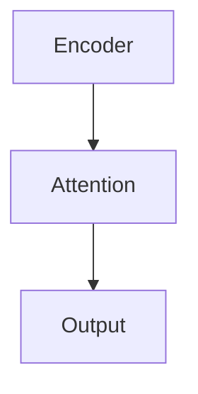
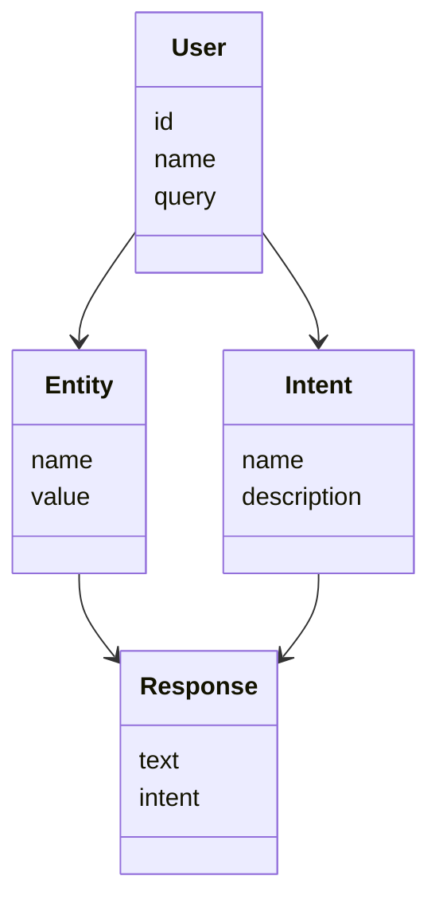

                 


# 自然语言处理AI Agent：深化LLM的语言理解

---

## 关键词
自然语言处理，AI Agent，大语言模型，LLM，语言理解，上下文理解

---

## 摘要
随着大语言模型（LLM）的快速发展，自然语言处理（NLP）在AI Agent中的应用变得越来越重要。本文将从背景、核心概念、算法原理、系统架构到项目实战，全面解析如何深化LLM的语言理解能力，帮助读者掌握从理论到实践的全链路知识。

---

# 第一部分: 自然语言处理与AI Agent概述

## 第1章: 自然语言处理与AI Agent的基本概念

### 1.1 自然语言处理的背景与现状

#### 1.1.1 自然语言处理的基本概念
自然语言处理（NLP）是人工智能领域的重要分支，旨在让计算机能够理解、生成和处理人类语言。NLP的核心任务包括文本分类、信息提取、机器翻译、问答系统等。

#### 1.1.2 自然语言处理的发展历程
- **早期阶段**：基于规则的NLP（20世纪50年代-90年代），依赖人工制定语法规则。
- **统计学习阶段**：基于概率的NLP（20世纪90年代末-21世纪10年代初），利用统计模型处理语言。
- **深度学习阶段**：基于深度学习的NLP（21世纪10年代末至今），以Transformer模型为代表。

#### 1.1.3 当前自然语言处理的技术现状
- **模型规模**：从BERT、GPT到GPT-4，模型参数量不断增加。
- **应用场景**：从学术研究到工业应用，NLP技术广泛应用于搜索引擎、智能客服、内容生成等领域。

### 1.2 AI Agent的基本概念与特点

#### 1.2.1 AI Agent的定义与分类
- **定义**：AI Agent是一种智能体，能够感知环境并采取行动以实现目标。
- **分类**：基于智能水平，分为反应式AI Agent和认知式AI Agent。

#### 1.2.2 AI Agent的核心功能与优势
- **核心功能**：感知、推理、决策、执行。
- **优势**：能够通过自然语言与用户交互，提供个性化服务。

#### 1.2.3 自然语言处理在AI Agent中的作用
- **输入处理**：将用户输入的自然语言转化为结构化数据。
- **输出生成**：根据推理结果生成自然语言回复。

### 1.3 自然语言处理与AI Agent的结合

#### 1.3.1 自然语言理解在AI Agent中的应用
- **语义理解**：通过NLP技术理解用户的意图。
- **上下文理解**：基于上下文进行推理，提供更精准的服务。

#### 1.3.2 自然语言生成在AI Agent中的应用
- **对话生成**：生成自然流畅的对话回复。
- **文本摘要**：将长文本摘要为关键信息。

#### 1.3.3 自然语言处理对AI Agent性能的提升
- **提升用户体验**：通过更精准的理解和生成，提升用户满意度。
- **降低开发成本**：通过自动化处理减少人工干预。

### 1.4 本章小结
本章介绍了自然语言处理和AI Agent的基本概念，分析了NLP在AI Agent中的作用，为后续内容奠定了基础。

---

# 第二部分: 大语言模型（LLM）的核心原理

## 第2章: 大语言模型的结构与训练

### 2.1 大语言模型的模型结构

#### 2.1.1 Transformer模型的基本结构
- **编码器**：将输入序列编码为高维向量。
- **解码器**：根据编码结果生成输出序列。
- **注意力机制**：计算输入序列中每个词的重要性。



#### 2.1.2 注意力机制的工作原理
- **计算查询（Q）、键（K）、值（V）**：
  $$ Q = W_q x $$
  $$ K = W_k x $$
  $$ V = W_v x $$
- **计算注意力权重**：
  $$ attention(Q,K,V) = softmax\left(\frac{QK^T}{\sqrt{d}}\right)V $$

#### 2.1.3 模型的并行计算与优化
- **并行计算**：通过并行计算加速模型训练。
- **模型优化**：使用Dropout、权重衰减等技术防止过拟合。

### 2.2 大语言模型的训练方法

#### 2.2.1 预训练的概念与流程
- **预训练目标**：通过大量未标注数据训练模型。
- **预训练流程**：
  1. 分词和编码输入。
  2. 计算词之间的关系。
  3. 更新模型参数。

#### 2.2.2 微调（Fine-tuning）的原理与应用
- **微调目标**：针对特定任务调整模型参数。
- **微调流程**：
  1. 使用预训练模型初始化参数。
  2. 使用特定任务数据训练模型。
  3. 调整学习率和优化器。

#### 2.2.3 基于生成对抗网络的训练方法
- **生成器**：生成符合任务需求的文本。
- **判别器**：判别生成文本的质量。
- **交替训练**：生成器和判别器交替优化。

### 2.3 大语言模型的评估与优化

#### 2.3.1 常见的模型评估指标
| 指标名称 | 定义 | 示例 |
|----------|------|------|
| BLEU     | 用于机器翻译评估，计算生成文本与参考文本的相似度。 | BLEU score = 0.85 |
| ROUGE    | 用于文本摘要评估，计算生成文本与参考文本的重叠程度。 | ROUGE score = 0.78 |

#### 2.3.2 模型的调参与优化策略
- **学习率调整**：使用学习率衰减策略。
- **批量大小调整**：根据硬件资源调整批量大小。
- **模型剪枝**：去除冗余参数，减少计算量。

#### 2.3.3 模型的可解释性与鲁棒性
- **可解释性**：通过注意力权重分析模型决策过程。
- **鲁棒性**：通过对抗训练增强模型对噪声的抵抗能力。

### 2.4 本章小结
本章详细介绍了大语言模型的结构和训练方法，分析了模型的评估与优化策略，为后续内容奠定了理论基础。

---

# 第三部分: 自然语言处理中的关键算法

## 第3章: 词嵌入与上下文理解

### 3.1 词嵌入的基本原理

#### 3.1.1 词向量的概念与作用
- **词向量**：将词语映射为高维向量，捕捉词语的语义信息。
- **作用**：降低词汇空间的维度，提升模型的计算效率。

#### 3.1.2 Word2Vec模型的训练方法
- **CBOW模型**：基于上下文预测中心词。
- **Skip-Gram模型**：基于中心词预测上下文。

#### 3.1.3 GloVe与FastText的对比分析
| 模型名称 | 特点 | 适用场景 |
|----------|------|----------|
| GloVe    | 基于全局词频统计，适合处理大规模数据。 | 文本分类、信息提取。 |
| FastText | 基于子词信息，适合处理多语种数据。 | 跨语言文本处理。 |

### 3.2 上下文理解的算法实现

#### 3.2.1 基于注意力机制的上下文理解
- **注意力机制**：计算输入序列中每个位置的重要性。
- **实现步骤**：
  1. 计算查询、键、值向量。
  2. 计算注意力权重。
  3. 加权求和得到上下文向量。

#### 3.2.2 基于句法分析的上下文理解
- **句法分析**：通过解析句子结构，理解词语之间的关系。
- **实现步骤**：
  1. 词性标注。
  2. 语法树构建。
  3. 上下文推理。

#### 3.2.3 基于语义网络的上下文理解
- **语义网络**：通过构建词语之间的语义关系图，理解上下文。
- **实现步骤**：
  1. 词语关系提取。
  2. 语义网络构建。
  3. 上下文推理。

### 3.3 上下文理解的优化策略

#### 3.3.1 结合外部知识库的上下文理解
- **知识库**：如WordNet、Wikidata等，提供丰富的语义信息。
- **实现方法**：通过查询知识库丰富上下文理解。

#### 3.3.2 多模态信息融合的上下文理解
- **多模态数据**：结合图像、语音等信息，提升上下文理解的准确性。

#### 3.3.3 动态上下文理解
- **动态调整**：根据对话历史动态调整上下文理解。

### 3.4 本章小结
本章深入探讨了词嵌入与上下文理解的关键算法，分析了不同方法的优缺点，为后续内容提供了理论支持。

---

# 第四部分: 项目实战与系统架构

## 第4章: 智能客服系统的设计与实现

### 4.1 项目背景与目标
- **背景**：智能客服系统通过NLP技术，提供24小时在线客服服务。
- **目标**：实现自然语言理解与生成，提升用户体验。

### 4.2 系统功能设计

#### 4.2.1 领域模型设计


#### 4.2.2 系统架构设计
```mermaid
graph TD
    User --> NLP Engine
    NLP Engine --> Database
    Database --> Response
    Response --> User
```

### 4.3 系统实现

#### 4.3.1 环境配置
```bash
pip install transformers
pip install torch
pip install numpy
```

#### 4.3.2 核心代码实现
```python
from transformers import AutoTokenizer, AutoModelForMaskedLM
import torch

model_name = "bert-base-uncased"
tokenizer = AutoTokenizer.from_pretrained(model_name)
model = AutoModelForMaskedLM.from_pretrained(model_name)

def generate_response(query):
    inputs = tokenizer(query, return_tensors="pt")
    outputs = model(**inputs)
    response = outputs.last_layer_logits.argmax(dim=-1)
    return tokenizer.decode(response[0])
```

#### 4.3.3 测试与优化
- **测试**：通过输入不同问题，测试系统响应。
- **优化**：根据测试结果，优化模型参数和推理策略。

### 4.4 项目小结
本章通过智能客服系统的实战，详细讲解了NLP技术在AI Agent中的应用，帮助读者掌握从理论到实践的全链路知识。

---

# 第五部分: 总结与展望

## 第5章: 总结与展望

### 5.1 核心总结
- **核心观点**：自然语言处理是AI Agent的核心技术，大语言模型的深度理解能力是提升AI Agent性能的关键。
- **主要收获**：通过本篇文章，读者能够系统掌握自然语言处理的核心算法和AI Agent的系统架构。

### 5.2 未来展望
- **技术发展**：随着模型规模的扩大和算法的优化，LLM的语言理解能力将更加接近人类水平。
- **应用场景**：从垂直领域到通用领域，AI Agent的应用场景将更加广泛。

### 5.3 最佳实践 tips
- **数据质量**：高质量的数据是模型性能的基础。
- **模型选择**：根据任务需求选择合适的模型。
- **系统优化**：通过并行计算和模型剪枝优化系统性能。

### 5.4 本章小结
本章总结了全文的主要内容，展望了未来的技术发展，并给出了实用的建议。

---

# 参考文献
1. Vaswani, A., et al. "Attention Is All You Need." Advances in Neural Information Processing Systems, 2017.
2. Devlin, J., et al. "BERT: Pre-training of Deep Bidirectional Transformers for Natural Language Processing." arXiv preprint arXiv:1810.0469, 2018.
3. Brown, T., et al. "Language Models are Few-Shot Learners." arXiv preprint arXiv:2005.14169, 2020.

---

通过本篇文章，读者可以系统地了解自然语言处理AI Agent的核心原理和实现方法，掌握从理论到实践的全链路知识，为未来的深入研究和应用开发奠定坚实基础。

