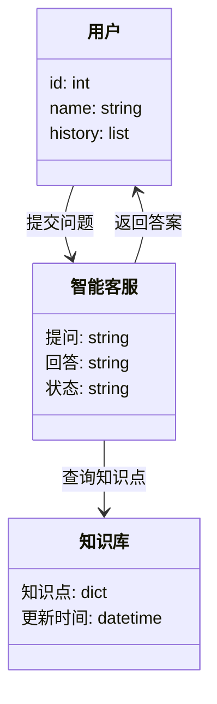
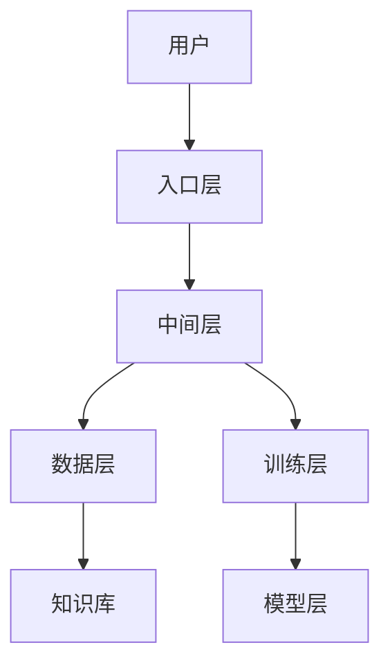
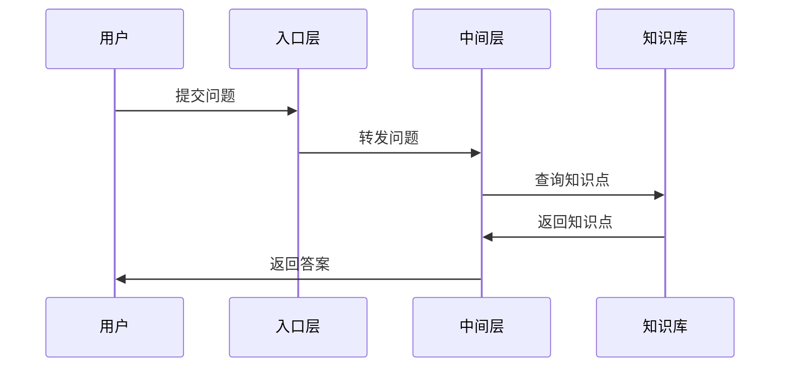

                 


# 自然语言处理在金融中的应用

> 关键词：自然语言处理，金融，文本分析，风险评估，智能客服，金融预测

> 摘要：本文系统地探讨了自然语言处理（NLP）在金融领域的应用，从基础概念到核心算法，再到系统架构和实际项目，全面分析了NLP如何助力金融行业实现智能化。文章结合具体案例，深入讲解了NLP在金融文本分析、风险评估、智能客服等场景中的应用，同时提供了详细的算法原理和系统设计方法，为读者提供了一套完整的NLP在金融领域的解决方案。

---

## 第1章 自然语言处理与金融的结合

### 1.1 自然语言处理的背景介绍

#### 1.1.1 自然语言处理的核心概念
自然语言处理（NLP）是人工智能领域的重要分支，旨在让计算机能够理解、分析和生成人类语言。其核心任务包括文本分类、信息提取、情感分析和文本生成等。

#### 1.1.2 金融领域的核心概念
金融领域涉及大量文本数据，如财务报告、新闻、社交媒体评论等。这些文本数据蕴含着丰富的市场信息，但需要通过NLP技术进行处理，才能转化为可操作的决策依据。

#### 1.1.3 两者的结合与应用价值
NLP与金融的结合可以帮助金融机构提高信息处理效率、降低风险、提升客户体验等。例如，通过分析新闻和社交媒体数据，可以预测市场情绪和股票价格波动。

---

### 1.2 自然语言处理在金融中的问题背景

#### 1.2.1 传统金融信息处理的局限性
传统金融信息处理主要依赖人工分析，效率低、成本高且容易出错。例如，分析师需要手动阅读大量财务报告和新闻，提取关键信息。

#### 1.2.2 自然语言处理在金融中的应用需求
随着金融市场数据的爆炸式增长，金融机构迫切需要自动化、智能化的工具来处理和分析文本数据。NLP技术可以有效解决这一问题。

#### 1.2.3 问题解决的边界与外延
NLP在金融中的应用边界包括文本数据的处理和分析，而其外延则涉及数据来源、模型训练和结果解释等。

---

### 1.3 自然语言处理与金融的核心概念联系

#### 1.3.1 核心概念原理
NLP通过文本预处理、特征提取和模型训练等步骤，将文本数据转化为可计算的向量表示。金融领域的文本数据具有专业性和领域特性，需要结合领域知识进行处理。

#### 1.3.2 核心概念属性特征对比表格
以下表格展示了NLP和金融领域核心概念的属性对比：

| 属性 | NLP | 金融 |
|------|-----|------|
| 数据类型 | 文本 | 文本、数值 |
| 核心任务 | 理解语言 | 分析市场信息 |
| 应用场景 | 智能客服 | 风险评估 |

#### 1.3.3 ER实体关系图架构
以下是NLP在金融领域的实体关系图：

```mermaid
er
actor: 用户
sequence {
    actor -> 客服系统: 提问
    客服系统 -> NLP引擎: 分析问题
    NLP引擎 -> 知识库: 查询信息
    NLP引擎 -> actor: 返回答案
}
```

---

## 第2章 自然语言处理的核心技术

### 2.1 自然语言处理的关键技术

#### 2.1.1 分词技术
分词是NLP的基础任务，将连续的文本分割成有意义的词汇。例如，将“自然语言处理”分割成“自然”、“语言”、“处理”。

#### 2.1.2 实体识别
实体识别（NER）用于从文本中提取命名实体，如人名、地名、组织名等。在金融领域，可以用于提取公司名称和财务指标。

#### 2.1.3 情感分析
情感分析用于判断文本的情感倾向，如正面、负面或中性。在金融领域，可以用于分析社交媒体上的市场情绪。

#### 2.1.4 文本生成
文本生成用于生成自然语言文本，如智能客服的回复。基于Transformer的模型（如GPT）在文本生成任务中表现优异。

---

### 2.2 自然语言处理在金融中的应用技术

#### 2.2.1 金融文本分析
金融文本分析涉及对财务报告、新闻和社交媒体的分析，以提取市场信息和风险信号。

#### 2.2.2 金融信息抽取
信息抽取从文本中提取特定信息，如公司名称、财务指标和市场情绪。这有助于金融机构进行快速决策。

#### 2.2.3 金融风险评估
通过分析社交媒体和新闻数据，NLP可以帮助评估市场风险，预测股票价格波动。

---

### 2.3 自然语言处理与金融的结合技术

#### 2.3.1 基于NLP的金融知识图谱构建
知识图谱将金融领域的实体和关系以图结构表示，便于后续分析和推理。

#### 2.3.2 基于NLP的金融对话系统
智能客服系统通过NLP技术理解用户问题，并生成准确的回复。

#### 2.3.3 基于NLP的金融预测模型
NLP结合机器学习模型，可以预测股票价格和市场趋势。

---

## 第3章 自然语言处理在金融中的算法原理

### 3.1 常见的自然语言处理算法

#### 3.1.1 词袋模型
词袋模型将文本表示为词汇的集合，不考虑顺序。例如，“hello world”可以表示为{hello:1, world:1}。

#### 3.1.2 词嵌入模型
词嵌入模型（如Word2Vec）将词表示为低维向量，捕捉词语之间的语义关系。

#### 3.1.3 基于深度学习的NLP模型
深度学习模型（如BERT、GPT）在NLP任务中表现出色，具有强大的上下文理解能力。

---

### 3.2 金融领域常用的NLP算法

#### 3.2.1 文本分类算法
文本分类用于将文本归类到特定类别，如情感分类和主题分类。

#### 3.2.2 序列标注算法
序列标注用于识别文本中的命名实体，如公司名称和财务指标。

#### 3.2.3 机器翻译算法
机器翻译用于跨语言的金融文本分析，如将英文新闻翻译成中文。

---

### 3.3 自然语言处理算法在金融中的应用

#### 3.3.1 基于BERT的文本表示
BERT通过预训练生成上下文相关的向量表示，可以用于金融文本的深度分析。

#### 3.3.2 基于GPT的文本生成
GPT模型可以生成自然语言文本，如智能客服的回复。

#### 3.3.3 基于LSTM的时间序列分析
LSTM用于处理时间序列数据，可以预测股票价格和市场趋势。

---

## 第4章 自然语言处理在金融中的系统架构设计

### 4.1 金融领域的应用场景

#### 4.1.1 智能客服系统
智能客服通过NLP技术理解用户问题，并生成准确的回复。

#### 4.1.2 金融新闻分析
金融新闻分析用于提取市场信息和风险信号。

#### 4.1.3 风险评估系统
风险评估系统通过分析社交媒体和新闻数据，评估市场风险。

---

### 4.2 系统功能设计

#### 4.2.1 领域模型设计
以下是领域模型设计的类图：



#### 4.2.2 系统架构设计
以下是系统架构设计的架构图：



#### 4.2.3 系统接口设计
系统接口设计包括用户接口、API接口和数据库接口。

---

### 4.3 系统交互设计

#### 4.3.1 序列图设计
以下是系统交互的序列图：



---

## 第5章 自然语言处理在金融中的项目实战

### 5.1 环境安装
需要安装Python、TensorFlow、Keras、NLTK等工具。

### 5.2 核心代码实现

#### 5.2.1 文本分类代码
```python
import tensorflow as tf
from tensorflow import keras
from tensorflow.keras import layers

model = keras.Sequential([
    layers.Embedding(1000, 16),
    layers.SimpleRNN(32),
    layers.Dense(1, activation='sigmoid')
])
```

#### 5.2.2 情感分析代码
```python
import numpy as np
from sklearn.feature_extraction.text import TfidfVectorizer
from sklearn.linear_model import LogisticRegression

vectorizer = TfidfVectorizer()
model = LogisticRegression()
```

---

### 5.3 案例分析

#### 5.3.1 金融新闻分析案例
通过分析新闻标题，预测市场情绪。

#### 5.3.2 风险评估案例
通过分析社交媒体评论，评估公司风险。

---

### 5.4 项目总结
总结项目实现过程中的关键点和经验教训，为后续优化提供参考。

---

## 第6章 最佳实践和小结

### 6.1 最佳实践
- 数据预处理是关键，需要清洗和标注。
- 模型调参是提高性能的重要手段。
- 系统设计需要考虑可扩展性和可维护性。

### 6.2 小结
本文全面探讨了自然语言处理在金融中的应用，从理论到实践，为读者提供了一套完整的解决方案。

### 6.3 注意事项
- 数据隐私和安全问题需要高度重视。
- 模型的解释性和可信赖性需要进一步提升。

### 6.4 拓展阅读
建议读者深入研究NLP的前沿技术，如大语言模型（LLM）在金融中的应用。

---

以上是《自然语言处理在金融中的应用》的完整目录和内容概览。

