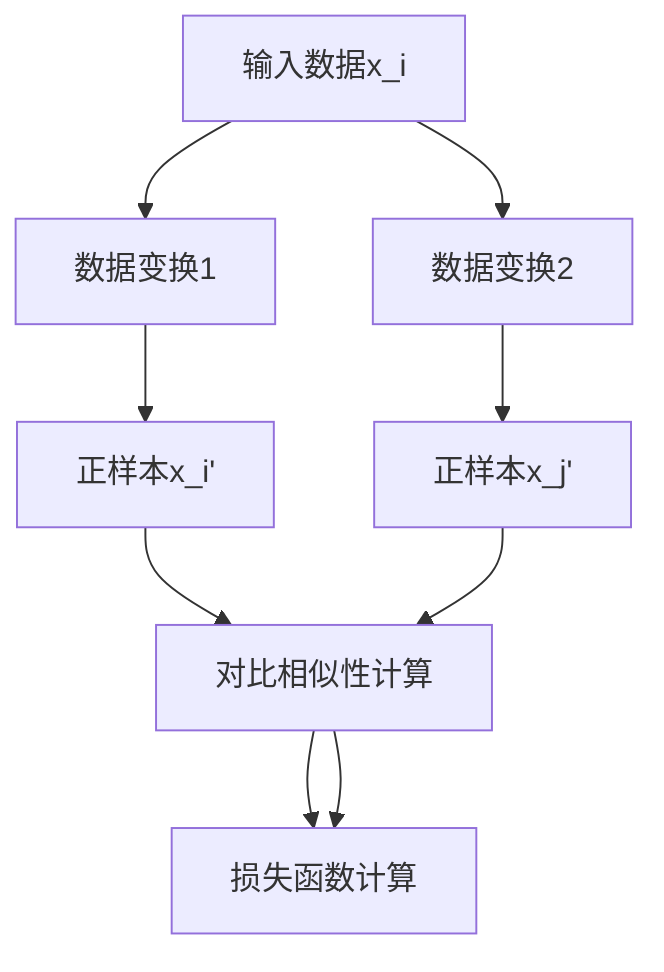
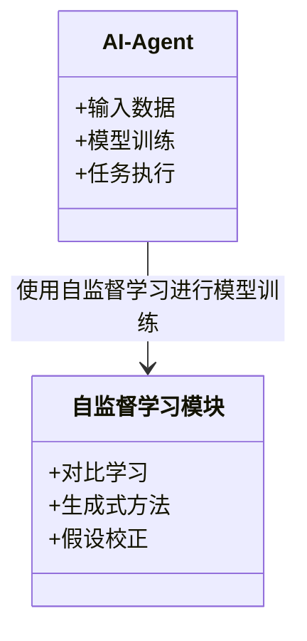
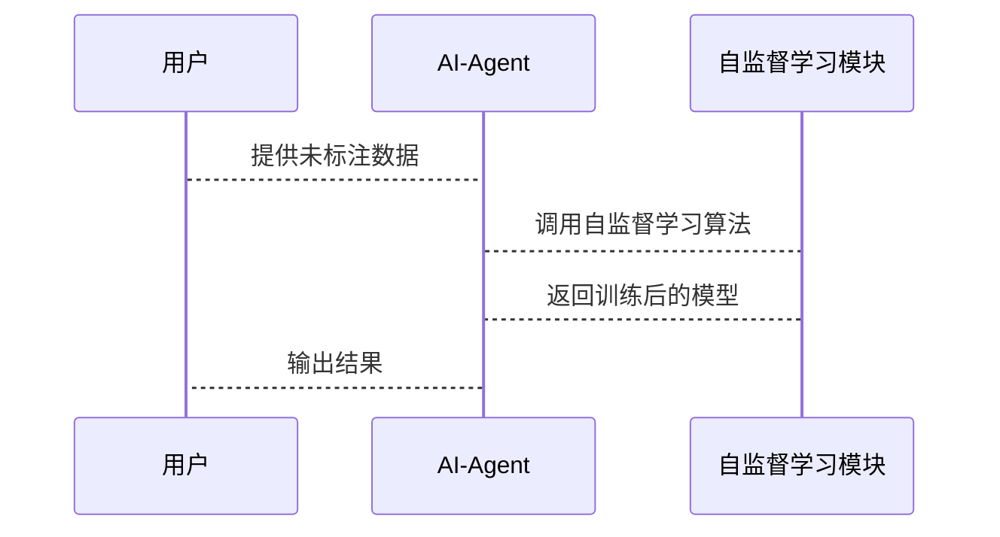

                 


# 自监督学习：减少AI Agent对标注数据的依赖

> 关键词：自监督学习，AI Agent，无监督学习，对比学习，生成式方法，数据标注，深度学习

> 摘要：随着人工智能技术的快速发展，数据标注的高成本和低效率问题日益凸显。自监督学习作为一种新兴的机器学习范式，通过利用未标注数据进行自我监督，显著减少了对标注数据的依赖。本文深入探讨自监督学习的核心原理、算法实现、系统架构设计以及在AI Agent中的实际应用。通过对比学习、生成式方法和伪标签策略等技术，本文展示了如何构建高效、可扩展的AI Agent系统，同时提供了详细的数学推导和代码示例，帮助读者全面理解自监督学习的优势与挑战。

---

## 第一部分: 自监督学习基础

### 第1章: 自监督学习概述

#### 1.1 问题背景与定义

##### 1.1.1 数据标注的挑战
在AI Agent的开发过程中，数据标注是一个耗时且成本高昂的过程。高质量的标注数据需要专业人员进行人工分类、打标签或标注，这不仅限制了模型的训练规模，还可能导致模型的泛化能力不足。此外，某些领域（如医学图像或视频分析）的数据标注难度更大，进一步加剧了数据获取的挑战。

##### 1.1.2 自监督学习的定义
自监督学习是一种机器学习范式，通过利用未标注数据中的内在结构信息，构建监督信号来训练模型。与监督学习不同，自监督学习不需要外部标注数据，而是通过数据本身的特征或上下文关系生成伪标签。

##### 1.1.3 自监督学习的核心目标
自监督学习的核心目标是通过最大化利用未标注数据，降低对标注数据的依赖，同时提升模型的泛化能力和适应性。

#### 1.2 自监督学习与监督学习的对比

##### 1.2.1 数据标注的依赖性对比
| 对比维度 | 监督学习 | 自监督学习 |
|----------|----------|------------|
| 数据标注 | 高度依赖 | 低依赖     |
| 数据成本 | 高       | 低         |
| 数据需求 | 需要大量标注数据 | 需要未标注数据 |

#### 1.3 自监督学习在AI Agent中的应用

##### 1.3.1 AI Agent的基本概念
AI Agent是一种智能体，能够在特定环境中感知、决策和执行任务。AI Agent的成功依赖于高质量的数据和高效的算法。

##### 1.3.2 自监督学习如何赋能AI Agent
自监督学习通过减少对标注数据的依赖，降低了AI Agent的开发成本，同时提高了其在数据稀缺环境中的适应能力。

##### 1.3.3 自监督学习的优势与局限性
优势：降低数据成本、提高模型鲁棒性、增强数据利用率。局限性：需要设计有效的对比任务、可能存在伪标签偏差。

---

## 第二部分: 自监督学习的核心概念与原理

### 第2章: 自监督学习的核心概念

#### 2.1 对比学习

##### 2.1.1 对比学习的基本原理
对比学习通过将同一数据的两个不同变换作为正样本对，最大化其相似性，同时最小化与其他样本的相似性。

##### 2.1.2 对比学习的损失函数公式
$$ \mathcal{L} = -\log\left( \frac{e^{s(x_i, x_j)}}{e^{s(x_i, x_k)} + e^{s(x_j, x_k)}} \right) $$
其中，$s(x_i, x_j)$是对比相似性分数。

##### 2.1.3 对比学习的优缺点
优点：通过对比任务设计，可以有效利用未标注数据；缺点：对比任务设计需要领域知识。

#### 2.2 生成式方法

##### 2.2.1 生成式方法的基本原理
生成式方法通过生成与输入数据类似的样本，作为监督信号。例如，生成对抗网络（GAN）可以生成新的数据点，用于模型训练。

##### 2.2.2 GAN在自监督学习中的应用
通过生成器和判别器的对抗训练，生成逼真的未标注数据，增强模型的泛化能力。

##### 2.2.3 生成式方法的挑战
训练不稳定、生成质量受限。

#### 2.3 假设校正（Contrastive Learning）

##### 2.3.1 假设校正的基本概念
假设校正在对比学习的基础上，通过引入噪声增强数据的鲁棒性。

##### 2.3.2 假设校正的数学模型
$$ \mathcal{L}_{\text{con}} = \mathbb{E}_{x,y}[\log p(y|x)] $$
其中，$p(y|x)$是模型对输入$x$的预测概率。

---

### 第3章: 自监督学习的核心原理

#### 3.1 对比学习的数学模型

##### 3.1.1 对比损失函数的推导
通过最大化正样本对的相似性和最小化负样本对的相似性，推导对比损失函数。

##### 3.1.2 对比学习的优化目标
最大化正样本对的相似性，同时最小化整体的对比损失。

##### 3.1.3 对比学习的数学公式（使用 Mermaid 流程图）



#### 3.2 生成式方法的数学模型

##### 3.2.1 GAN的损失函数
$$ \mathcal{L}_{\text{GAN}} = \mathbb{E}_{x \sim p_{\text{data}}}[ \log D(x)] + \mathbb{E}_{z \sim p_z}[ \log (1 - D(G(z)))] $$
其中，$D$是判别器，$G$是生成器。

---

## 第三部分: 系统分析与架构设计

### 第4章: 系统分析与架构设计方案

#### 4.1 问题场景介绍
AI Agent需要在无标注数据的环境中进行自我学习和优化。

#### 4.2 项目介绍
构建一个基于自监督学习的AI Agent系统，用于图像分类任务。

#### 4.3 系统功能设计（领域模型Mermaid类图）



#### 4.4 系统架构设计Mermaid架构图


#### 4.5 系统接口设计
定义API接口，用于数据输入、模型训练和结果输出。

#### 4.6 系统交互Mermaid序列图



---

## 第四部分: 项目实战

### 第5章: 项目实战

#### 5.1 环境安装
安装Python、深度学习框架（如TensorFlow或PyTorch）和自监督学习库。

#### 5.2 系统核心实现源代码

##### 5.2.1 对比学习实现代码

```python
import tensorflow as tf

def contrastive_loss(y_true, y_pred):
    temperature = 0.1
    y_pred = tf.clip_by_value(y_pred, 0.01, 0.99)
    labels = tf.cast(y_true, dtype=tf.float32)
    positive = tf.where(tf.equal(labels, 1.0))[:, 0]
    negative = tf.where(tf.equal(labels, 0.0))[:, 0]
    loss = tf.nn.softmax_cross_entropy_with_logits(labels=labels, logits=tf.math.log(y_pred / (1 - y_pred)))
    return tf.reduce_mean(loss)
```

##### 5.2.2 生成式方法实现代码

```python
import tensorflow as tf

def generator_model():
    model = tf.keras.Sequential([
        tf.keras.layers.Dense(128, activation='relu'),
        tf.keras.layers.Dense(2, activation='sigmoid')
    ])
    return model

def discriminator_model():
    model = tf.keras.Sequential([
        tf.keras.layers.Dense(128, activation='relu'),
        tf.keras.layers.Dense(1, activation='sigmoid')
    ])
    return model
```

#### 5.3 代码应用解读与分析
解释代码的功能，展示如何在实际项目中实现自监督学习算法。

#### 5.4 实际案例分析和详细讲解剖析
通过图像分类任务，展示如何利用自监督学习减少标注数据的依赖。

#### 5.5 项目小结
总结项目实现的关键点和经验教训。

---

## 第五部分: 总结与展望

### 第6章: 总结与展望

#### 6.1 总结
自监督学习通过减少对标注数据的依赖，显著降低了AI Agent的开发成本，同时提高了模型的泛化能力。

#### 6.2 未来的发展方向
探索更高效的对比学习算法，优化生成式方法的训练稳定性，研究自监督学习在多模态数据中的应用。

---

## 第六部分: 最佳实践 tips、小结、注意事项、拓展阅读

### 第7章: 最佳实践 tips

#### 7.1 tips
- 在选择自监督学习算法时，需根据具体任务需求进行评估。
- 对比学习适用于图像和文本数据，生成式方法适用于生成任务。

#### 7.2 小结
通过本文的学习，读者可以掌握自监督学习的核心原理和实际应用方法。

#### 7.3 注意事项
- 确保数据质量，避免噪声干扰。
- 定期验证模型的泛化能力。

#### 7.4 拓展阅读
推荐相关书籍和论文，供读者深入研究。

---

通过以上章节的详细讲解，读者可以全面理解自监督学习的核心原理、算法实现和实际应用，掌握如何减少AI Agent对标注数据的依赖。

