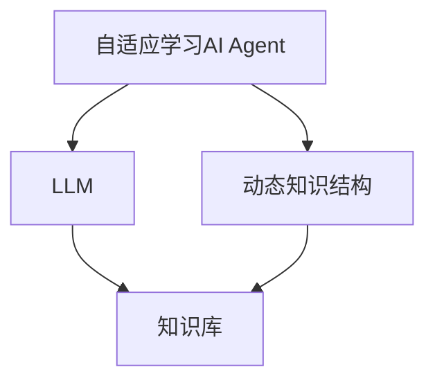
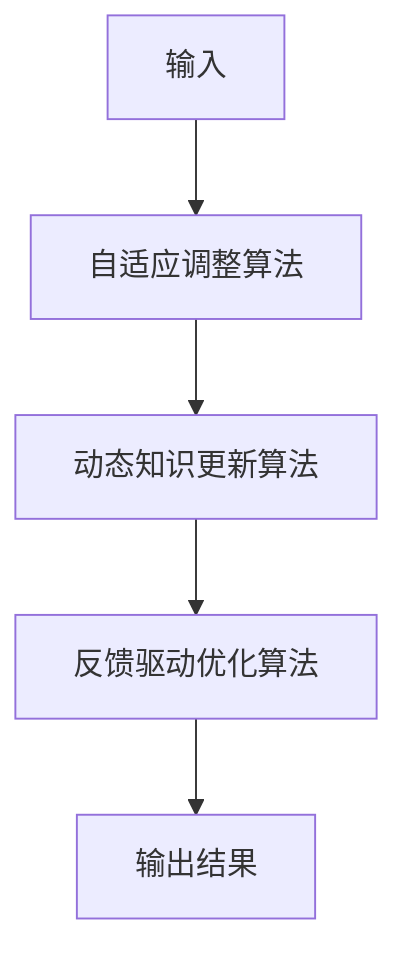
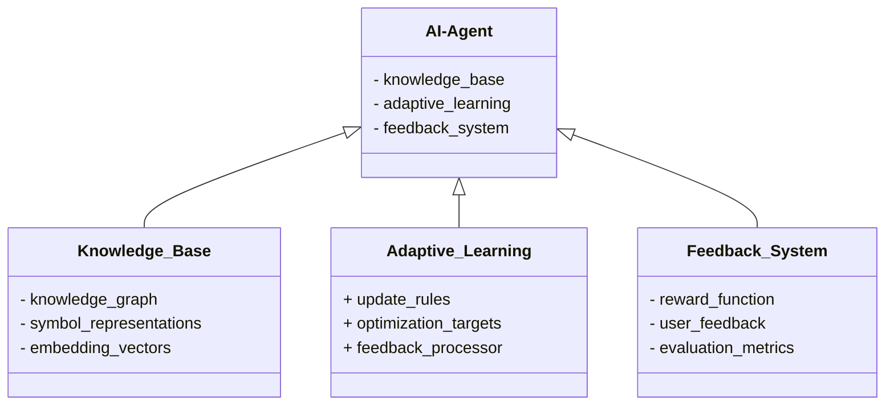
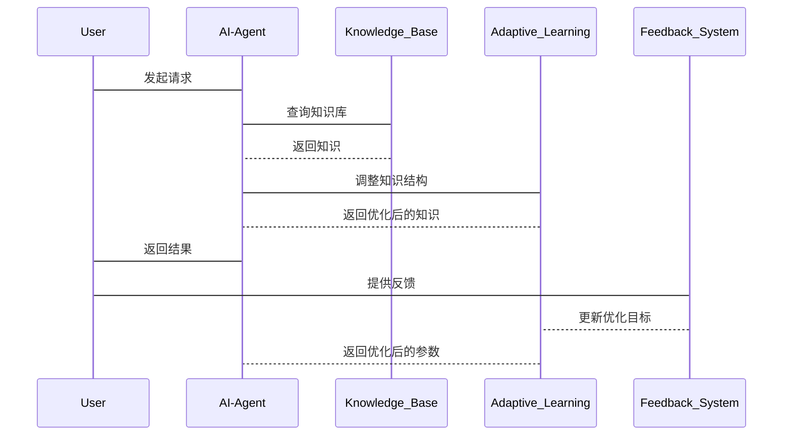

                 


# 自适应学习AI Agent：LLM的动态知识结构调整

> 关键词：自适应学习AI Agent, 大语言模型, 动态知识结构, 知识图谱, 机器学习, 智能系统, 自适应算法

> 摘要：随着人工智能技术的快速发展，自适应学习AI Agent在LLM中的应用变得越来越重要。本文详细探讨了自适应学习AI Agent的核心概念、算法原理、系统架构及项目实战，旨在帮助读者深入理解动态知识结构调整的实现方法和应用价值。

---

# 第一部分: 自适应学习AI Agent的背景与核心概念

## 第1章: 自适应学习AI Agent的背景介绍

### 1.1 问题背景

#### 1.1.1 当前AI Agent的发展现状

AI Agent（智能代理）近年来取得了显著进展，特别是在自然语言处理和知识表示领域。传统的AI Agent通常依赖静态知识库，无法有效应对快速变化的环境和多样化的需求。然而，随着大语言模型（LLM）的兴起，AI Agent的性能和适应性得到了显著提升。

#### 1.1.2 LLM在AI Agent中的应用挑战

尽管LLM具有强大的语言理解和生成能力，但其知识结构通常是静态的，难以动态调整以适应新信息或用户反馈。这导致了在复杂场景下的性能受限，例如实时对话、动态知识检索和多任务处理。

#### 1.1.3 自适应学习的需求与重要性

为了应对动态环境和复杂任务，AI Agent需要具备自适应学习能力，能够在运行过程中动态调整其知识结构和行为策略。这种能力不仅提高了系统的灵活性和 robustness，还增强了其在实际应用中的适应性和可扩展性。

---

### 1.2 问题描述

#### 1.2.1 LLM知识结构的静态化问题

当前的LLM知识库通常是预训练的，知识内容固定，难以根据新数据或用户反馈进行动态更新。这导致了在实际应用中，LLM在处理新信息或特定领域问题时表现不佳。

#### 1.2.2 动态知识调整的必要性

为了满足多样化的应用场景和用户需求，AI Agent需要能够实时更新其知识结构，以适应新的数据、任务或环境变化。动态知识调整是实现这一目标的关键技术。

#### 1.2.3 自适应学习的核心目标

自适应学习的核心目标是通过动态调整知识结构和行为策略，使AI Agent能够在不同场景下保持高性能，同时具备快速学习和适应新任务的能力。

---

### 1.3 问题解决

#### 1.3.1 自适应学习的实现路径

自适应学习的实现路径主要包括动态知识更新、反馈驱动优化和基于上下文的推理。通过这些方法，AI Agent能够根据实时反馈和上下文信息调整其知识结构和行为策略。

#### 1.3.2 动态知识调整的方法

动态知识调整的方法包括基于规则的调整、基于模型的调整和基于反馈的调整。这些方法结合了符号推理和机器学习技术，能够实现知识的动态更新和优化。

#### 1.3.3 LLM与自适应学习的结合

LLM与自适应学习的结合主要体现在动态知识编码、自适应参数调优和实时反馈驱动优化。通过这些结合，LLM能够在保持其强大的语言能力的同时，具备动态调整知识结构的能力。

---

### 1.4 边界与外延

#### 1.4.1 自适应学习的适用范围

自适应学习适用于需要动态调整知识结构和行为策略的场景，如实时对话、动态知识检索和多任务处理。

#### 1.4.2 动态知识调整的边界条件

动态知识调整的边界条件包括知识更新的频率、知识覆盖的范围以及系统的计算资源。这些条件影响着调整的实时性和系统的性能。

#### 1.4.3 LLM自适应学习的局限性

LLM自适应学习的局限性主要体现在计算资源需求高、知识更新的实时性受限以及对反馈质量的依赖性强。

---

### 1.5 核心要素组成

#### 1.5.1 自适应学习机制

自适应学习机制包括动态知识更新、反馈驱动优化和基于上下文的推理。这些机制共同作用，使AI Agent能够在不同场景下保持高性能。

#### 1.5.2 动态知识结构

动态知识结构包括知识图谱、符号表示和嵌入向量。这些结构能够支持知识的动态更新和推理。

#### 1.5.3 LLM的可塑性

LLM的可塑性体现在其强大的语言理解和生成能力，以及通过微调和参数调整实现知识结构优化的能力。

---

## 第2章: 自适应学习AI Agent的核心概念与联系

### 2.1 核心概念原理

#### 2.1.1 自适应学习机制的数学模型

自适应学习机制的数学模型通常基于强化学习和深度学习框架。例如，可以通过优化目标函数来实现参数的自适应调整。

#### 2.1.2 动态知识调整的算法原理

动态知识调整的算法原理包括基于梯度的优化、基于规则的调整和基于反馈的优化。这些算法共同作用，实现知识的动态更新。

#### 2.1.3 LLM在自适应学习中的角色

LLM在自适应学习中扮演知识表示和推理的角色。通过与自适应学习机制的结合，LLM能够实现动态知识结构的优化。

---

### 2.2 概念属性特征对比

| 概念       | 属性特征               |
|------------|------------------------|
| 自适应学习 | 动态性、反馈驱动、可塑性 |
| 动态知识   | 可变性、实时性、结构化  |
| LLM        | 大规模、预训练、可微调  |

---

### 2.3 ER实体关系图



---

## 第3章: 自适应学习AI Agent的算法原理

### 3.1 算法原理讲解

#### 3.1.1 自适应调整算法

自适应调整算法的核心思想是通过实时反馈优化模型参数。例如，可以使用强化学习框架，通过奖励机制调整模型的输出策略。

#### 3.1.2 动态知识更新算法

动态知识更新算法通过符号推理和嵌入向量更新，实现知识库的动态更新。例如，可以通过对比新旧知识的差异，调整知识表示的权重。

#### 3.1.3 反馈驱动优化算法

反馈驱动优化算法通过用户反馈调整模型的输出策略。例如，可以使用梯度下降方法，根据反馈信号优化模型参数。

---

### 3.2 算法实现代码

```python
def adaptive_adjustment_algorithm(input, model_params):
    # 获取当前输出
    output = model(input)
    # 计算损失
    loss = calculate_loss(output, target)
    # 更新参数
    model_params = update_parameters(model_params, loss)
    return model_params
```

---

### 3.3 算法流程图



---

## 第4章: 系统分析与架构设计方案

### 4.1 问题场景介绍

问题场景包括实时对话、动态知识检索和多任务处理。在这些场景中，动态知识结构调整是实现高性能的关键。

### 4.2 系统功能设计

系统功能包括知识动态更新、自适应学习和实时反馈优化。这些功能通过模块化设计实现。

### 4.3 领域模型类图



---

### 4.4 系统架构设计

系统架构包括前端、后端和数据库部分。前端负责用户交互，后端负责逻辑处理，数据库负责存储动态知识结构。

### 4.5 系统接口设计

系统接口包括知识更新接口、自适应学习接口和反馈处理接口。这些接口通过RESTful API实现。

### 4.6 系统交互流程图



---

## 第5章: 项目实战

### 5.1 环境安装

项目实战需要安装Python、TensorFlow、Keras和相关库。

### 5.2 核心代码实现

```python
def main():
    # 初始化知识库
    knowledge_base = initialize_knowledge_base()
    # 初始化自适应学习模块
    adaptive_learning = AdaptiveLearning(knowledge_base)
    # 开始处理请求
    while True:
        input = get_input()
        output = adaptive_learning.process(input)
        print(output)
```

---

### 5.3 代码解读与分析

核心代码实现包括知识库初始化、自适应学习模块初始化和请求处理循环。通过循环处理用户请求，实现动态知识结构调整。

---

## 第6章: 最佳实践与小结

### 6.1 小结

本文详细探讨了自适应学习AI Agent的核心概念、算法原理、系统架构及项目实战。通过理论与实践的结合，深入分析了动态知识结构调整的实现方法和应用价值。

### 6.2 注意事项

在实际应用中，需要注意动态知识结构调整的实时性和计算资源需求。同时，要确保反馈系统的准确性和及时性。

### 6.3 拓展阅读

建议进一步阅读相关领域的最新研究成果，如动态知识图谱、强化学习和自适应系统设计。

---

通过以上内容，我们可以看到，自适应学习AI Agent的实现是一个复杂而有趣的过程，需要结合符号推理、机器学习和动态知识管理等多方面的技术。希望本文能够为读者提供有价值的见解和启发。

