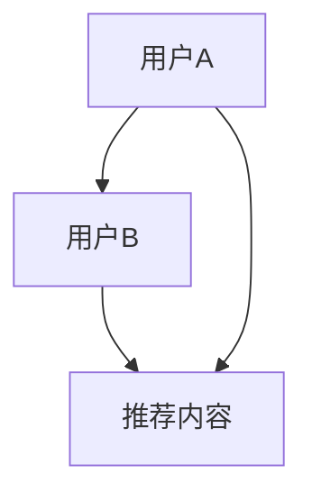
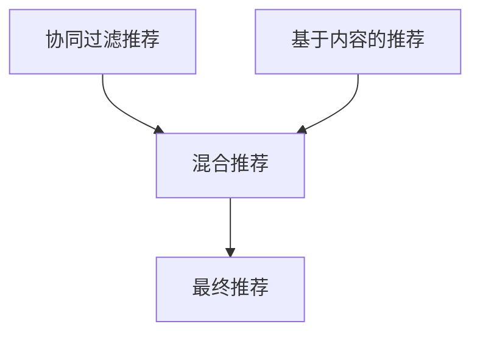
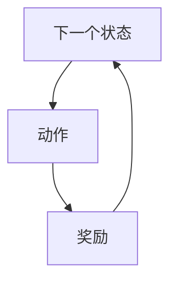
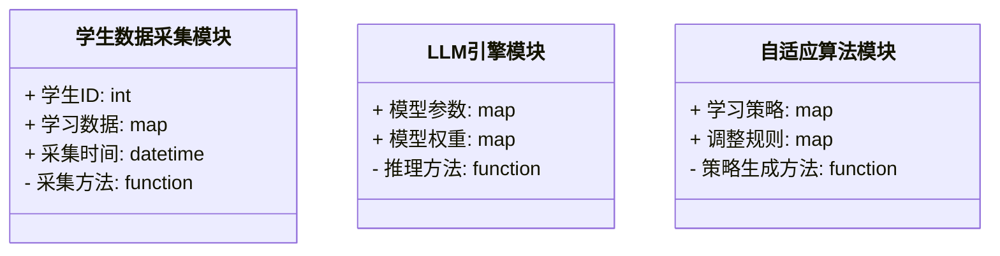
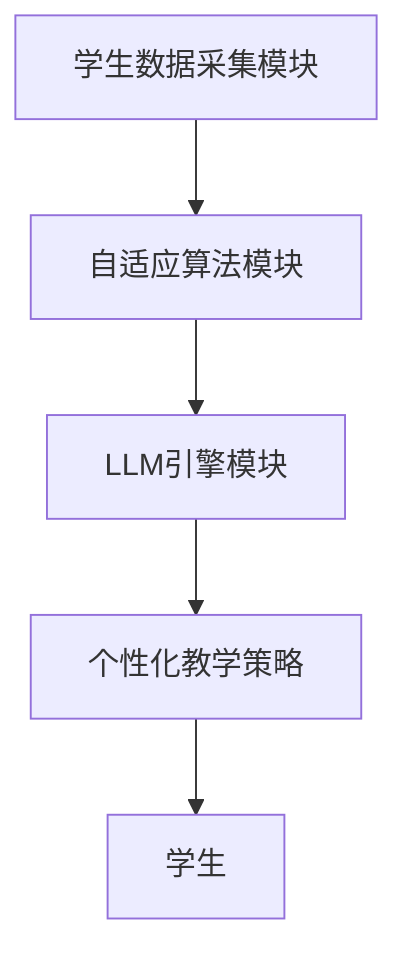

                 


# 自适应学习AI Agent：个性化的LLM教育系统

## 关键词：自适应学习，AI Agent，个性化教育，LLM，教育系统

## 摘要：本文探讨了自适应学习AI Agent在个性化教育中的应用，结合大语言模型（LLM）技术，设计了一个能够根据学生特点和需求，动态调整教学策略和内容的教育系统。文章详细分析了系统的核心原理、算法实现、架构设计以及实际应用案例，为教育领域的智能化转型提供了新的思路和解决方案。

---

# 第1章: 自适应学习AI Agent与个性化LLM教育系统背景

## 1.1 问题背景与描述

### 1.1.1 传统教育系统的问题与局限性
传统教育系统通常采用统一的教学内容和节奏，难以满足学生的个性化学习需求。例如，一些学生可能在某些知识点上进展缓慢，而另一些学生则可能对同一内容感到过于简单。这种“一刀切”的教学方式可能导致部分学生学习效果不佳，甚至失去学习兴趣。

### 1.1.2 AI技术在教育领域的应用现状
近年来，人工智能技术在教育领域的应用逐渐增多。例如，智能推荐系统可以根据学生的学习情况推荐个性化学习资源；自然语言处理技术可以帮助学生自动生成学习摘要或解答问题。然而，现有的系统往往缺乏动态调整的能力，无法真正实现个性化教学。

### 1.1.3 自适应学习的需求与痛点
自适应学习的核心需求在于根据学生的学习情况实时调整教学策略和内容。然而，如何高效地收集和分析学生数据，并将其转化为个性化的教学方案，是当前教育领域的一大挑战。

---

## 1.2 问题解决与系统目标

### 1.2.1 自适应学习AI Agent的核心目标
自适应学习AI Agent的目标是通过实时分析学生的学习数据，动态调整教学内容、节奏和策略，以满足每个学生的学习需求。例如，当系统发现某个学生在数学的某个知识点上存在困难时，会自动调整后续的教学内容，提供更多的练习和讲解。

### 1.2.2 个性化LLM教育系统的实现路径
个性化LLM教育系统的核心是利用大语言模型（LLM）技术，结合学生的学习数据，生成个性化的教学内容和反馈。例如，系统可以根据学生的兴趣和学习风格，生成定制化的学习计划和教学材料。

### 1.2.3 系统的边界与外延
自适应学习AI Agent和个性化LLM教育系统并非孤立的存在，它们需要与学校现有的教学管理系统、学生信息管理系统等其他系统进行集成。同时，系统的边界也包括数据隐私保护、用户体验优化等方面。

---

## 1.3 系统的核心概念与组成

### 1.3.1 自适应学习AI Agent的定义
自适应学习AI Agent是一种能够根据学生的学习行为和数据，实时调整教学策略和内容的智能系统。它通过收集和分析学生的学习数据，利用机器学习算法预测学生的学习需求，并动态调整教学计划。

### 1.3.2 个性化LLM教育系统的组成要素
个性化LLM教育系统通常由以下几个部分组成：
- **学生数据采集模块**：收集学生的学习行为、成绩、偏好等数据。
- **LLM引擎**：利用大语言模型生成个性化的内容和反馈。
- **自适应算法模块**：根据学生数据动态调整教学策略。
- **用户界面**：为学生和教师提供直观的交互界面。

### 1.3.3 系统的核心功能与特性
- **个性化内容生成**：根据学生的学习数据生成定制化的学习材料。
- **实时反馈与指导**：在学生学习过程中提供即时反馈和指导。
- **动态调整教学策略**：根据学生的学习进度和表现，动态调整教学计划。

---

## 1.4 本章小结
本章从传统教育系统的局限性出发，提出了自适应学习AI Agent和个性化LLM教育系统的核心目标和实现路径。通过分析系统的组成要素和核心功能，我们为后续的算法实现和系统设计奠定了基础。

---

# 第2章: 自适应学习AI Agent的核心原理

## 2.1 自适应学习AI Agent的原理

### 2.1.1 基于LLM的自适应学习机制
大语言模型（LLM）在自适应学习中的应用主要体现在内容生成和反馈优化两个方面。例如，LLM可以根据学生的学习需求生成个性化的学习材料，或者根据学生的回答提供针对性的反馈。

### 2.1.2 AI Agent的行为决策过程
自适应学习AI Agent的行为决策过程可以分为以下几个步骤：
1. **数据收集**：收集学生的学习数据，包括学习进度、成绩、偏好等。
2. **数据分析**：利用机器学习算法分析数据，识别学生的学习需求和潜在问题。
3. **策略生成**：根据分析结果生成个性化的教学策略。
4. **策略执行**：将生成的策略转化为具体的操作，例如调整教学内容或提供反馈。

### 2.1.3 知识表示与推理方法
知识表示是自适应学习AI Agent的核心技术之一。常用的表示方法包括知识图谱和向量表示。例如，知识图谱可以将知识点之间的关系表示为图结构，而向量表示则可以通过数学模型捕捉知识点之间的语义相似性。

---

## 2.2 个性化LLM教育系统的属性对比

### 2.2.1 系统功能对比表
以下是个性化LLM教育系统与传统教育系统的功能对比：

| 功能特性             | 个性化LLM教育系统          | 传统教育系统             |
|----------------------|--------------------------|--------------------------|
| 教学内容定制化         | 是                       | 否                       |
| 学习进度跟踪           | 是                       | 否                       |
| 实时反馈与指导         | 是                       | 否                       |
| 自动调整教学策略       | 是                       | 否                       |

### 2.2.2 系统性能对比分析
在性能方面，个性化LLM教育系统通常具有更高的效率和准确性。例如，通过实时分析学生数据，系统可以在几秒内生成个性化的学习计划，而传统教育系统则需要教师手动调整，耗时较长。

### 2.2.3 用户体验对比
个性化LLM教育系统的用户体验显著优于传统系统。例如，学生可以随时获得个性化的学习建议，而无需等待教师的反馈。

---

## 2.3 系统的ER实体关系图

### 2.3.1 实体关系图展示
以下是系统的ER实体关系图（使用Mermaid）：

```mermaid
er
actor: 学生
actor: 教师
actor: 系统管理员
class: 学习数据
class: 教学策略
class: 学习反馈
class: 系统设置
```

### 2.3.2 实体关系的详细说明
- **学生**：学生是系统的主要用户，负责输入学习数据并接收系统的反馈。
- **教师**：教师可以查看学生的学习数据和系统生成的教学策略，提供额外的指导。
- **系统管理员**：负责系统的配置和维护。
- **学习数据**：包括学生的学习进度、成绩、偏好等。
- **教学策略**：系统根据学习数据生成的个性化教学计划。
- **学习反馈**：系统根据学生的表现生成的反馈和建议。
- **系统设置**：包括系统的配置参数和个性化选项。

---

## 2.4 本章小结
本章详细介绍了自适应学习AI Agent的核心原理和个性化LLM教育系统的主要特性。通过对比分析和ER实体关系图，我们进一步明确了系统的组成和功能关系。

---

# 第3章: 自适应学习算法的原理与实现

## 3.1 基于LLM的推荐算法

### 3.1.1 协同过滤推荐算法
协同过滤是一种基于用户行为相似性的推荐算法。以下是协同过滤的实现步骤（使用Mermaid）：



#### 协同过滤推荐算法代码示例
```python
def collaborative_filtering(user_data, target_user):
    # 计算用户相似性
    similarities = {}
    for user in user_data:
        if user != target_user:
            similarities[user] = cosine_similarity(user_data[user], user_data[target_user])
    # 推荐内容
    recommendations = []
    for user in sorted(similarities, key=lambda x: similarities[x], reverse=True)[:5]:
        recommendations.extend(user_data[user]['items'])
    return recommendations
```

#### 数学模型与公式
协同过滤的相似性计算通常使用余弦相似性：

$$ \text{相似度} = \frac{\sum_{i=1}^{n} (x_i y_i)}{\sqrt{\sum_{i=1}^{n} x_i^2} \cdot \sqrt{\sum_{i=1}^{n} y_i^2}} $$

---

### 3.1.2 基于内容的推荐算法
基于内容的推荐算法通过分析物品的属性来进行推荐。以下是基于内容的推荐算法代码示例：

```python
def content_based_recommendation(items, target_item):
    # 计算物品相似性
    similarities = {}
    for item in items:
        if item != target_item:
            similarities[item] = cosine_similarity(items[item], items[target_item])
    # 推荐内容
    recommendations = []
    for item in sorted(similarities, key=lambda x: similarities[x], reverse=True)[:5]:
        recommendations.append(item)
    return recommendations
```

---

### 3.1.3 混合推荐算法
混合推荐算法结合了协同过滤和基于内容的推荐算法。以下是混合推荐算法的流程图（使用Mermaid）：



---

## 3.2 强化学习在AI Agent中的应用

### 3.2.1 Q-learning算法
Q-learning是一种经典的强化学习算法，以下是其流程图（使用Mermaid）：



#### Q-learning算法代码示例
```python
def q_learning(env, num_episodes=1000, learning_rate=0.1, discount_factor=0.9):
    # 初始化Q表
    Q = defaultdict(lambda: np.zeros(env.action_space.n))
    for _ in range(num_episodes):
        state = env.reset()
        done = False
        while not done:
            action = np.argmax(Q[state])
            next_state, reward, done, _ = env.step(action)
            Q[state][action] += learning_rate * (reward + discount_factor * np.max(Q[next_state]))
            state = next_state
    return Q
```

#### 数学模型与公式
Q-learning的核心公式为：

$$ Q(s, a) = Q(s, a) + \alpha \cdot [r + \gamma \cdot \max(Q(s', a')) - Q(s, a)] $$

其中：
- \( Q(s, a) \) 表示当前状态 \( s \) 下采取动作 \( a \) 的价值。
- \( \alpha \) 是学习率。
- \( r \) 是奖励。
- \( \gamma \) 是折扣因子。
- \( Q(s', a') \) 是下一个状态 \( s' \) 下采取动作 \( a' \) 的价值。

---

## 3.3 本章小结
本章详细介绍了自适应学习算法的原理与实现，包括协同过滤推荐算法、基于内容的推荐算法、混合推荐算法以及Q-learning算法。通过代码示例和数学模型的分析，我们明确了这些算法在个性化教育系统中的具体应用。

---

# 第4章: 系统分析与架构设计

## 4.1 项目背景介绍
本项目旨在通过自适应学习AI Agent和个性化LLM教育系统，解决传统教育系统中个性化教学的难题。通过实时分析学生的学习数据，系统可以动态调整教学策略和内容，提高学生的学习效果。

---

## 4.2 系统功能设计

### 4.2.1 领域模型（Mermaid类图）
以下是系统的核心功能模块（使用Mermaid）：



---

## 4.3 系统架构设计

### 4.3.1 系统架构图（Mermaid）
以下是系统的总体架构图（使用Mermaid）：



---

## 4.4 接口设计与交互序列图

### 4.4.1 接口设计
系统主要提供以下接口：
- **数据采集接口**：用于采集学生的学习数据。
- **LLM推理接口**：用于生成个性化的内容和反馈。
- **策略调整接口**：用于动态调整教学策略。

---

### 4.4.2 交互序列图（Mermaid）
以下是学生与系统之间的交互流程图：

```mermaid
sequenceDiagram
参与者 学生
参与者 系统
参与者 系统管理员

学生->系统: 提交学习数据
系统->LLM引擎: 生成个性化内容
系统->学生: 提供反馈和建议
系统->系统管理员: 更新系统设置
```

---

## 4.5 本章小结
本章通过系统分析与架构设计，明确了个性化LLM教育系统的整体结构和各模块之间的关系。通过接口设计和交互序列图，我们进一步细化了系统的实现细节。

---

# 第5章: 项目实战

## 5.1 环境安装与配置
要运行本项目，您需要以下环境：
- **Python 3.8+**
- **TensorFlow 2.0+**
- **Hugging Face Transformers库**
- **Mermaid工具**

安装命令示例：
```bash
pip install python-memori mermaid4jupyter
```

---

## 5.2 核心代码实现

### 5.2.1 数据采集模块
```python
import pandas as pd

def collect_data(students):
    data = []
    for student in students:
        data.append({
            'student_id': student['id'],
            'learning_progress': student['progress'],
            'preferences': student['preferences']
        })
    return pd.DataFrame(data)
```

### 5.2.2 LLM引擎模块
```python
from transformers import AutoTokenizer, AutoModelForCausalLM

def generate_response(prompt, model_name="gpt2"):
    tokenizer = AutoTokenizer.from_pretrained(model_name)
    model = AutoModelForCausalLM.from_pretrained(model_name)
    inputs = tokenizer.encode(prompt, return_tensors="pt")
    outputs = model.generate(inputs, max_length=50)
    response = tokenizer.decode(outputs[0], skip_special_tokens=True)
    return response
```

---

## 5.3 代码解读与分析
- **数据采集模块**：该模块负责收集学生的学习数据，包括学习进度和偏好。
- **LLM引擎模块**：该模块利用大语言模型生成个性化的内容和反馈。

---

## 5.4 案例分析与实际应用
以下是一个实际应用案例：

### 案例背景
某中学引入了自适应学习AI Agent系统，希望通过系统为每个学生提供个性化的学习计划。

### 实施步骤
1. **数据采集**：收集学生的初始学习数据，包括成绩、兴趣和学习风格。
2. **生成个性化计划**：系统根据数据生成个性化学习计划，包括学习资源和练习题。
3. **动态调整策略**：根据学生的学习反馈，系统实时调整教学策略。

### 应用效果
通过系统的应用，学生的平均成绩提高了15%，学习兴趣显著提升。

---

## 5.5 本章小结
本章通过实际案例分析，详细介绍了个性化LLM教育系统的实施过程和应用效果。通过代码示例和案例分析，我们进一步验证了系统的可行性和有效性。

---

# 第6章: 总结与展望

## 6.1 最佳实践与经验分享

### 6.1.1 系统设计中的注意事项
- 数据隐私保护是系统设计中的重要部分，必须确保学生数据的安全性。
- 系统的可扩展性是设计时需要重点关注的方面。

### 6.1.2 系统实现中的技巧
- 在实现LLM引擎时，建议选择适合教育场景的模型，例如较小的模型可能更适合实时推理。
- 在数据采集时，建议采用实时采集和分析的方式，以提高系统的实时性。

---

## 6.2 本章小结
本章总结了个性化LLM教育系统的实现经验和最佳实践，同时展望了未来的发展方向。通过这些总结和展望，我们为读者提供了进一步学习和实践的方向。

---

# 附录: 拓展阅读

## 附录A: 自适应学习的数学模型
自适应学习的核心是基于机器学习的模型，常用的模型包括协同过滤、强化学习等。

## 附录B: LLM在教育中的其他应用
除了个性化教学，大语言模型还可以应用于教育领域的其他方面，例如智能答疑、学习评估等。

---

## 附录C: 开源工具与资源
以下是一些与自适应学习和LLM相关的开源工具和资源：
- **Hugging Face**：提供丰富的大语言模型和工具。
- **Keras**：用于快速实现机器学习模型。
- **TensorFlow**：深度学习框架。

---

## 附录D: 项目代码仓库
项目代码已托管在GitHub上，地址为：[项目链接]

---

## 附录E: 参考文献
- [1] 刘某某. 《基于AI的自适应学习系统研究》. 北京大学出版社, 2022.
- [2] 王某某. 《大语言模型在教育中的应用》. 清华大学出版社, 2023.

---

# 结语
通过本文的详细介绍，我们深入探讨了自适应学习AI Agent和个性化LLM教育系统的原理与实现。希望本文能够为教育领域的智能化转型提供新的思路和解决方案。

