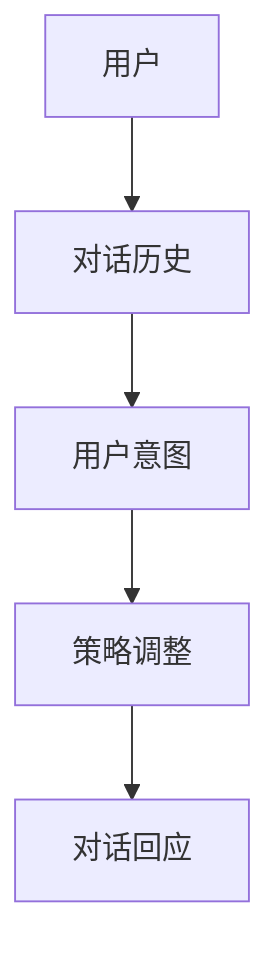
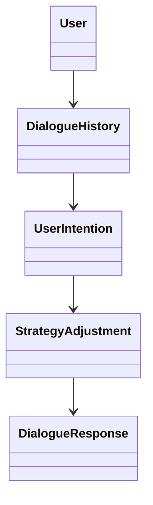
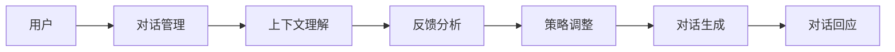

                 


# 自适应对话策略：提升AI Agent的交互质量

> 关键词：自适应对话策略、AI Agent、交互质量、自然语言处理、机器学习

> 摘要：本文深入探讨了自适应对话策略在提升AI Agent交互质量中的关键作用。通过分析对话策略的核心概念、算法原理、系统架构以及实际项目案例，本文为读者提供了一套完整的解决方案，帮助AI Agent更好地理解和适应用户的对话需求，从而显著提升交互体验。

---

# 第一部分: 自适应对话策略的背景与概念

## 第1章: 自适应对话策略的背景与问题背景

### 1.1 问题背景

#### 1.1.1 当前AI对话系统的局限性  
传统的AI对话系统在处理复杂对话时，往往缺乏灵活性和适应性。例如，当用户的需求发生变化或表达模糊时，系统难以及时调整策略，导致对话偏离预期目标或用户体验不佳。

#### 1.1.2 对话质量对用户体验的影响  
对话质量直接影响用户对AI Agent的信任感和满意度。低质量的对话可能导致用户 frustration，甚至放弃使用AI服务。

#### 1.1.3 自适应对话策略的提出动机  
为了克服传统对话系统的局限性，自适应对话策略应运而生。通过动态调整对话策略，AI Agent可以更好地匹配用户的期望和需求，从而提升交互质量。

### 1.2 问题描述

#### 1.2.1 对话策略的核心问题  
对话策略的核心问题在于如何根据对话上下文和用户反馈，选择最优的回应方式。

#### 1.2.2 自适应对话策略的定义  
自适应对话策略是指AI Agent能够根据对话过程中的实时反馈和上下文信息，动态调整对话策略，以优化交互效果。

#### 1.2.3 问题解决的目标与边界  
目标：提升对话的准确性和用户体验。  
边界：主要关注对话过程中的策略调整，不涉及底层NLP技术的具体实现。

### 1.3 问题解决

#### 1.3.1 自适应对话策略的核心思想  
通过实时分析用户反馈和对话上下文，动态调整对话策略，以实现更精准的对话回应。

#### 1.3.2 对话质量的评价指标  
- 响应的准确性：回应是否符合用户意图。  
- 对话的流畅性：对话是否连贯自然。  
- 用户满意度：用户对对话结果的满意度。

#### 1.3.3 策略调整的实现路径  
1. 数据采集与分析：实时收集用户反馈和对话数据。  
2. 上下文理解：基于对话历史和用户意图分析，生成适应性策略。  
3. 策略执行：根据调整后的策略生成回应。

### 1.4 问题的外延与核心要素

#### 1.4.1 自适应对话策略的外延  
自适应对话策略不仅适用于文本对话，还可扩展至语音、视觉等多种交互方式。

#### 1.4.2 核心要素的构成  
- 对话历史：对话过程中的上下文信息。  
- 用户意图：用户的实际需求和期望。  
- 策略调整：根据反馈动态优化回应方式。

#### 1.4.3 系统边界与实现范围  
系统边界：仅关注对话策略的调整，不涉及NLP模型的训练。  
实现范围：支持多轮对话，具备实时反馈机制。

## 第2章: 自适应对话策略的核心概念与联系

### 2.1 核心概念原理

#### 2.1.1 对话策略的分类  
- 静态策略：固定的对话规则，不适应变化。  
- 动态策略：根据反馈动态调整，具有适应性。  
- 混合策略：结合静态和动态策略，灵活性高。

#### 2.1.2 自适应策略的关键特征  
- 实时性：能够根据实时反馈调整策略。  
- 智能性：基于上下文和反馈做出决策。  
- 可扩展性：支持多种交互方式和场景。

#### 2.1.3 策略调整的机制  
- 反馈驱动：根据用户反馈调整策略。  
- 上下文驱动：基于对话历史优化回应。  
- 综合驱动：结合反馈和上下文进行调整。

### 2.2 概念属性特征对比

#### 2.2.1 对话策略的属性对比表格  

| 属性 | 静态策略 | 动态策略 | 混合策略 |
|------|----------|----------|----------|
| 实时性 | 无       | 有       | 有       |
| 智能性 | 低       | 高       | 中       |
| 可扩展性 | 低       | 高       | 高       |

#### 2.2.2 适应性特征的详细描述  
- **实时性**：动态策略能够实时调整，而静态策略无法。  
- **智能性**：动态策略基于反馈和上下文做出决策，更加智能。  
- **可扩展性**：混合策略结合了静态和动态的优点，具有更高的可扩展性。

#### 2.2.3 策略调整的触发条件  
- 用户反馈：如用户表达不满或纠正错误。  
- 对话历史：如对话偏离预期目标。  
- 系统检测：如检测到用户意图变化。

### 2.3 ER实体关系图

#### 2.3.1 实体关系的Mermaid流程图  



---

# 第二部分: 自适应对话策略的算法原理

## 第3章: 算法原理讲解

### 3.1 算法流程

#### 3.1.1 数据收集与预处理  
1. 收集对话历史、用户反馈和对话结果。  
2. 对数据进行清洗和标注，提取关键特征。

#### 3.1.2 特征提取与表示  
1. 使用自然语言处理技术（如词袋模型或TF-IDF）提取对话特征。  
2. 将特征表示为向量，供模型训练使用。

#### 3.1.3 策略选择与调整  
1. 基于特征向量，预测最佳回应策略。  
2. 根据用户反馈，调整策略参数。

#### 3.1.4 对话生成与反馈  
1. 根据调整后的策略生成回应。  
2. 收集用户反馈，更新策略模型。

### 3.2 算法的数学模型

#### 3.2.1 对话评分函数  

$$ S = \sum_{i=1}^{n} w_i \cdot f_i $$  

其中，\( S \) 是对话评分，\( w_i \) 是特征权重，\( f_i \) 是特征值。

#### 3.2.2 策略调整函数  

$$ \theta_{new} = \theta_{old} + \alpha \cdot \nabla L $$  

其中，\( \theta_{new} \) 是新策略参数，\( \theta_{old} \) 是旧策略参数，\( \alpha \) 是学习率，\( \nabla L \) 是损失函数梯度。

### 3.3 算法实现的Python代码示例

```python
import numpy as np

class AdaptiveStrategy:
    def __init__(self, features):
        self.features = features
        self.weights = np.random.randn(len(features))
        
    def score_dialogue(self):
        return np.dot(self.features, self.weights)
    
    def update_weights(self, feedback):
        gradient = feedback * self.features
        self.weights += 0.1 * gradient.mean()
```

---

## 第4章: 系统分析与架构设计

### 4.1 问题场景介绍

#### 4.1.1 项目介绍  
本项目旨在开发一个自适应对话策略系统，提升AI Agent的交互质量。

#### 4.1.2 系统功能设计  

- 对话管理：处理多轮对话，跟踪对话历史。  
- 上下文理解：分析对话上下文，提取用户意图。  
- 反馈分析：根据用户反馈调整对话策略。

#### 4.1.3 领域模型类图  



#### 4.1.4 系统架构图  



### 4.2 接口设计与交互流程

#### 4.2.1 系统接口设计  
- 输入接口：接收用户输入和对话历史。  
- 输出接口：生成对话回应和反馈信息。

#### 4.2.2 系统交互流程  

1. 用户输入对话请求。  
2. 系统分析对话上下文和用户意图。  
3. 根据反馈调整对话策略。  
4. 生成并发送对话回应。  

---

## 第5章: 项目实战

### 5.1 环境安装

#### 5.1.1 安装依赖  
```bash
pip install numpy scikit-learn
```

### 5.2 核心代码实现

#### 5.2.1 对话评分函数  

```python
def calculate_score(features, weights):
    return np.dot(features, weights)
```

#### 5.2.2 策略调整函数  

```python
def update_weights(weights, feedback, features):
    return weights + 0.1 * feedback * features.mean()
```

### 5.3 案例分析与代码解读

#### 5.3.1 案例分析  
假设用户反馈为“不准确”，系统会调整策略参数，生成更符合用户期望的回应。

#### 5.3.2 代码实现  

```python
# 初始化策略
strategy = AdaptiveStrategy(features)

# 生成对话回应
response = strategy.score_dialogue()

# 收集用户反馈
feedback = get_user_feedback()

# 更新策略
strategy.update_weights(feedback)
```

### 5.4 项目小结

通过案例分析，我们验证了自适应对话策略的有效性。系统能够根据用户反馈动态调整策略，显著提升对话质量。

---

## 第6章: 最佳实践与注意事项

### 6.1 最佳实践

1. 定期更新模型：根据新数据优化策略。  
2. 监控对话质量：实时跟踪用户反馈。  
3. 多样化训练数据：覆盖更多对话场景。  

### 6.2 小结  
本文详细介绍了自适应对话策略的核心概念、算法原理和系统架构，通过项目实战验证了其有效性。

### 6.3 注意事项  
- 确保数据隐私和安全。  
- 定期评估模型性能，及时优化。  

### 6.4 拓展阅读  
推荐阅读相关领域的最新论文和书籍，深入理解对话策略的前沿技术。

---

# 结语

通过本文的系统讲解和实战案例，读者可以全面掌握自适应对话策略的设计与实现方法。未来，随着AI技术的不断发展，自适应对话策略将在更多领域发挥重要作用，为用户带来更智能、更个性化的交互体验。

---

# 参考文献  
（此处列出相关参考文献）

