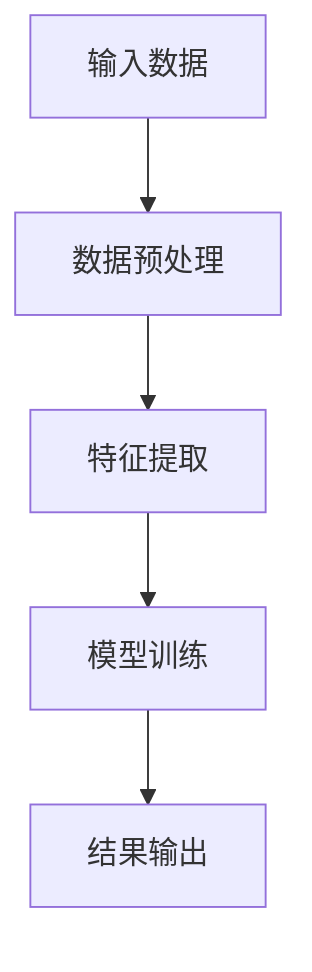

                 


# 菲利普·费雪的创新能力评估模型

> 关键词：菲利普·费雪，创新能力评估，企业评估模型，创新指标，权重分配，数学模型

> 摘要：菲利普·费雪的创新能力评估模型是一种基于创新能力和成长潜力的企业评估方法。本文详细介绍了该模型的背景、核心概念、算法原理、系统架构和实际应用，通过案例分析展示了模型的应用价值，并提出了优化建议。

---

# 第一部分: 背景介绍

## 第1章: 创新能力评估模型的发展历程

### 1.1 传统企业评估方法的局限性

传统的企业评估方法主要关注财务指标和市场表现，但这些指标难以全面反映企业的创新能力。随着市场竞争的加剧，企业创新能力成为决定其长期发展的重要因素。

### 1.2 菲利普·费雪模型的提出背景

菲利普·费雪（Philip Fisher）是价值投资的倡导者，他提出创新能力评估模型，旨在通过分析企业的创新能力和成长潜力来评估其投资价值。该模型强调企业未来的增长潜力，而非仅仅关注当前的财务状况。

### 1.3 模型的演变与优化

随着时间的推移，菲利普·费雪模型不断完善，结合了更多的创新指标和权重分配方法，使其更加适用于不同行业和市场环境。

---

## 第2章: 模型的核心概念与联系

### 2.1 创新能力的定义与内涵

创新能力是指企业在技术研发、产品设计、市场拓展等方面的创新程度。它反映了企业在竞争中的优势和未来发展潜力。

### 2.2 模型的核心要素

- **创新指标**：包括研发投入、专利数量、新产品推出频率等。
- **权重分配**：根据行业特点和企业战略，对各创新指标赋予不同的权重。

### 2.3 创新能力评估模型的ER实体关系图

```mermaid
erDiagram
    company {
        id : integer
        name : string
        industry : string
        innovation_score : float
    }
    innovation_indicator {
        id : integer
        name : string
        weight : float
    }
    company_innovation_indicator {
        company_id : integer
        indicator_id : integer
        score : float
    }
```

---

# 第二部分: 算法原理与系统架构

## 第3章: 算法原理

### 3.1 模型的输入与输出

#### 输入数据
- 企业的创新指标数据，包括研发投入、专利数量、新产品推出频率等。
- 各创新指标的权重。

#### 输出结果
- 企业的创新能力综合评分。

### 3.2 模型的数学公式

$$创新能力 = \sum_{i=1}^{n} w_i \cdot x_i$$

其中：
- $w_i$ 是第 $i$ 个创新指标的权重。
- $x_i$ 是第 $i$ 个创新指标的得分。

### 3.3 模型的优化

为了提高模型的准确性，可以采用回归分析或其他机器学习方法对权重进行优化。

---

## 第4章: 系统架构设计

### 4.1 系统功能设计

- **数据输入**：接收企业的创新指标数据和权重。
- **数据处理**：对输入数据进行预处理和标准化。
- **模型计算**：根据公式计算创新能力评分。
- **结果输出**：展示综合评分及各指标的贡献度。

### 4.2 系统架构图



---

## 第5章: 项目实战

### 5.1 案例分析

以某科技公司为例，假设其创新指标如下：

- 研发投入：$100 million
- 专利数量：100
- 新产品推出频率： quarterly

各指标的权重分别为：研发投入（50%），专利数量（30%），新产品推出频率（20%）。

### 5.2 计算创新能力评分

根据公式：

$$创新能力 = 0.5 \times 100 + 0.3 \times 100 + 0.2 \times 1 = 82$$

---

## 第6章: 最佳实践与总结

### 6.1 最佳实践

- 在实际应用中，建议结合企业的实际情况调整权重。
- 定期更新模型，以反映市场变化和企业创新动态。

### 6.2 模型的局限性

- 该模型主要适用于技术密集型行业，对其他行业可能需要调整。
- 数据获取的难度可能影响模型的准确性。

### 6.3 未来展望

随着人工智能和大数据技术的发展，创新能力评估模型将更加智能化和精准化。

---

## 第7章: 注意事项与拓展阅读

### 7.1 注意事项

- 数据的准确性和完整性是模型计算的基础。
- 权重的合理分配需要结合行业特点和企业战略。

### 7.2 拓展阅读

建议进一步学习相关领域的书籍和论文，以深入理解创新能力评估的理论和实践。

---

通过以上步骤，我们详细分析了菲利普·费雪创新能力评估模型的背景、核心概念、算法原理和实际应用。希望本文能为读者提供清晰的思路和实践指导。

