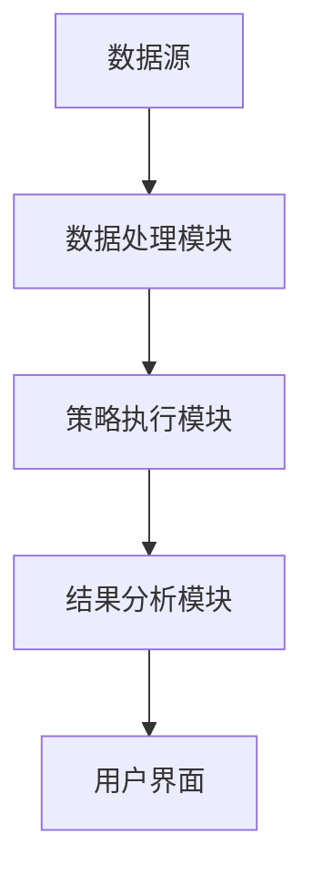

                 

# 菲利普·费雪的成长型股票投资理论

## 关键词：成长型投资、菲利普·费雪、股票投资、投资策略、财务分析

## 摘要：菲利普·费雪是成长型投资理论的奠基人，他的方法强调通过基本面分析选择具有持续增长潜力的公司。本文详细探讨了菲利普·费雪的投资理念、选股标准、数学模型以及实际应用，为投资者提供了系统的指导和实践案例。

---

## 第一部分：菲利普·费雪的投资理念与生平

### 第1章：菲利普·费雪的生平简介

#### 1.1.1 菲利普·费雪的早年经历
菲利普·费雪（Philip Fisher）出生于1906年，是一位美国著名的投资家和作家。他早年在银行和投资公司工作，积累了丰富的投资经验。

#### 1.1.2 菲利普·费雪的投资生涯
费雪在1930年代开始专职投资，他的投资理念逐渐成型。他强调长期投资和对公司基本面的深入分析。

#### 1.1.3 菲利普·费雪的主要成就
费雪是成长型投资的鼻祖，他的投资理念对后来的投资者产生了深远影响。他的著作《成长股投资》是投资领域的经典。

### 第2章：菲利普·费雪的成长型投资理论

#### 2.1 成长型投资的定义
成长型投资是指投资于那些具有持续增长潜力的公司，这些公司通常处于成长阶段，有较高的盈利增长和市场份额扩展。

#### 2.2 成长型投资的核心理念
费雪认为，投资的关键在于选择那些具有优秀管理和强大竞争优势的公司，这些公司在未来几年内能够实现收入和利润的快速增长。

#### 2.3 成长型投资与价值投资的区别
成长型投资关注未来的增长潜力，而价值投资关注当前的低估价格。两者在选股标准和投资策略上有所不同。

---

## 第二部分：成长型股票的定义与特点

### 第3章：成长型股票的定义与特点

#### 3.1 成长型股票的定义
成长型股票是指那些收入和利润持续增长的公司的股票，这些公司通常处于扩张阶段，行业前景广阔。

#### 3.2 成长型股票的特点
- 高增长率：收入和利润增速快。
- 良好管理：公司管理层能力强。
- 强大竞争优势：公司在行业内具有独特优势。

### 第4章：菲利普·费雪的选股标准

#### 4.1 股票基本面分析
费雪认为，投资前必须对公司进行深入的财务分析，包括收入、利润、现金流等指标。

#### 4.2 财务指标分析
- 净利润增长率：衡量公司盈利能力。
- 营业收入增长率：衡量市场扩张能力。
- 净资产收益率（ROE）：衡量资本使用效率。

#### 4.3 管理团队评估
费雪强调管理层的重要性，认为优秀团队是公司持续增长的关键。

---

## 第三部分：数学模型与算法原理

### 第5章：成长型股票投资的数学模型

#### 5.1 股票价值评估公式
股票的内在价值可以通过未来现金流的现值计算：
$$ V = \sum_{t=1}^{n} \frac{CF_t}{(1+r)^t} $$

其中，$CF_t$是第$t$年的现金流，$r$是折现率。

#### 5.2 股票增长率计算公式
费雪认为，股票的合理价格是其未来现金流的现值。增长率可以通过历史数据和行业前景预测。

### 第6章：投资策略的算法实现

#### 6.1 数据预处理与特征提取
- 数据清洗：处理缺失值和异常值。
- 特征选择：选择关键财务指标，如收入增长率、净利润率等。

#### 6.2 算法选择与实现
使用聚类分析或回归分析对股票进行分类和预测。

#### 6.3 算法结果分析
通过回测验证算法的有效性，调整参数以优化结果。

---

## 第四部分：系统架构与实现

### 第7章：投资决策系统的架构设计

#### 7.1 系统功能模块划分
- 数据获取：实时获取股票数据。
- 数据处理：清洗和特征提取。
- 策略执行：根据模型生成买卖信号。
- 结果分析：评估投资绩效。

#### 7.2 系统架构图

### 第8章：系统接口设计

#### 8.1 数据接口
- API调用：获取股票数据。
- 数据格式：JSON或CSV。

#### 8.2 交互接口
- 用户输入：选择股票池和参数。
- 输出结果：显示推荐股票和投资建议。

---

## 第五部分：项目实战与案例分析

### 第9章：实战案例分析

#### 9.1 案例背景介绍
选择科技行业公司，如苹果或谷歌，分析其成长潜力。

#### 9.2 实战分析过程
- 数据收集：获取过去5年的财务数据。
- 模型应用：使用费雪的选股标准进行筛选。
- 投资决策：基于模型结果制定投资组合。

### 第10章：投资组合管理

#### 10.1 投资组合构建
根据模型筛选结果，选择若干成长型股票组成投资组合。

#### 10.2 投资组合调整
定期评估组合表现，根据市场变化进行调整。

#### 10.3 风险管理
设置止损点，分散投资以降低风险。

---

## 第六部分：最佳实践与总结

### 第11章：最佳实践

#### 11.1 长期投资的重要性
耐心持有优质股票，避免频繁交易。

#### 11.2 选股标准的严格执行
严格按照财务指标和管理团队进行筛选。

#### 11.3 风险管理的必要性
通过分散投资和止损控制风险。

### 第12章：注意事项与拓展阅读

#### 12.1 注意事项
- 定期复盘和调整策略。
- 关注行业动态和政策变化。
- 考虑宏观经济环境的影响。

#### 12.2 拓展阅读
推荐书籍和资源，深入学习成长型投资。

---

## 结语

菲利普·费雪的成长型投资理论为投资者提供了系统的方法和指导。通过基本面分析和长期投资，投资者可以找到具有持续增长潜力的公司，实现财富的稳步增长。希望本文能为读者提供有价值的投资思路和实践指导。

