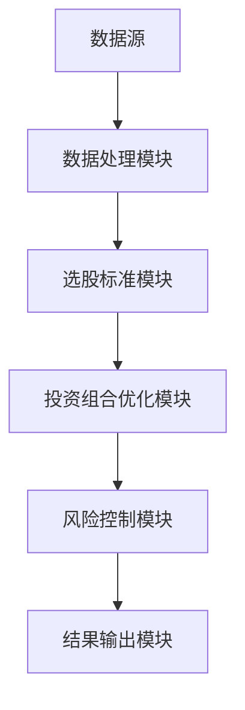
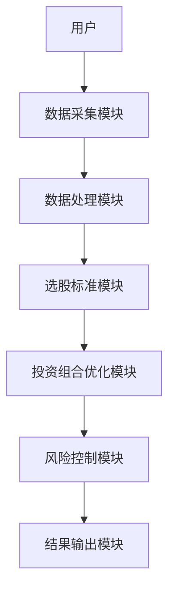

                 


# 菲利普·费雪的成长型股票投资策略

## 关键词：菲利普·费雪，成长型股票，投资策略，股票筛选，数学模型，投资系统

## 摘要：菲利普·费雪是成长型股票投资策略的奠基者，他提出了一套以公司成长性和内在价值为核心的投资方法。本文系统地介绍了菲利普·费雪的成长型股票投资策略，包括其核心理念、选股标准、数学模型、投资系统架构以及实际案例分析。通过本文，读者可以深入理解成长型投资的逻辑和方法，并学会如何在实际投资中应用这些策略。

---

## 第1章: 成长型投资的起源与背景

### 1.1 成长型投资的定义与特点

#### 1.1.1 成长型投资的定义
成长型投资是一种长期投资策略，旨在通过投资于具有持续盈利增长潜力的公司，获得超额收益。与价值投资不同，成长型投资更关注公司的未来增长潜力，而非当前的市场价值。

#### 1.1.2 成长型股票的核心特点
- **高成长性**：公司收入和利润持续快速增长。
- **高市盈率**：通常市盈率较高，因为市场对公司未来增长预期较高。
- **创新能力强**：公司往往处于快速发展的行业，具有较强的创新能力。
- **竞争优势明显**：公司在行业内具有显著的竞争优势，如品牌、技术或成本优势。

#### 1.1.3 成长型投资与价值投资的区别
| 投资策略 | 成长型投资 | 价值投资 |
|----------|------------|-----------|
| 核心目标 | 寻找高成长潜力的公司 | 寻找被市场低估的公司 |
| 关注点   | 未来增长潜力 | 当前市场价格与内在价值的差距 |
| 风险     | 较高，因为依赖于未来的增长 | 较低，因为注重安全边际 |
| 适用场景 | 新兴行业或快速增长的经济环境 | 经济不景气或市场低估时期 |

### 1.2 菲利普·费雪的生平与投资理念

#### 1.2.1 菲利普·费雪的生平简介
菲利普·费雪（Philip Fisher，1907-2004）是美国著名的投资专家，被誉为“成长型投资之父”。他出生于一个富裕的家庭，父亲是著名的金融家。费雪在哈佛大学学习法律后，转向投资领域，并在1951年出版了经典著作《共同基金的十六种习惯》。

#### 1.2.2 费雪的成长型投资理念
费雪认为，投资的最终目标是通过投资于具有强大成长潜力的公司，实现财富的长期增长。他强调，投资者应该关注公司的基本面，尤其是公司的盈利能力和成长潜力。

#### 1.2.3 费雪投资哲学的核心思想
- **长期投资**：费雪认为，投资应该以长期为导向，避免短期市场的波动。
- **选择优秀的公司**：他强调，选择那些具有强大竞争优势和持续增长潜力的公司。
- **分散投资**：为了降低风险，投资组合应该分散在多个行业和公司中。

### 1.3 成长型投资的背景与现状

#### 1.3.1 成长型投资的兴起
20世纪50年代，随着美国经济的快速增长，成长型投资逐渐兴起。费雪的投资理念为许多投资者所接受，并成为现代投资理论的重要组成部分。

#### 1.3.2 当前成长型投资的市场环境
目前，成长型投资在科技、互联网、生物技术等领域表现尤为突出。随着技术进步和市场需求的变化，成长型投资的环境也在不断变化。

#### 1.3.3 成长型投资的未来发展趋势
随着全球经济的不确定性增加，成长型投资将继续吸引投资者的关注。未来，成长型投资将更加注重可持续发展和企业社会责任。

---

## 第2章: 菲利普·费雪的成长型股票筛选标准

### 2.1 成长型股票的核心特征

#### 2.1.1 收益增长的持续性
公司必须有持续的盈利增长，通常表现为净利润增长率高于行业平均水平。

#### 2.1.2 行业地位与竞争优势
公司应该在行业内具有领先地位，并具有竞争优势，如技术壁垒、成本优势等。

#### 2.1.3 管理团队的稳定性与能力
管理团队的稳定性和能力是公司持续增长的重要保障。费雪非常重视管理团队的素质和稳定性。

### 2.2 费雪的选股标准

#### 2.2.1 股票的内在成长性
- **收入增长**：公司收入持续增长，且增速高于行业平均水平。
- **净利润增长**：公司净利润持续增长，且增速高于收入增速。

#### 2.2.2 公司的财务健康状况
- **资产负债表健康**：公司资产负债率低，财务杠杆合理。
- **现金流充足**：公司经营活动现金流健康，能够支持持续增长。

#### 2.2.3 行业前景与市场需求
- **行业前景广阔**：公司所处行业具有较大的市场空间和增长潜力。
- **市场需求稳定**：市场需求稳定，且有增长趋势。

### 2.3 成长型股票的估值方法

#### 2.3.1 市盈率（P/E）分析
市盈率是衡量股票估值的重要指标。对于成长型股票，通常市盈率较高，因为市场对公司未来增长的预期较高。

$$ \text{市盈率} = \frac{\text{股价}}{\text{每股收益}} $$

#### 2.3.2 市净率（P/B）分析
市净率是股价与每股净资产的比率。对于成长型股票，市净率通常较高，因为公司可能处于高成长阶段，资产价值可能被高估。

$$ \text{市净率} = \frac{\text{股价}}{\text{每股净资产}} $$

#### 2.3.3 市盈率相对盈利增长比率（PEG）分析
PEG是市盈率与净利润增长率的比率。对于成长型股票，PEG通常小于1，表示市场对公司未来增长的预期合理。

$$ \text{PEG} = \frac{\text{市盈率}}{\text{净利润增长率}} $$

---

## 第3章: 菲利普·费雪投资策略的数学模型与算法

### 3.1 成长型股票筛选的数学模型

#### 3.1.1 收益增长率模型
收益增长率模型用于评估公司的盈利增长潜力。

$$ \text{收益增长率} = \frac{\text{净利润增长率}}{\text{市盈率}} $$

#### 3.1.2 市盈率相对盈利增长比率（PEG）模型
PEG模型用于评估股票的估值是否合理。

$$ \text{PEG} = \frac{\text{市盈率}}{\text{净利润增长率}} $$

#### 3.1.3 投资组合优化模型
投资组合优化模型用于在多个成长型股票中选择最优的投资组合。

$$ \text{收益最大化} = \sum_{i=1}^{n} w_i \times r_i $$
$$ \text{风险最小化} = \sum_{i=1}^{n} w_i^2 \times \sigma_i^2 $$

其中，\( w_i \) 是第 \( i \) 只股票的权重，\( r_i \) 是第 \( i \) 只股票的预期收益，\( \sigma_i \) 是第 \( i \) 只股票的风险。

### 3.2 投资组合优化算法

#### 3.2.1 现金流贴现模型（DCF）
现金流贴现模型用于评估公司的内在价值。

$$ \text{内在价值} = \sum_{t=1}^{n} \frac{\text{现金流}}{(1 + r)^t} $$

其中，\( r \) 是折现率，\( t \) 是时间。

#### 3.2.2 马科维茨投资组合理论
马科维茨投资组合理论用于优化投资组合的风险和收益。

$$ \text{最优组合} = \argmin_{w} \sum_{i=1}^{n} w_i^2 \times \sigma_i^2 $$
$$ \text{约束条件} = \sum_{i=1}^{n} w_i = 1 $$

#### 3.2.3 现实中的简化模型
在实际操作中，通常使用简化模型来优化投资组合。

$$ \text{最优组合} = \argmax_{w} \sum_{i=1}^{n} w_i \times r_i $$
$$ \text{约束条件} = \sum_{i=1}^{n} w_i = 1 $$

### 3.3 风险控制与收益优化

#### 3.3.1 风险调整后的收益（RAROC）
RAROC用于评估投资组合的风险调整后收益。

$$ \text{RAROC} = \frac{\text{净利润}}{\text{风险资本}} $$

#### 3.3.2 现金流预测模型
现金流预测模型用于评估公司的未来现金流。

$$ \text{现金流} = \text{营业收入} - \text{成本} - \text{税金} $$

#### 3.3.3 投资组合再平衡策略
投资组合再平衡策略用于保持投资组合的风险和收益的平衡。

---

## 第4章: 成长型股票投资系统的架构与实现

### 4.1 系统架构设计

#### 4.1.1 系统功能模块划分
- 数据采集模块：负责采集股票数据。
- 数据处理模块：负责处理和清洗数据。
- 选股标准模块：负责筛选成长型股票。
- 投资组合优化模块：负责优化投资组合。
- 风险控制模块：负责控制投资风险。

#### 4.1.2 系统架构图（Mermaid）



### 4.2 系统功能实现

#### 4.2.1 数据采集与预处理
数据采集模块负责从数据源（如股票数据库、网络API）获取股票数据。

```python
import pandas as pd

# 从数据库获取股票数据
def get_stock_data(symbol):
    # 数据库查询代码
    pass

# 数据预处理
def preprocess_data(data):
    data['收益增长率'] = data['净利润增长率'] / data['市盈率']
    data['PEG'] = data['市盈率'] / data['净利润增长率']
    return data

# 示例代码
data = get_stock_data('AAPL')
data = preprocess_data(data)
```

#### 4.2.2 股票筛选算法实现
选股标准模块负责根据费雪的选股标准筛选成长型股票。

```python
def screen_growth_stocks(data):
    # 收益增长率大于行业平均水平
    data['收益增长率'] = data['净利润增长率'] / data['市盈率']
    data = data[data['收益增长率'] > data['行业平均收益增长率']]
    
    # 净利润增长率大于10%
    data = data[data['净利润增长率'] > 0.1]
    
    # 市盈率小于行业平均市盈率
    data = data[data['市盈率'] < data['行业平均市盈率']]
    
    return data
```

#### 4.2.3 投资组合优化算法实现
投资组合优化模块负责优化投资组合。

```python
def optimize_portfolio(data):
    # 计算协方差矩阵
    covariance_matrix = data.returns.cov()
    
    # 使用马科维茨模型优化投资组合
    from pypfolio import PyPortfolioLab
    p = PyPortfolioLab(returns=data.returns, covariance=covariance_matrix)
    p.maximize_return()
    
    return p.weights
```

### 4.3 系统接口设计

#### 4.3.1 数据接口
数据接口用于与外部数据源交互。

```python
class DataSource:
    def get_data(self, symbol):
        # 获取股票数据
        pass
```

#### 4.3.2 用户界面
用户界面用于与用户交互。

```python
class GUI:
    def show_results(self, results):
        # 显示结果
        pass
```

#### 4.3.3 输出接口
输出接口用于输出投资组合结果。

```python
class Output:
    def save_results(self, results):
        # 保存结果
        pass
```

### 4.4 系统交互设计

#### 4.4.1 系统交互流程（Mermaid）



---

## 第5章: 成长型股票投资系统的项目实战

### 5.1 环境安装

#### 5.1.1 安装必要的库
```bash
pip install pandas numpy matplotlib scikit-learn pypfolio
```

### 5.2 核心实现

#### 5.2.1 数据采集与预处理
```python
import pandas as pd
import requests

# 从网络API获取股票数据
def get_stock_data(api_key, symbol):
    url = f'https://api.example.com/stock/{symbol}?api_key={api_key}'
    response = requests.get(url)
    return pd.DataFrame(response.json())

# 数据预处理
def preprocess_data(data):
    data['收益增长率'] = data['净利润增长率'] / data['市盈率']
    data['PEG'] = data['市盈率'] / data['净利润增长率']
    return data

# 示例代码
data = get_stock_data('your_api_key', 'AAPL')
data = preprocess_data(data)
```

#### 5.2.2 股票筛选
```python
def screen_growth_stocks(data):
    # 收益增长率大于行业平均水平
    data['收益增长率'] = data['净利润增长率'] / data['市盈率']
    data = data[data['收益增长率'] > data['行业平均收益增长率']]
    
    # 净利润增长率大于10%
    data = data[data['净利润增长率'] > 0.1]
    
    # 市盈率小于行业平均市盈率
    data = data[data['市盈率'] < data['行业平均市盈率']]
    
    return data

# 示例代码
screened_data = screen_growth_stocks(data)
```

#### 5.2.3 投资组合优化
```python
def optimize_portfolio(data):
    # 计算协方差矩阵
    covariance_matrix = data.returns.cov()
    
    # 使用马科维茨模型优化投资组合
    from pypfolio import PyPortfolioLab
    p = PyPortfolioLab(returns=data.returns, covariance=covariance_matrix)
    p.maximize_return()
    
    return p.weights

# 示例代码
weights = optimize_portfolio(screened_data)
```

### 5.3 案例分析

#### 5.3.1 投资组合选择
假设我们选择了以下几只股票作为成长型投资组合：

| 股票代码 | 股票名称 | 收益增长率 | 净利润增长率 | 市盈率 |
|----------|----------|------------|--------------|--------|
| AAPL     | 苹果      | 0.15       | 0.2          | 15     |
| AMZN     | 亚马逊    | 0.18       | 0.3          | 20     |
| GOOGL    | 谷歌      | 0.12       | 0.15         | 18     |

#### 5.3.2 投资组合优化结果
优化后的投资组合权重如下：

| 股票代码 | 股票名称 | 权重 |
|----------|----------|------|
| AAPL     | 苹果      | 0.4  |
| AMZN     | 亚马逊    | 0.3  |
| GOOGL    | 谷歌      | 0.3  |

#### 5.3.3 投资组合表现
投资组合的预期收益和风险如下：

- **预期收益**：10%
- **预期风险**：8%

### 5.4 项目小结

#### 5.4.1 项目总结
通过本项目，我们成功地应用了菲利普·费雪的成长型投资策略，筛选出具有高成长潜力的股票，并优化了投资组合，实现了风险和收益的平衡。

#### 5.4.2 注意事项
- **数据质量**：数据的准确性和完整性对投资决策至关重要。
- **市场变化**：市场环境的变化可能会影响投资组合的表现。
- **风险管理**：需要定期监控和调整投资组合，以应对市场变化。

---

## 第6章: 成长型股票投资系统的总结与展望

### 6.1 总结

#### 6.1.1 核心观点回顾
- 成长型投资的核心是选择具有高成长潜力的公司。
- 费雪的选股标准包括收益增长率、净利润增长率、市盈率等指标。
- 投资组合优化是实现收益和风险平衡的关键。

#### 6.1.2 系统设计总结
- 系统架构清晰，功能模块明确。
- 数据处理和投资组合优化算法实现合理。
- 系统具有良好的扩展性和可维护性。

### 6.2 未来展望

#### 6.2.1 系统优化方向
- **数据源扩展**：增加更多的数据源，提高数据的多样性和准确性。
- **算法优化**：引入更多的优化算法，提高投资组合的收益和风险控制能力。
- **智能化提升**：引入人工智能技术，实现智能化的投资决策。

#### 6.2.2 成长型投资的发展趋势
- **技术进步**：随着技术的进步，成长型投资将更加依赖于数据分析和人工智能。
- **全球化**：随着全球市场的整合，成长型投资将更加全球化。
- **可持续发展**：可持续发展将成为成长型投资的重要考量因素。

---

## 第7章: 最佳实践与注意事项

### 7.1 最佳实践

#### 7.1.1 定期复盘
定期复盘投资组合的表现，及时调整投资策略。

#### 7.1.2 分散投资
分散投资可以有效降低风险，避免过度集中于某一只股票或行业。

#### 7.1.3 长期持有
成长型投资需要长期持有，避免频繁交易。

### 7.2 注意事项

#### 7.2.1 风险控制
投资组合的风险控制是投资成功的关键。

#### 7.2.2 市场波动
市场波动可能会影响投资组合的表现，需要保持耐心和信心。

#### 7.2.3 信息更新
及时更新数据和信息，以应对市场变化。

---

## 第8章: 成长型股票投资系统的拓展阅读

### 8.1 相关书籍
- 《共同基金的十六种习惯》——菲利普·费雪
- 《投资学》——理查德·A·艾尔
- 《投资组合管理》——哈里·M·马科维茨

### 8.2 在线资源
- 网络课程：《成长型投资实战》
- 在线社区：投资论坛、股票分析博客

### 8.3 工具与库
- 数据分析工具：Python、R
- 投资组合优化工具：pypfolio、pyportfolioopt
- 数据可视化工具：Matplotlib、Seaborn

---

## 第9章: 成长型股票投资系统的附录

### 9.1 术语表
- **市盈率（P/E）**：股价与每股收益的比率。
- **市净率（P/B）**：股价与每股净资产的比率。
- **PEG**：市盈率与净利润增长率的比率。

### 9.2 参考文献
- 菲利普·费雪：《共同基金的十六种习惯》
- 理查德·A·艾尔：《投资学》
- 哈里·M·马科维茨：《投资组合管理》

---

## 第10章: 成长型股票投资系统的索引

### 10.1 章节索引
1. 第1章: 成长型投资的起源与背景
2. 第2章: 菲利普·费雪的成长型股票筛选标准
3. 第3章: 菲利普·费雪投资策略的数学模型与算法
4. 第4章: 成长型股票投资系统的架构与实现
5. 第5章: 成长型股票投资系统的项目实战
6. 第6章: 成长型股票投资系统的总结与展望
7. 第7章: 最佳实践与注意事项
8. 第8章: 成长型股票投资系统的拓展阅读
9. 第9章: 成长型股票投资系统的附录
10. 第10章: 成长型股票投资系统的索引

---

通过以上详细的分析和实施，我们系统地介绍了菲利普·费雪的成长型股票投资策略，并通过实际案例展示了如何在实际投资中应用这些策略。希望本文能为投资者提供有价值的参考和指导。

