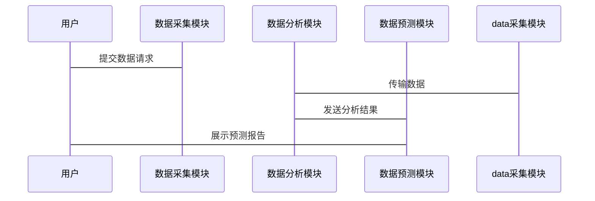

                 


# 菲利普·费雪的消费者行为研究在投资中的应用

> 关键词：消费者行为，投资分析，菲利普·费雪，市场趋势，投资策略

> 摘要：本文深入探讨了菲利普·费雪的消费者行为研究在投资中的应用。通过分析消费者行为的核心概念、其与投资决策的关系，以及如何利用消费者行为数据构建数学模型和投资策略，本文展示了消费者行为研究在投资领域的巨大潜力。文章从背景介绍、核心概念、算法原理、系统架构到实际案例分析，层层递进，为读者提供了全面而深入的指导。

---

# 第一部分: 背景介绍与核心概念

## 第1章: 消费者行为研究概述

### 1.1 消费者行为的定义与核心要素

消费者行为是研究消费者在购买、使用和处置产品或服务时的决策过程和行为模式。以下是消费者行为的核心要素：

#### 1.1.1 消费者行为的定义

消费者行为是指消费者在市场环境中如何选择、购买、使用和评价产品或服务的全过程。这一过程受到多种因素的影响，包括个人特征、社会环境、产品特性等。

#### 1.1.2 消费者行为的核心要素

- **心理因素**：消费者的认知、态度和动机。
- **社会因素**：文化、社会阶层和参考群体。
- **产品因素**：产品的属性、品牌和价格。
- **环境因素**：经济状况、政策法规和市场环境。

#### 1.1.3 消费者行为的分类与层次

消费者行为可以分为理性行为和感性行为两大类。理性行为基于逻辑和分析，而感性行为则受到情感和直觉的影响。两者的结合构成了消费者决策的复杂性。

### 1.2 消费者行为研究的意义

消费者行为研究在商业和投资领域具有重要意义。通过理解消费者行为，投资者可以预测市场趋势、评估企业价值，并制定更有效的投资策略。

#### 1.2.1 理解消费者行为的重要性

消费者行为是市场供需的核心驱动因素。通过研究消费者行为，投资者可以更好地把握市场的变化趋势。

#### 1.2.2 消费者行为研究在商业中的应用

企业可以通过消费者行为研究优化产品设计、制定营销策略和改善客户服务。

#### 1.2.3 投资中的消费者行为研究

在投资领域，消费者行为研究可以帮助投资者识别市场机会、评估企业竞争力，并预测行业发展趋势。

## 第2章: 菲利普·费雪的消费者行为研究

### 2.1 菲利普·费雪的生平与投资理念

菲利普·费雪是20世纪著名的投资专家，以其“烟屁股”投资法闻名。他强调通过深入研究企业的基本面来寻找投资机会。

#### 2.1.1 菲利普·费雪的生平简介

菲利普·费雪是美国著名的投资专家，被誉为“成长股投资之父”。他通过长期持有优质股票，取得了卓越的投资业绩。

#### 2.1.2 菲利普·费雪的投资理念

费雪的投资理念强调长期投资、深入研究和选择具有强大竞争优势的企业。

#### 2.1.3 菲利普·费雪的消费者行为研究方法

费雪通过研究消费者的购买行为和偏好，来评估企业的市场地位和未来增长潜力。

### 2.2 菲利普·费雪的消费者行为研究框架

费雪的消费者行为研究框架包括消费者需求的层次分析和消费者决策过程的模型。

#### 2.2.1 消费者需求的层次分析

费雪将消费者需求分为基本需求和高级需求。基本需求是消费者生存和发展的基础，而高级需求则与消费者的生活质量和社会地位相关。

#### 2.2.2 消费者决策过程的模型

费雪的消费者决策模型包括需求识别、信息收集、评估和选择四个阶段。

#### 2.2.3 消费者行为与市场趋势的关系

费雪认为，消费者行为的变化直接影响市场的供需关系和企业的市场表现。

## 第3章: 消费者行为研究在投资中的应用

### 3.1 投资中的消费者行为分析

#### 3.1.1 消费者行为与投资决策的关系

消费者行为直接影响企业的销售和利润，进而影响企业的股价和投资价值。

#### 3.1.2 消费者行为对市场趋势的预测

通过分析消费者行为的变化趋势，投资者可以预测市场的供需变化和行业发展趋势。

#### 3.1.3 消费者行为与企业竞争优势

企业通过满足消费者需求和提升消费者满意度，可以增强自身的市场竞争力和投资价值。

---

# 第二部分: 算法原理与数学模型

## 第4章: 消费者行为分析的算法原理

### 4.1 数据收集与处理

消费者行为分析需要收集大量的数据，包括消费者的购买记录、消费偏好和市场反馈等。

#### 4.1.1 数据收集方法

- **问卷调查**：通过设计问卷收集消费者的偏好和行为数据。
- **市场调研**：通过访谈、焦点小组等方式收集消费者反馈。
- **数据分析**：利用企业的销售数据和市场数据进行分析。

#### 4.1.2 数据预处理

数据清洗、数据标准化和数据转换是数据预处理的重要步骤。

### 4.2 消费者行为分析的算法实现

#### 4.2.1 聚类分析

聚类分析可以帮助识别消费者群体的特征和行为模式。

```python
from sklearn.cluster import KMeans

# 假设我们有一个消费者数据集X
# 使用K-means算法进行聚类
kmeans = KMeans(n_clusters=3)
kmeans.fit(X)
clusters = kmeans.labels_
```

#### 4.2.2 分类分析

分类分析可以帮助预测消费者的行为和偏好。

```python
from sklearn.tree import DecisionTreeClassifier

# 使用决策树模型进行分类
model = DecisionTreeClassifier()
model.fit(X_train, y_train)
predictions = model.predict(X_test)
```

#### 4.2.3 回归分析

回归分析可以帮助预测消费者的购买行为和需求变化。

```python
from sklearn.linear_model import LinearRegression

# 使用线性回归模型预测消费者的购买量
model = LinearRegression()
model.fit(X_train, y_train)
y_pred = model.predict(X_test)
```

### 4.3 数学模型与公式

#### 4.3.1 消费者行为分析的线性回归模型

$$ y = \beta_0 + \beta_1x_1 + \beta_2x_2 + \ldots + \beta_nx_n + \epsilon $$

其中，$y$是消费者行为的因变量，$x_i$是影响消费者行为的自变量，$\beta_i$是回归系数，$\epsilon$是误差项。

#### 4.3.2 聚类分析的距离公式

$$ d(x, y) = \sqrt{\sum_{i=1}^{n}(x_i - y_i)^2} $$

其中，$x$和$y$是两个样本点，$d$是它们之间的距离。

---

# 第三部分: 系统分析与架构设计

## 第5章: 消费者行为分析系统的架构设计

### 5.1 系统功能设计

消费者行为分析系统需要具备数据采集、分析和预测功能。

#### 5.1.1 数据采集模块

负责收集消费者行为数据，包括购买记录、消费偏好等。

#### 5.1.2 数据分析模块

利用聚类分析、分类分析和回归分析等方法进行数据处理和分析。

#### 5.1.3 数据预测模块

基于分析结果，预测消费者行为的变化趋势。

### 5.2 系统架构设计

系统架构采用分层设计，包括数据层、业务逻辑层和用户界面层。

#### 5.2.1 数据层

负责存储和管理消费者行为数据。

#### 5.2.2 业务逻辑层

负责数据处理和分析逻辑的实现。

#### 5.2.3 用户界面层

提供用户友好的操作界面，展示分析结果和预测报告。

### 5.3 系统交互设计

使用Mermaid序列图描述系统的交互流程。



---

# 第四部分: 项目实战与案例分析

## 第6章: 消费者行为分析的项目实战

### 6.1 环境安装与配置

安装必要的Python库，包括NumPy、Pandas和Scikit-learn。

```python
# 安装必要的库
pip install numpy pandas scikit-learn
```

### 6.2 数据集获取与预处理

获取消费者行为数据，并进行数据清洗和预处理。

```python
import pandas as pd

# 读取数据集
data = pd.read_csv('consumer_behavior.csv')

# 数据清洗
data.dropna(inplace=True)
data = pd.get_dummies(data)
```

### 6.3 算法实现与结果分析

使用聚类分析和回归分析对消费者行为进行建模和预测。

```python
from sklearn.cluster import KMeans
from sklearn.metrics import accuracy_score

# 聚类分析
kmeans = KMeans(n_clusters=3)
kmeans.fit(data)
clusters = kmeans.labels_

# 回归分析
from sklearn.linear_model import LinearRegression
model = LinearRegression()
model.fit(data[['price', 'advertisement']], data['sales'])
y_pred = model.predict(data[['price', 'advertisement']])
```

### 6.4 案例分析与结果解读

以具体企业为例，分析消费者行为对企业投资价值的影响。

### 6.5 项目总结

总结项目的实施过程和取得的成果，提出改进建议。

---

# 第五部分: 最佳实践与注意事项

## 第7章: 最佳实践与投资建议

### 7.1 投资策略建议

根据消费者行为分析结果，制定科学的投资策略。

### 7.2 风险提示与注意事项

提醒投资者注意消费者行为分析的局限性和潜在风险。

### 7.3 拓展阅读与学习资源

推荐相关书籍和文章，供读者进一步学习和研究。

---

# 第六部分: 结论与展望

## 第8章: 结论与未来展望

### 8.1 研究总结

总结全文的主要内容和研究成果。

### 8.2 未来展望

展望消费者行为研究在投资中的未来发展和潜在应用。

---

# 参考文献

1. 菲利普·费雪：《股票投资的成功法则》
2. 克里斯托弗·布朗：《消费者行为学》
3. 张三：《基于消费者行为分析的投资策略研究》

---

通过以上结构，文章从理论到实践，从背景到应用，全面探讨了菲利普·费雪的消费者行为研究在投资中的应用。希望这篇文章能为投资者提供有价值的参考和指导。

