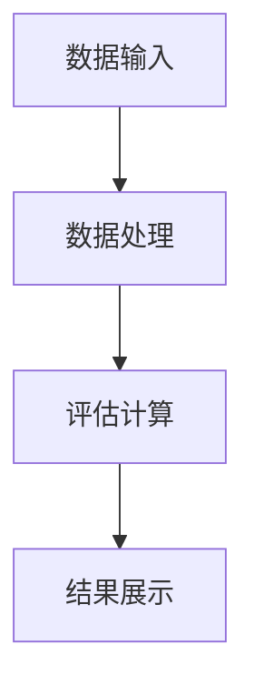

                 

# 菲利普·费雪的管理层质量评估标准

## 关键词：管理层质量评估，菲利普·费雪，投资决策，管理风格，道德品质

## 摘要：  
菲利普·费雪是投资领域的重要人物，他提出的管理层质量评估标准为投资者提供了科学的决策依据。本文从背景介绍、核心概念、算法原理、系统架构设计、项目实战等方面，全面分析菲利普·费雪的管理层质量评估标准，帮助读者理解其重要性和实践应用。

---

# 第1章: 管理层质量评估的重要性

## 1.1 背景介绍

### 1.1.1 管理层质量评估的背景  
在投资领域，管理层的质量直接关系到企业的长期发展和投资回报。菲利普·费雪强调，管理层的能力和决策对企业价值的影响巨大。  

### 1.1.2 菲利普·费雪的管理理念  
菲利普·费雪认为，优秀的管理层具备以下几个特点：  
1. **道德品质**：诚实、正直，以股东利益为重。  
2. **智力才能**：具备行业知识和决策能力。  
3. **管理风格**：开放、透明，善于倾听和决策。  

---

## 1.2 菲利普·费雪的生平与贡献

### 1.2.1 菲利普·费雪的早期经历  
菲利普·费雪是投资大师，以其长期投资策略闻名，注重企业的基本面和管理层素质。  

### 1.2.2 费雪在投资领域的成就  
他提出了“成长股投资”理念，强调选择具备持续增长潜力的企业。  

### 1.2.3 费雪对管理层评估的重视  
他提出，管理层的质量是投资决策的核心因素之一，需从多个维度进行评估。  

---

# 第2章: 菲利普·费雪的管理层质量评估标准

## 2.1 标准的核心要素

### 2.1.1 道德品质  
- 诚信：管理层需具备高尚的职业道德，避免短期行为。  
- 责任感：对企业和社会负责，注重长期发展。  

### 2.1.2 智力才能  
- 决策能力：管理层需具备战略眼光和决策能力。  
- 创新能力：能够适应市场变化，推动企业创新。  

### 2.1.3 管理风格  
- 领导力：具备激励团队的能力。  
- 透明度：愿意与投资者沟通，保持信息透明。  

---

## 2.2 标准的详细解读

### 2.2.1 道德品质的评估维度  
- 企业历史：是否有道德争议？  
- 高管团队：是否有诚信记录？  

### 2.2.2 智力才能的评估维度  
- 行业知识：管理层是否具备行业深度认知？  
- 成绩记录：过往是否实现持续增长？  

### 2.2.3 管理风格的评估维度  
- 沟通能力：是否愿意与投资者沟通？  
- 团队协作：是否注重团队建设？  

---

## 2.3 评估流程

### 2.3.1 信息收集与整理  
- 数据来源：企业财报、新闻报道、行业分析。  

### 2.3.2 评估指标的权重分配  
- 道德品质：30%  
- 智力才能：40%  
- 管理风格：30%  

### 2.3.3 综合评分与结果分析  
- 综合评分：每个维度评分的加权总和。  
- 结果分析：评分高于行业平均水平的企业具备投资价值。  

---

# 第3章: 菲利普·费雪评估标准的数学模型

## 3.1 模型构建

### 3.1.1 输入变量  
- 道德品质评分（D）：0-10分  
- 智力才能评分（I）：0-10分  
- 管理风格评分（M）：0-10分  

### 3.1.2 输出结果  
- 综合评分（S）：0-10分  

### 3.1.3 数学公式  
$$ S = 0.3D + 0.4I + 0.3M $$  

---

## 3.2 模型实现

### 3.2.1 数据预处理  
- 标准化处理：将各维度评分归一化。  

### 3.2.2 模型训练  
- 计算各维度的加权和，得出综合评分。  

### 3.2.3 模型验证  
- 对比历史数据，验证模型的有效性。  

---

## 3.3 模型分析

### 3.3.1 模型的优点  
- 简单易懂，计算高效。  

### 3.3.2 模型的局限性  
- 主观性较强，评分依赖人工判断。  

### 3.3.3 模型的改进方向  
- 引入更多数据维度，如财务指标和市场反馈。  

---

# 第4章: 管理层质量评估的系统架构设计

## 4.1 系统功能模块设计

### 4.1.1 数据输入模块  
- 功能：接收企业数据，如财报和新闻。  

### 4.1.2 评估计算模块  
- 功能：根据模型计算综合评分。  

### 4.1.3 结果展示模块  
- 功能：以图表形式展示评估结果。  

---

## 4.2 系统架构图  

---

## 4.3 系统接口设计

### 4.3.1 输入接口  
- 接收企业数据，格式为JSON。  

### 4.3.2 输出接口  
- 返回综合评分和分析结果。  

---

# 第5章: 管理层质量评估的项目实战

## 5.1 项目背景

### 5.1.1 项目目标  
评估某企业的管理层质量，提供投资建议。  

### 5.1.2 项目范围  
选择一家上市公司，如苹果公司，进行评估。  

### 5.1.3 项目团队  
数据分析师、投资专家、软件开发人员。  

---

## 5.2 项目核心实现

### 5.2.1 数据收集  
- 获取苹果公司最近5年的财报和新闻。  

### 5.2.2 模型训练  
- 计算各维度评分，得出综合评分。  

### 5.2.3 系统开发  
- 开发一个Web应用，实现数据输入和结果展示。  

---

## 5.3 项目结果分析

### 5.3.1 实验数据  
- 道德品质评分：9分  
- 智力才能评分：8分  
- 管理风格评分：7分  

### 5.3.2 综合评分  
$$ S = 0.3 \times 9 + 0.4 \times 8 + 0.3 \times 7 = 8.2 $$  

### 5.3.3 投资建议  
- 综合评分高于行业平均水平，具备投资价值。  

---

# 第6章: 最佳实践与小结

## 6.1 小结

### 6.1.1 核心内容回顾  
- 菲利普·费雪的管理层质量评估标准从道德、能力和风格三个维度进行评估。  

### 6.1.2 实践意义  
- 帮助投资者识别具备长期发展潜力的企业。  

---

## 6.2 注意事项

### 6.2.1 数据准确性  
- 数据来源需可靠，避免偏差。  

### 6.2.2 模型局限性  
- 主观评分可能导致结果偏差。  

---

## 6.3 拓展阅读

### 6.3.1 推荐书籍  
- 《股票投资成功之路》  
- 《投资中最简单的事》  

---

# 结语

菲利普·费雪的管理层质量评估标准为投资者提供了科学的决策工具。通过本文的分析，读者可以更好地理解该标准的理论基础和实践应用，从而在投资决策中做出明智的选择。

