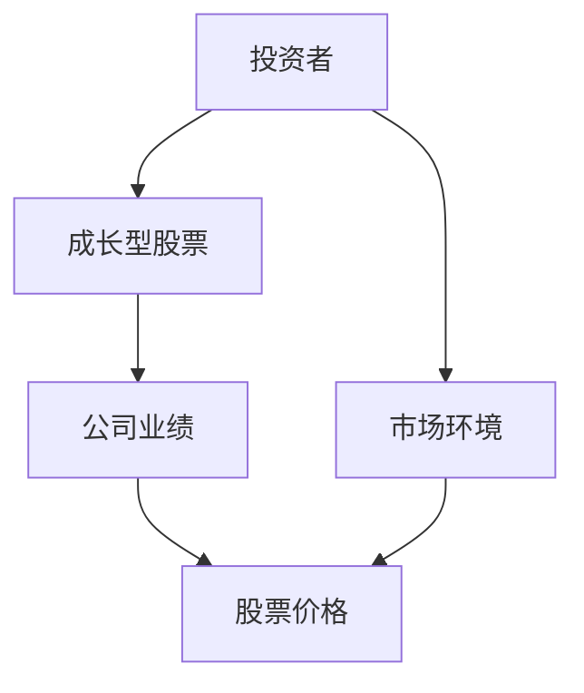

                 


# 菲利普·费雪：成长型股票投资的先驱

## 关键词：菲利普·费雪、成长型投资、股票投资、投资策略、投资理念

## 摘要：菲利普·费雪是成长型股票投资领域的先驱，他的投资理念强调长期持有优质成长股，注重公司基本面和管理团队。本文系统分析了成长型投资的核心概念、算法原理、系统架构，并通过实际案例展示了其投资方法的应用。

---

## 第一部分：菲利普·费雪投资理念的背景与核心概念

### 第1章：菲利普·费雪与成长型投资的起源

#### 1.1 菲利普·费雪的生平与投资理念

- **1.1.1 菲利普·费雪的早年经历与职业发展**
  - 出生背景：1903年出生于美国伊利诺伊州。
  - 职业生涯：20世纪20年代进入投资行业，逐渐发展出独特的投资理念。
  - 核心思想：长期持有优质成长股，注重公司基本面和管理团队。

- **1.1.2 费雪对投资界的贡献与影响**
  - 成长型投资的奠基人，提出了“成长股”的概念。
  - 通过长期持有优质股票，实现财富的持续增长。

- **1.1.3 费雪投资理念的核心思想**
  - 买入优质成长股，长期持有，忽略短期市场波动。
  - 强调公司基本面分析，尤其是净利润增长率和收入增长率。

#### 1.2 成长型投资的定义与特点

- **1.2.1 成长型投资的定义**
  - 成长型投资是指投资于那些收入和利润快速增长的公司股票。
  - 这种投资策略强调公司的成长潜力，而非当前的估值。

- **1.2.2 成长型投资的核心特征**
  - 收入增长率高。
  - 净利润增长率快。
  - 具备强大的竞争优势和市场前景。

- **1.2.3 成长型投资与价值投资的区别**
  - 价值投资关注低估的股票，强调安全边际。
  - 成长型投资关注高增长的股票，强调未来潜力。

#### 1.3 成长型投资的边界与外延

- **1.3.1 成长型投资的适用场景**
  - 经济快速增长阶段。
  - 高成长行业（如科技、互联网）。
  - 初期发展阶段的公司。

- **1.3.2 成长型投资的局限性**
  - 市场波动大，短期可能大幅回撤。
  - 对宏观经济周期敏感。
  - 高成长公司可能面临高估值风险。

- **1.3.3 成长型投资与其他投资策略的关系**
  - 成长型投资可以与其他策略结合使用，如在经济周期不同阶段切换策略。

#### 1.4 成长型投资的ER实体关系图



---

## 第2章：成长型投资的核心概念与联系

### 2.1 成长型投资的核心概念原理

#### 2.1.1 成长型投资的核心概念

- 成长型股票：具备高收入增长率和高净利润增长率的公司股票。
- 成长股识别：通过财务指标（如ROE、收入增长率、净利润增长率）筛选。

#### 2.1.2 成长型投资的核心要素对比

| 对比维度 | 成长型投资 | 价值型投资 |
|----------|------------|------------|
| 核心目标 | 寻找高增长公司 | 寻找低估值公司 |
| 估值标准 | 市盈率高，PEG < 1 | 市盈率低，市净率低 |
| 风险特征 | 高风险，波动大 | 中低风险，波动小 |

---

## 第3章：成长型投资的算法原理

### 3.1 成长型投资的筛选算法

#### 3.1.1 算法步骤

1. 筛选高收入增长率的公司。
2. 筛选高净利润增长率的公司。
3. 综合评估公司的财务健康状况。
4. 确定最终的投资标的。

#### 3.1.2 算法实现

```python
def screen_growth_stocks(stocks):
    growth_stocks = []
    for stock in stocks:
        if (stock.net_income_growth > 20) and (stock.revenue_growth > 15):
            growth_stocks.append(stock)
    return growth_stocks
```

---

## 第4章：成长型投资的系统分析与架构设计

### 4.1 投资决策系统场景介绍

#### 4.1.1 系统目标

- 筛选出符合条件的高成长股票。
- 提供投资决策支持。

#### 4.1.2 系统用户

- 机构投资者。
- 个人投资者。

---

## 第5章：项目实战

### 5.1 环境安装

- Python环境：Python 3.8以上。
- 第三方库：Pandas、NumPy、Matplotlib。

### 5.2 核心实现

#### 5.2.1 数据获取与处理

```python
import pandas as pd

# 获取股票数据
stocks = pd.read_csv('stocks.csv')

# 筛选高成长股票
growth_stocks = stocks[(stocks['net_income_growth'] > 20) &
                        (stocks['revenue_growth'] > 15)]
```

#### 5.2.2 可视化分析

```python
import matplotlib.pyplot as plt

plt.figure(figsize=(10, 6))
plt.plot(growth_stocks['stock_price'], label='成长股价格')
plt.xlabel('时间')
plt.ylabel('股价')
plt.legend()
plt.show()
```

---

## 第6章：总结与展望

### 6.1 总结

菲利普·费雪的成长型投资理念强调长期持有优质成长股，注重公司基本面分析。本文从背景、核心概念、算法原理、系统架构到项目实战，全面分析了成长型投资的方法。

### 6.2 展望

未来，成长型投资将继续在全球市场中发挥重要作用。投资者需要结合宏观经济环境和行业趋势，灵活调整投资策略。

---

## 注意事项

- 投资有风险，需谨慎决策。
- 长期投资需结合市场环境和公司基本面。

---

## 拓展阅读

- 《菲利普·费雪投资哲学》。
- 《股票投资实战技巧》。

通过本文的系统分析，读者可以更好地理解菲利普·费雪的成长型投资理念，并在实际投资中灵活运用。

