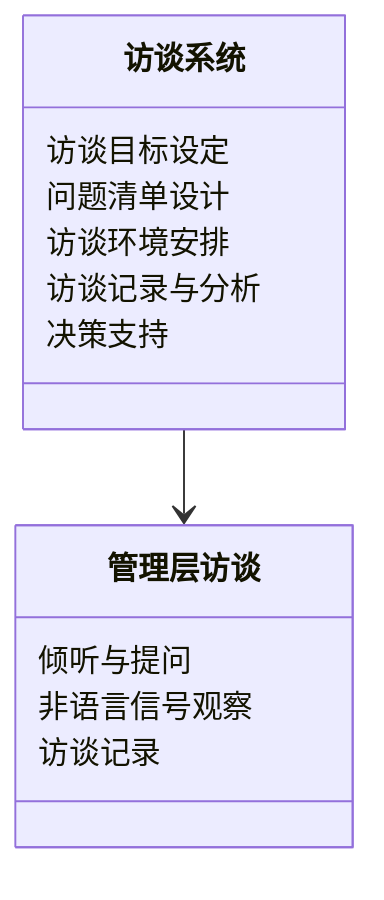
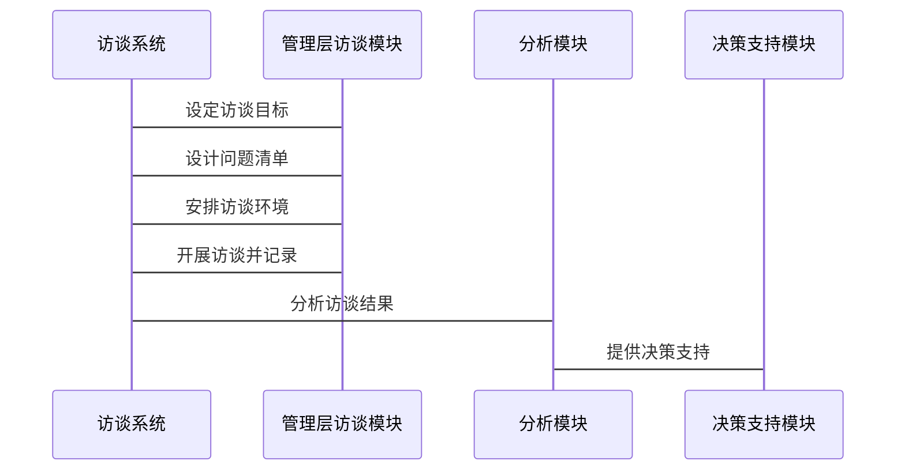

                 


# 《菲利普费雪的管理层访谈技巧》

## 关键词：菲利普费雪、管理层访谈、投资技巧、提问技巧、非语言信号、决策模型

## 摘要：  
菲利普·费雪是投资领域的重要人物，他提出的管理层访谈技巧为投资者提供了独特的方法。本文将详细分析菲利普·费雪的访谈技巧，包括准备、提问、倾听、分析和决策等关键环节。通过结合实际案例和系统分析，本文将揭示这些技巧如何帮助投资者做出明智的决策。

---

# 第1章: 管理层访谈的背景与重要性

## 1.1 管理层访谈的基本概念
### 1.1.1 访谈的定义与核心要素
- 访谈是一种通过直接交流获取信息的方法。
- 核心要素包括目标、问题、倾听和记录。

### 1.1.2 管理层访谈在投资决策中的作用
- 通过访谈获取管理层的思路和决策风格。
- 帮助投资者评估公司的潜力和风险。

### 1.1.3 菲利普·费雪的访谈方法与理念
- 费雪强调通过访谈了解管理层的质量和决策能力。
- 访谈是投资决策中的关键步骤。

## 1.2 管理层访谈的背景与重要性
### 1.2.1 投资决策中的信息获取需求
- 投资者需要多渠道获取信息，包括财务数据和管理层访谈。
- 访谈提供了第一手的公司内部信息。

### 1.2.2 管理层访谈的背景分析
- 访谈通常在公司基本面分析之后进行。
- 通过访谈验证财务数据和行业趋势。

### 1.2.3 菲利普·费雪访谈技巧的核心价值
- 费雪的技巧帮助投资者识别管理层的能力和诚信。
- 访谈结果对投资决策具有重要参考价值。

## 1.3 本章小结
- 管理层访谈是投资决策的重要工具。
- 费雪的访谈技巧提供了系统化的方法。

---

# 第2章: 访谈前的充分准备

## 2.1 访谈目标的设定
### 2.1.1 确定访谈的核心目标
- 明确访谈的目的，例如评估管理层的战略能力和公司前景。

### 2.1.2 目标与投资决策的关系
- 访谈结果将直接影响投资决策。
- 设定具体目标有助于提高访谈效率。

### 2.1.3 如何制定具体的访谈计划
- 列出关键问题，安排访谈时间和地点。

## 2.2 访谈前的信息收集与分析
### 2.2.1 公司基本面的初步分析
- 研究公司的财务报表、市场地位和竞争优势。

### 2.2.2 行业趋势与竞争环境研究
- 了解行业动态和公司所处的竞争环境。

### 2.2.3 财务数据与管理层行为的关联性
- 分析财务数据与管理层决策之间的关系。

## 2.3 菲利普·费雪的准备工作方法
### 2.3.1 问题清单的制定与优化
- 根据公司特点设计问题，确保问题具有针对性。

### 2.3.2 访谈对象的选择与筛选
- 选择关键人物进行访谈，例如CEO和 CFO。

### 2.3.3 访谈环境的安排与注意事项
- 选择安静的环境，确保访谈顺利进行。

## 2.4 本章小结
- 充分的准备是成功访谈的关键。
- 费雪的准备工作方法提供了系统的指导。

---

# 第3章: 访谈中的技巧与策略

## 3.1 倾听与提问技巧
### 3.1.1 倾听的核心原则
- 专注倾听，避免打断对方。
- 通过倾听获取更多信息。

### 3.1.2 提问的逻辑框架与技巧
- 设计开放式问题，引导对方详细回答。
- 使用追问技巧，深入探讨关键问题。

### 3.1.3 如何通过提问引导对话
- 根据对方的回答调整后续问题。
- 使用引导性问题帮助对方展开话题。

## 3.2 非语言信号的观察与解读
### 3.2.1 身体语言的基本解读
- 观察对方的肢体语言，判断其情绪和态度。

### 3.2.2 语气与表情的分析
- 注意对方的语气和表情，识别其真实意图。

### 3.2.3 如何通过非语言信号判断管理层态度
- 结合语言和非语言信号，全面评估对方的态度。

## 3.3 访谈中的应对策略
### 3.3.1 应对突发问题的技巧
- 遇到意外问题时，保持冷静，灵活应对。

### 3.3.2 如何处理管理层的回避或模糊回答
- 通过追问和引导，获取更多信息。

### 3.3.3 菲利普·费雪的特殊提问技巧
- 费雪的提问技巧包括“假设性问题”和“情景模拟问题”。

## 3.4 本章小结
- 倾听和提问是访谈的核心技巧。
- 非语言信号的观察有助于全面评估对方。

---

# 第4章: 访谈后的分析与决策

## 4.1 访谈信息的整理与分析
### 4.1.1 如何记录与分类访谈内容
- 将访谈内容分类整理，便于后续分析。

### 4.1.2 信息的交叉验证与逻辑分析
- 通过多源信息验证，确保分析的准确性。

### 4.1.3 财务数据与访谈信息的结合
- 将访谈结果与财务数据结合，全面评估公司价值。

## 4.2 菲利普·费雪的决策模型
### 4.2.1 决策模型的核心要素
- 包括管理层能力、公司前景和行业趋势。

### 4.2.2 如何通过访谈结果评估管理层质量
- 根据访谈结果评估管理层的能力和诚信。

### 4.2.3 费雪投资理念与访谈结果的结合
- 将访谈结果与投资理念结合，制定投资策略。

## 4.3 本章小结
- 访谈后的分析是投资决策的关键步骤。
- 费雪的决策模型提供了系统的分析框架。

---

# 第5章: 系统分析与架构设计

## 5.1 系统功能设计（领域模型）
### 5.1.1 问题场景介绍
- 介绍访谈系统的应用场景和目标。

### 5.1.2 领域模型设计（mermaid类图）


### 5.1.3 系统架构设计（mermaid架构图）


## 5.2 系统接口设计
### 5.2.1 访谈系统的核心接口
- 提供目标设定、问题设计、记录分析等功能的接口。

### 5.2.2 与外部系统的接口
- 与财务数据系统、行业趋势分析系统对接。

## 5.3 系统交互设计（mermaid序列图）


## 5.4 本章小结
- 系统分析与设计为访谈提供了技术支持。
- 通过系统架构优化访谈流程。

---

# 第6章: 项目实战

## 6.1 环境安装与配置
### 6.1.1 安装必要的工具与库
- 安装Python、Jupyter Notebook、Mermaid工具等。

### 6.1.2 配置开发环境
- 配置代码编辑器和版本控制系统。

## 6.2 核心代码实现
### 6.2.1 访谈记录与分析的代码实现
```python
# 访谈记录与分析代码示例
import pandas as pd
import numpy as np

def analyze_interview_transcript(transcript):
    # 分析访谈记录，提取关键词和主题
    keywords = ['strategy', 'growth', 'risk', 'market']
    transcript_text = ' '.join(transcript)
    word_counts = {}
    for keyword in keywords:
        count = transcript_text.lower().count(keyword)
        word_counts[keyword] = count
    return word_counts

# 示例数据
transcript = [
    "Our strategy is to expand into new markets.",
    "We believe the market has significant growth potential.",
    "We are prepared to handle any risks associated with expansion."
]
result = analyze_interview_transcript(transcript)
print(result)
```

### 6.2.2 数据可视化与分析代码
```python
import matplotlib.pyplot as plt

# 数据可视化示例
data = {'市场增长': [85, 70, 65], '风险管理': [70, 80, 85]}
df = pd.DataFrame(data)
df.plot(kind='bar', figsize=(10,6))
plt.title('管理层对市场增长和风险管理的关注度')
plt.show()
```

## 6.3 案例分析与详细解读
### 6.3.1 案例背景
- 某公司访谈案例，分析管理层的战略规划。

### 6.3.2 访谈记录分析
- 使用代码分析访谈记录，提取关键词和主题。

### 6.3.3 决策支持
- 基于分析结果，提供投资建议。

## 6.4 本章小结
- 项目实战展示了访谈技巧的实际应用。
- 代码实现和案例分析提供了具体的操作指导。

---

# 第7章: 总结与最佳实践

## 7.1 最佳实践 tips
### 7.1.1 访谈前的充分准备
- 明确目标，收集充分信息。

### 7.1.2 访谈中的倾听与提问
- 倾听为主，提问为辅，注重非语言信号。

### 7.1.3 访谈后的分析与决策
- 结合财务数据和行业趋势，全面分析访谈结果。

## 7.2 小结
- 菲利普·费雪的访谈技巧为投资者提供了系统的指导。
- 通过实践和系统设计，可以进一步优化访谈流程。

## 7.3 注意事项
### 7.3.1 避免偏见和主观判断
- 保持客观，避免个人偏见影响分析。

### 7.3.2 注意非语言信号的误导性
- 非语言信号仅供参考，需结合语言信号综合判断。

## 7.4 拓展阅读
### 7.4.1 菲利普·费雪的其他投资理念
- 推荐阅读《投资成功之要素》。

### 7.4.2 现代投资分析方法
- 结合现代金融理论，优化投资决策。

---

# 附录: 访谈系统设计的详细代码实现

## 附录1: 访谈记录分析模块
```python
import re

def extract_keywords(text, keywords):
    keyword_counts = {}
    for keyword in keywords:
        keyword_counts[keyword] = len(re.findall(r'\b{}\b'.format(re.escape(keyword)), text.lower()))
    return keyword_counts

# 示例
text = "Our strategy is to expand into new markets and we believe the market has significant growth potential. We are prepared to handle any risks associated with expansion."
keywords = ['strategy', 'growth', 'risk']
result = extract_keywords(text, keywords)
print(result)
```

## 附录2: 数据可视化模块
```python
import matplotlib.pyplot as plt

def create_visualization(data, title):
    plt.figure(figsize=(10,6))
    df = pd.DataFrame(data)
    df.plot(kind='bar', title=title)
    plt.show()

# 示例
data = {
    '市场增长': [85, 70, 65],
    '风险管理': [70, 80, 85]
}
create_visualization(data, '管理层对市场增长和风险管理的关注度')
```

---

# 结语

菲利普·费雪的管理层访谈技巧为投资者提供了独特的视角和方法。通过系统的准备、精准的提问和深入的分析，投资者可以更好地评估公司价值，做出明智的投资决策。希望本文的分析和实战案例能够为读者提供有价值的参考。

