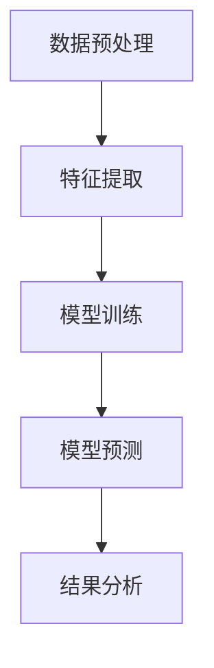
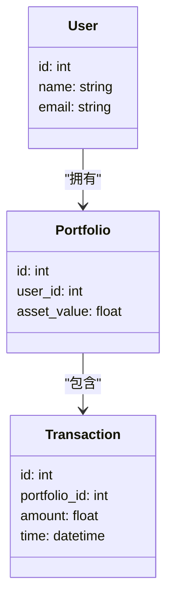
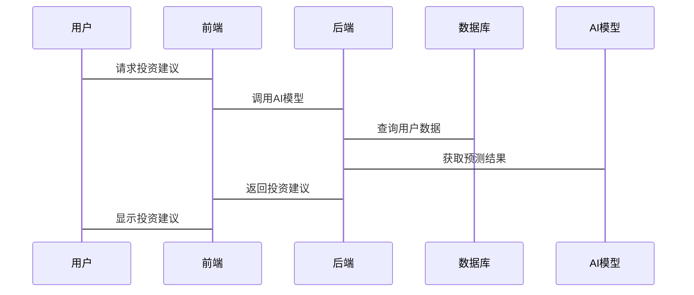

                 


```markdown
# 融合AI技术的新一代投资理财教育平台

## 关键词：AI技术、投资理财、教育平台、机器学习、自然语言处理

## 摘要：本文探讨了如何将AI技术融入投资理财教育平台，提升个性化学习和决策支持。通过分析核心概念、算法原理和系统架构，结合项目实战，展示了AI在投资理财教育中的潜力与应用。

---

## 第1章: 融合AI技术的投资理财教育平台背景

### 1.1 问题背景与问题描述
#### 1.1.1 投资理财教育的现状与挑战
当前，投资理财教育面临以下挑战：
- **信息过载**：投资者面对海量金融数据，难以快速提取关键信息。
- **个性化需求**：不同投资者的风险承受能力和财务目标差异大，传统教育难以满足个性化需求。
- **实时性要求**：金融市场波动频繁，教育内容需要实时更新。

#### 1.1.2 AI技术在金融领域的应用潜力
AI技术在金融领域的应用潜力主要体现在：
- **数据处理**：AI能够高效处理和分析大量金融数据。
- **预测模型**：AI可以通过机器学习构建预测模型，帮助投资者做出决策。
- **个性化服务**：AI可以根据用户需求提供定制化建议。

#### 1.1.3 用户需求与痛点分析
用户在投资理财教育中的主要需求包括：
- 获取个性化的投资建议。
- 获得实时的市场动态和分析。
- 学习投资知识的便捷性和互动性。

### 1.2 问题解决与边界定义
#### 1.2.1 AI技术如何解决投资理财教育问题
AI技术可以通过以下方式解决投资理财教育中的问题：
- **数据挖掘与分析**：利用AI技术对海量数据进行分析，提取有价值的信息。
- **自然语言处理**：通过NLP技术，帮助用户快速理解复杂的金融信息。
- **机器学习预测**：构建预测模型，为用户提供投资建议。

#### 1.2.2 平台的功能边界与外延
平台的功能边界包括：
- 提供个性化投资建议。
- 实时市场动态分析。
- 在线投资课程和互动社区。
- 风险评估与预警。

#### 1.2.3 核心概念与要素组成
核心概念包括：
- 数据处理模块：负责数据的采集、清洗和存储。
- 模型构建模块：负责构建机器学习模型。
- 用户交互模块：负责用户界面和交互设计。

### 1.3 本章小结
本章介绍了投资理财教育的现状与挑战，探讨了AI技术在该领域的应用潜力，并定义了平台的功能边界与核心概念。

---

## 第2章: AI技术在投资理财教育中的核心概念

### 2.1 核心概念原理
#### 2.1.1 数据挖掘与分析
数据挖掘是AI技术的重要组成部分，主要用于从海量数据中提取有价值的信息。常见的数据挖掘技术包括：
- **聚类分析**：将相似的数据点分组，帮助发现数据中的模式。
- **分类分析**：根据已有数据，预测新数据的类别。
- **回归分析**：用于预测连续型变量的值。

#### 2.1.2 自然语言处理
自然语言处理（NLP）用于理解和处理人类语言，主要应用于：
- **文本分类**：将金融新闻分类为正面、负面或中性。
- **情感分析**：分析文本中的情感倾向，帮助投资者判断市场情绪。
- **实体识别**：识别文本中的公司名称、日期等实体。

#### 2.1.3 机器学习与预测
机器学习用于构建预测模型，帮助投资者做出决策。常用算法包括：
- **线性回归**：用于预测连续型变量。
- **决策树**：用于分类和回归问题。
- **随机森林**：一种基于决策树的集成学习方法。

### 2.2 核心概念属性对比
#### 2.2.1 技术特征对比表格
以下是一个对比表格：

| 技术 | 数据处理能力 | 实时性 | 可解释性 |
|------|--------------|--------|----------|
| 线性回归 | 强 | 较低 | 高 |
| 决策树 | 较强 | 中等 | 较低 |
| 随机森林 | 强 | 较高 | 较低 |

#### 2.2.2 ER实体关系图
```mermaid
erDiagram
    user {
        +id: int
        +name: string
        +email: string
    }
    portfolio {
        +id: int
        +user_id: int
        +asset_value: float
    }
    transaction {
        +id: int
        +portfolio_id: int
        +amount: float
        +time: datetime
    }
    user --> portfolio : "拥有"
    portfolio --> transaction : "包含"
```

### 2.3 本章小结
本章详细介绍了AI技术在投资理财教育中的核心概念，包括数据挖掘、自然语言处理和机器学习，并通过对比和ER图展示了这些技术的特点和关系。

---

## 第3章: AI驱动的投资理财教育算法原理

### 3.1 算法原理概述
#### 3.1.1 机器学习模型选择
选择机器学习模型时需要考虑以下因素：
- **数据类型**：是否为分类或回归问题。
- **数据规模**：数据量大小。
- **计算资源**：模型的复杂度。

#### 3.1.2 深度学习模型简介
深度学习模型在投资理财中的应用包括：
- **LSTM网络**：用于时间序列预测。
- **卷积神经网络（CNN）**：用于图像识别和文本分析。

#### 3.1.3 自然语言处理模型的应用
自然语言处理模型在投资理财中的应用包括：
- **文本摘要**：将长文本压缩成摘要。
- **问答系统**：回答投资者的提问。

### 3.2 算法流程图


### 3.3 算法实现代码
以下是一个简单的投资预测模型代码示例：

```python
import pandas as pd
from sklearn.model_selection import train_test_split
from sklearn.ensemble import RandomForestRegressor

# 数据加载
data = pd.read_csv('financial_data.csv')
X = data.drop('target', axis=1)
y = data['target']

# 数据分割
X_train, X_test, y_train, y_test = train_test_split(X, y, test_size=0.2)

# 模型训练
model = RandomForestRegressor(n_estimators=100)
model.fit(X_train, y_train)

# 预测与评估
score = model.score(X_test, y_test)
print(f"模型得分: {score}")
```

### 3.4 本章小结
本章详细介绍了AI驱动的投资理财教育算法原理，包括模型选择、流程图和代码实现。

---

## 第4章: 系统分析与架构设计方案

### 4.1 问题场景介绍
投资理财教育平台需要满足以下需求：
- 实时数据处理。
- 个性化投资建议。
- 用户交互界面。

### 4.2 项目介绍
本项目旨在构建一个基于AI的投资理财教育平台，帮助用户做出明智的投资决策。

### 4.3 系统功能设计
#### 4.3.1 领域模型


#### 4.3.2 系统架构设计


#### 4.3.3 系统接口设计
- **用户注册与登录**：实现用户身份验证。
- **数据查询**：提供API接口查询实时数据。
- **模型调用**：提供API接口调用AI模型。

#### 4.3.4 系统交互设计


### 4.4 本章小结
本章详细介绍了投资理财教育平台的系统架构设计，包括领域模型、架构图和交互图。

---

## 第5章: 项目实战

### 5.1 环境安装
以下是项目所需的环境配置：
- **Python**：3.8及以上版本。
- **机器学习库**：scikit-learn、xgboost。
- **数据处理库**：pandas、numpy。
- **可视化工具**：matplotlib、seaborn。

### 5.2 系统核心实现源代码
以下是一个完整的投资预测模型实现：

```python
import pandas as pd
from sklearn.model_selection import train_test_split
from sklearn.ensemble import RandomForestRegressor
from sklearn.metrics import mean_squared_error

# 数据加载
data = pd.read_csv('financial_data.csv')
X = data.drop('target', axis=1)
y = data['target']

# 数据分割
X_train, X_test, y_train, y_test = train_test_split(X, y, test_size=0.2, random_state=42)

# 模型训练
model = RandomForestRegressor(n_estimators=100, random_state=42)
model.fit(X_train, y_train)

# 预测与评估
y_pred = model.predict(X_test)
mse = mean_squared_error(y_test, y_pred)
print(f"均方误差: {mse}")
print(f"模型得分: {model.score(X_test, y_test)}")
```

### 5.3 代码应用解读与分析
- **数据加载**：从CSV文件加载数据。
- **数据分割**：将数据分为训练集和测试集。
- **模型训练**：使用随机森林算法训练模型。
- **预测与评估**：对测试数据进行预测，并评估模型性能。

### 5.4 实际案例分析
以股票价格预测为例，展示模型的应用和结果。

### 5.5 本章小结
本章通过实际案例展示了投资理财教育平台的实现过程，包括环境配置、代码实现和案例分析。

---

## 第6章: 最佳实践、小结与注意事项

### 6.1 最佳实践 tips
- **数据预处理**：确保数据质量，避免噪声干扰。
- **模型选择**：根据具体问题选择合适的算法。
- **实时更新**：定期更新模型和数据，保持平台的实时性。

### 6.2 本章小结
本章总结了投资理财教育平台的开发经验，提供了最佳实践和注意事项。

### 6.3 注意事项
- **数据隐私**：确保用户数据的安全性和隐私性。
- **模型解释性**：选择解释性较强的模型，方便用户理解。
- **实时性优化**：优化系统性能，提升用户体验。

### 6.4 拓展阅读
推荐相关书籍和论文，帮助读者深入学习AI在金融领域的应用。

---

## 第7章: 结语

### 7.1 未来展望
随着AI技术的不断发展，投资理财教育平台将更加智能化和个性化。

### 7.2 致谢
感谢读者的支持和关注。

### 7.3 关于作者
作者简介及联系方式。

---

## 参考文献
- [1] 书籍或论文参考文献
- [2] 其他参考资料
```

