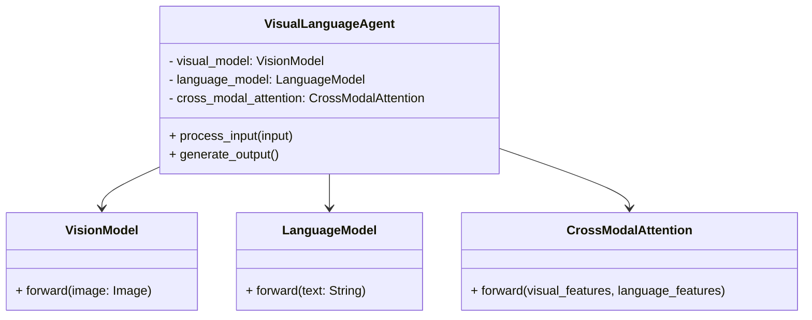
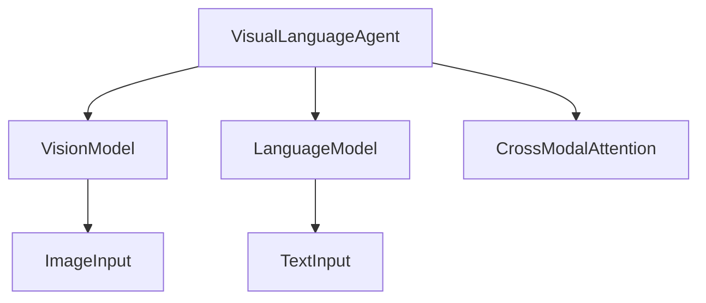
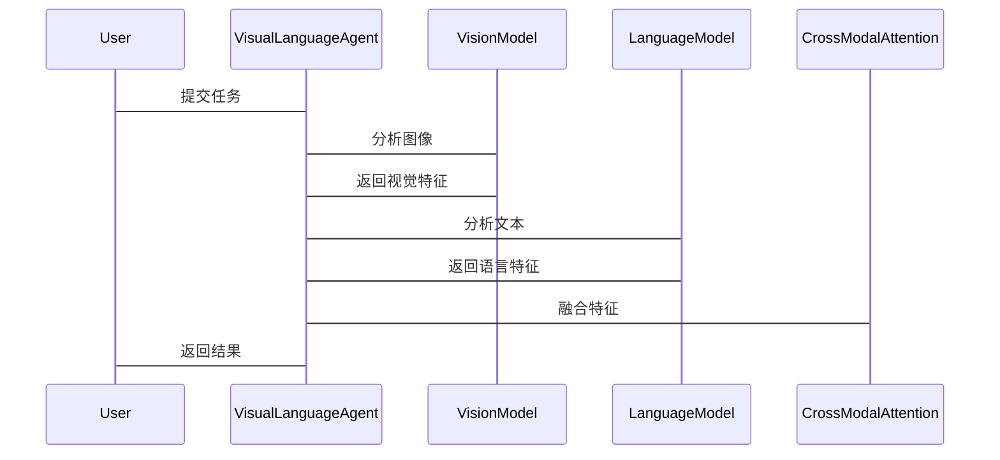

                 


# 视觉-语言AI Agent：整合LLM与图像理解

> 关键词：视觉-语言AI Agent, 大语言模型（LLM）, 图像理解, 多模态模型, 视觉语言预训练, AI交互设计

> 摘要：本文深入探讨了视觉-语言AI Agent的设计与实现，结合大语言模型（LLM）与图像理解技术，分析了其整合原理、算法实现、系统架构及实际应用。通过详细的技术分析与案例解读，为读者提供了一套完整的视觉-语言AI Agent解决方案。

---

## 第一部分: 视觉-语言AI Agent的背景与概念

### 第1章: 视觉-语言AI Agent的背景与概念

#### 1.1 问题背景

##### 1.1.1 当前AI技术的发展趋势
人工智能（AI）技术近年来取得了显著进展，尤其是大语言模型（LLM）和计算机视觉技术的快速发展，为视觉-语言AI Agent的实现奠定了坚实基础。LLM能够处理复杂的自然语言任务，而图像理解技术则能够解析视觉信息，二者的结合为AI Agent提供了更强大的感知和交互能力。

##### 1.1.2 视觉与语言理解的结合需求
在现实场景中，单一的文本或图像处理难以满足复杂任务的需求。例如，在医疗影像分析中，AI Agent需要结合图像特征和相关文献知识；在智能客服中，AI Agent需要理解用户的问题并结合上下文提供准确的回答。这些场景都需要视觉与语言的联合理解能力。

##### 1.1.3 视觉-语言AI Agent的定义与目标
视觉-语言AI Agent是一种能够同时处理视觉和语言信息的智能系统，其目标是通过整合LLM和图像理解技术，实现对多模态数据的深度理解和智能交互。

---

#### 1.2 核心概念

##### 1.2.1 大语言模型（LLM）的基本原理
LLM基于Transformer架构，通过自注意力机制（Self-Attention）处理序列数据，能够理解上下文关系并生成自然语言文本。

##### 1.2.2 图像理解的核心技术
图像理解包括图像分类、目标检测、图像分割等任务，通常基于卷积神经网络（CNN）或基于Transformer的模型实现。

##### 1.2.3 视觉-语言AI Agent的整合方式
视觉-语言AI Agent通过多模态模型将视觉和语言信息进行联合编码和解码，实现跨模态的理解和交互。

---

#### 1.3 应用价值与挑战

##### 1.3.1 视觉-语言AI Agent的应用场景
- 医疗影像分析：结合医学图像和文献信息，辅助医生诊断。
- 智能客服：通过图像和文本交互提供更智能的服务。
- 智能家居：理解用户的语音指令并结合环境信息执行操作。

##### 1.3.2 技术整合中的主要挑战
- 多模态数据的对齐与融合：如何将图像和文本特征有效地结合。
- 模型的可解释性：确保AI Agent的决策过程透明且可追溯。
- 计算资源需求：多模态模型通常需要大量的计算资源。

##### 1.3.3 未来发展的潜力与方向
随着深度学习技术的不断进步，视觉-语言AI Agent将在更多领域得到应用，例如教育、娱乐、工业自动化等。

---

## 第二部分: 大语言模型（LLM）与图像理解的核心技术

### 第2章: 大语言模型（LLM）的核心原理

#### 2.1 LLM的基本原理

##### 2.1.1 深度学习与自然语言处理的结合
深度学习通过神经网络模型学习数据的特征表示，自然语言处理（NLP）则关注语言的结构和语义理解。

##### 2.1.2 Transformer模型的结构与优势
Transformer模型由编码器和解码器组成，通过自注意力机制实现全局上下文的理解。

##### 2.1.3 大模型的训练与优化方法
LLM通常采用大规模数据集进行预训练，并通过微调（Fine-tuning）适应特定任务。

---

#### 2.2 LLM的关键技术

##### 2.2.1 注意力机制的实现原理
注意力机制通过计算输入序列中每个位置的重要性，赋予模型全局上下文的理解能力。

##### 2.2.2 梯度下降与参数优化方法
常用的优化方法包括随机梯度下降（SGD）、Adam优化器等。

##### 2.2.3 模型的可解释性与鲁棒性
可解释性通过可视化注意力权重实现，鲁棒性则通过模型的泛化能力评估。

---

#### 2.3 LLM的应用案例分析

##### 2.3.1 文本生成与对话系统
例如，使用GPT模型生成自然语言对话。

##### 2.3.2 信息抽取与问答系统
例如，从文本中提取实体信息并回答问题。

##### 2.3.3 多语言模型的跨语言理解
例如，模型同时理解和生成多种语言。

---

### 第3章: 图像理解的核心技术

#### 3.1 图像识别与目标检测

##### 3.1.1 基于CNN的图像分类
卷积神经网络通过提取图像的空间特征，实现图像分类任务。

##### 3.1.2 目标检测算法（如Faster R-CNN）
目标检测算法通过定位和识别图像中的目标，实现更精细的图像理解。

##### 3.1.3 图像分割技术
图像分割技术将图像划分为多个区域，每个区域对应不同的语义信息。

---

#### 3.2 图像描述生成

##### 3.2.1 图像到文本的生成模型
基于Transformer的图像描述生成模型，如ViLBERT，能够将图像特征映射到文本描述。

##### 3.2.2 基于注意力机制的图像描述
通过注意力机制，模型能够关注图像中的关键区域，生成更准确的描述。

##### 3.2.3 图像描述的评估指标
常用的评估指标包括BLEU、ROUGE、METEOR等。

---

#### 3.3 图像理解的挑战与解决方案

##### 3.3.1 复杂场景下的图像理解
复杂场景中存在多个目标和背景干扰，需要更强大的模型和数据增强技术。

##### 3.3.2 图像数据的多样性与标注问题
数据多样性不足和标注成本高是图像理解的主要挑战。

##### 3.3.3 图像理解的模型优化方法
模型优化包括轻量化设计、知识蒸馏等技术。

---

## 第三部分: 视觉-语言AI Agent的整合与算法原理

### 第4章: 视觉-语言模型的整合原理

#### 4.1 多模态模型的基本概念

##### 4.1.1 多模态数据的特征分析
多模态数据包括文本、图像、语音等多种形式，需要对每种数据的特征进行提取和对齐。

##### 4.1.2 多模态模型的分类与特点
多模态模型可以分为模态独立模型、模态交互模型和端到端多模态模型。

##### 4.1.3 多模态模型的训练策略
多模态模型通常采用联合训练或预训练-微调策略。

---

#### 4.2 视觉-语言模型的训练流程

##### 4.2.1 数据预处理
对图像数据进行归一化、裁剪等预处理操作，文本数据进行分词和嵌入编码。

##### 4.2.2 模型训练
通过反向传播算法优化模型参数，最小化预测误差。

##### 4.2.3 模型评估
通过准确率、F1分数等指标评估模型的性能。

---

### 第5章: 视觉-语言AI Agent的算法实现

#### 5.1 多模态模型的数学模型

##### 5.1.1 注意力机制的数学表示
$$ \text{Attention}(Q, K, V) = \text{softmax}\left(\frac{QK^T}{\sqrt{d_k}}\right)V $$

##### 5.1.2 多模态融合的数学模型
$$ f(x, y) = g(h_x, h_y) $$

##### 5.1.3 损失函数的定义
$$ \mathcal{L} = -\sum_{i=1}^{n} y_i \log p(y_i) $$

---

#### 5.2 基于Transformer的视觉-语言模型

##### 5.2.1 模型结构
- 视觉特征编码：将图像特征映射到文本空间。
- 语言特征编码：将文本特征映射到图像空间。
- 模型融合：通过注意力机制实现跨模态交互。

##### 5.2.2 实现代码示例
```python
import torch
import torch.nn as nn

class VisualLanguageModel(nn.Module):
    def __init__(self, visual_dim, language_dim):
        super(VisualLanguageModel, self).__init__()
        self.visual_encoder = nn.Linear(visual_dim, 512)
        self.language_encoder = nn.Linear(language_dim, 512)
        self.cross_attention = nn.MultiheadAttention(512, 8)
        
    def forward(self, visual_features, language_features):
        visual_embed = self.visual_encoder(visual_features)
        language_embed = self.language_encoder(language_features)
        
        # Cross attention
        attn_output, _ = self.cross_attention(visual_embed.permute(1, 0, 2),
                                                  language_embed.permute(1, 0, 2),
                                                  language_embed.permute(1, 0, 2))
        attn_output = attn_output.permute(1, 0, 2)
        
        return attn_output
```

---

## 第四部分: 系统分析与架构设计

### 第6章: 视觉-语言AI Agent的系统架构设计

#### 6.1 系统架构设计

##### 6.1.1 系统类图


##### 6.1.2 系统架构图


##### 6.1.3 系统交互流程


---

## 第五部分: 项目实战

### 第7章: 视觉-语言AI Agent的项目实现

#### 7.1 环境搭建与依赖安装

##### 7.1.1 安装Python环境
建议使用Python 3.8以上版本。

##### 7.1.2 安装依赖库
```bash
pip install torch torchvision numpy matplotlib
```

---

#### 7.2 系统核心实现

##### 7.2.1 视觉特征提取代码
```python
import torch
import torch.nn as nn
import torch.nn.functional as F

class VisionModel(nn.Module):
    def __init__(self, input_size, hidden_size):
        super(VisionModel, self).__init__()
        self.conv1 = nn.Conv2d(input_size, 64, kernel_size=3, stride=1, padding=1)
        self.pool = nn.MaxPool2d(2, 2)
        self.fc = nn.Linear(64 * 16 * 16, 512)
        
    def forward(self, x):
        x = F.relu(self.conv1(x))
        x = self.pool(x)
        x = x.view(-1, 64 * 16 * 16)
        x = F.relu(self.fc(x))
        return x
```

##### 7.2.2 语言特征提取代码
```python
class LanguageModel(nn.Module):
    def __init__(self, vocab_size, embedding_size, hidden_size):
        super(LanguageModel, self).__init__()
        self.embedding = nn.Embedding(vocab_size, embedding_size)
        self.lstm = nn.LSTM(embedding_size, hidden_size, batch_first=True)
        
    def forward(self, x):
        embed = self.embedding(x)
        out, _ = self.lstm(embed)
        return out[:, -1, :]
```

##### 7.2.3 跨模态注意力机制代码
```python
class CrossModalAttention(nn.Module):
    def __init__(self, visual_dim, language_dim, hidden_dim):
        super(CrossModalAttention, self).__init__()
        self.W_v = nn.Linear(visual_dim, hidden_dim)
        self.W_l = nn.Linear(language_dim, hidden_dim)
        self.W Attention
```

---

## 第六部分: 最佳实践与总结

### 第8章: 最佳实践与总结

#### 8.1 实践中的注意事项

##### 8.1.1 数据预处理的重要性
确保数据的多样性和质量，进行有效的数据增强。

##### 8.1.2 模型调优技巧
合理选择学习率、批量大小和训练轮数，使用早停法防止过拟合。

##### 8.1.3 模型部署建议
优化模型的计算效率，采用轻量化设计，确保模型在实际场景中的快速响应。

---

#### 8.2 未来发展的潜力

##### 8.2.1 更强大的多模态模型
未来的研究可以探索更高效的多模态模型，例如基于视觉-语言预训练的大模型。

##### 8.2.2 新兴技术的结合
结合边缘计算、5G等技术，实现更高效的视觉-语言AI Agent。

---

### 总结

视觉-语言AI Agent通过整合大语言模型（LLM）与图像理解技术，为AI系统赋予了更强的感知和交互能力。本文从背景、核心概念、算法原理、系统架构到项目实战，全面分析了视觉-语言AI Agent的设计与实现。未来，随着技术的不断进步，视觉-语言AI Agent将在更多领域发挥重要作用。

---

通过以上内容，希望为读者提供一个全面的视觉-语言AI Agent解决方案，帮助读者理解其技术原理和实现方法。

