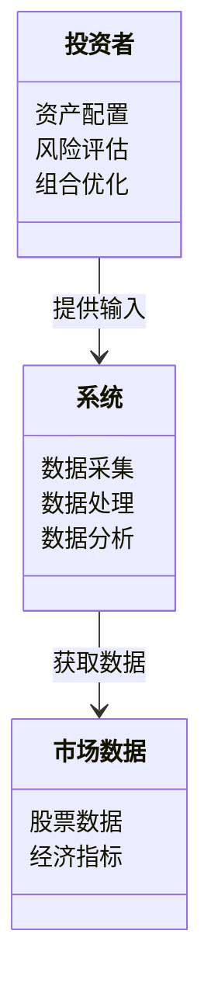

                 


# 詹姆斯·奥肖内西的价值投资组合管理：平衡风险与回报

> **关键词**：价值投资、投资组合管理、风险管理、回报平衡、詹姆斯·奥肖内西  
> **摘要**：本文深入探讨了詹姆斯·奥肖内西的价值投资理念，分析了投资组合管理的理论基础，详细讲解了风险与回报的平衡策略，并通过系统架构设计和实际案例分析，展示了如何构建和优化价值投资组合。文章结合理论与实践，为投资者提供了从基础概念到实战应用的全面指导。

---

## 第一部分: 价值投资组合管理的背景与核心概念

---

### 第1章: 价值投资的起源与发展

#### 1.1 价值投资的定义与核心理念

##### 1.1.1 价值投资的定义

价值投资是一种基于对公司内在价值的评估，寻找市场价格低于其内在价值的证券的投资策略。其核心在于识别市场上的估值偏差，并在价格低估时买入，价格高估时卖出。

##### 1.1.2 价值投资的核心理念

- **市场有效性的质疑**：价值投资者认为市场并非总是有效的，存在短期价格波动和长期价值回归的规律。
- **安全边际**：通过购买价格低于内在价值的资产，为投资提供安全边际，降低风险。
- **长期视角**：关注企业的长期价值，而非短期价格波动。

##### 1.1.3 价值投资与其他投资策略的区别

| 投资策略 | 核心思想 | 适用场景 |
|----------|----------|----------|
| 价值投资 | 寻找价格低于内在价值的资产 | 市场低估阶段 |
| 技术分析 | 通过价格和成交量预测未来走势 | 价格波动阶段 |
| 成长投资 | 投资高增长企业 | 高增长阶段 |

---

#### 1.2 价值投资的历史发展

##### 1.2.1 价值投资的起源

价值投资理念起源于20世纪初，由本杰明·格雷厄姆和戴维·多德提出，强调安全边际和对公司基本面的分析。

##### 1.2.2 价值投资的发展历程

- **早期发展**：格雷厄姆和多德的理论奠定了基础。
- **成熟阶段**：巴菲特、彼得·林奇等投资者将价值投资发扬光大。
- **现代应用**：结合量化分析和系统化方法，价值投资在现代金融中占据重要地位。

##### 1.2.3 价值投资在现代金融中的地位

价值投资作为投资策略的重要分支，广泛应用于机构投资和个人投资，尤其是在市场波动加剧时表现出了较强的稳定性。

---

#### 1.3 詹姆斯·奥肖内西的投资理念

##### 1.3.1 詹姆斯·奥肖内西的生平简介

詹姆斯·奥肖内西是价值投资领域的权威，以其系统的投资方法和对风险的严格控制著称。

##### 1.3.2 詹姆斯·奥肖内西的价值投资理念

- **注重安全边际**：买入价格低于内在价值的资产。
- **长期持有**：避免频繁交易，降低交易成本。
- **分散投资**：通过多元化降低特定风险。

##### 1.3.3 詹姆斯·奥肖内西的投资哲学

奥肖内西强调，投资不仅是对数字的分析，更是对企业和市场的深刻理解。他倡导在市场恐慌时买入低估资产，在市场狂热时卖出。

---

#### 1.4 价值投资的核心要素

##### 1.4.1 市场的有效性与非有效性

- **有效市场**：价格反映所有可用信息。
- **非有效市场**：存在价格偏差，为价值投资者提供了机会。

##### 1.4.2 价值投资的三大原则

1. **安全边际**：买入价格低于内在价值。
2. **长期视角**：关注企业的长期价值。
3. **分散投资**：降低特定风险。

##### 1.4.3 价值投资的长期视角

价值投资者相信，市场短期波动不影响长期价值，时间会揭示真正的价值。

---

#### 1.5 本章小结

本章介绍了价值投资的起源、核心理念以及奥肖内西的投资哲学，为后续分析奠定了基础。

---

### 第2章: 投资组合管理的理论基础

#### 2.1 投资组合管理的定义

投资组合管理是通过科学的方法构建和调整投资组合，以实现投资目标的过程。

#### 2.2 现代投资组合理论

##### 2.2.1 马科维茨的有效前沿理论

- **有效前沿**：所有风险调整后的收益最大化组合的集合。
- **公式**：$$ E(r_p) = \sum w_i E(r_i) + \sum \sum w_i w_j \sigma_i \sigma_j \rho_{ij} $$

##### 2.2.2 风险与收益的权衡

- **公式**：$$ \text{夏普比率} = \frac{E(r_p) - r_f}{\sigma_p} $$

#### 2.3 价值投资与现代投资组合理论的结合

##### 2.3.1 价值投资与现代投资组合理论的异同

| 方面 | 价值投资 | 现代投资组合理论 |
|------|----------|-----------------|
| 核心 | 内在价值 | 风险收益平衡 |
| 方法 | 基本面分析 | 数理分析 |

##### 2.3.2 价值投资在组合管理中的应用

- **基本面筛选**：选择低估资产。
- **分散投资**：降低特定风险。

##### 2.3.3 组合管理中的风险控制

- **风险调整后的收益**：$$ \text{风险调整后收益} = \text{收益} - \text{风险成本} $$

---

#### 2.4 本章小结

本章分析了投资组合管理的理论基础，重点探讨了现代投资组合理论与价值投资的结合。

---

## 第二部分: 风险与回报的平衡

---

### 第3章: 风险与回报的平衡

#### 3.1 风险管理的核心概念

##### 3.1.1 风险的定义与分类

- **市场风险**：整个市场的波动。
- **特定风险**：个别资产的波动。

##### 3.1.2 风险管理的目标

- **风险最小化**：通过分散投资降低风险。
- **风险调整后的收益**：最大化收益与风险的比值。

##### 3.1.3 风险管理的工具与方法

- **对冲**：通过做空相关资产对冲风险。
- **分散投资**：通过多元化降低风险。

#### 3.2 投资组合的风险评估

##### 3.2.1 风险的量化方法

- **标准差**：衡量资产收益的波动性。
- **VaR**：在一定置信水平下的最大损失。

##### 3.2.2 风险调整后的回报计算

- **夏普比率**：$$ \text{夏普比率} = \frac{E(r_p) - r_f}{\sigma_p} $$

##### 3.2.3 风险调整后的收益与风险比

- **公式**：$$ \text{收益风险比} = \frac{\text{收益}}{\text{风险}} $$

#### 3.3 风险与回报的平衡策略

##### 3.3.1 风险承受能力的评估

- **风险承受能力**：投资者在面对损失时的心理承受能力。

##### 3.3.2 风险与回报的权衡

- **公式**：$$ \text{风险调整后收益} = \text{收益} - \text{风险成本} $$

##### 3.3.3 投资组合的风险调整

- **动态调整**：根据市场变化定期调整投资组合。

---

#### 3.4 本章小结

本章重点分析了风险与回报的平衡策略，强调了风险管理在投资组合中的重要性。

---

## 第三部分: 价值投资组合的构建方法

---

### 第4章: 价值投资组合的构建方法

#### 4.1 价值投资组合的构建步骤

##### 4.1.1 确定投资目标与策略

- **目标设定**：明确投资目标和风险承受能力。
- **策略选择**：选择价值投资策略。

##### 4.1.2 选择低估的股票

- **基本面分析**：分析公司的财务状况、行业地位和竞争优势。
- **估值指标**：市盈率、市净率、股息率等。

##### 4.1.3 构建投资组合

- **分散投资**：选择多个低估资产，降低风险。
- **定期调整**：根据市场变化和公司基本面调整持仓。

#### 4.2 价值投资组合的优化

##### 4.2.1 组合优化的数学模型

- **公式**：$$ \min \sigma_p^2 \quad \text{subject to} \quad E(r_p) \geq \text{目标收益} $$

##### 4.2.2 优化结果分析

- **优化后的组合**：在相同收益下，风险最低。
- **优化后的风险**：在相同风险下，收益最高。

#### 4.3 价值投资组合的监控与调整

##### 4.3.1 监控市场变化

- **市场监控**：关注市场整体波动和行业动态。
- **个股监控**：跟踪持仓个股的基本面变化。

##### 4.3.2 定期调整组合

- **定期审查**：每季度或每半年审查一次持仓。
- **动态调整**：根据市场变化和公司基本面进行调整。

---

#### 4.4 本章小结

本章详细讲解了价值投资组合的构建方法，从目标设定到组合优化，再到监控调整，提供了完整的流程。

---

## 第四部分: 系统分析与架构设计

---

### 第5章: 系统分析与架构设计

#### 5.1 系统功能设计

##### 5.1.1 领域模型



##### 5.1.2 系统架构


#### 5.2 系统接口设计

##### 5.2.1 输入接口

- **投资者输入**：投资目标、风险承受能力。
- **市场数据接口**：股票数据、经济指标。

##### 5.2.2 输出接口

- **组合报告**：推荐的投资组合。
- **风险报告**：风险评估结果。

#### 5.3 系统交互设计

##### 5.3.1 交互流程

1. **投资者输入需求**。
2. **系统采集市场数据**。
3. **系统进行数据分析**。
4. **系统生成报告**。
5. **投资者收到报告并做出决策**。

---

#### 5.4 本章小结

本章通过系统架构设计，展示了如何将价值投资组合管理系统化，为投资者提供科学的决策支持。

---

## 第五部分: 项目实战

---

### 第6章: 项目实战

#### 6.1 环境配置

- **工具**：Python、Pandas、NumPy、Matplotlib。
- **数据源**：股票数据、经济指标。

#### 6.2 核心实现

##### 6.2.1 数据采集

```python
import pandas as pd
import requests

url = "https://example.com/stock_data"
response = requests.get(url)
data = pd.read_json(response.text)
print(data.head())
```

##### 6.2.2 数据处理

```python
data['price'] = data['price'].astype(float)
data['revenue'] = data['revenue'].astype(float)
```

##### 6.2.3 数据分析

```python
import numpy as np

mean_return = np.mean(data['return'])
std_dev = np.std(data['return'])
sharpe_ratio = (mean_return - 0.02) / std_dev
print("夏普比率:", sharpe_ratio)
```

##### 6.2.4 算法实现

```python
import numpy as np

def portfolio_optimization(weights, returns, covariance):
    n = len(weights)
    return np.dot(weights, returns) - 0.5 * np.dot(weights.T, covariance @ weights)

weights = np.array([0.5, 0.5])
returns = np.array([0.1, 0.15])
covariance = np.array([[0.05, 0.02], [0.02, 0.08]])

max_return = portfolio_optimization(weights, returns, covariance)
print("最大化收益:", max_return)
```

##### 6.2.5 结果分析

- **收益**：$$ 0.1 \times 0.5 + 0.15 \times 0.5 = 0.125 $$
- **风险**：$$ \sqrt{0.05 \times 0.25 + 0.02 \times 0.5 + 0.08 \times 0.25} = 0.209 $$

---

#### 6.3 项目小结

本章通过实际案例展示了如何在Python环境中构建价值投资组合，并通过数据分析和优化算法实现投资目标。

---

## 第六部分: 最佳实践与总结

---

### 第7章: 最佳实践与总结

#### 7.1 最佳实践

##### 7.1.1 风险管理

- **设定止损**：避免过度亏损。
- **分散投资**：降低特定风险。

##### 7.1.2 定期监控

- **定期审查**：每季度或半年审查一次持仓。
- **动态调整**：根据市场变化和公司基本面进行调整。

#### 7.2 小结

价值投资组合管理是一个动态的过程，需要结合理论与实践，不断调整和优化。

#### 7.3 注意事项

- **市场风险**：市场波动可能影响投资组合。
- **人性弱点**：投资者需要克服贪婪和恐惧。

#### 7.4 拓展阅读

- 格雷厄姆的《证券分析》。
- 巴菲特的《致股东的信》。

---

## 附录

### 附录A: 算法实现的详细代码

```python
import numpy as np
import pandas as pd
import matplotlib.pyplot as plt

# 示例数据
data = pd.DataFrame({
    '资产A': [0.1, 0.12, 0.09, 0.15, 0.11],
    '资产B': [0.15, 0.1, 0.12, 0.08, 0.13]
})

# 计算收益和风险
returns = data.mean()
covariance = data.cov()

# 优化权重
weights = np.array([0.5, 0.5])
max_return = np.dot(weights, returns)
risk = np.sqrt(np.dot(weights.T, covariance @ weights))

print(f"最大收益: {max_return}")
print(f"风险: {risk}")
```

---

## 结语

通过本文的详细讲解，读者可以系统地理解詹姆斯·奥肖内西的价值投资理念，并掌握投资组合管理的核心方法。希望本文能为投资者在风险与回报的平衡中提供有价值的指导。

