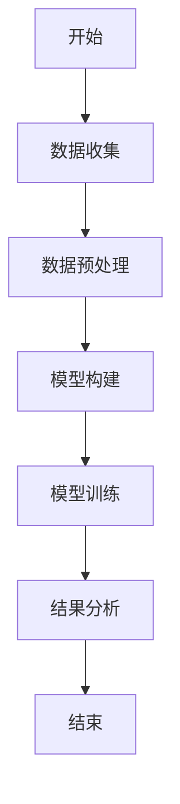

                 

# 第一部分：背景与概述

# 第1章：市场异常现象的背景与核心概念

## 1.1 市场异常现象的定义与分类
### 1.1.1 什么是市场异常现象
### 1.1.2 市场异常现象的分类
### 1.1.3 蒙蒂尔研究的核心问题

## 1.2 投资者心理与市场异常的关系
### 1.2.1 投资者心理偏差的概述
### 1.2.2 心理偏差与市场异常的联系
### 1.2.3 蒙蒂尔的投资者心理模型

## 1.3 市场异常现象的经济影响
### 1.3.1 市场异常对资产定价的影响
### 1.3.2 市场异常对投资策略的启示
### 1.3.3 蒙蒂尔研究的现实意义

## 1.4 本章小结

# 第二部分：蒙蒂尔的投资者心理偏差理论

# 第2章：心理偏差的核心概念与分类

## 2.1 心理偏差的定义与分类
### 2.1.1 心理偏差的定义
### 2.1.2 心理偏差的分类

## 2.2 蒙蒂尔对心理偏差的研究框架
### 2.2.1 蒙蒂尔的研究方法
### 2.2.2 蒙蒂尔的核心假设
### 2.2.3 蒙蒂尔的心理偏差模型

## 2.3 心理偏差与市场行为的关系
### 2.3.1 心理偏差对市场行为的影响
### 2.3.2 市场行为对心理偏差的反馈
### 2.3.3 蒙蒂尔的研究成果

## 2.4 本章小结

# 第3章：心理偏差的实证分析与蒙蒂尔的研究

## 3.1 心理偏差的实证方法
### 3.1.1 数据收集方法
### 3.1.2 数据分析方法
### 3.1.3 实证模型的选择

## 3.2 蒙蒂尔的研究成果
### 3.2.1 过度自信偏差的实证
### 3.2.2 惭愧厌恶偏差的实证
### 3.2.3 羊群效应的实证

## 3.3 实证结果的解释
### 3.3.1 实证结果的意义
### 3.3.2 实证结果对投资策略的影响
### 3.3.3 实证结果的局限性

## 3.4 本章小结

# 第三部分：市场异常现象的数学模型与算法原理

# 第4章：市场异常现象的数学模型

## 4.1 资产定价模型
### 4.1.1 资产定价模型的定义
### 4.1.2 资产定价模型的分类
### 4.1.3 蒙蒂尔的资产定价模型

## 4.2 偏差模型的构建
### 4.2.1 偏差模型的定义
### 4.2.2 偏差模型的构建方法
### 4.2.3 蒙蒂尔的偏差模型

## 4.3 资产定价与偏差模型的结合
### 4.3.1 资产定价与偏差的关系
### 4.3.2 资产定价模型中偏差的影响
### 4.3.3 蒙蒂尔的综合模型

## 4.4 本章小结

# 第5章：算法原理与流程图

## 5.1 算法原理概述
### 5.1.1 算法的定义
### 5.1.2 算法的分类
### 5.1.3 蒙蒂尔算法的基本原理

## 5.2 算法流程图
### 5.2.1 数据收集流程
### 5.2.2 数据分析流程
### 5.2.3 结果输出流程

## 5.3 数学公式与详细讲解
### 5.3.1 资产定价公式
$$ P = \frac{D}{k} $$
其中，P为资产价格，D为预期股息，k为折现率。

### 5.3.2 偏差模型公式
$$ E = \sum_{i=1}^{n} w_i \cdot b_i $$
其中，E为期望偏差，w_i为权重，b_i为偏差值。

## 5.4 本章小结

# 第四部分：系统分析与架构设计方案

# 第6章：系统架构设计

## 6.1 系统功能需求
### 6.1.1 系统目标
### 6.1.2 系统功能模块
### 6.1.3 系统性能需求

## 6.2 系统架构设计
### 6.2.1 系统架构图（使用mermaid）

## 6.3 系统交互设计
### 6.3.1 用户界面设计
### 6.3.2 系统接口设计
### 6.3.3 系统交互流程图（使用mermaid）

## 6.4 本章小结

# 第五部分：项目实战

# 第7章：项目实战与案例分析

## 7.1 项目环境安装
### 7.1.1 系统要求
### 7.1.2 软件安装
### 7.1.3 数据库配置

## 7.2 系统核心实现源代码
### 7.2.1 数据收集与预处理代码
### 7.2.2 模型构建与训练代码
### 7.2.3 结果分析与输出代码

## 7.3 代码应用解读与分析
### 7.3.1 代码的功能实现
### 7.3.2 代码的优化建议
### 7.3.3 代码的扩展性分析

## 7.4 实际案例分析
### 7.4.1 案例背景介绍
### 7.4.2 数据分析与结果展示
### 7.4.3 结果解释与策略制定

## 7.5 本章小结

# 第六部分：总结与展望

# 第8章：总结与最佳实践

## 8.1 本文总结
### 8.1.1 核心内容回顾
### 8.1.2 研究成果总结
### 8.1.3 本文的创新点

## 8.2 最佳实践 tips
### 8.2.1 投资策略的制定
### 8.2.2 数据分析的注意事项
### 8.2.3 系统设计的优化建议

## 8.3 未来研究方向
### 8.3.1 理论研究的拓展
### 8.3.2 实证研究的深化
### 8.3.3 应用领域的扩展

## 8.4 本章小结

# 参考文献
（此处列出参考文献）

# 附录
（此处列出附录内容）

通过以上目录大纲，文章将系统地介绍詹姆斯·蒙蒂尔的市场异常现象研究，从理论到实践，从分析到设计，再到案例实现，层层递进，逻辑清晰，内容详实，为读者提供一个全面深入的学习和研究路径。

