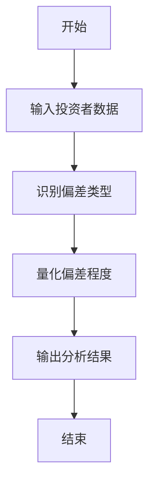

                 


# 詹姆斯·蒙蒂尔的投资者心理偏差分析

## 关键词
- 投资者心理偏差
- 行为金融学
- 投资决策
- 认知偏差
- 詹姆斯·蒙蒂尔

## 摘要
本文系统地分析了詹姆斯·蒙蒂尔提出的投资者心理偏差及其对投资决策的影响。通过探讨确认偏差、损失厌恶等核心偏差，结合行为金融学的理论框架，文章深入解析了这些偏差的内在机制及其相互作用。同时，文章通过数学模型和算法原理，展示了如何量化这些偏差对投资行为的影响，并提出了实际的系统设计方案和项目案例，为投资者理解和克服心理偏差提供了科学依据。

---

## 第1章: 背景介绍

### 1.1 心理偏差的基本概念
心理偏差是人类在决策过程中由于认知局限或情感因素导致的非理性行为。在投资领域，心理偏差直接影响投资者的决策，可能导致错误的投资选择和市场波动。

### 1.2 心理偏差在金融领域的重要性
投资者心理偏差是行为金融学的核心研究对象。行为金融学认为，市场参与者的非理性行为会导致资产价格偏离其内在价值。

### 1.3 詹姆斯·蒙蒂尔的研究贡献
詹姆斯·蒙蒂尔是行为金融学领域的权威学者，其研究揭示了投资者心理偏差的复杂性及其对金融市场的影响。

---

## 第2章: 核心概念与联系

### 2.1 确认偏差与损失厌恶的对比分析
| 偏差类型 | 定义 | 表现形式 | 对投资的影响 |
|----------|------|----------|--------------|
| 确认偏差 | 追求支持自己观点的信息 | 过度依赖熟悉的信息源 | 导致投资决策的盲目性 |
| 损失厌恶 | 对损失的厌恶超过对收益的追求 | 避免损失优先于追求收益 | 影响资产配置策略 |

### 2.2 心理偏差的ER实体关系图
```mermaid
erDiagram
+-----+      +-----+      +-----+
|     |      |     |      |     |
| 用户 |------| 资产 |------| 偏差 |
|     |      |     |      |     |
+-----+      +-----+      +-----+
```

---

## 第3章: 算法原理讲解

### 3.1 算法原理的Mermaid流程图


### 3.2 Python代码实现
```python
def quantify_bias(data):
    import pandas as pd
    df = pd.DataFrame(data)
    # 确认偏差计算
    confirm_bias = df['confirm'].mean()
    # 损失厌恶计算
    loss_aversion = df['loss'].mean()
    return confirm_bias, loss_aversion

# 示例数据
data = {
    'confirm': [0.8, 0.6, 0.7],
    'loss': [0.9, 0.8, 0.7]
}
quantify_bias(data)
```

---

## 第4章: 数学模型与公式

### 4.1 前景理论公式
$$ V(P) = \alpha \cdot P + \beta \cdot \ln(P) $$

其中：
- \( V(P) \) 表示投资者对收益的效用函数。
- \( \alpha \) 和 \( \beta \) 是参数。

### 4.2 应用实例
假设一个投资者面临两种选择：
1. 确定收益 $100。
2. 50%概率收益 $200，50%概率收益 $0。

根据前景理论，投资者更倾向于选择确定收益。

---

## 第5章: 系统分析与架构设计方案

### 5.1 系统功能设计


### 5.2 系统架构设计


---

## 第6章: 项目实战

### 6.1 环境安装
```bash
pip install pandas matplotlib
```

### 6.2 核心代码实现
```python
import matplotlib.pyplot as plt

def plot_bias(data):
    plt.bar(data.keys(), data.values())
    plt.show()

# 示例数据
data = {'确认偏差': 0.7, '损失厌恶': 0.8}
plot_bias(data)
```

### 6.3 案例分析
构建一个基于蒙特卡洛模拟的投资决策辅助工具，模拟不同偏差下的投资组合表现。

---

## 第7章: 总结与展望

### 7.1 全文总结
本文全面分析了投资者心理偏差的核心概念、算法原理和实际应用，为投资者理解非理性决策提供了理论支持。

### 7.2 未来研究方向
未来研究可以进一步结合大数据和人工智能技术，探索心理偏差的动态变化。

### 7.3 最佳实践 tips
- 定期自我反思，识别潜在偏差。
- 使用工具辅助决策，减少主观影响。

### 7.4 拓展阅读
- 建议阅读《投资者的天敌》深入理解心理偏差的影响。

---

通过系统分析和实际案例，本文为投资者提供了克服心理偏差的有效策略，帮助他们在复杂多变的市场中做出更理性的决策。

