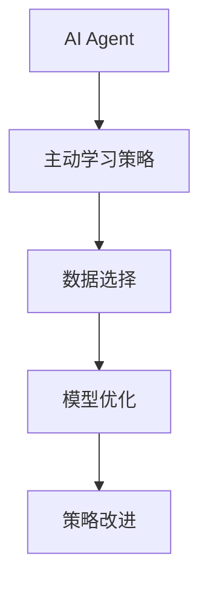
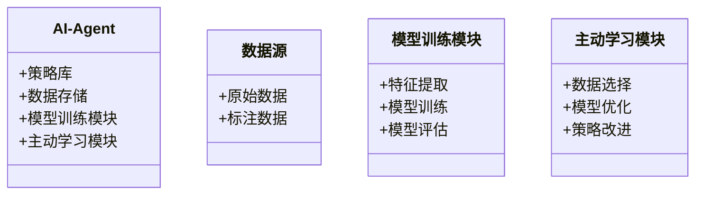
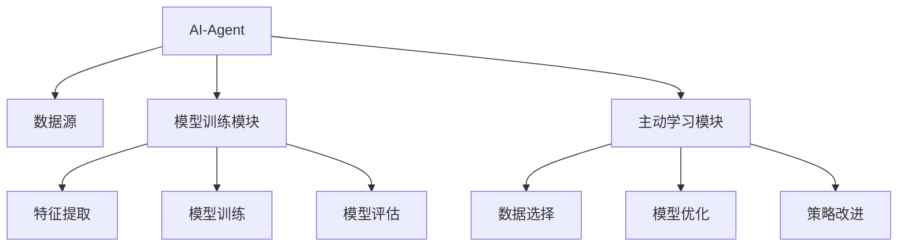
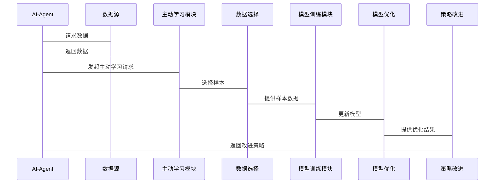

                 


# 设计AI Agent的主动学习策略

**关键词：主动学习，AI Agent，策略优化，机器学习，强化学习，数据驱动**

**摘要：**  
本文深入探讨了设计AI Agent的主动学习策略的核心方法和实践。从主动学习的基本概念到具体算法的实现，从系统架构设计到项目实战，全面解析了如何通过主动学习策略提升AI Agent的性能和智能水平。文章通过丰富的案例分析和详细的技术讲解，帮助读者掌握主动学习策略的设计与优化技巧。

---

## 目录大纲

### 第一部分: 设计AI Agent的主动学习策略背景与基础

#### 第1章: AI Agent与主动学习概述

##### 1.1 AI Agent的基本概念
- 1.1.1 AI Agent的定义与特点
  - AI Agent的定义
  - AI Agent的核心特点：自主性、反应性、目标导向
- 1.1.2 AI Agent的分类与应用场景
  - 分类：基于任务型AI Agent、服务型AI Agent、自主型AI Agent
  - 应用场景：智能助手、推荐系统、自动驾驶、机器人控制
- 1.1.3 主动学习的基本概念
  - 主动学习的定义
  - 主动学习与被动学习的区别

##### 1.2 主动学习的背景与重要性
- 1.2.1 数据驱动学习的挑战
  - 数据量爆炸性增长的挑战
  - 数据标注成本高昂的问题
- 1.2.2 主动学习的核心价值
  - 提高学习效率
  - 减少数据需求
  - 提高模型性能
- 1.2.3 主动学习在AI Agent中的应用前景
  - 提升AI Agent的决策能力
  - 提高AI Agent的自适应能力
  - 降低计算资源消耗

##### 1.3 本章小结
  - 总结本章的核心内容
  - 强调主动学习在AI Agent中的重要性

---

### 第二部分: 主动学习策略的核心概念与联系

#### 第2章: 主动学习策略的核心概念

##### 2.1 主动学习策略的原理
- 2.1.1 主动学习的基本原理
  - 策略优化的核心思想
  - 数据选择的策略
- 2.1.2 策略优化的核心思想
  - 策略评估与改进方法
  - 策略优化的数学模型
- 2.1.3 策略评估与改进方法
  - 基于模型的评估方法
  - 基于经验的改进方法

##### 2.2 核心概念对比分析
- 2.2.1 主动学习与监督学习的对比
  - 数据来源与控制的对比
  - 学习过程的对比
- 2.2.2 主动学习与无监督学习的对比
  - 数据标注的需求对比
  - 知识发现能力的对比
- 2.2.3 主动学习与强化学习的对比
  - 动作空间的对比
  - 奖励机制的对比

##### 2.3 实体关系图


##### 2.4 本章小结
  - 总结本章的核心内容
  - 强调主动学习策略与其他学习方法的区别与联系

---

### 第三部分: 主动学习策略的算法原理

#### 第3章: 主动学习策略的核心算法

##### 3.1 不确定性采样算法
- 3.1.1 不确定性采样的原理
  - 不确定性度量的定义
  - 不确定性度量的计算方法
- 3.1.2 不确定性采样的实现步骤
  - 数据选择策略
  - 数据标注与模型训练
- 3.1.3 不确定性采样的优缺点
  - 优点：提高模型的泛化能力
  - 缺点：计算成本较高

##### 3.2 查询学习算法
- 3.2.1 查询学习的原理
  - 查询策略的定义
  - 查询策略的实现方法
- 3.2.2 查询学习的实现步骤
  - 数据预处理
  - 查询策略的选择与应用
  - 模型训练与优化
- 3.2.3 查询学习的优缺点
  - 优点：减少数据需求
  - 缺点：查询策略的设计复杂

##### 3.3 其他主动学习算法
- 3.3.1 核心算法的对比分析
  - 不确定性采样与查询学习的对比
  - 其他主动学习算法的简介
- 3.3.2 算法选择的原则
  - 根据问题需求选择算法
  - 根据数据特性选择算法
  - 根据计算资源选择算法

##### 3.4 算法实现的Python代码示例
- 3.4.1 不确定性采样算法的Python实现
  ```python
  import numpy as np
  from sklearn.metrics import accuracy_score

  def uncertainty_sampling(X, y, model, num_samples=10):
      # 计算不确定性度量
      uncertainty = model.predict_proba(X)[:, 1]
      # 选择不确定性最高的样本
      selected_indices = np.argsort(-uncertainty)[:num_samples]
      # 返回选择的样本和标签
      return X[selected_indices], y[selected_indices]
  ```

- 3.4.2 查询学习算法的Python实现
  ```python
  def query_learning(X, y, model, num_queries=5):
      for _ in range(num_queries):
          # 计算查询度量
          query = model.decision_function(X)
          # 选择最不确定的样本
          selected_index = np.argmax(query)
          # 更新模型
          model.fit(X[[selected_index]], y[[selected_index]])
      return model
  ```

##### 3.5 算法的数学模型与公式
- 3.5.1 不确定性采样的数学模型
  - 熵公式：$$ H(y) = -\sum p(y) \log p(y) $$
  - 不确定性度量公式：$$ U(x) = H(y|x) $$

- 3.5.2 查询学习的数学模型
  - 查询度量公式：$$ Q(x) = \text{max}(p(y|x)) $$

##### 3.6 本章小结
  - 总结本章的核心内容
  - 强调算法实现的关键点

---

### 第四部分: 系统分析与架构设计

#### 第4章: 系统分析与架构设计

##### 4.1 问题场景介绍
- 4.1.1 问题背景
  - AI Agent的主动学习需求
  - 数据驱动的挑战
- 4.1.2 项目介绍
  - 项目目标
  - 项目范围
  - 项目技术选型

##### 4.2 系统功能设计
- 4.2.1 领域模型设计


##### 4.3 系统架构设计


##### 4.4 系统接口设计
- 4.4.1 接口描述
  - 数据接口：数据源与AI-Agent的交互接口
  - 模型接口：模型训练模块与AI-Agent的交互接口
  - 策略接口：主动学习模块与AI-Agent的交互接口

##### 4.5 系统交互流程图


##### 4.6 本章小结
  - 总结本章的核心内容
  - 强调系统架构设计的重要性

---

### 第五部分: 项目实战

#### 第5章: 项目实战

##### 5.1 环境配置
- 5.1.1 系统环境
  - 操作系统：Linux/Windows/MacOS
  - Python版本：Python 3.8+
  - 依赖管理：pip、conda
- 5.1.2 工具安装
  - 安装Python库：numpy、scikit-learn、mermaid、graphviz
  - 安装开发工具：IDE（PyCharm、VS Code）
- 5.1.3 数据准备
  - 数据来源：公开数据集、自定义数据集
  - 数据预处理：数据清洗、特征提取

##### 5.2 核心代码实现
- 5.2.1 数据选择模块
  ```python
  def select_samples(X, y, model, num_samples=10):
      # 计算不确定性度量
      uncertainty = model.predict_proba(X)[:, 1]
      # 选择不确定性最高的样本
      selected_indices = np.argsort(-uncertainty)[:num_samples]
      # 返回选择的样本和标签
      return X[selected_indices], y[selected_indices]
  ```

- 5.2.2 模型优化模块
  ```python
  def optimize_model(X, y, model, selected_samples):
      # 更新模型
      model.fit(X[selected_samples], y[selected_samples])
      return model
  ```

##### 5.3 代码应用解读与分析
- 5.3.1 代码功能分析
  - 数据选择模块的功能分析
  - 模型优化模块的功能分析
- 5.3.2 代码实现的关键点
  - 数据选择策略的选择
  - 模型优化算法的选择
  - 系统交互流程的实现

##### 5.4 案例分析
- 5.4.1 案例背景
  - 项目目标：设计一个AI Agent的推荐系统
  - 数据来源：用户行为数据、商品属性数据
  - 问题需求：提高推荐系统的准确率和用户满意度
- 5.4.2 案例分析与实现
  - 数据预处理：清洗、特征提取
  - 数据选择：基于不确定性采样的数据选择
  - 模型训练：基于主动学习的推荐模型
  - 模型优化：基于查询学习的模型优化
- 5.4.3 案例结果与分析
  - 实验结果：准确率提升、用户满意度提高
  - 结果分析：主动学习策略的有效性

##### 5.5 本章小结
  - 总结本章的核心内容
  - 强调项目实战的重要性

---

### 第六部分: 最佳实践与总结

#### 第6章: 最佳实践与总结

##### 6.1 最佳实践
- 6.1.1 算法选择的建议
  - 根据问题需求选择算法
  - 根据数据特性选择算法
  - 根据计算资源选择算法
- 6.1.2 系统设计的建议
  - 系统架构设计的优化
  - 系统接口设计的规范
  - 系统交互流程的优化
- 6.1.3 项目实施的建议
  - 项目规划的合理性
  - 项目实施的规范性
  - 项目管理的有效性

##### 6.2 小结
  - 总结全文的核心内容
  - 强调主动学习策略在AI Agent中的重要性

##### 6.3 注意事项
- 6.3.1 算法选择中的注意事项
  - 算法的适用性
  - 算法的可扩展性
  - 算法的计算成本
- 6.3.2 系统设计中的注意事项
  - 系统的可维护性
  - 系统的可扩展性
  - 系统的可测试性
- 6.3.3 项目实施中的注意事项
  - 项目风险的控制
  - 项目进度的管理
  - 项目质量的保证

##### 6.4 拓展阅读
- 6.4.1 推荐书籍
  - 《机器学习实战》
  - 《强化学习（ Reinforcement Learning）》
  - 《主动学习（Active Learning）》
- 6.4.2 推荐论文
  - "主动学习：现状与挑战"
  - "基于主动学习的AI Agent设计"
  - "强化学习与主动学习的结合研究"

##### 6.5 本章小结
  - 总结本章的核心内容
  - 强调主动学习策略在实际应用中的注意事项和拓展方向

---

### 附录

#### 附录A: 常用Python库的安装与配置

##### A.1 numpy的安装与配置
  - 安装命令：`pip install numpy`
  - 配置方法：设置环境变量、安装依赖库

##### A.2 scikit-learn的安装与配置
  - 安装命令：`pip install scikit-learn`
  - 配置方法：安装依赖库、版本管理

##### A.3 mermaid的安装与配置
  - 安装命令：`pip install mermaid`

##### A.4 graphviz的安装与配置
  - 安装命令：`pip install graphviz`

#### 附录B: 算法实现的详细代码

##### B.1 不确定性采样算法的详细代码
  ```python
  import numpy as np
  from sklearn.metrics import accuracy_score

  def uncertainty_sampling(X, y, model, num_samples=10):
      # 计算不确定性度量
      uncertainty = model.predict_proba(X)[:, 1]
      # 选择不确定性最高的样本
      selected_indices = np.argsort(-uncertainty)[:num_samples]
      # 返回选择的样本和标签
      return X[selected_indices], y[selected_indices]
  ```

##### B.2 查询学习算法的详细代码
  ```python
  def query_learning(X, y, model, num_queries=5):
      for _ in range(num_queries):
          # 计算查询度量
          query = model.decision_function(X)
          # 选择最不确定的样本
          selected_index = np.argmax(query)
          # 更新模型
          model.fit(X[[selected_index]], y[[selected_index]])
      return model
  ```

#### 附录C: 算法的数学公式推导

##### C.1 不确定性采样的数学推导
  - 熵公式：$$ H(y) = -\sum p(y) \log p(y) $$
  - 不确定性度量公式：$$ U(x) = H(y|x) $$

##### C.2 查询学习的数学推导
  - 查询度量公式：$$ Q(x) = \text{max}(p(y|x)) $$

---

### 参考文献

1. Bishop, C. M. (2006). Pattern Recognition and Machine Learning.
2. Sutton, R. S., & Barto, A. G. (2018). Reinforcement Learning: Theory and Algorithms.
3. Settles, B. (2012). Active Learning Literature Survey.
4. 王飞跃. (2020). 人工智能：模型与算法.

---

**总结：**  
本文通过详细的技术分析和实际案例，全面介绍了设计AI Agent的主动学习策略的核心方法和实践。从算法原理到系统架构，从项目实战到最佳实践，帮助读者全面掌握主动学习策略的设计与优化技巧，为实际应用提供了宝贵的参考。

