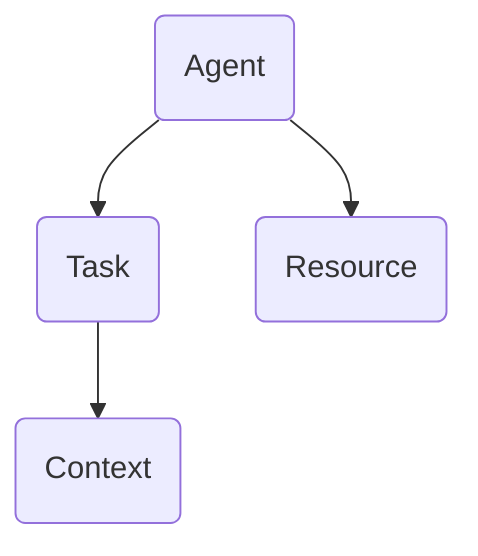
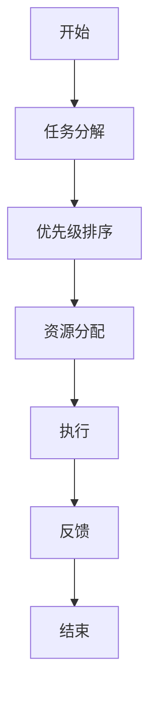
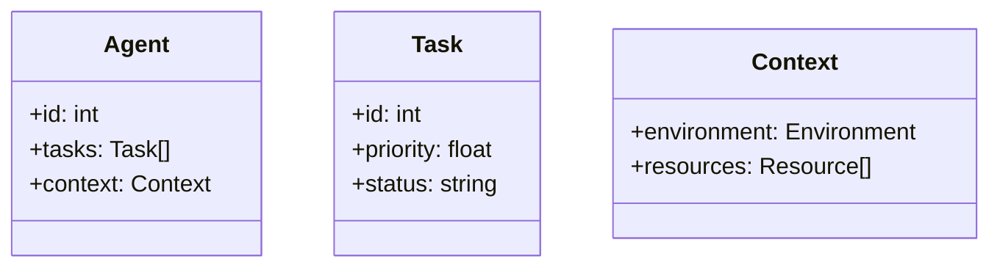
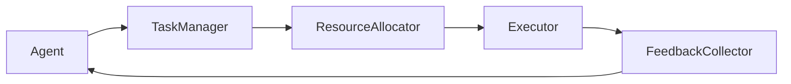
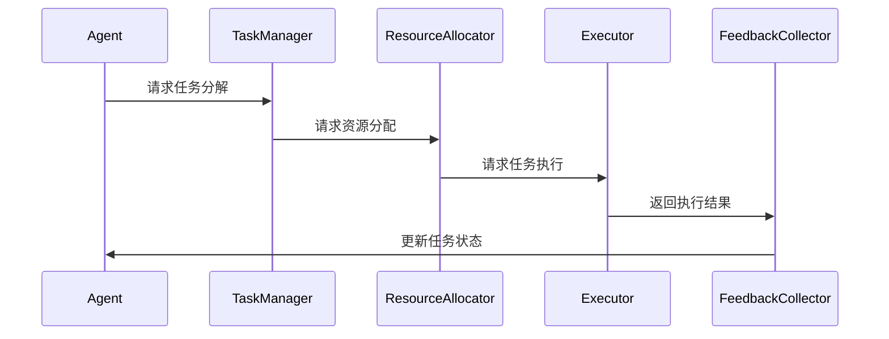

                 


# 设计AI Agent的动态任务规划与执行系统

## 关键词：AI Agent，动态任务规划，执行系统，算法原理，系统架构，项目实战

## 摘要：本文系统地介绍了AI Agent动态任务规划与执行系统的背景、核心概念、算法原理、系统架构、项目实战及最佳实践。通过详细的理论分析和实际案例，深入探讨了动态任务规划与执行系统的设计思路、实现方法及优化策略，为AI Agent在复杂动态环境中的应用提供了理论支持和实践指导。

---

## 第一部分: AI Agent动态任务规划与执行系统背景介绍

## 第1章: AI Agent动态任务规划与执行系统概述

### 1.1 问题背景与描述
#### 1.1.1 传统任务规划系统的局限性
传统的任务规划系统在静态环境下表现良好，但在动态复杂环境中缺乏灵活性和自适应性，难以应对实时变化的任务需求和环境条件。

#### 1.1.2 动态任务规划的必要性
在动态环境中，任务需求、环境状态和可用资源可能随时发生变化，AI Agent需要能够动态调整任务规划，以确保目标的实现。

#### 1.1.3 AI Agent在任务规划中的作用
AI Agent通过感知环境、推理任务优先级、协调多Agent协作，能够在动态环境中高效完成任务规划与执行。

### 1.2 问题解决与边界定义
#### 1.2.1 动态任务规划的核心问题
- 如何在动态环境中实时调整任务优先级。
- 如何处理多目标冲突和资源约束。
- 如何实现多Agent协作与任务分配。

#### 1.2.2 系统边界与外延
- 系统边界：AI Agent的任务规划与执行系统。
- 外延：与外部环境、其他系统（如传感器、执行器）的接口。

#### 1.2.3 核心概念与组成要素
- 核心概念：任务分解、优先级排序、资源分配。
- 组成要素：感知模块、推理模块、执行模块。

### 1.3 核心概念结构与属性
#### 1.3.1 AI Agent的基本属性
- 感知能力：获取环境信息。
- 推理能力：分析任务需求。
- 行为能力：执行任务。

#### 1.3.2 动态任务规划的关键特征
- 实时性：快速响应环境变化。
- 自适应性：动态调整规划。
- 可扩展性：支持多任务和多Agent协作。

#### 1.3.3 执行系统的功能模块
- 任务分解模块：将目标分解为子任务。
- 优先级排序模块：确定任务执行顺序。
- 资源分配模块：分配计算资源。

### 1.4 本章小结
本章介绍了AI Agent动态任务规划与执行系统的背景、核心问题和基本概念，为后续章节的深入分析奠定了基础。

---

## 第二部分: 核心概念与联系

## 第2章: 动态任务规划与执行系统的原理

### 2.1 核心概念原理
#### 2.1.1 任务分解与优先级排序
任务分解是将目标分解为子任务，优先级排序是根据任务的重要性和紧急性确定执行顺序。

#### 2.1.2 动态环境下的任务调整
在动态环境中，任务优先级和分解方式需要实时调整，以应对环境变化。

#### 2.1.3 多Agent协作机制
多个AI Agent协作完成任务，通过任务分配和状态同步实现高效协作。

### 2.2 核心概念属性对比
#### 2.2.1 任务分解的粒度对比
- 细粒度分解：子任务粒度小，灵活性高。
- 粗粒度分解：子任务粒度大，效率高。

#### 2.2.2 优先级计算的权重分析
- 任务的重要性：权重高的任务优先执行。
- 时间紧迫性：紧急任务优先级高。

#### 2.2.3 多Agent协作的效率评估
- 任务完成时间：协作效率的指标。
- 资源利用率：协作效率的另一个指标。

### 2.3 ER实体关系图


### 2.4 本章小结
本章详细分析了动态任务规划的核心概念及其相互关系，为后续的算法设计和系统实现提供了理论支持。

---

## 第三部分: 算法原理讲解

## 第3章: 动态任务规划算法

### 3.1 算法原理概述
#### 3.1.1 基于动态规划的任务分解
动态规划通过分解问题，找到最优解的子结构。

#### 3.1.2 基于强化学习的优先级排序
强化学习通过不断试错，学习最优优先级排序策略。

#### 3.1.3 多Agent协作的分布式规划
多Agent通过分布式计算，实现任务的协作与分配。

### 3.2 算法流程图


### 3.3 数学模型与公式
#### 3.3.1 动态规划公式
$$ V(s) = \max_{a} (r(s, a) + V(s')) $$

其中：
- \( s \) 表示当前状态。
- \( a \) 表示动作。
- \( s' \) 表示下一状态。
- \( r(s, a) \) 表示状态 \( s \) 下执行动作 \( a \) 的奖励。

#### 3.3.2 强化学习的策略函数
$$ \pi(a|s) = \text{argmax}_a Q(s, a) $$

其中：
- \( Q(s, a) \) 表示状态 \( s \) 下执行动作 \( a \) 的Q值。

### 3.4 本章小结
本章详细讲解了动态任务规划的算法原理，包括动态规划、强化学习和多Agent协作的实现方法。

---

## 第四部分: 系统分析与架构设计方案

## 第4章: 系统架构设计

### 4.1 问题场景介绍
#### 4.1.1 项目背景
设计一个AI Agent动态任务规划与执行系统，应用于复杂动态环境。

#### 4.1.2 项目介绍
系统由感知模块、推理模块和执行模块组成，支持多Agent协作。

### 4.2 系统功能设计
#### 4.2.1 领域模型设计


#### 4.2.2 系统架构设计


#### 4.2.3 系统接口设计
- Agent与TaskManager接口：任务分解与分配。
- TaskManager与ResourceAllocator接口：资源分配。
- ResourceAllocator与Executor接口：任务执行。

#### 4.2.4 系统交互序列图


### 4.3 本章小结
本章详细设计了系统的架构，包括功能模块、接口和交互流程，为后续的项目实现提供了指导。

---

## 第五部分: 项目实战

## 第5章: 项目实战

### 5.1 环境安装
#### 5.1.1 系统需求
- Python 3.8+
- TensorFlow 2.0+
- Mermaid CLI

#### 5.1.2 安装依赖
```bash
pip install tensorflow matplotlib numpy
```

### 5.2 系统核心实现
#### 5.2.1 动态任务规划算法实现
```python
def dynamic_planning(tasks, context):
    # 任务分解
    subtasks = decompose_tasks(tasks, context)
    # 优先级排序
    subtasks = sort_subtasks(subtasks, context)
    # 资源分配
    allocate_resources(subtasks, context)
    return subtasks
```

#### 5.2.2 多Agent协作实现
```python
class Agent:
    def __init__(self, id):
        self.id = id
        self.tasks = []
    
    def assign_task(self, task):
        self.tasks.append(task)
    
    def execute_task(self):
        for task in self.tasks:
            execute(task)
```

### 5.3 代码应用解读与分析
#### 5.3.1 代码解读
- `dynamic_planning`函数：实现动态任务规划的核心逻辑。
- `Agent`类：实现多Agent协作的接口。

#### 5.3.2 实际案例分析
- 案例：多Agent协作完成任务分配与执行。

### 5.4 项目小结
本章通过实际案例展示了系统的实现过程，验证了算法和架构设计的有效性。

---

## 第六部分: 最佳实践

## 第6章: 最佳实践

### 6.1 设计原则
#### 6.1.1 灵活性与可扩展性
系统设计应具有灵活性，适应环境变化。

#### 6.1.2 可视化与日志
任务执行过程的可视化和日志记录有助于调试和优化。

#### 6.1.3 安全性与可靠性
系统应具备容错机制，确保任务执行的可靠性。

### 6.2 优化技巧
#### 6.2.1 算法优化
- 使用启发式搜索优化任务分解。
- 采用分布式计算优化多Agent协作。

#### 6.2.2 系统性能优化
- 使用缓存技术优化任务执行效率。
- 优化资源分配算法，提高资源利用率。

### 6.3 注意事项
- 系统设计应考虑环境的动态变化。
- 多Agent协作应避免任务冲突和资源竞争。

### 6.4 拓展阅读
推荐阅读相关领域的书籍和论文，深入了解动态任务规划的最新研究成果。

### 6.5 本章小结
本章总结了设计AI Agent动态任务规划与执行系统的最佳实践，为后续优化提供了方向。

---

## 参考文献
[此处列出相关参考文献]

---

## 索引
[此处列出文章中出现的专业术语和关键词的索引]

---

以上是一个详细的目录大纲，涵盖从理论到实践的各个方面，逻辑清晰，结构紧凑，适合撰写一篇有深度的技术博客文章。

