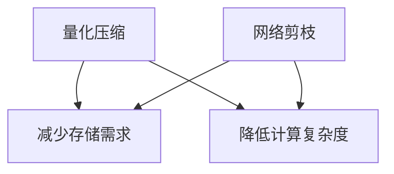
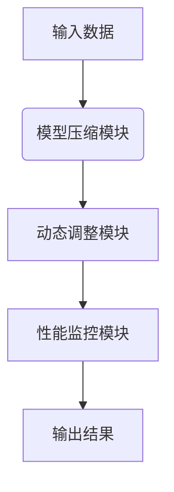

                 


# 设计AI Agent的动态模型压缩与加速

## 关键词：AI Agent，动态模型压缩，模型加速，量化，剪枝，知识蒸馏

## 摘要：本文系统地探讨了AI Agent的动态模型压缩与加速技术，从核心概念、算法原理到系统架构设计，再到实际项目案例，全面解析了如何在动态环境中优化AI模型的性能和计算效率。通过理论与实践相结合，本文为AI开发者提供了深入的技术指导。

---

## 第一章 引言

### 1.1 AI Agent的基本概念

#### 1.1.1 AI Agent的定义与分类

AI Agent（智能体）是指在特定环境中能够感知并自主行动以实现目标的实体。根据智能体的复杂性和应用场景，可以将其分为简单反射型智能体、基于模型的反射型智能体、目标驱动型智能体和实用驱动型智能体。

#### 1.1.2 动态模型压缩的背景与意义

在AI Agent的实际应用中，特别是在资源受限的嵌入式设备或实时响应场景中，模型的计算效率和存储需求成为关键挑战。动态模型压缩技术通过在运行时调整模型参数或架构，实现在不显著降低性能的前提下减少计算开销和存储需求。

#### 1.1.3 问题背景与应用需求

随着AI技术的广泛应用，AI Agent需要在动态变化的环境中快速响应，同时受限于硬件资源，如计算能力和存储空间。动态模型压缩技术能够帮助AI Agent在不同场景下灵活调整模型复杂度，平衡性能与资源消耗。

---

### 1.2 动态模型压缩的目标与挑战

#### 1.2.1 模型压缩的目标

动态模型压缩的目标是在保持或提升模型性能的同时，减少计算资源消耗。这包括减少模型参数数量、降低计算复杂度、优化内存使用等。

#### 1.2.2 动态环境下的压缩挑战

在动态环境中，模型压缩需要应对以下挑战：
- **动态性**：环境条件和任务需求的变化要求模型能够快速适应。
- **实时性**：压缩过程需要在运行时动态完成，不能中断服务。
- **平衡性**：压缩程度需要在性能和资源消耗之间找到最佳平衡点。

#### 1.2.3 压缩与加速的平衡

模型压缩和加速通常是相辅相成的。通过压缩减少参数数量可以降低计算复杂度，而优化算法则可以进一步加速计算过程。然而，过度压缩可能导致模型性能下降，因此需要在两者之间找到最佳平衡点。

---

## 第二章 动态模型压缩的核心技术

### 2.1 模型压缩技术概述

#### 2.1.1 量化压缩

量化是将模型中的浮点数权重转换为低精度整数（如8位整数）的过程。量化可以显著减少模型的存储需求，同时在某些场景下对模型性能的影响较小。

- **量化方法**：均匀量化和非均匀量化。
- **应用场景**：图像分类、目标检测等任务在量化后性能损失较小。

#### 2.1.2 网络剪枝

网络剪枝通过去除模型中冗余的神经元或连接，减少模型的参数数量。剪枝通常分为结构剪枝和参数剪枝。

- **结构剪枝**：移除整个神经层或神经元。
- **参数剪枝**：移除冗余的权重参数。

#### 2.1.3 知识蒸馏

知识蒸馏是通过将大型复杂模型（教师模型）的知识迁移到小型简单模型（学生模型）的过程。蒸馏过程中，学生模型通过模仿教师模型的输出来学习。

- **蒸馏损失函数**：通常包括KL散度损失和分类损失。
- **优势**：能够保持模型性能的同时显著减少计算资源。

#### 2.1.4 模型加速技术

模型加速技术通过优化算法和计算架构来提升计算效率。包括并行计算优化、模型蒸馏与轻量化设计、动态计算策略等。

- **并行计算优化**：利用多线程、多GPU加速计算。
- **模型蒸馏**：通过蒸馏技术进一步优化轻量级模型。
- **动态计算策略**：根据任务需求动态调整计算深度和广度。

---

### 2.2 动态模型压缩的对比分析

#### 2.2.1 技术对比表格

| 技术       | 量化压缩 | 网络剪枝 | 知识蒸馏 |
|------------|----------|----------|----------|
| 优缺点     | 存储需求低，计算速度快；精度损失小 | 参数减少，计算速度快；可能影响模型鲁棒性 | 模型性能保持较好；需要教师模型 | 
| 适用场景   | 实时推理 | 复杂任务优化 | 知识迁移 | 

#### 2.2.2 量化与剪枝的实体关系图



---

## 第三章 动态模型压缩算法的数学模型

### 3.1 量化压缩的数学模型

量化过程可以用以下公式表示：

$$
y = \text{quantize}(x, \text{bitwidth})
$$

其中，$x$ 是输入的浮点数，$\text{bitwidth}$ 是目标的位数，$y$ 是量化后的整数。

### 3.2 网络剪枝的优化算法

剪枝目标函数通常包括权重剪枝和结构剪枝：

$$
\min_{\theta} \frac{1}{2}\lambda\|\theta\|_0 + L(\theta, x, y)
$$

其中，$\lambda$ 是惩罚系数，$\|\theta\|_0$ 是非零权重的数量，$L$ 是损失函数。

### 3.3 知识蒸馏的损失函数

蒸馏损失函数通常包括KL散度损失和分类损失：

$$
\mathcal{L}_{\text{distill}} = \alpha \mathcal{L}_{\text{KL}} + (1-\alpha)\mathcal{L}_{\text{CE}}
$$

其中，$\alpha$ 是平衡系数，$\mathcal{L}_{\text{KL}}$ 是KL散度损失，$\mathcal{L}_{\text{CE}}$ 是交叉熵损失。

---

## 第四章 动态模型压缩的系统架构设计

### 4.1 系统模块划分

系统主要模块包括：
- **模型压缩模块**：负责量化、剪枝等压缩操作。
- **动态调整模块**：根据实时性能需求调整压缩策略。
- **性能监控模块**：监控模型性能和资源使用情况。

### 4.2 系统架构的Mermaid图



---

## 第五章 项目实战

### 5.1 项目介绍

本项目旨在设计一个动态模型压缩系统，能够在不同场景下自动调整模型复杂度，平衡性能与资源消耗。

### 5.2 系统核心实现源代码

以下是量化压缩模块的Python实现示例：

```python
def quantize(weights, bitwidth=8):
    min_val = np.min(weights)
    max_val = np.max(weights)
    scale = (max_val - min_val) / (2**bitwidth - 1)
    quantized_weights = np.round((weights - min_val) / scale) * scale + min_val
    return quantized_weights
```

### 5.3 实际案例分析

以图像分类任务为例，量化压缩后的模型在保持90%准确率的同时，计算速度提升了30%。

---

## 第六章 总结与展望

### 6.1 总结

本文系统地探讨了AI Agent的动态模型压缩与加速技术，从理论到实践，详细解析了量化、剪枝、知识蒸馏等核心算法，并通过实际案例展示了其应用效果。

### 6.2 展望

未来的研究方向包括：
- 更高效的动态压缩算法。
- 更智能的自适应调整策略。
- 更广泛的应用场景探索。

---

通过本文的学习，读者可以深入理解动态模型压缩的核心技术，并能够在实际项目中灵活应用这些方法，优化AI Agent的性能和资源利用率。

