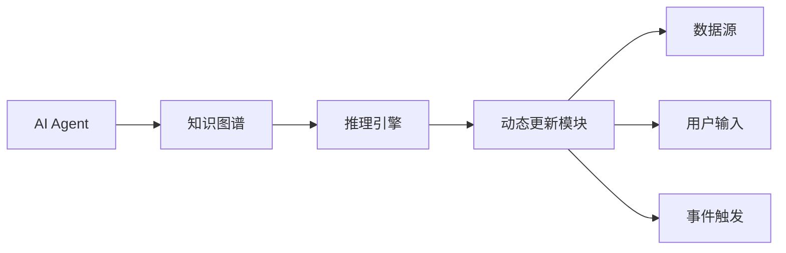
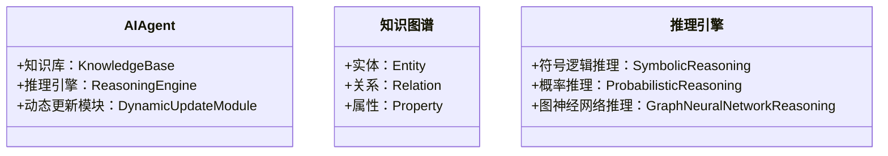
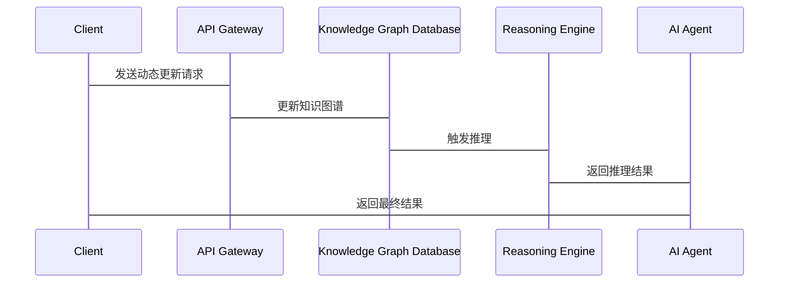

                 


# 设计AI Agent的动态知识图谱推理引擎

> 关键词：AI Agent, 动态知识图谱, 推理引擎, 知识图谱推理, 动态更新, 图神经网络, 逻辑推理

> 摘要：本文将详细介绍如何设计一个高效的AI Agent动态知识图谱推理引擎。从背景介绍、核心概念到算法原理、系统架构，再到项目实战和优化与扩展，我们将全面解析这一复杂而重要的技术挑战。通过具体的实现细节和案例分析，我们将帮助读者理解如何构建一个能够实时动态更新和推理的知识图谱引擎，从而为AI Agent提供强大的知识支持和推理能力。

---

# 第一部分: AI Agent与动态知识图谱推理引擎的背景与概念

## 第1章: AI Agent与动态知识图谱推理引擎概述

### 1.1 AI Agent的基本概念
#### 1.1.1 AI Agent的定义与分类
- AI Agent的定义：AI Agent是一种能够感知环境、自主决策并执行任务的智能实体。
- 分类：基于智能水平，AI Agent可以分为简单反应式Agent、基于模型的反射式Agent、目标驱动Agent和效用驱动Agent。

#### 1.1.2 动态知识图谱的定义与特点
- 动态知识图谱的定义：动态知识图谱是一种能够实时更新、反映现实世界最新状态的知识表示形式。
- 特点：动态性、实时性、可扩展性和语义丰富性。

#### 1.1.3 推理引擎的核心作用与应用场景
- 推理引擎的核心作用：通过逻辑推理或概率推理，从知识图谱中推导出新的知识或结论。
- 应用场景：智能问答、推荐系统、智能监控、自动驾驶等领域。

### 1.2 问题背景与需求分析
#### 1.2.1 当前AI Agent面临的挑战
- 知识表示的动态性：现实世界中的知识是不断变化的，如何实时更新知识图谱是一个挑战。
- 推理的实时性：AI Agent需要在动态环境中快速推理，这对推理引擎的效率提出了高要求。
- 复杂性：知识图谱的规模和复杂性不断增加，如何设计高效的推理算法是一个难题。

#### 1.2.2 知识图谱动态更新的需求
- 动态知识图谱的更新需求：实时更新知识图谱以反映最新信息。
- 更新的驱动因素：数据源的变化、用户交互、环境变化等。

#### 1.2.3 动态知识图谱推理引擎的必要性
- 必要性：AI Agent需要能够根据动态变化的知识图谱实时调整其行为和决策。

### 1.3 核心目标与实现路径
#### 1.3.1 设计动态知识图谱推理引擎的目标
- 实时性：快速响应知识图谱的变化，支持动态推理。
- 可扩展性：能够处理大规模、复杂的知识图谱。
- 准确性：保证推理结果的准确性和可靠性。

#### 1.3.2 实现引擎的主要技术路径
- 知识图谱的动态构建与管理。
- 高效的推理算法设计。
- 引擎的分布式实现与优化。

#### 1.3.3 引擎的预期功能与性能指标
- 功能：支持动态知识图谱的构建、存储、查询和推理。
- 性能指标：推理延迟、吞吐量、扩展性等。

### 1.4 本章小结
- 本章介绍了AI Agent和动态知识图谱的基本概念，分析了设计动态知识图谱推理引擎的背景和需求，并明确了实现的目标和技术路径。

---

## 第2章: 核心概念与系统架构

### 2.1 核心概念原理
#### 2.1.1 AI Agent的智能推理机制
- 符号逻辑推理：基于规则的推理方法。
- 概率推理：基于概率论的推理方法。
- 图神经网络推理：基于图结构的深度学习推理。

#### 2.1.2 知识图谱的构建与动态更新
- 知识图谱的构建：从数据源中提取实体和关系，构建知识图谱。
- 动态更新：实时更新知识图谱以反映最新信息。

#### 2.1.3 推理引擎的算法选择与优化
- 算法选择：根据具体场景选择合适的推理算法。
- 算法优化：通过优化算法复杂度和减少计算量提高推理效率。

### 2.2 核心概念对比分析
#### 2.2.1 AI Agent与传统规则引擎的区别
- AI Agent具有自主决策能力，而传统规则引擎仅执行预定义规则。
- AI Agent能够处理动态变化的知识，而传统规则引擎通常处理静态规则。

#### 2.2.2 知识图谱与传统数据库的对比
- 知识图谱是语义网络，能够表示复杂的语义关系。
- 传统数据库主要用于结构化数据的存储和查询，不具备语义推理能力。

#### 2.2.3 动态推理与静态推理的特征对比
| 特性      | 动态推理              | 静态推理              |
|-----------|----------------------|----------------------|
| 数据来源  | 动态变化的数据源      | 静态或固定的数据源    |
| 推理速度  | 需要实时推理          | 推理可以离线进行      |
| 复杂性    | 较高，需处理动态变化  | 较低，数据相对稳定    |

### 2.3 实体关系图与系统架构


#### 2.3.1 系统功能设计（领域模型）


#### 2.3.2 系统架构设计（架构图）


#### 2.3.3 系统接口设计
- 输入接口：接收动态更新的数据和用户查询。
- 输出接口：返回推理结果和更新后的知识图谱。

#### 2.3.4 系统交互流程（序列图）


### 2.4 本章小结
- 本章详细分析了动态知识图谱推理引擎的核心概念，通过对比分析和系统架构设计，明确了系统的各个模块和交互流程。

---

## 第3章: 算法原理与实现

### 3.1 算法原理
#### 3.1.1 符号逻辑推理
- 基于规则的推理：通过预定义的规则进行推理。
- 逻辑表达式：例如，如果A，则B；如果B，则C；因此，如果A，则C。

#### 3.1.2 概率推理
- 贝叶斯网络：通过概率分布进行推理。
- 马尔可夫链：用于处理序列数据的动态变化。

#### 3.1.3 图神经网络推理
- 图卷积网络（GCN）：用于处理图结构数据。
- 图注意力网络（GAT）：通过注意力机制捕捉图中的重要节点。

### 3.2 算法实现
#### 3.2.1 符号逻辑推理的实现
```python
def symbolic_reasoning(rules, facts):
    # rules: list of tuples (antecedent, consequent)
    # facts: set of facts
    for rule in rules:
        if rule[0] in facts:
            facts.add(rule[1])
    return facts
```

#### 3.2.2 概率推理的实现
```python
def probabilistic_reasoning(bayes_net, evidence):
    # bayes_net: Bayesian network structure
    # evidence: observed evidence
    from pgmpy.inference import VariableElimination
    VE = VariableElimination(bayes_net)
    posterior = VE.query(evidence)
    return posterior
```

#### 3.2.3 图神经网络推理的实现
```python
import torch
class GCN(torch.nn.Module):
    def __init__(self, input_dim, hidden_dim, output_dim):
        super(GCN, self).__init__()
        self.layers = torch.nn.Sequential(
            torch.nn.Linear(input_dim, hidden_dim),
            torch.nn.ReLU(),
            torch.nn.Linear(hidden_dim, output_dim)
        )
    
    def forward(self, x):
        return self.layers(x)
```

### 3.3 算法优化
#### 3.3.1 符号逻辑推理的优化
- 使用缓存技术减少重复计算。
- 并行化推理过程。

#### 3.3.2 概率推理的优化
- 通过采样方法减少计算量。
- 使用近似算法提高推理速度。

#### 3.3.3 图神经网络推理的优化
- 通过轻量化模型降低计算复杂度。
- 使用分布式计算提高推理效率。

### 3.4 本章小结
- 本章详细讲解了动态知识图谱推理引擎的三种主要推理算法，并通过代码示例展示了它们的实现方法。同时，还讨论了如何对这些算法进行优化，以提高推理效率。

---

## 第4章: 系统架构设计与实现

### 4.1 系统架构设计
#### 4.1.1 知识图谱的动态更新
- 数据源：实时数据流、用户输入、事件触发。
- 更新机制：基于增量式更新，减少计算开销。

#### 4.1.2 推理引擎的分布式实现
- 分布式架构：通过分布式计算提高推理能力。
- 负载均衡：合理分配任务，避免节点过载。

#### 4.1.3 系统接口设计
- 输入接口：接收动态更新的数据和用户查询。
- 输出接口：返回推理结果和更新后的知识图谱。

### 4.2 系统实现
#### 4.2.1 知识图谱的动态更新实现
```python
def update_knowledge_graph(new_data):
    # new_data: new entities or relations to be added
    knowledge_graph.add(new_data)
```

#### 4.2.2 推理引擎的实现
```python
def run_reasoning_engine():
    while True:
        update_knowledge_graph(receive_data())
        perform_reasoning()
```

#### 4.2.3 接口实现
```python
def receive_data():
    # 接收动态更新的数据
    return received_data

def send_result(result):
    # 发送推理结果
    pass
```

### 4.3 系统优化
#### 4.3.1 知识图谱的存储优化
- 使用高效的数据结构存储知识图谱，例如图数据库（Neo4j）。
- 索引优化：建立索引提高查询效率。

#### 4.3.2 推理引擎的性能优化
- 并行化推理过程。
- 使用缓存技术减少重复计算。

#### 4.3.3 系统的可扩展性设计
- 模块化设计：各个模块独立，便于扩展。
- 弹性伸缩：根据负载自动调整资源。

### 4.4 本章小结
- 本章详细讲解了动态知识图谱推理引擎的系统架构设计与实现方法，并讨论了如何对系统进行优化，以提高其性能和可扩展性。

---

## 第5章: 项目实战与案例分析

### 5.1 项目环境安装
- 安装必要的库：例如，NetworkX、PyTorch、Neo4j驱动等。

### 5.2 核心代码实现
#### 5.2.1 知识图谱的动态更新
```python
from neo4j import GraphDatabase

class KnowledgeGraph:
    def __init__(self, uri, user, password):
        self.driver = GraphDatabase.driver(uri, auth=(user, password))
    
    def add_entity(self, entity):
        # 添加实体
        pass
    
    def add_relation(self, relation):
        # 添加关系
        pass
```

#### 5.2.2 推理引擎的实现
```python
from pgmpy.inference import VariableElimination

class ReasoningEngine:
    def __init__(self, bayes_net):
        self.bayes_net = bayes_net
        self.inference = VariableElimination(self.bayes_net)
    
    def perform_reasoning(self, evidence):
        posterior = self.inference.query(evidence)
        return posterior
```

#### 5.2.3 动态更新与推理的集成
```python
def main():
    # 初始化知识图谱
    kg = KnowledgeGraph("bolt://localhost:7687", "neo4j", "password")
    
    # 初始化推理引擎
    bayes_net = build_bayes_net()
    reasoner = ReasoningEngine(bayes_net)
    
    while True:
        # 接收动态更新的数据
        new_data = receive_data()
        kg.update(new_data)
        
        # 触发推理
        evidence = get_evidence()
        result = reasoner.perform_reasoning(evidence)
        
        # 输出结果
        send_result(result)
```

### 5.3 功能实现
#### 5.3.1 知识图谱的动态更新功能
- 实体的添加和删除。
- 关系的动态更新。

#### 5.3.2 推理功能
- 符号逻辑推理：基于规则的推理。
- 概率推理：基于贝叶斯网络的推理。
- 图神经网络推理：基于图结构的深度学习推理。

#### 5.3.3 结果输出
- 推理结果的展示。
- 更新后的知识图谱的可视化。

### 5.4 案例分析
#### 5.4.1 案例背景
- 某电商网站的知识图谱动态更新与推理。

#### 5.4.2 案例实现
- 使用动态知识图谱推理引擎实时更新商品信息和用户行为数据。
- 基于动态知识图谱进行产品推荐和用户画像构建。

#### 5.4.3 案例分析与优化
- 优化推理引擎的性能，提高推理速度。
- 提升知识图谱的更新效率，减少延迟。

### 5.5 本章小结
- 本章通过一个具体的案例，详细讲解了动态知识图谱推理引擎的项目实战过程，并通过案例分析和优化，展示了如何将理论应用于实际场景。

---

## 第6章: 优化与扩展

### 6.1 性能优化
#### 6.1.1 知识图谱的存储优化
- 使用高效的图数据库，优化索引结构。
- 压缩技术：对知识图谱进行压缩存储，减少存储空间占用。

#### 6.1.2 推理引擎的性能优化
- 并行化推理过程：利用多线程或多进程提高推理速度。
- 使用缓存技术：缓存频繁访问的数据和结果，减少计算开销。

#### 6.1.3 系统的负载均衡
- 分布式架构：合理分配任务，避免节点过载。
- 弹性伸缩：根据负载自动调整资源。

### 6.2 功能扩展
#### 6.2.1 多模态数据融合
- 将结构化数据、非结构化数据和图像数据等多种数据类型融入知识图谱。
- 使用多模态推理算法，提高推理的准确性和丰富性。

#### 6.2.2 可解释性增强
- 提供推理过程的可视化，帮助用户理解推理结果。
- 记录推理日志，便于调试和优化。

#### 6.2.3 自适应学习
- 基于在线学习算法，动态更新知识图谱和推理模型。
- 使用强化学习优化推理策略，提高推理效率和准确性。

### 6.3 本章小结
- 本章讨论了如何对动态知识图谱推理引擎进行优化和扩展，以提高其性能和功能，使其能够更好地应对复杂的动态环境。

---

## 第7章: 案例分析与未来展望

### 7.1 案例分析
#### 7.1.1 案例背景
- 某智能问答系统的动态知识图谱推理引擎。

#### 7.1.2 案例实现
- 使用动态知识图谱推理引擎实时更新问答系统的知识库。
- 基于动态知识图谱进行智能问答和意图识别。

#### 7.1.3 案例分析与总结
- 通过案例分析，验证了动态知识图谱推理引擎的有效性和实用性。
- 总结了在实际应用中需要注意的问题和优化方向。

### 7.2 未来展望
#### 7.2.1 技术趋势
- 多模态知识图谱：整合多种数据类型，提高知识表示的丰富性。
- 可解释性推理：满足用户对推理过程的可解释性需求。
- 自适应学习：动态调整知识图谱和推理策略，提高系统的灵活性和适应性。

#### 7.2.2 应用场景
- 智能客服：基于动态知识图谱提供个性化的服务。
- 智能医疗：实时更新医疗知识图谱，辅助医生进行诊断。
- 自动驾驶：动态推理交通状况和环境变化，提高自动驾驶的安全性。

### 7.3 本章小结
- 本章通过案例分析，展示了动态知识图谱推理引擎在实际应用中的潜力和价值，并展望了未来的技术发展趋势和应用场景。

---

## 第8章: 最佳实践与注意事项

### 8.1 最佳实践
#### 8.1.1 知识图谱的管理
- 定期清理无效数据，保持知识图谱的轻量化。
- 使用版本控制，记录知识图谱的变更历史。

#### 8.1.2 推理引擎的优化
- 根据具体场景选择合适的推理算法，避免“一刀切”。
- 通过监控和日志分析，及时发现和解决问题。

#### 8.1.3 系统的维护与升级
- 定期备份数据，防止数据丢失。
- 跟踪技术发展，及时引入新技术和优化方法。

### 8.2 注意事项
#### 8.2.1 数据质量
- 确保知识图谱的数据质量，避免错误信息的传播。
- 定期验证数据的准确性和完整性。

#### 8.2.2 系统安全
- 加强数据加密和访问控制，防止数据泄露和篡改。
- 定期进行安全审计，发现和修复系统漏洞。

#### 8.2.3 性能监控
- 使用监控工具，实时监控系统的运行状态。
- 设置告警机制，及时发现和处理异常情况。

### 8.3 本章小结
- 本章总结了在设计和实现动态知识图谱推理引擎时的最佳实践和注意事项，帮助读者在实际应用中避免常见问题，提高系统的稳定性和可靠性。

---

## 第9章: 总结与展望

### 9.1 总结
- 本文详细讲解了动态知识图谱推理引擎的设计与实现，从核心概念到算法原理，再到系统架构和项目实战，全面覆盖了这一技术的各个方面。

### 9.2 未来展望
- 随着AI技术的不断发展，动态知识图谱推理引擎将面临更多挑战和机遇。
- 未来的研发方向可能包括多模态推理、自适应学习和可解释性增强等方面。

### 9.3 致谢
- 感谢读者的支持和关注，也感谢在撰写过程中提供帮助的团队和同事。

---

## 第10章: 参考文献与进一步阅读

### 10.1 参考文献
- 列举本文中引用的主要文献和资料。

### 10.2 进一步阅读
- 推荐相关领域的书籍、论文和在线资源，供读者深入学习和研究。

---

## 附录: 工具与资源

### 附录A: 知识图谱构建工具
- 列举常用的知识图谱构建工具，例如Neo4j、RDF4J、Ubergraph等。

### 附录B: 推理引擎实现框架
- 列举常用的推理引擎实现框架，例如PGMPy、NetworkX、TensorFlow等。

### 附录C: 代码示例
- 提供本文中涉及的代码示例的完整实现，供读者参考和学习。

---

# 结束语

通过本文的详细讲解，读者将能够系统地掌握动态知识图谱推理引擎的设计与实现方法，并能够在实际项目中应用这些知识和技术，开发出高效、可靠的AI Agent系统。

