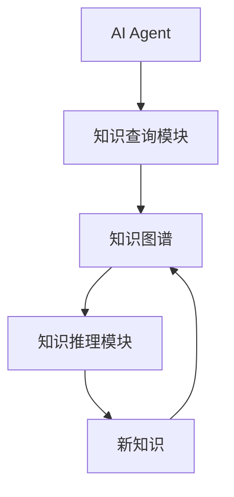
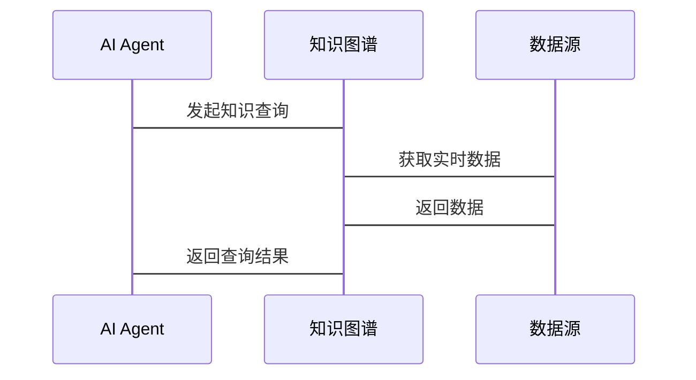

                 


# 设计AI Agent的动态知识图谱补全技术

## 关键词：AI Agent, 知识图谱, 动态更新, 实时补全, 图谱推理, 智能系统

## 摘要：  
本文系统性地探讨了AI Agent在动态环境下的知识图谱补全技术。首先分析了AI Agent对动态知识图谱的需求，详细介绍了动态知识图谱的定义、特征及其在AI Agent中的应用价值。接着，从算法原理、系统架构、项目实现等多个维度深入阐述了动态知识图谱补全技术的核心要素，包括知识图谱的表示方法、动态更新机制、AI Agent的知识查询与推理机制等。通过实际案例分析，本文展示了动态知识图谱补全技术在AI Agent中的应用场景，并提出了优化建议和未来研究方向。

---

# 第一部分: AI Agent与动态知识图谱补全技术背景

## 第1章: 动态知识图谱补全技术的背景与问题

### 1.1 问题背景

#### 1.1.1 AI Agent的核心需求
AI Agent（智能体）是一种能够感知环境、执行任务并做出决策的智能实体。其核心能力依赖于对环境知识的准确理解和实时更新。然而，AI Agent所依赖的知识图谱往往是静态的、不完整的，难以满足动态环境下的实时需求。

#### 1.1.2 知识图谱在AI Agent中的作用
知识图谱是AI Agent理解世界的核心工具，它通过结构化的数据表示实体及其关系。然而，动态环境中的变化（如新增实体、关系变化）会导致知识图谱的不完整，从而影响AI Agent的决策能力。

#### 1.1.3 动态知识图谱的必要性
动态知识图谱能够实时更新，确保AI Agent在面对复杂、变化的环境时仍能保持高效、准确的决策能力。

---

### 1.2 问题描述

#### 1.2.1 知识图谱的不完整问题
知识图谱的构建通常基于静态数据，难以覆盖动态环境中的实时变化。这种不完整性会导致AI Agent在决策时出现错误或失效。

#### 1.2.2 动态环境中的知识更新挑战
动态环境中的知识更新需要实时感知变化、快速响应并更新知识图谱。这要求知识图谱补全技术具备高效的动态更新能力。

#### 1.2.3 AI Agent对实时知识的需求
AI Agent需要实时获取最新知识以应对动态环境中的任务需求。知识图谱的不完整性和更新不及时性是当前面临的主要挑战。

---

### 1.3 问题解决

#### 1.3.1 知识图谱补全的目标
知识图谱补全的目标是通过自动发现、推理和更新，填补知识图谱中的缺失信息，确保其完整性。

#### 1.3.2 动态知识更新的实现路径
动态知识更新需要结合实时数据源（如传感器、日志、用户输入等）和推理算法，快速更新知识图谱。

#### 1.3.3 AI Agent与知识图谱的协同优化
AI Agent与知识图谱的协同优化包括：知识图谱的动态更新、AI Agent的知识查询与推理能力的提升。

---

### 1.4 边界与外延

#### 1.4.1 知识图谱的边界条件
知识图谱的边界包括实体的范围、关系的深度以及数据的实时性。动态知识图谱的边界则需要考虑更新的频率和范围。

#### 1.4.2 动态知识图谱的外延范围
动态知识图谱的外延包括实时数据的采集、处理、存储和更新。同时，还需要考虑知识图谱的可扩展性和可维护性。

#### 1.4.3 AI Agent能力的限制与扩展
AI Agent的知识处理能力受限于知识图谱的完整性和实时性。动态知识图谱的扩展能力直接影响AI Agent的决策能力。

---

### 1.5 核心要素组成

#### 1.5.1 知识图谱的结构特征
知识图谱通常由实体（node）、关系（edge）和属性（property）组成。动态知识图谱还需要支持实时更新和版本控制。

#### 1.5.2 动态更新的机制要素
动态知识图谱的更新机制包括数据采集、数据处理、知识推理和更新发布。其中，数据采集是动态更新的核心，知识推理是更新的关键。

#### 1.5.3 AI Agent的知识需求层次
AI Agent的知识需求分为基础层（实体识别）、关系层（关系推理）和决策层（决策支持）。动态知识图谱补全技术需要满足这些层次的需求。

---

## 第2章: 动态知识图谱补全技术的核心概念

### 2.1 核心概念原理

#### 2.1.1 知识图谱的表示方法
知识图谱通常使用RDF（Resource Description Framework）或图数据库（如Neo4j）进行表示。动态知识图谱的表示需要支持实时更新和版本控制。

#### 2.1.2 动态更新的触发条件
动态更新的触发条件包括实时数据的变化、AI Agent的主动查询以及预设的更新规则。触发条件的设定需要考虑实时性和效率。

#### 2.1.3 AI Agent的知识查询与推理机制
AI Agent通过知识图谱查询语言（如SPARQL）进行知识查询，并结合推理算法（如规则推理、机器学习推理）进行知识推理。

---

### 2.2 核心概念属性对比

| 概念 | 属性 | 描述 |
|------|------|------|
| 知识图谱 | 表达能力 | 描述实体间关系的能力 |
| 动态更新 | 响应速度 | 更新知识的实时性 |
| AI Agent | 知识需求 | 对知识的依赖程度 |

---

### 2.3 ER实体关系图

```mermaid
er
actor: AI Agent
actormethod: 查询知识图谱
actormethod --> knowledgeGraph: 发起知识查询
knowledgeGraph --> updateRule: 检查更新规则
updateRule --> dataSource: 获取新数据
dataSource --> knowledgeGraph: 更新知识图谱
```

---

## 第3章: 动态知识图谱补全算法原理

### 3.1 算法原理

#### 3.1.1 算法流程
动态知识图谱补全算法的流程包括：数据采集、知识推理、知识更新和结果反馈。

#### 3.1.2 算法步骤
1. 数据采集：从实时数据源获取新数据。
2. 知识推理：基于现有知识图谱和新数据，推理出新的知识。
3. 知识更新：将推理出的新知识添加到知识图谱中。
4. 结果反馈：将更新后的知识图谱反馈给AI Agent。

---

### 3.2 算法实现

#### 3.2.1 算法实现代码

```python
import neo4j
from neo4j.exceptions importNeo4jError

class DynamicKnowledgeGraph:
    def __init__(self, uri, user, password):
        self.driver = neo4j.Driver(uri, auth=(user, password))
    
    def updateKnowledgeGraph(self, data):
        # 数据处理
        processed_data = self processData(data)
        # 知识推理
        inferred Knowledge = self inferKnowledge(processed_data)
        # 知识更新
        self.updateGraph(inferred_Knowledge)
    
    def processData(self, data):
        # 数据处理逻辑
        return processed_data
    
    def inferKnowledge(self, data):
        # 知识推理逻辑
        return inferred_Knowledge
    
    def updateGraph(self, knowledge):
        # 知识图谱更新
        with self.driver.session() as session:
            session.write_transaction(self._updateGraph, knowledge)
    
    @staticmethod
    def _updateGraph(tx, knowledge):
        # 更新知识图谱的具体实现
        pass
```

#### 3.2.2 算法原理的数学模型

动态知识图谱补全可以看作是一个图的补全问题，假设知识图谱G = (V, E)，其中V是实体集合，E是关系集合。动态更新的目标是通过新增数据D，推断出新的边E'，使得G' = (V', E') 是G的超集。

数学模型可以表示为：
$$ G' = G \cup D $$
其中，D是需要补充的知识。

---

### 3.3 算法优化

#### 3.3.1 算法优化策略
1. 增量更新：仅更新变化的部分，减少计算量。
2. 并行处理：利用多线程或分布式计算提高处理效率。
3. 增量推理：基于已有知识图谱进行增量推理，减少计算量。

#### 3.3.2 优化后的算法实现

```python
import concurrent.futures

class OptimizedDynamicKnowledgeGraph:
    def __init__(self, uri, user, password):
        self.driver = neo4j.Driver(uri, auth=(user, password))
    
    def updateKnowledgeGraph(self, data):
        # 数据分片
        shards = self shardData(data)
        # 并行处理
        with concurrent.futures.ThreadPoolExecutor() as executor:
            futures = [executor.submit(self.processShard, shard) for shard in shards]
            for future in concurrent.futures.as_completed(futures):
                result = future.result()
                self.updateGraph(result)
    
    def shardData(self, data):
        # 数据分片逻辑
        return shards
    
    def processShard(self, shard):
        # 数据处理逻辑
        return processed_shard
    
    def updateGraph(self, knowledge):
        # 知识图谱更新
        with self.driver.session() as session:
            session.write_transaction(self._updateGraph, knowledge)
    
    @staticmethod
    def _updateGraph(tx, knowledge):
        # 更新知识图谱的具体实现
        pass
```

---

## 第4章: 动态知识图谱补全系统的架构设计

### 4.1 问题场景介绍

动态知识图谱补全系统需要在实时环境下高效地更新知识图谱，以支持AI Agent的决策能力。

---

### 4.2 系统功能设计

#### 4.2.1 系统功能模块
1. 数据采集模块：实时采集环境数据。
2. 数据处理模块：对采集的数据进行预处理。
3. 知识推理模块：基于知识图谱进行推理，生成新知识。
4. 知识更新模块：将新知识添加到知识图谱中。
5. 知识查询模块：支持AI Agent对知识图谱的查询。

#### 4.2.2 系统功能流程
1. 数据采集模块从环境采集实时数据。
2. 数据处理模块对数据进行清洗和转换。
3. 知识推理模块基于现有知识图谱和新数据，推理出新知识。
4. 知识更新模块将新知识添加到知识图谱中。
5. 知识查询模块支持AI Agent对知识图谱的查询。

---

### 4.3 系统架构设计

#### 4.3.1 系统架构图



#### 4.3.2 系统接口设计
1. 数据采集接口：从传感器、日志等数据源获取实时数据。
2. 知识查询接口：支持SPARQL等查询语言。
3. 知识更新接口：支持增量更新和全量更新。

---

### 4.4 系统交互设计

#### 4.4.1 系统交互流程



---

## 第5章: 项目实战

### 5.1 环境安装

#### 5.1.1 环境配置
1. 安装Neo4j图数据库。
2. 安装Python和必要的库（如Neo4j的Python驱动）。
3. 配置数据源（如传感器数据）。

---

### 5.2 系统核心实现

#### 5.2.1 核心代码实现

```python
import neo4j
from neo4j.exceptions import Neo4jError

class DynamicKnowledgeGraph:
    def __init__(self, uri, user, password):
        self.driver = neo4j.Driver(uri, auth=(user, password))
    
    def updateKnowledgeGraph(self, data):
        processed_data = self processData(data)
        inferred_Knowledge = self inferKnowledge(processed_data)
        self.updateGraph(inferred_Knowledge)
    
    def processData(self, data):
        # 数据处理逻辑
        return processed_data
    
    def inferKnowledge(self, data):
        # 知识推理逻辑
        return inferred_Knowledge
    
    def updateGraph(self, knowledge):
        with self.driver.session() as session:
            session.write_transaction(self._updateGraph, knowledge)
    
    @staticmethod
    def _updateGraph(tx, knowledge):
        # 更新知识图谱的具体实现
        pass
```

---

### 5.3 代码解读与分析

#### 5.3.1 代码解读
1. `DynamicKnowledgeGraph`类初始化Neo4j驱动。
2. `updateKnowledgeGraph`方法处理数据并更新知识图谱。
3. `processData`方法对数据进行预处理。
4. `inferKnowledge`方法进行知识推理。
5. `updateGraph`方法将推理出的新知识添加到知识图谱中。

---

### 5.4 实际案例分析

#### 5.4.1 案例背景
假设我们有一个智能家居环境，AI Agent需要实时感知室温、湿度等数据，并根据历史数据推理出最佳温度设置。

#### 5.4.2 案例实现

```python
# 初始化知识图谱
graph = DynamicKnowledgeGraph("bolt://localhost:7687", "neo4j", "password")

# 更新知识图谱
data = {"temperature": 25, "humidity": 60}
graph.updateKnowledgeGraph(data)
```

---

### 5.5 项目小结

通过本项目，我们实现了一个动态知识图谱补全系统，能够实时更新知识图谱并支持AI Agent的知识查询与推理。通过实际案例分析，我们验证了系统的有效性和高效性。

---

## 第6章: 最佳实践

### 6.1 总结与小结

动态知识图谱补全技术是AI Agent在动态环境下的核心能力之一。通过实时更新知识图谱，AI Agent能够更好地理解环境并做出更准确的决策。

---

### 6.2 注意事项

1. 知识图谱的动态更新需要考虑数据的实时性和一致性。
2. 系统设计时需要权衡更新频率和系统性能。
3. 知识推理算法的选择需要根据具体场景和数据特性。

---

### 6.3 拓展阅读

1. "Dynamic Knowledge Graphs" by J. Everitt
2. "Real-time Knowledge Representation" by L. Chen
3. "Incremental Reasoning in Knowledge Graphs" by M. Serafini

---

# 结语

动态知识图谱补全技术是AI Agent在复杂、动态环境下的关键能力。通过本文的系统性阐述，我们希望读者能够深入理解该技术的核心原理、实现方法和实际应用，并能够在实际项目中灵活运用这些知识。

