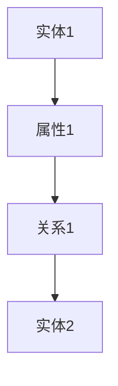
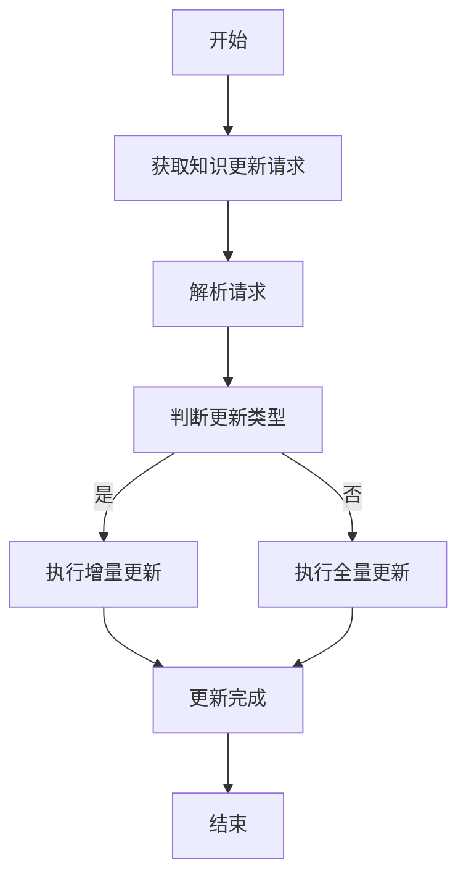
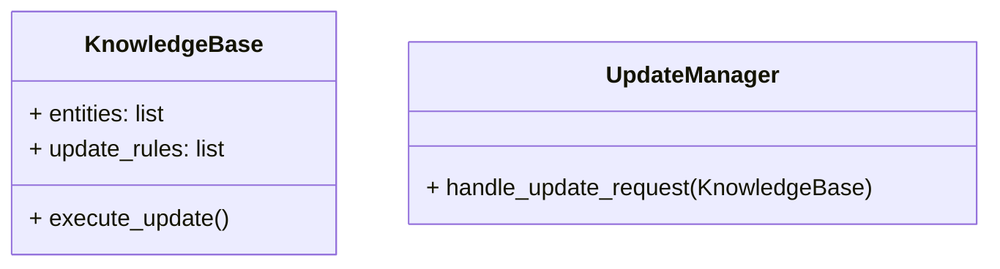
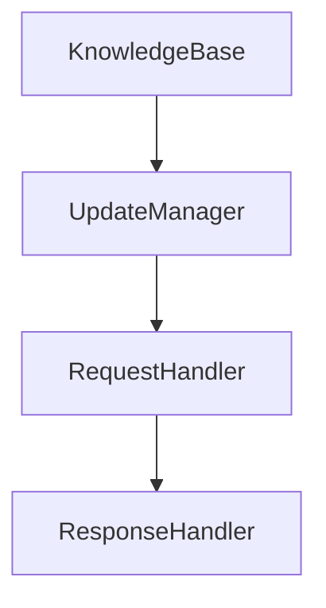
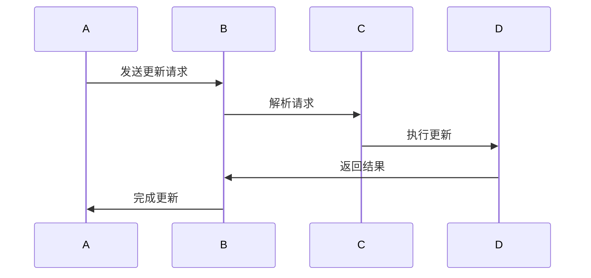

                 


# 设计AI Agent的动态知识库更新机制

## 关键词：
- AI Agent
- 动态知识库
- 知识更新机制
- 实时更新
- 知识管理

## 摘要：
本文详细探讨了设计AI Agent动态知识库更新机制的核心原理和实现方法。从问题背景到核心概念，再到算法实现，系统分析与架构设计，以及项目实战，全面解析了动态知识库更新机制的关键技术。文章结合实际案例，提供详细代码示例和系统架构图，帮助读者深入理解如何构建高效、可靠的动态知识库更新机制。

---

# 第1章: 动态知识库更新机制的背景与问题背景

## 1.1 动态知识库更新机制的背景
### 1.1.1 AI Agent的定义与核心概念
AI Agent是一种能够感知环境、自主决策并执行任务的智能体。动态知识库是AI Agent的核心知识存储，需要实时更新以适应环境变化。

### 1.1.2 动态知识库的定义与特点
动态知识库是存储AI Agent所需知识的结构化数据库，具有实时性、灵活性和可扩展性的特点。

### 1.1.3 动态知识库更新机制的必要性
为了适应快速变化的环境，AI Agent需要不断更新知识库，确保其知识的准确性和完整性。

## 1.2 动态知识库更新机制的问题背景
### 1.2.1 AI Agent在复杂环境中的知识需求
AI Agent需要处理复杂环境中的不确定性，动态知识库更新机制是其核心能力。

### 1.2.2 知识库更新的挑战与问题
知识库更新面临数据冗余、信息冲突、更新效率等问题，需要设计高效的更新机制。

### 1.2.3 动态知识库更新机制的核心目标
通过自动化、智能化的更新规则，确保知识库的准确性和及时性。

## 1.3 动态知识库更新机制的边界与外延
### 1.3.1 知识库更新的边界条件
知识库更新仅限于特定范围，如增量更新和全量更新。

### 1.3.2 动态知识库更新机制的外延范围
包括知识表示、推理、学习等过程。

### 1.3.3 相关概念的对比与区分
对比知识库、数据库、信息库等概念，明确动态知识库的独特性。

## 1.4 本章小结
本章介绍了动态知识库更新机制的背景、问题和目标，为后续章节奠定了基础。

---

# 第2章: 动态知识库更新机制的核心概念与联系

## 2.1 动态知识库更新机制的核心概念
### 2.1.1 知识库的构成与属性
知识库由实体、属性、关系等构成，具有可扩展性和可维护性。

### 2.1.2 更新规则的核心要素
更新规则包括触发条件、更新策略和执行步骤。

### 2.1.3 动态知识库更新的驱动因素
环境变化、任务需求、用户输入等驱动知识库更新。

## 2.2 核心概念的属性特征对比
### 2.2.1 知识库类型对比表格
| 知识库类型 | 特点 | 适用场景 |
|------------|------|----------|
| 增量知识库 | 空间高效 | 实时更新 |
| 全量知识库 | 完整性高 | 离线更新 |

### 2.2.2 实体关系图（ER图）架构


---

# 第3章: 动态知识库更新机制的算法原理

## 3.1 算法原理概述
### 3.1.1 动态知识库更新的基本流程
获取请求 → 解析请求 → 判断类型 → 执行更新 → 返回结果。

### 3.1.2 更新规则的数学模型
$$
\text{更新规则} = \begin{cases}
\text{增量更新} & \text{如果 } \Delta K \neq 0 \\
\text{全量更新} & \text{否则}
\end{cases}
$$

### 3.1.3 算法的输入输出描述
输入：更新请求；输出：更新完成。

## 3.2 算法流程图


## 3.3 算法实现代码示例
```python
def update_knowledge_base(update_request):
    request_type = parse_request(update_request)
    if request_type == 'incremental':
        perform_incremental_update()
    elif request_type == 'full':
        perform_full_update()
    else:
        raise ValueError("Invalid update request type")
    return "更新完成"
```

## 3.4 数学模型与公式
### 3.4.1 更新规则的数学表示
$$
\text{更新规则} = \text{增量更新} \quad \text{或} \quad \text{全量更新}
$$

---

# 第4章: 系统分析与架构设计方案

## 4.1 问题场景介绍
AI Agent需要在复杂环境中实时更新知识库，确保知识的准确性和完整性。

## 4.2 系统功能设计
### 4.2.1 领域模型mermaid类图


### 4.2.2 系统架构设计mermaid架构图


### 4.2.3 系统接口设计
接口包括：获取更新请求、解析请求、执行更新、返回结果。

### 4.2.4 系统交互mermaid序列图


---

# 第5章: 项目实战

## 5.1 环境安装
安装必要的依赖，如Python、Pillow、pymysql。

## 5.2 核心实现代码
```python
def parse_request(update_request):
    # 解析请求并返回类型
    pass

def perform_incremental_update():
    # 执行增量更新
    pass

def perform_full_update():
    # 执行全量更新
    pass
```

## 5.3 代码应用解读与分析
详细分析代码实现，解释每个函数的功能和作用。

## 5.4 实际案例分析和详细讲解
通过实际案例分析，说明动态知识库更新机制的应用和效果。

## 5.5 项目小结
总结项目实现的关键点和经验教训。

---

# 第6章: 最佳实践与总结

## 6.1 小结
总结动态知识库更新机制的核心原理和实现方法。

## 6.2 注意事项
注意事项包括数据一致性、更新频率、性能优化等。

## 6.3 拓展阅读
推荐相关领域的书籍和论文，供读者深入学习。

---

# 附录

## 附录A: 术语表
定义本文中使用的关键术语。

## 附录B: 参考文献
列出参考的文献和资料。

## 附录C: 工具安装指南
详细说明环境安装和工具配置步骤。

---

通过以上章节的详细划分，您可以逐步完成《设计AI Agent的动态知识库更新机制》的技术博客文章。每个章节都涵盖了必要的内容，并通过清晰的结构和详细的讲解，帮助读者全面理解动态知识库更新机制的设计与实现。

