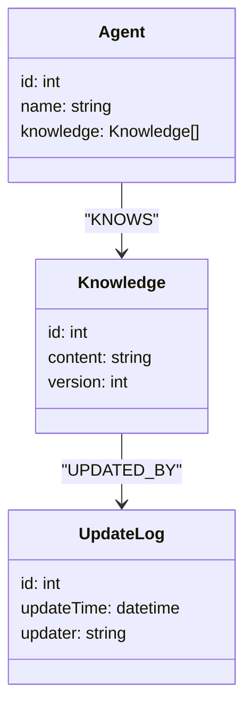

                 


# 设计AI Agent的动态知识库构建与维护

---

## 关键词
AI Agent, 动态知识库, 知识图谱, 知识表示, 知识存储, 实时更新, 可扩展性

---

## 摘要
随着人工智能技术的快速发展，AI Agent在各个领域的应用越来越广泛。然而，AI Agent的智能性和实用性高度依赖于其知识库的构建与维护。动态知识库作为AI Agent的核心组件，需要具备实时更新、高效检索和自我优化的能力。本文将从AI Agent与动态知识库的基本概念出发，详细探讨动态知识库的构建算法、系统架构设计以及项目实战。通过对知识表示、知识存储、知识推理等关键技术的分析，本文旨在为AI Agent的动态知识库设计提供理论支持和实践指导，帮助读者更好地理解动态知识库的核心原理及其在实际应用中的重要性。

---

## 第一部分: AI Agent与动态知识库概述

## 第1章: AI Agent与动态知识库的背景介绍

### 1.1 AI Agent的基本概念

#### 1.1.1 AI Agent的定义与特点
AI Agent（人工智能代理）是一种能够感知环境、自主决策并执行任务的智能实体。它通常具备以下特点：
- **自主性**：能够独立决策和行动。
- **反应性**：能够实时感知环境并做出反应。
- **目标导向性**：基于目标驱动行为。
- **学习能力**：能够通过经验优化自身性能。

#### 1.1.2 动态知识库的定义与特点
动态知识库是一种能够实时更新、适应环境变化的知识存储系统。其特点包括：
- **实时性**：能够快速响应数据的变化。
- **动态性**：知识内容和结构可以动态调整。
- **可扩展性**：能够根据需求灵活扩展。

#### 1.1.3 AI Agent与动态知识库的关系
AI Agent依赖知识库进行推理和决策，而动态知识库为AI Agent提供实时、准确的知识支持。两者相辅相成，共同构建智能系统的核心能力。

---

### 1.2 动态知识库的构建背景

#### 1.2.1 知识库在AI Agent中的作用
知识库是AI Agent进行推理和决策的基础。它存储了AI Agent所需的所有知识，包括事实、规则、概念等。

#### 1.2.2 动态知识库的必要性
传统的静态知识库无法适应环境的变化，而动态知识库能够实时更新，确保AI Agent的知识始终最新。

#### 1.2.3 当前知识库技术的发展趋势
随着大数据和人工智能技术的发展，知识库从静态化向动态化、智能化方向演进。

---

### 1.3 动态知识库的构建与维护的重要性

#### 1.3.1 知识库构建对AI Agent性能的影响
知识库的质量直接影响AI Agent的性能。高质量的知识库能够提高AI Agent的推理效率和决策准确性。

#### 1.3.2 动态知识库维护的挑战与意义
动态知识库的维护需要解决数据实时更新、版本控制、数据冲突等问题。良好的维护能够确保知识库的稳定性和可靠性。

#### 1.3.3 未来动态知识库的发展方向
未来，动态知识库将更加智能化、自动化，具备自我优化和自适应能力。

---

## 第2章: 动态知识库的核心概念

### 2.1 知识库的核心要素

#### 2.1.1 知识表示
知识表示是将知识以计算机可理解的形式存储的过程。常用的表示方法包括：
- **符号表示**：使用符号和规则表示知识。
- **语义网络**：通过节点和边表示知识的语义关系。
- **知识图谱**：通过图结构表示实体及其关系。

#### 2.1.2 知识存储
知识存储是将知识以某种形式存储在数据库中的过程。常用的知识存储方式包括：
- **关系型数据库**：适合存储结构化数据。
- **图数据库**：适合存储复杂的语义关系。
- **分布式存储**：适合大规模数据存储。

#### 2.1.3 知识检索
知识检索是根据查询条件从知识库中快速找到所需知识的过程。常用的检索方法包括：
- **基于关键词的检索**：通过关键词匹配检索结果。
- **基于语义的检索**：通过语义相似度匹配检索结果。
- **基于上下文的检索**：结合上下文信息进行检索。

---

### 2.2 动态知识库的属性特征对比

#### 2.2.1 静态知识库与动态知识库的对比
| 属性          | 静态知识库                | 动态知识库                |
|---------------|--------------------------|--------------------------|
| 数据更新频率   | 低或固定                | 高或实时                |
| 数据一致性     | 高                     | 可能较低，需要处理冲突   |
| 系统复杂性     | 较低                   | 较高，需要处理动态变化   |

#### 2.2.2 动态知识库的实时更新机制
动态知识库的实时更新机制包括：
- **增量更新**：仅更新发生变化的部分。
- **全量更新**：定期对整个知识库进行更新。
- **按需更新**：根据用户需求实时更新。

#### 2.2.3 动态知识库的可扩展性
动态知识库的可扩展性体现在：
- **数据格式的灵活性**：支持多种数据格式和结构。
- **存储容量的弹性**：能够根据需求动态调整存储容量。
- **服务接口的扩展性**：能够方便地扩展新的服务接口。

---

### 2.3 动态知识库的ER实体关系图

```mermaid
er
    entity(Agent) {
        id: int
        name: string
    }
    entity(Knowledge) {
        id: int
        content: string
        version: int
    }
    entity(UpdateLog) {
        id: int
        updateTime: datetime
        updater: string
    }
    relationship(Agent)-[KNOWS]->(Knowledge)
    relationship(Knowledge)-[UPDATED_BY]->(UpdateLog)
```

---

## 第三部分: 动态知识库的算法原理

## 第3章: 动态知识库的构建算法

### 3.1 知识表示与存储算法

#### 3.1.1 知识图谱的构建算法
知识图谱的构建算法包括：
- **实体识别**：识别文本中的实体。
- **关系抽取**：抽取实体之间的关系。
- **知识融合**：将多个来源的知识进行融合。

#### 3.1.2 知识存储的算法
知识存储的算法包括：
- **分布式存储算法**：如一致性哈希算法。
- **索引构建算法**：如倒排索引。

---

### 3.2 动态知识库的构建与更新算法

#### 3.2.1 动态知识库的构建算法
动态知识库的构建算法包括：
- **增量式构建算法**：仅更新变化的部分。
- **全量式构建算法**：定期重建整个知识库。

#### 3.2.2 动态知识库的更新算法
动态知识库的更新算法包括：
- **实时更新算法**：根据实时数据流进行更新。
- **批量更新算法**：定期批量处理更新请求。

---

### 3.3 基于图的动态知识推理

#### 3.3.1 基于图的知识推理算法
基于图的知识推理算法包括：
- **路径搜索算法**：如广度优先搜索和深度优先搜索。
- **规则推理算法**：基于知识图谱中的规则进行推理。

#### 3.3.2 动态知识图谱的推理优化
动态知识图谱的推理优化包括：
- **缓存优化**：缓存常用的推理结果。
- **并行推理**：利用多线程或分布式计算加速推理过程。

---

## 第4章: 动态知识库的系统分析与架构设计

### 4.1 项目背景介绍

#### 4.1.1 项目背景
本项目旨在设计一个高效的动态知识库系统，支持AI Agent的实时知识更新和推理。

#### 4.1.2 项目目标
- 实现知识库的动态更新。
- 提供高效的知识检索服务。
- 支持多种知识表示形式。

---

### 4.2 系统功能设计

#### 4.2.1 领域模型


#### 4.2.2 系统架构设计


#### 4.2.3 系统接口设计
- **查询接口**：提供基于关键词或语义的查询服务。
- **更新接口**：支持实时更新知识库内容。
- **管理接口**：提供知识库的管理功能，如权限控制、版本管理等。

---

## 第5章: 动态知识库的项目实战

### 5.1 环境安装与配置

#### 5.1.1 开发环境
- 操作系统：Linux/Windows/MacOS
- 开发工具：Python/Java/Go
- 数据库：MySQL/PostgreSQL/Neo4j

#### 5.1.2 依赖安装
```bash
pip install neo4j python-driver
pip install Flask
```

---

### 5.2 核心代码实现

#### 5.2.1 知识存储实现
```python
from neo4j import GraphDatabase
from neo4j.exceptions importNeo4j.exceptions import Neo4jError

class KnowledgeStorage:
    def __init__(self, uri, user, password):
        self.driver = GraphDatabase.driver(uri, user, password)
    
    def store_knowledge(self, content):
        # 在知识图谱中存储知识
        with self.driver.session() as session:
            session.run("CREATE (:Knowledge {content: $content})", content=content)
    
    def update_knowledge(self, old_content, new_content):
        # 更新知识内容
        with self.driver.session() as session:
            session.run("MATCH (k:Knowledge {content: $old_content}) SET k.content = $new_content",
                        old_content=old_content, new_content=new_content)
```

---

### 5.3 案例分析与实现解读

#### 5.3.1 知识表示案例
```mermaid
graph TD
    A[Agent] --> K[Knowledge]: "KNOWS"
    K --> U[UpdateLog]: "UPDATED_BY"
```

#### 5.3.2 知识推理案例
```python
def infer_knowledge(agent_id):
    # 查询与agent_id相关的知识
    with driver.session() as session:
        result = session.run("MATCH (a:Agent {id: $agent_id})-[r:KNOWS]->(k:Knowledge) RETURN k.content",
                             agent_id=agent_id)
        return [record['content'] for record in result]
```

---

## 第6章: 最佳实践与小结

### 6.1 最佳实践

#### 6.1.1 知识表示的规范性
确保知识表示的规范性和一致性，便于后续的处理和推理。

#### 6.1.2 知识更新的及时性
动态知识库的核心是实时更新，确保知识的最新性和准确性。

#### 6.1.3 知识存储的高效性
选择合适的存储技术和数据结构，提高知识存储和检索的效率。

---

### 6.2 小结

本文详细探讨了AI Agent动态知识库的构建与维护方法，涵盖了知识表示、知识存储、知识推理等多个方面。通过实际案例的分析和代码实现，读者可以更好地理解动态知识库的核心原理和实际应用。未来，随着人工智能技术的不断发展，动态知识库将变得更加智能化和自动化。

---

### 6.3 注意事项

- **数据一致性**：动态知识库的实时更新可能导致数据一致性问题，需要通过版本控制和事务管理来解决。
- **性能优化**：在大规模数据情况下，需要进行性能优化，如缓存优化、分布式计算等。
- **安全性**：确保知识库的安全性，防止数据泄露和恶意攻击。

---

### 6.4 拓展阅读

- 《知识图谱：概念、方法与应用》
- 《动态知识库的设计与实现》
- 《分布式系统中的数据一致性与同步》

---

以上是《设计AI Agent的动态知识库构建与维护》的技术博客文章的完整目录和内容概要。接下来，我会根据以上大纲，逐步完成每个章节的具体内容撰写。

